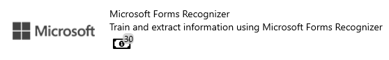
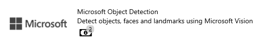

# Untitled

<table>
  <thead>
    <tr>
      <th style="text-align:left">
        

          
        

        
USER MANUAL

      </th>
      <th style="text-align:left">
        
aBOUT

        
AIForged is a cloud-based platform that enables you to quickly configure
          and train composites of algorithms and intelligent services from leading
          technology providers to create AI Skills.

        
Dominic Joubert

      </th>
    </tr>
  </thead>
  <tbody></tbody>
</table>

**USER MANUAL**

## TERMS AND CONDITIONS

## TABLE OF CONTENTS

## SYSTEM REQUIREMENTS

Please ensure that your computer meets or exceeds the following system requirements before installing the AIFORGED application.

**Minimum System Requirements**

| **OS** | Windows 10 version 18362.0 or higher,Xbox One |
| :--- | :--- |
| **Architecture** | ARM,x64,x86 |
| **DISPLAY RESOLUTION** | Best viewed in 1980 x 1080 |
| **Keyboard** | Integrated Keyboard |
| **Mouse** | Integrated Mouse |
| **DirectX** | Version 9 |
| **Memory** | 300 MB |
| **Video Memory** | 1 GB |
| **Processor** | i5 or Ryzen 5 |

**Recommended System Requirements**

| **OS** | Windows 10 version 18362.0 or higher, Xbox One |
| :--- | :--- |
| **Architecture** | ARM,x64,x86 |
| **DISPLAY RESOLUTION** | Best viewed in 1980 x 1080 |
| **Keyboard** | Integrated Keyboard |
| **Mouse** | Integrated Mouse |
| **DirectX** | Version 11 |
| **Memory** | 300 MB |
| **Video Memory** | 1 GB |
| **Processor** | I7 or Ryzen 7 |

## INSTALL AIFORGED

You can install AIFORGED from the Microsoft App Store or get it from the following link:

[https://www.microsoft.com/en-za/p/aiforged/9n9tv5k8f914?activetab=pivot:overviewtab](https://www.microsoft.com/en-za/p/aiforged/9n9tv5k8f914?activetab=pivot:overviewtab)

## 

### 

### 

### 

### Amazon Textract

* Amazon Textract is a service that automatically extracts text and data from scanned documents. Amazon Textract goes beyond simple optical character recognition \(OCR\) to also identify the contents of fields in forms and information stored in tables.

#### Possible use cases

#### Supported Content Types

* Images

### Microsoft Forms Recognizer

Form Recognizer applies advanced machine learning to accurately extract text, key/value pairs, and tables from documents. With just a few samples to train with, Form Recognizer tailors its understanding to your documents. Turn forms into usable data at a fraction of the time and cost, so you can focus more time acting on the information rather than compiling it.

* Form Recogniser supports printed and handwritten forms, PDFs and images.

#### Setup and Train Service

1. Open the project you would like to add the service to
2. Click on Add Service
3. Select the Microsoft Forms Recognizer
4. **Step 1** – Service \(Displays the service setting, you can change it as required\)
5. Click the “Next” Action in the Action Bar to save the Service
6. **Step 2** Classes, to add a Class View to [Document Categories]() \(Click next to save categories\)
7. **Step 3** Training
   * 1.  Click “Upload Training Documents” in the Action Bar
     2. Select the Document Category you want to upload documents to. **The demos training files can be found at the following link:** [**Click here**](https://larchold-my.sharepoint.com/:u:/g/personal/jannie_larcai_com/EVXJvXsMjM1Gnmhcic-UUnoB99xK0fDRjsaZREkx63PFHg?e=4RtU6d)
     3. Upload Documents for each category you want to train
     4. Click Train Service once all documents have been uploaded
     5. A log Window will open displaying the current logs for the Training Document
     6. Click the Next button when done training
8. **Step 4** Definition, the definition Document would be created after the Service has trained successfully

#### Add and Process Documents

1. In your Microsoft Forms Recognizer Service click on “Inbox” in the App Bar
2. Select your Status you want to upload, use Status “None” or “Received” for new documents that have not been processed yet
3. Select an optional category if you know the category for the document, if you don’t want to select one just click on “No selection”
4. Find the files on your Local machine and upload them. **The demos test files can be found at the following link:** [**Click here**](https://larchold-my.sharepoint.com/:u:/g/personal/jannie_larcai_com/Ec-_k8RmUqNAv6WgCgwItfcBTRp1Gk0V6OeyTj2S3SIUQg?e=EquxX9)
5. After all the documents have been uploaded you can check the documents to be processed, click on “Processed Checked” to process the documents

It is Recommended to only process a few documents at a time if is a new service to properly test if you receive the results you want before processing everything

#### View Processed Documents

1. In your AIForged Classification Service click on “Outbox” in the App Bar
2. You can View your Processing results in the Status

#### Possible use cases

* Handwritten forms that needs information to be extracted
* Images that has information to be extracted
* PDF’s that has information to be extracted \(Proof of payments, Bank Statements etc.\)

#### Supported Content Types

* Pdf
* images

If you need to use a different type of content, you can use the AiForged Pdf Converter.

### Microsoft Forms Layout

Extract text and layout information from a given document. The input document must be of one of the supported content types - 'application/pdf', 'image/jpeg', 'image/png' or 'image/tiff'. Alternatively, use 'application/json' type to specify the Url location of the document to be analysed.

#### Supported Content Types

* Pdf
* jpeg
* png
* tiff

If you need to use a different type of content, you can use the AiForged Pdf Converter.

#### Setup Service

1. Open the project you would like to add the service to
2. Click on Add Service
3. Select the Microsoft Receipt Tracker Service
4. **Step 1** – Service \(Displays the service setting, you can change it as required\)
5. Click the “Next” Action in the Action Bar to save the Service
6. **Step 2** Verification, TODO

#### Add and Process Documents

1. In your Microsoft Forms Layout Tracker Service click on “Inbox” in the App Bar
2. Select your Status you want to upload, use Status “None” or “Received” for new documents that have not been processed yet
3. Select an optional category if you know the category for the document, if you don’t want to select one just click on “No selection”
4. Find the files on your Local machine and upload them. **The demos test files can be found at the following link:** [**Click here**](https://larchold-my.sharepoint.com/:u:/g/personal/jannie_larcai_com/Ec-_k8RmUqNAv6WgCgwItfcBTRp1Gk0V6OeyTj2S3SIUQg?e=EquxX9)
5. After all the documents have been uploaded you can check the documents to be processed, click on “Processed Checked” to process the documents

#### Possible use cases

### Microsoft Receipt Tracker

Microsoft Receipt Tracker uses Optical Character Recognition \(OCR\) to automatically extract information from receipt photos. Receipt Tracker allows users to categorize and visualize their expenses

#### Setup Service

1. Open the project you would like to add the service to
2. Click on Add Service
3. Select the Microsoft Receipt Tracker Service
4. **Step 1** – Service \(Displays the service setting, you can change it as required\)
5. Click the “Next” Action in the Action Bar to save the Service
6. **Step 2** Verification, TODO

#### Add and Process Documents

1. In your Microsoft Receipt Tracker Service click on “Inbox” in the App Bar
2. Select your Status you want to upload, use Status “None” or “Received” for new documents that have not been processed yet
3. Select an optional category if you know the category for the document, if you don’t want to select one just click on “No selection”
4. Find the files on your Local machine and upload them. **The demos test files can be found at the following link:** [**Click here**](https://larchold-my.sharepoint.com/:u:/g/personal/jannie_larcai_com/Ec-_k8RmUqNAv6WgCgwItfcBTRp1Gk0V6OeyTj2S3SIUQg?e=EquxX9)
5. After all the documents have been uploaded you can check the documents to be processed, click on “Processed Checked” to process the documents

It is Recommended to only process a few documents at a time if is a new service to properly test if you receive the results you want before processing everything

#### View Processed Documents

1. In your AIForged Classification Service click on “Outbox” in the App Bar
2. You can View your Processing results in the Status

#### Supported Content Types

* Pdf
* jpeg
* png

If you need to use a different type of content, you can use the AiForged Pdf Converter.

#### Possible use cases

* Extract data from receipts
* Visualise your receipts data

### Amazon Mechanical Turk

Amazon Mechanical Turk \(MTurk\) is a crowdsourcing marketplace that makes it easier for individuals and businesses to outsource their processes and jobs to a distributed workforce who can perform these tasks virtually.

#### Possible use cases

* Building, managing, and evaluating Machine Learning workflows
* Business process outsourcing

### Amazon OCR

The Amazon OCR service reads text from images for you to use.

####  Supported Content Types

* Images
* Pdf

If you need to use a different type of content, you can use the AiForged Pdf Converter.

#### Possible use cases

* Extract data from receipts
* Visualise your receipts data

### Google OCR

The Google OCR service reads text from images for you to use.

#### Supported Content Types

* Images
* Pdf

If you need to use a different type of content, you can use the AiForged Pdf Converter.

#### Possible use cases

* Extract data from receipts
* Visualise your receipts data

### Microsoft OCR

The Microsoft OCR service reads text from images for you to use.

####  Supported Content Types

* Images
* Pdf

If you need to use a different type of content, you can use the AiForged Pdf Converter.

#### Possible use cases

* Extract data from receipts
* Visualise your receipts data

### Teseract OCR

The Teseract Handwriting OCR \(optical character recognition\) is the process of automatically extracting handwritten information from paper, scans and other low-quality digital documents.

####  Supported Content Types

* Images
* Pdf

If you need to use a different type of content, you can use the AiForged Pdf Converter.

#### Possible use cases

* Extract data from receipts
* Visualise your receipts data

### Email Scraping

Email Scraping allows you to extract Emails from your mailbox or a specified mailbox.

#### Supported Email Clients

* Outlook

#### Possible use cases

* Extract Documents from emails
* Find and process specific kinds of emails

### OneDrive Scraping

Email Scraping allows you to extract Emails from your mailbox or a specified mailbox.

#### Supported Clients

* OneDrive

#### Possible use cases

* Extracting Documents from OneDrive
* Find and extract specific kinds of Documents from Onedrive

### Microsoft Speech to Text

Quickly and accurately transcribe audio to text in more than 30 languages. Customize models to enhance accuracy for domain-specific terminology.

#### Supported Content Types

* Mp3

#### Possible use cases

* Extracting Music lyrics from a song
* Create meeting notes based on recorded audio

### ABBYY Image Splitter

You can use the ABBYY image splitter to split your documents into images.

### AIForged Digitizer

You can use the AIForged Digitizer to Digitize documents through verification and processing

### AIForged Image Splitter

You can use the AIForged image splitter to split your documents into images.

### AIForged Pdf Converter

You can use the AIForged Pdf Converter to convert documents to the Pdf Format

### Copy Documents

You can use the Copy Documents Service to Copy Documents between services

### Move Documents

You can use the Move Documents Service to Move Documents between services

### Google Object Detection

Google object detection detects object, faces and landmarks using Google Vision

#### Possible use cases

* Detecting specific objects within images \(Counting cars within images etc.\)

### Microsoft Object Detection

Microsoft Object Detection detects object, faces and landmarks using Google Vision

#### Possible use cases

* Detecting specific objects within images \(Counting cars within images etc.\)

## Documents

### Understanding the Documents page

#### Available Fields

| Field Name | Description |
| :--- | :--- |
| Id | Displays the generated Id of the Document |
| Master |  |
| Date Created | Displays the date the Document was uploaded to AiForged |
| Filename | Displays the Filename of the Document |
| Type | Displays the file type of the document |
| Usage | Displays the current Usage of the Document |
| Status | Displays the Status of the document |
| Actions | Displays Actions that is available to this document |
| Comment | Displays Comments left on this document |
| Result | Displays the Result of this document |
| Category | Displays the Category |

#### Document Actions

* Opens documents linked to this document

* Opens documents on your operating system

* Downloads the Document to your system

* Opens the document hierarchy

* Pens the documents structured results

* Shows the documents results

* Opens the document for verification

#### Sort the Documents grid

* You can Sort the documents page by clicking on any of the table headers
* All Sorting of the documents happens **server side**
* To do multiple column sorting use **CTRL + Left Mouse Click** on the columns

#### Bulk Category Updates

The Bulk Category Update Action allows you to update all the selected Document categories

1. To do a Bulk category Update click on “Bulk Category Update” in the app bar.
2. A popup will appear asking what Document Status you would like to update.
3. Once you have selected the Status another popup will appear.
4. Select the Usage of the documents you would like to update, after selecting the Usage another popup will appear asking you to select the Categories you would like to update.
5. Select the Category you would like to update it to and click yes on the Next popup.
6. Your category update should be completed.

#### Bulk Status Updates

The Bulk Status Update Action allows you to update all the selected Document statuses

1. To do a Bulk Status Update click on “Bulk Status Update” in the app bar.
2. A popup will appear asking what Document Status you would like to update.
3. Once you have selected the Status another popup will appear.
4. Select the Status you want to Update it to, after selecting a value another popup will appear.
5. Select the Document Usage you would like to update, the next prompt will ask to what Usage you would like to update to.
6. After selecting yes your Statuses should be updated.

#### Bulk Copy

The Bulk Copy Action allows you to **copy** the documents to another project and service.

1. To do a Bulk Copy click on “Bulk Copy” in the app bar.
2. A popup will appear asking to select a destination project.
3. Once you have selected the Destination project, another popup will appear asking to select the Destination service.
4. Select the Status you want to Copy, after selecting a value another popup will appear.
5. Select the Target Status you want the copied documents to be, after selecting a value another popup will appear.
6. Select the Document Usage you want to copy, the next prompt will ask to what Usage you would like the copied documents to be.
7. After completing all the prompts and yes has been clicked your documents should **copy**.

#### Bulk Move

The Bulk Move Action allows you to **move** the documents to another project and service.

1. To do a Bulk Move click on “Bulk Move” in the app bar.
2. A popup will appear asking to select a destination project.
3. Once you have selected the Destination project, another popup will appear asking to select the Destination service.
4. Select the Status you want to Copy, after selecting a value another popup will appear.
5. Select the Target Status you want the copied documents to be, after selecting a value another popup will appear.
6. Select the Document Usage you want to copy, the next prompt will ask to what Usage you would like the copied documents to be.
7. After completing all the prompts and yes has been clicked your documents should **move**.

#### Process Checked

The Process Checked Action allows you to **process** selected documents.

1. To **Process** a checked document, check all the document you would like to process.
2. Click on the Process Checked click on the Process “Process Checked” Action in the app bar.
3. A popup will appear to check if you want to process the documents, click yes.
4. A Log Events popup will appear displaying the progress of **processing** the documents.

#### Copy Checked

The Process Checked Action allows you to **process** selected documents.

1. To **Copy** a checked document, check all the document you would like to copy.
2. Click on the Copy Checked click on the Process “Copy Checked” Action in the app bar.
3. A popup will appear asking to select a destination project.
4. Once you have selected the Destination project, another popup will appear asking to select the Destination service.
5. Select the Status you want to Copy, after selecting a value another popup will appear.
6. Select the Target Status you want the copied documents to be, after selecting a value another popup will appear.
7. Select the Document Usage you want to copy, the next prompt will ask to what Usage you would like the copied documents to be.
8. After completing all the prompts and yes has been clicked your documents should **move**.

#### Delete Checked

The Delete Checked Action allows you to **delete** selected documents.

1. To **Delete** a checked document, check all the document you would like to delete.
2. Click the “Delete Checked” Action in the app bar.
3. On the prompt click “Yes” to approve the deletion of the documents

#### Set Checked Status

The Checked Status Action allows you to change the selected documents statuses selected documents.

1. To **Set the Status** of a checked document check all the document you would like to change the Status of.
2. Click the “Set Checked Status” Action in the app bar.
3. On the First prompt select the new **Status**
4. On the next prompt click “Yes” to approve the Status change of the checked documents

#### Update Checked

The Update Checked Action allows update a checked document.

1. To **Update** a checked documents check all the document you would like to Update
2. Click the “Update Checked” Action in the app ba

#### Upload

The Upload Action allows you to upload a new document.

1. Click the “Upload” Action in the app bar.
2. In the popup Select the Status of the Document being uploaded
3. After selecting the Status select the document category to be uploaded
4. Select the document on your local machine to be uploaded and click “Open”

### Documents Inbox

#### How to open the Documents Inbox

* Within a service click on the **Inbox** button in the App bar to open the inbox documents.
* To open a Service, refer to \(Refer\)

### Documents Outbox

#### How to open the Documents Outbox

* Within a service click on the **Outbox** button in the App bar to open the outbox documents.
* To open a Service, refer to \(Refer\)

### Training box

The Training box is only applicable to services that requires training of documents

#### How to open the Training box

* Within a service click on the **Training Box** button in the App bar to open the Training documents.
* To open a Service, refer to \(Refer\)

### Document Categories

Document categories defines the **Type** of document that has been uploaded. Projects Document categories is shared to all its services.

#### How to create Document Categories

1. From the Project page click on “Configure categories”
2.  Click on “Click here to add a new row”
3.  Fill in your new row and click on another row in your grid to allow you to add more rows \(Note the Id Field is Inserted Automatically\)
4. After adding All your project categories click on “Save Changes” in the App Bar

#### How to Delete a Document Category

1. From the Project page click on “Configure categories”
2.  Click on the “trash can” icon to remove the document category from the Grid
3. After removing the project categories click on “Save Changes” in the App Bar

