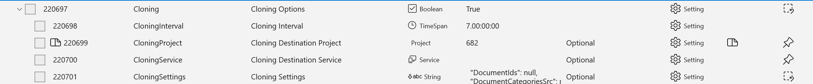
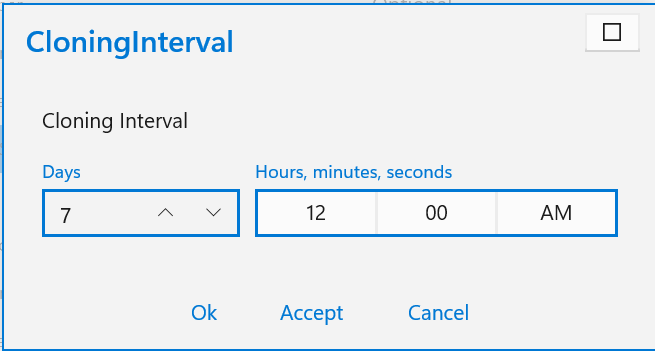
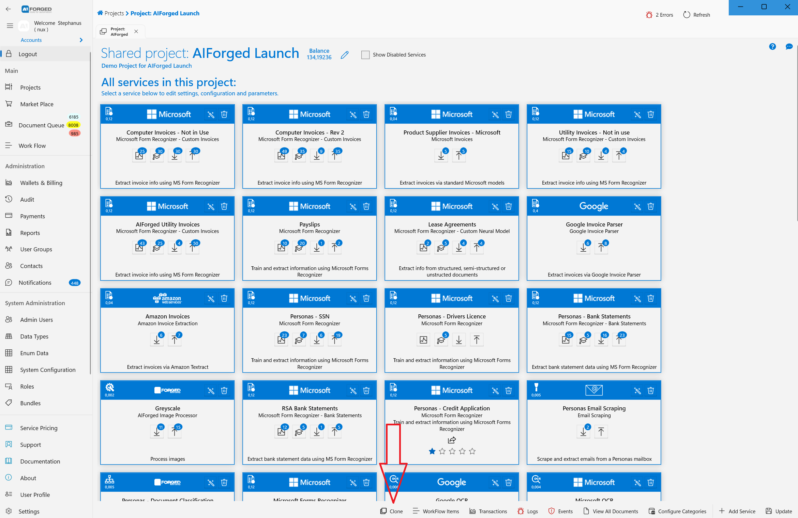
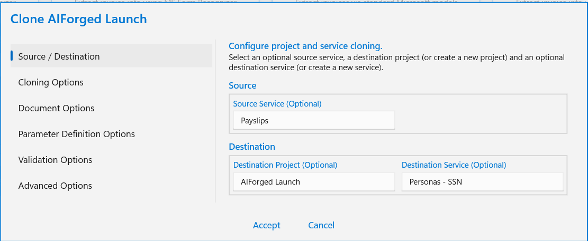
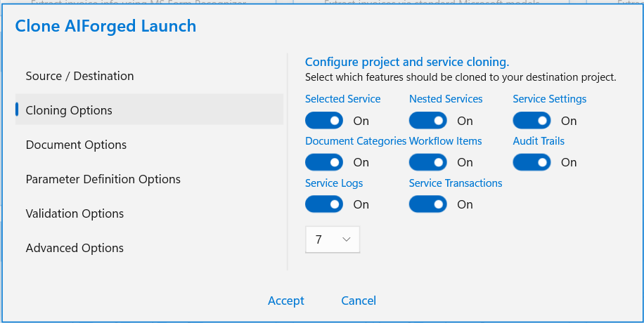
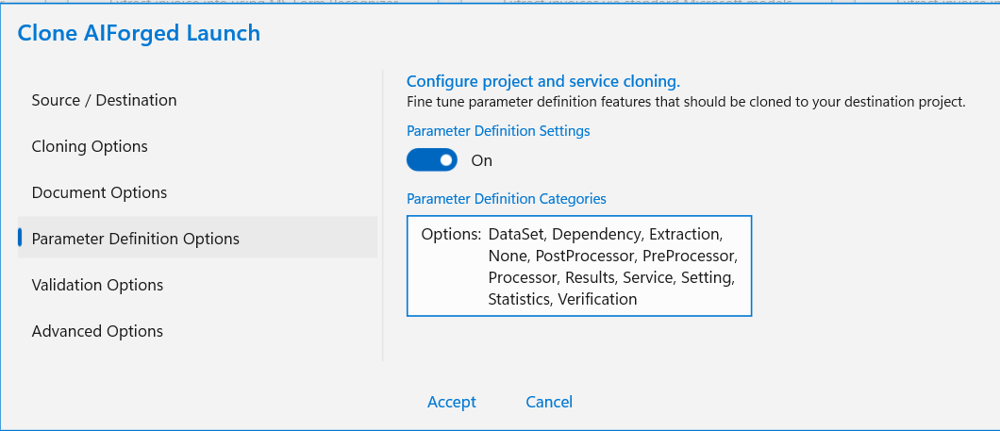
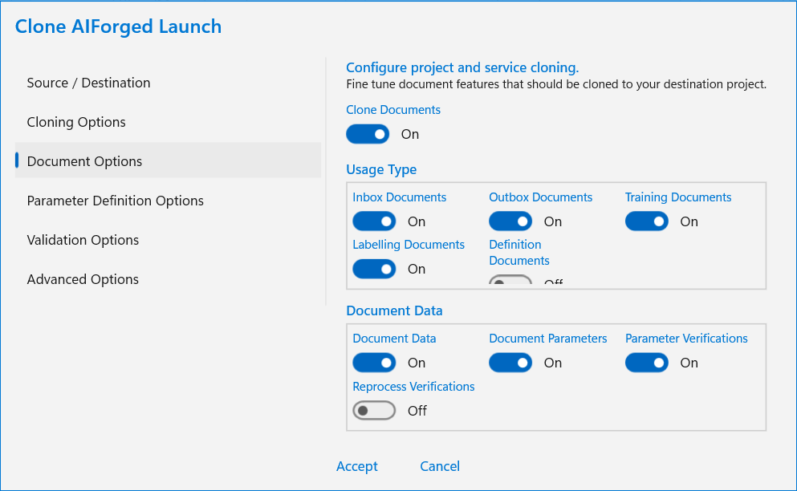
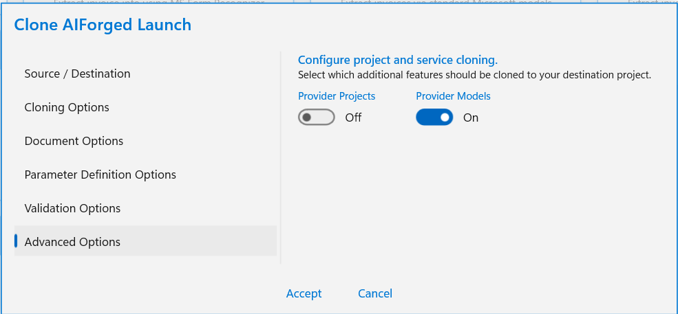
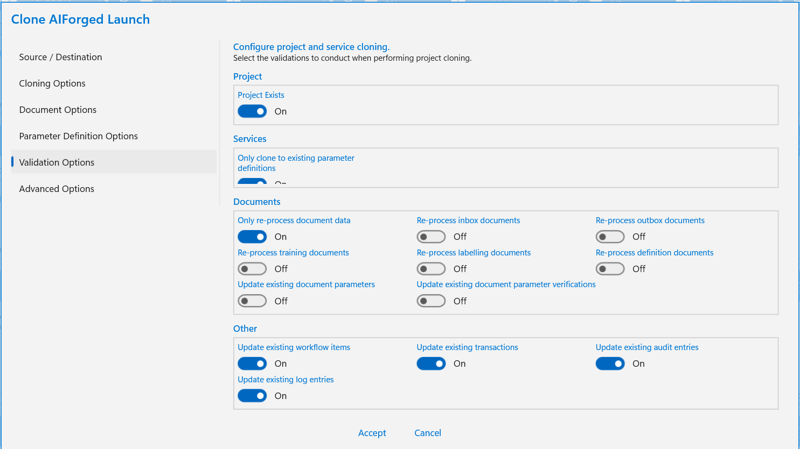

# Cloning

## Reasons for Cloning

### DevOps

Cloning is part of the AIForged DevOps Lifecycle. It assists AIForged developers to clone a “Live” project / service to at “Dev” project / service. Then the developer can make changes to settings and training data and test the impact the change will have on the “Live” project.

It can also assist with making “demo” copies of a project.

Clone can only be done on the Production environment. The cloning scheduler is not enabled on Sandbox or Development environments.

### Demos or Other

Cloning can be done across tenants and projects to demo or research proposes.

## Cloining Scheduler

Cloning run as a scheduled backend job. Once cloning is configured the scheduler will run cloning. Schedules can be configured for daily or weekly runs. If you require ad-hoc cloning, we suggested to schedule it for daily and then disable the schedule once it started.

### How to create and change the schedule

You need to create cloning options first. Once that is done the cloning schedule will be created and appear in the service settings / definitions view.

<figure><figcaption><p>Cloning Definitions Settings</p></figcaption></figure>

<figure><figcaption><p>Cloning Interval</p></figcaption></figure>

### How to change the options and validation checks

This will create cloning options and initiate cloning schedule.

<figure><figcaption><p>Start with Cloning</p></figcaption></figure>

<figure><figcaption><p>Cloning Source and Destination</p></figcaption></figure>

<figure><figcaption><p>Cloning Options</p></figcaption></figure>

<figure><figcaption><p>Cloning Definition Options</p></figcaption></figure>

<figure><figcaption><p>Cloning Document Options</p></figcaption></figure>

<figure><figcaption><p>Cloning Provider Options</p></figcaption></figure>

<figure><figcaption><p>Cloning Validation Checks</p></figcaption></figure>

## Cloning Options

A large number of Cloning options can be configured. These options are related and interdependent. These options are comprehensive with very complex nested affects.

```csharp
bool Classes;
```

Clone classes, sometimes you may not want to clone classes. Then disable this cloning for classes.

```csharp
bool ProjectUsers; 
```

Clone project users links. This will clone and give users access to the new project. Please be aware of the security risks of this option.

```csharp
bool Service; 
```

Enable the cloning of all top level services linked to a project. The service and its settings will be cloned.

```csharp
bool ServiceRecursive; 
```

To enabled cloning of nested/recursive services. This only has an effect if Service cloning is enabled.

```csharp
bool ServiceDefSettings; 
```

Clone service definitions settings. This should be enabled if service cloning is enabled. This will allow runtime/processing settings to be cloned.

```csharp
bool ParamDefSettings;
```

Clone parameter definitions settings.\
This allow for custom code and rule settings to be cloned. This should normally be enabled.

```csharp
List<ParameterDefinitionCategory?> ParamDefCategories;
```

Limit cloning of parameter definition categories. Normally this is not configured and should only be configured in advanced situations.

```csharp
bool Ratings;
```

Clone ratings user gave a service. Does not have any processing impact.

```csharp
bool Documents;
```

Enabled cloning of documents. This mus be enabled to for documents to be cloned. Additional setting will apply. See additions document usage settings.

```csharp
int? DocumentFromId;
```

For performance, only clone documents from a certain document Id range. This is also helpfull for clong only a certain range of document id's.

```csharp
int? DocumentToId;
```

For performance, only clone documents to a certain document Id range. This is also helpfull for clong only a certain range of document id's.

```csharp
bool? DocumentDescending;
```

Clone documents in reverse descending order. Normally cloning start with oldest documents first and then move to newer documents. Sometimes you may want to start cloning with newest documents and move back in time to older documents.

```csharp
List<int> DocumentIds;
```

Optionally limit document cloning to very specific document Ids. This is used in combination of document usages.

```csharp
List<int?> DocumentCategoriesSrc;
```

Only clone documents with of a specific source classification or vendor This is a list of classification ids

```csharp
List<int?> DocumentCategoriesDst;
```

Only clone documents with of a specific destination classification or vendor This is a list of classification ids

```csharp
Dictionary<UsageType, List<string>> SkipDocs;
```

To bypass or skip documents of a certain usage and filename. Usefull to bypass datasets with certain names... e.g. UsageType.DataSet: \["ExtractionPatterns", "StoreMaster", "Storemaster New", "PurchaseOrdersItems", "PurchaseOrders", "CostCenters", "GLCodes"]

```csharp
Dictionary<DocumentStatus, List<string>> SkipStatus;
```

Skip Documents of a certain status and filename. This is similair to the document usage skip list.

```csharp
int DocumentMaxDegreeOfParallelism;
```

Process documents in Parallel for better performance performance.

```csharp
bool DocumentsDeletedState;
```

Normally documents in a deleted state are not cloned. Used this to enabled cloning of deleted documents. Sometime you may wish to clone documents currently in a "soft delete" state.

```csharp
bool DocumentsDataSet;
```

Clone datasets via documents

```csharp
bool DocumentsInbox;
```

Enable or disable cloning of inbox documents

```csharp
bool DocumentsOutBox;
```

Enable or disable cloning of outbox documents

```csharp
bool DocumentsDefinitions;
```

Enable or disable cloning of definition documents

```csharp
bool DocumentsTraining;
```

Enable or disable cloning of training documents

```csharp
bool DocumentsLabelling;
```

Enable or disable cloning of labelling documents

```csharp
bool DocumentData;
```

Enable or disable cloning of documents data. This is also dependant on Documents flags

```csharp
bool Parameters;
```

Enable or disable cloning of document parameters. This ia heavy in processing, but all values and parameters on documnets are cloned.

```csharp
bool Verifications;
```

Enable or disable cloning of document verifications. This should normally be enabled when parameter cloning is enabled.

```csharp
bool RedoVerifications;
```

When verifications are cloned, you may wish to redo verification. This should only be used once off.

```csharp
bool Work;
```

Enable cloning of work items related to documents.

```csharp
bool Audit;
```

Enable cloning of audit records.

```csharp
bool Logs;
```

Enable cloning document processing logs.

```csharp
bool Transactions;
```

Enable cloning of transactions. This should normally be disabled. This will copy debit trsansactions and may cause unintended charge to occur.

```csharp
bool Payments;
```

Enable cloning of payment records. Can only be selected with Transactions.

```csharp
bool ProviderProjects;
```

Services may be executed in the cloud or by remote serice providers. This will clone projects and configurations on provider. This is normally required. e.g. clone MS Forms, Document Intelligence projects on provider

```csharp
bool ProviderModels;
```

This will clone models on a provider. This is normally required. e.g. clone MS Forms, Document Intelligence projects on provider

```csharp
ICloneChecks Checks;
```

Additional cloning checks to finetune the and allow additional cloning checks.

### Cloning Validation Checks

Clone check assist with performance and syncing requirements. These related checks will only be used when the relevant cloning setting is enabled. e.g. ReProcessInboxDocument will only have an effect when inbox document are cloned.

```csharp
bool ProjectExist;
```

Check if a project exists before creating a new project. Search by using the name.

```csharp
bool DoNotCreatePD;
```

Do not create definitions. Otherwise it will use and extensive search to find a similar parameter definition.

```csharp
bool ReProcessDocumentDataOnly;
```

Only reprocess clone document data. Do not reporcess parameters and verifications...

```csharp
bool ReProcessDataSetDocument;
```

Enabled reprocessing of Dataset documents. If the document is found, it will skip any further processing. If this setting is enabled, it will retry to process and sync parameters and verifications.

```csharp
bool ReProcessInboxDocument;
```

Enabled reprocessing of inbox documents If the document is found, it will skip any further processing. If this setting is enabled, it will retry to process and sync parameters and verifications.

```csharp
bool ReProcessOutboxDocument;
```

Enabled reprocessing of outbox documents If the document is found, it will skip any further processing. If this setting is enabled, it will retry to process and sync parameters and verifications.

```csharp
bool ReProcessDefinitionDocument;
```

Enabled reprocessing of definitions documents If the document is found, it will skip any further processing. If this setting is enabled, it will retry to process and sync parameters and verifications.

```csharp
bool ReProcessTrainingDocument;
```

Enabled reprocessing of training documents If the document is found, it will skip any further processing. If this setting is enabled, it will retry to process and sync parameters and verifications.

```csharp
bool ReProcessLabellingDocument;
```

Enabled reprocessing of labelling documents. If the document is found, it will skip any further processing. If this setting is enabled, it will retry to process and sync parameters and verifications.

```csharp
bool ParameterExists;
```

Do additional check to see if a parameter already exists.

```csharp
bool VerificationExists;
```

Check if a verification parameter already exist.

```csharp
bool TransactionExists; //by default check - we dont want to duplicate 
```

Additional checks to see if a transaction already exists to avoid duplicate transactions.

```csharp
bool AuditExists;
```

Additional checks to see if an audit record already exists to avoid duplicates

```csharp
bool WorkItemsExists;
```

Additional checks to see if a work items already exists to avoid duplicates

```csharp
bool LogsExists;
```

Additional checks to see if a log record already exists to avoid duplicates

```csharp
bool PaymentExists;
```

Additional checks to see if a payment already exists to avoid duplicates By default this check is enabled - we dont want to duplicate payments.
