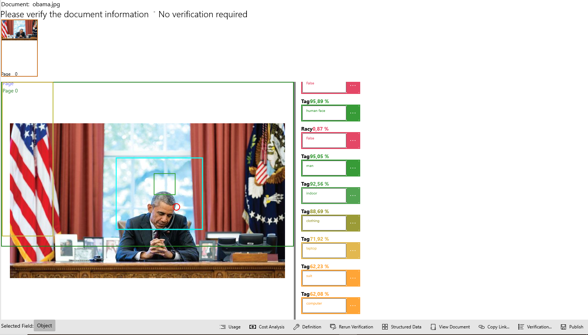
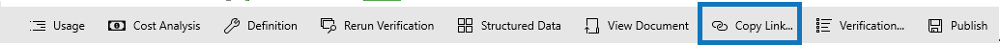

# Document Verification

## Usage

1.Click on any of the tags 2.Click on the "Usage" command in the command bar 3.This will open up the usage page you can view the usage page [Here](verification/document-analytics.md)

## Cost Analysis

* The "Cost Analysis" Command takes you to the Analytics page [Here](verification/document-analytics.md)

## Definition

* The "Definition" Command takes you to the Cost Analysis page \[Todo]

## Rerun Verification

* The "Rerun Verification" Command takes you to the Cost Analysis page \[Todo]

## Structured Data

* The "Structured Data" Command takes you to the Cost Analysis page \[Todo]

## View Document

* The "View Document" Command opens the document on your local machine

## Copy Link

* The "Copy Link" Command coppies a sharable link to the verification of th, you can share this verification with other AIForged users

## verification

* The "Verification" Command takes you to the Cost Analysis page \[Todo]

## Publish

* The "Publish" Command allows you to publiish changes made\[Todo]
