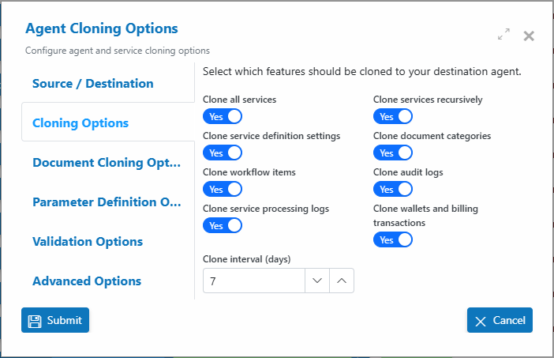
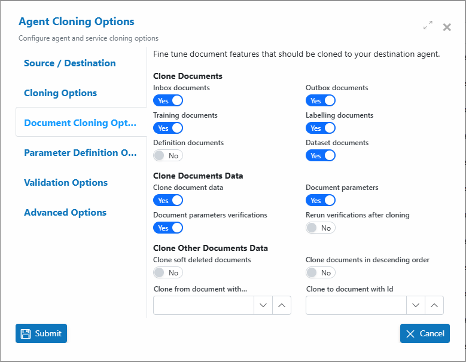
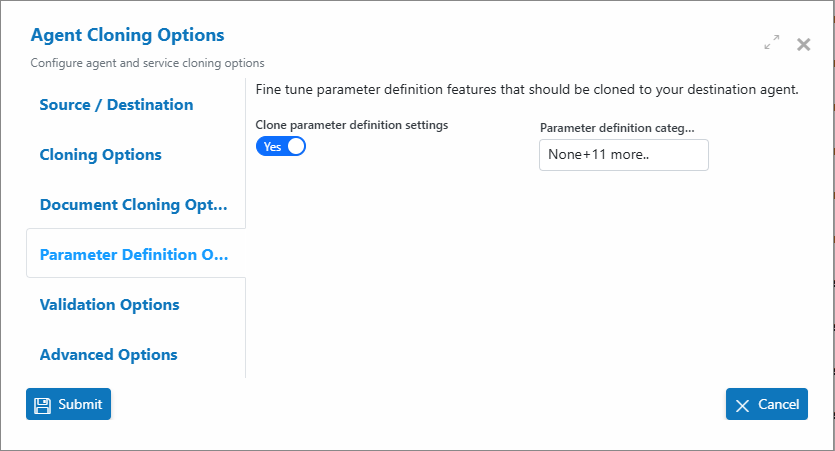
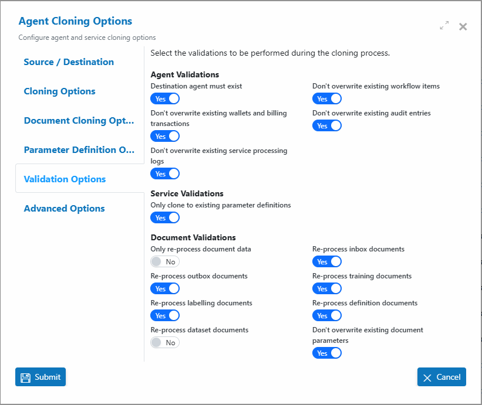
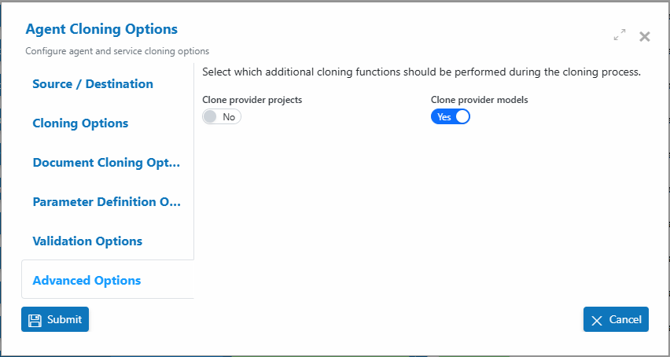

# 🖇️ Cloning

## Overview

Cloning in AIForged enables teams to quickly duplicate agents and services, supporting a variety of scenarios such as DevOps, testing, demonstrations, and cross-tenant collaboration. This process helps maintain consistency between environments and accelerates development workflows.

***

## Reasons for Cloning

### DevOps

Cloning is a fundamental part of the AIForged DevOps lifecycle. Developers can clone a “Live” agent or service into a “Dev” environment, make changes to settings and training data, and safely test the impact of these changes—without affecting the production agent.

* Enables safe experimentation and validation before deploying changes to production.
* Supports the creation of demo or sandbox copies for training, presentations, or customer walkthroughs.

### Demos and Research

Cloning also allows agents and services to be duplicated across tenants or projects for demo or research purposes, supporting collaboration and experimentation in isolated environments.

***

## Cloning Scheduler

Cloning operations are executed as scheduled jobs. Once cloning is configured, the scheduler handles execution. Schedules can be set for daily or weekly runs.


For ad-hoc cloning, schedule it as daily and then disable the schedule after the operation starts.


### Creating and Managing Cloning Schedules

1. **Create Cloning Options**\
   Before setting a schedule, define your cloning options.
2. **Access Service Settings/Definitions**\
   Once options are set, the cloning schedule appears in the service settings or definitions view.

<figure><figcaption></figcaption></figure>

### Modifying Cloning Options and Validation Checks

Adjust cloning options and validation settings as needed. Initiating these changes will update both cloning options and the schedule.

***

## Agent Cloning Options

A wide range of cloning options can be configured, offering granular control over what is cloned. Many options are interdependent and can have complex nested effects.

> **Tip:** Review all options carefully before cloning, especially when cloning user access or sensitive data.

Below are detailed definitions for each agent cloning option, organized by configuration tab.

***

### Source / Destination

Configure which agent and service will be used as the source and destination for the cloning process.

* **Source Agent**\
  &#xNAN;_&#x44;escription:_ The agent from which all selected data, services, and configurations will be cloned. _Purpose:_ This is your starting point for the cloning process.
* **Destination Agent**\
  &#xNAN;_&#x44;escription:_ The agent where the cloned data, services, and configurations will be copied to. _Purpose:_ Choose the target agent that will receive the cloned content.
* **Source Service (Optional)**\
  &#xNAN;_&#x44;escription:_ A specific service within the source agent to clone. _Purpose:_ Use this if you only want to clone a particular service, not the entire agent.
* **Destination Service (Optional)**\
  &#xNAN;_&#x44;escription:_ The target service within the destination agent to receive the cloned data. _Purpose:_ Direct the cloned service content to a specific service in the destination agent.

<figure><figcaption></figcaption></figure>

***

### Cloning Options

Control which features, services, and logs are included in the cloning process.

* **Clone all services**\
  &#xNAN;_&#x44;escription:_ Clones all services linked to the source agent. _Purpose:_ Ensures all connected services are copied to the destination agent.
* **Clone services recursively**\
  &#xNAN;_&#x44;escription:_ Also clones any nested or dependent services within each service. _Purpose:_ Use this to maintain complex service hierarchies.
* **Clone service definition settings**\
  &#xNAN;_&#x44;escription:_ Includes all configuration and processing settings for each service. _Purpose:_ Ensures the destination agent matches the source agent’s setup.
* **Clone document categories**\
  &#xNAN;_&#x44;escription:_ Clones all document category structures. _Purpose:_ Maintains document organization and classification.
* **Clone workflow items**\
  &#xNAN;_&#x44;escription:_ Clones workflow items such as tasks and automation steps. _Purpose:_ Preserves workflow automation in the destination agent.
* **Clone audit logs**\
  &#xNAN;_&#x44;escription:_ Copies audit logs from the source agent. _Purpose:_ Retains a history of changes and activity for compliance or analysis.
* **Clone service processing logs**\
  &#xNAN;_&#x44;escription:_ Copies internal processing logs from each service. _Purpose:_ Useful for troubleshooting and validation in the destination agent.
* **Clone wallets and billing transactions**\
  &#xNAN;_&#x44;escription:_ Clones associated billing and wallet transaction records. _Purpose:_ Use with caution—intended for financial auditing or migration scenarios.
* **Clone interval (days)**\
  &#xNAN;_&#x44;escription:_ Sets how often the cloning operation should be scheduled (in days). _Purpose:_ Automate cloning at regular intervals for continuous sync or backup.

<figure><figcaption></figcaption></figure>

***

### Document Cloning Options

Fine-tune which document types and associated data are cloned.

#### Clone Documents

* **Inbox documents**\
  &#xNAN;_&#x44;escription:_ Clone all documents from the agent’s inbox.
* **Outbox documents**\
  &#xNAN;_&#x44;escription:_ Clone all documents from the agent’s outbox.
* **Training documents**\
  &#xNAN;_&#x44;escription:_ Clone any documents used for agent training.
* **Labelling documents**\
  &#xNAN;_&#x44;escription:_ Clone documents used for labeling and annotation tasks.
* **Definition documents**\
  &#xNAN;_&#x44;escription:_ Clone documents used to define agent or service behavior.
* **Dataset documents**\
  &#xNAN;_&#x44;escription:_ Clone documents used as datasets for processing or training.

#### Clone Documents Data

* **Clone document data**\
  &#xNAN;_&#x44;escription:_ Copy all document data (content, metadata, etc.).
* **Document parameters**\
  &#xNAN;_&#x44;escription:_ Clone parameters associated with each document.
* **Document parameters verifications**\
  &#xNAN;_&#x44;escription:_ Clone verification results for document parameters.
* **Rerun verifications after cloning**\
  &#xNAN;_&#x44;escription:_ Re-execute verifications on cloned documents in the destination agent.

#### Clone Other Documents Data

* **Clone soft deleted documents**\
  &#xNAN;_&#x44;escription:_ Include documents marked as deleted (soft delete) in the cloning process.
* **Clone documents in descending order**\
  &#xNAN;_&#x44;escription:_ Clone documents starting from the most recent to the oldest.
* **Clone from document with...**\
  &#xNAN;_&#x44;escription:_ Limit cloning to documents with a specific starting document ID.
* **Clone to document with Id**\
  &#xNAN;_&#x44;escription:_ Limit cloning to documents up to a specific ending document ID.

<figure><figcaption></figcaption></figure>

***

### Parameter Definition Options

Fine-tune which parameter definition features are cloned to the destination agent.

* **Clone parameter definition settings**\
  &#xNAN;_&#x44;escription:_ Clone all parameter definition settings, including custom code, rules, and logic.
* **Parameter definition categories**\
  &#xNAN;_&#x44;escription:_ Specify which parameter categories to include.\
  &#xNAN;_&#x50;urpose:_ Use this to narrow cloning to certain categories for advanced scenarios.

<figure><figcaption></figcaption></figure>

***

### Validation Options

Select the validations to be performed during the cloning process.

#### Agent Validations

* **Destination agent must exist**\
  &#xNAN;_&#x44;escription:_ Ensure the destination agent is present before cloning.
* **Don't overwrite existing wallets and billing transactions**\
  &#xNAN;_&#x44;escription:_ Prevents cloning from overwriting any existing billing or wallet data.
* **Don't overwrite existing service processing logs**\
  &#xNAN;_&#x44;escription:_ Keeps existing service processing logs in the destination agent.
* **Don't overwrite existing workflow items**\
  &#xNAN;_&#x44;escription:_ Keeps existing workflow tasks in the destination agent.
* **Don't overwrite existing audit entries**\
  &#xNAN;_&#x44;escription:_ Keeps existing audit records in the destination agent.

#### Service Validations

* **Only clone to existing parameter definitions**\
  &#xNAN;_&#x44;escription:_ Only clone parameter definitions if they already exist in the destination agent.

#### Document Validations

* **Only re-process document data**\
  &#xNAN;_&#x44;escription:_ Restrict reprocessing to document data only (not parameters/verifications).
* **Re-process outbox documents**\
  &#xNAN;_&#x44;escription:_ Reprocess outbox documents during cloning.
* **Re-process inbox documents**\
  &#xNAN;_&#x44;escription:_ Reprocess inbox documents during cloning.
* **Re-process training documents**\
  &#xNAN;_&#x44;escription:_ Reprocess training documents during cloning.
* **Re-process labelling documents**\
  &#xNAN;_&#x44;escription:_ Reprocess labelling documents during cloning.
* **Re-process definition documents**\
  &#xNAN;_&#x44;escription:_ Reprocess definition documents during cloning.
* **Re-process dataset documents**\
  &#xNAN;_&#x44;escription:_ Reprocess dataset documents during cloning.
* **Don't overwrite existing document parameters**\
  &#xNAN;_&#x44;escription:_ Keeps existing document parameter data in the destination agent.

<figure><figcaption></figcaption></figure>

***

### Advanced Options

Control additional cloning functions related to cloud or external service providers.

* **Clone provider projects**\
  &#xNAN;_&#x44;escription:_ Clone projects and configurations from external providers (e.g., MS Forms, Document Intelligence).
* **Clone provider models**\
  &#xNAN;_&#x44;escription:_ Clone AI models from external providers.

<figure><figcaption></figcaption></figure>

***


Always test cloning in a non-production environment before running in production.&#x20;



When cloning user access, review permissions to avoid accidental over-sharing.&#x20;



Use document ID filters for large agents to improve performance and avoid unnecessary cloning.&#x20;



Regularly review scheduled cloning jobs and disable them when not needed to save resources.&#x20;



If unsure about any setting, consult AIForged support or documentation before proceeding.


 IgnoreCase Multiline IgnoreCase Multiline
