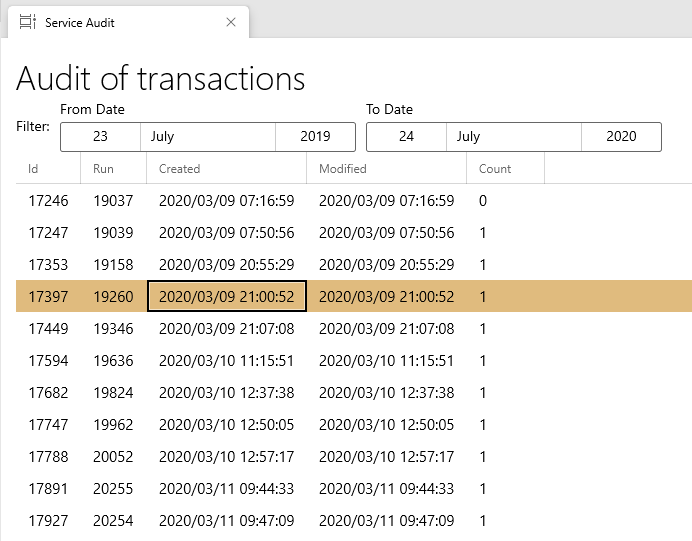
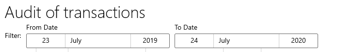

# Audit

* The Audit page displays transactions made by the service

## Filter Audits

1. Click on the date you want to filter
2. Select your date
3. Your Audits will auutomatically update and filter

| Field Name     | Description                                          |
| -------------- | ---------------------------------------------------- |
| Id             | Displays the generated Id of the Document            |
| Run            |                                                      |
| Date Created   | Displays the date the process transaction was done   |
| Modied Created | Displays the date the modiefied transaction was done |

