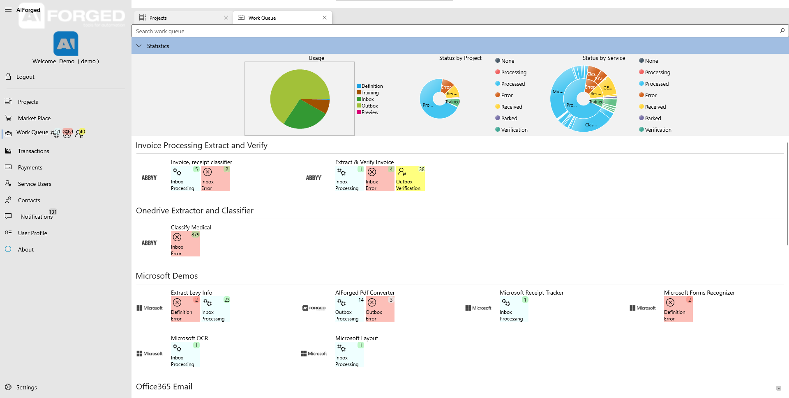
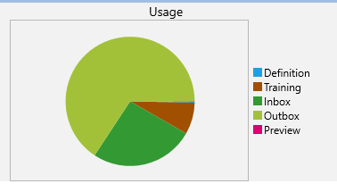
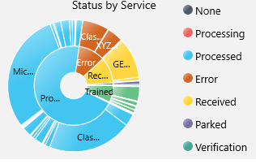
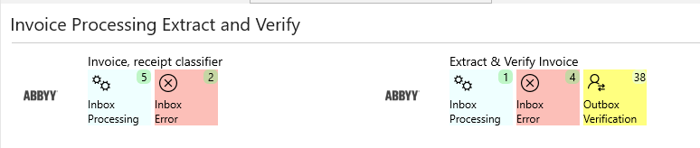

# Work Queue

The Work Queue displays the current statuses of services, you can use this too see the current work queue

## Statistics

### Usage

* Displays a pie-chart of your usage statistics

### Status by project

* Displays a pie-chart of your statuses by a project

### Status by Service

* Displays a pie-chart of your statuses by service

## Services

* Displays all your statuses for each service
* You can click on the status to navigate to documents page IgnoreCase Multiline IgnoreCase Multiline

