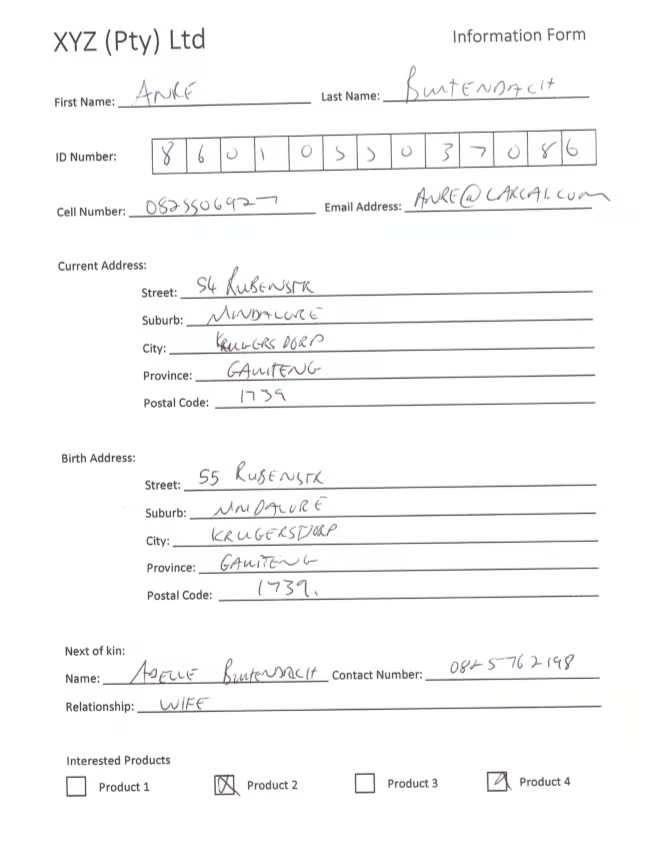

# ℹ️ Document Types

### Types of documents

It’s possible to categorize documents into three distinct types: structured, semi-structured, and unstructured. Each type comes with its own extraction challenges and typically benefits from different AI approaches.

!!! info
    Identify the document type first, then choose an appropriate [AI service](https://0.0.0.0/services/) and configuration to maximize accuracy and speed.

### Structured documents

Structured documents present information in a fixed, predictable layout with clearly defined fields (often with boxes, labels, and consistent positions). Because their format is standardized, they lend themselves to high-precision extraction with minimal ambiguity.

* Characteristics:
    * Fixed templates and layouts
    * Clearly labeled fields and stable positions
    * Minimal visual or textual variability between instances
* Common examples:
    * Application forms, standardized claim forms, registration forms
* Typical challenges:
    * Low-quality scans or skewed images can reduce detection accuracy
    * Handwritten entries may require specialized OCR or handwriting models
* Tips:
    * Use high-quality scans or digital originals
    * If handwriting is present, enable selection marks/handwriting options where available

### Semi-structured documents

Semi-structured documents don’t follow a single rigid template, but they do follow common patterns. Core fields are consistent conceptually (e.g., “Invoice Number,” “Total,” “Date”), yet their positions, labels, and formats can vary by issuer or layout. Extraction for this class typically benefits from pretrained models that learn the “concepts” rather than fixed coordinates.

* Characteristics:
    * Repeating concepts with variable positions and labels
    * Moderate layout diversity across sources/vendors
    * Tables and line items are common
* Common examples:
    * Invoices, receipts, purchase orders, statements
* Typical challenges:
    * Field labels vary (e.g., “Invoice #”, “Inv No.”, “Bill No.”)
    * Line items may appear in different table shapes or across multiple pages
* Tips:
    * Use services trained for invoices/receipts to handle variability
    * For tables, enable table detection and verify column mapping

### Unstructured documents

Unstructured documents contain rich free-form text with little to no consistent layout or fixed fields. Valuable information may be embedded in paragraphs, clauses, or mixed content. These require layout-aware OCR coupled with semantic understanding or targeted rules.

* Characteristics:
    * Free-form text; minimal consistent structure
    * Information is context-dependent and dispersed
    * High variability between documents
* Common examples:
    * Contracts, policies, letters, emails, reports
* Typical challenges:
    * Key data resides in narrative text rather than labeled fields
    * Requires semantic parsing, entity recognition, or custom rules
* Tips:
    * Start with robust OCR/layout extraction
    * Apply targeted extraction rules, NLP, or verification to pinpoint entities and clauses

