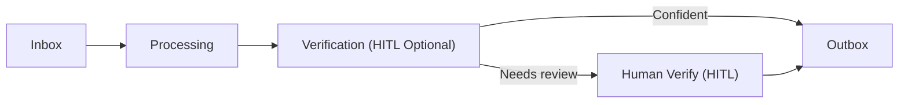

# 📄 Documents

Documents are the heartbeat of IDP in AIForged. This page helps you understand how documents flow through the platform and how to ingest, classify, extract, verify, and publish at scale—directly within each Service view.

!!! info
    New to AIForged? Start with Document Types to choose the right AI service and training approach. Then follow the path through flows, attributes, categories, and the Service view to run end‑to‑end.

---

## In this section

| Topic                                      | Page                                 |
|------------------------------------------- |--------------------------------------|
| Document Types                             | [document-types.md](document-types.md "mention") |
| Understanding Document Flows               | [understanding-document-flows.md](understanding-document-flows.md "mention") |
| Document Attributes                        | [document-attributes.md](document-attributes.md "mention") |
| Document Categories                        | [document-categories.md](document-categories.md "mention") |
| Working with documents in the Service view | [documents-in-service-view.md](documents-in-service-view.md "mention") |

---

## What are “documents” in AIForged?

A document is any input or output that moves through your agent’s pipelines—PDFs, images, or derived artifacts (e.g., JSON results, searchable PDFs). Documents carry attributes (identity and lifecycle), parameters (extracted fields), verifications (system/user/service checks), and data blobs (DocumentData types like Image, Result, Page, etc.). You work with documents from each Service view where you upload, process, verify (HITL), and review/export results.

Key ideas:

- Documents have a Usage (Inbox, Outbox, Training, Definition, Dataset, etc.) and a Status (Queued, Processing, Verification, Processed, Error, etc.).
- Parameters (fields/labels) are extracted values attached to a document, defined by Parameter Definitions.
- Verifications record the provenance and status of checks (system, user, provider), enabling robust audit trails.
- DocumentData entries store bytes and metadata (e.g., Image, Result, Page) so you can retrieve the right artifact at the right time.

---

## Lifecycle at a glance

Most pipelines follow a standard flow. HITL (Human‑in‑the‑Loop) is used where confidence or policy requires it.

- Inbox
    - Intake via manual upload, scrapers (Email/OneDrive), API/SDKs, or upstream Services.
- Processing
    - Pre/post utilities, OCR, classification, extraction, and enrichment steps.
- Verification
    - Rule‑based checks and/or HITL when confidence is low or policy requires review.
- Outbox
    - Finalized results ready for export, webhooks, or downstream integrations.

!!! tip
    Normalize early. Use Utilities (Digitizer, PDF Converter, Image Splitter) to standardize inputs and improve extraction accuracy before verification.

---

## Recommended path

1. Document Types
    - Classify your inputs as structured, semi‑structured, or unstructured.
    - Choose the right extraction approach (for example, document intelligence or LLM‑based extraction).
2. Understanding document flows
    - See how documents progress Inbox → Processing → Verification → Outbox, and where HITL fits.
3. Document attributes
    - Learn the identity and lifecycle fields available (Id, Usage, Status, Category, Type, Master ID, External ID).
4. Document categories
    - Separate Training/Test/Production and system artifacts for clean, auditable environments.
5. Working in the Service view
    - Upload, process, verify, and review/export results directly within the Service view.

---

## Quick start

- Create or open an Agent and add the appropriate Service (for example, OCR, Extract & Verify, LLM Extractor).
- Define Categories (Training/Test/Production) and confirm any required Attributes.
- Upload documents to the Service Inbox (or configure a Scraper for automated intake).
- Run a small test set; if enabled, complete HITL for low‑confidence or policy‑flagged fields.
- Review outputs in Outbox and export to downstream systems or trigger webhooks.

!!! tip
    For unstructured or highly variable content, pair an LLM Extractor with a typed schema and dataset grounding. Enforce output types for deterministic results and route low‑confidence items to HITL.

---

## Key concepts

- Document Types
    - How inputs are modeled and which AI service/training approach applies.
- Attributes
    - Identity, lifecycle, and context values that travel with the document throughout processing.
- Categories
    - Logical separation for environments (Training/Test/Production) and system artifacts (Definition, Dataset).
- Lifecycle and flows
    - Standard progression across Inbox, Processing, Verification, and Outbox, with optional HITL.
- Service view
    - The operational hub for upload, processing, HITL review, results inspection, and export.
- Access and HITL
    - Permissions and assignments governed by Tenants and roles; HITL actions are routed via Work Items.

---

## Working with documents in the Service view

- Upload and intake
    - Drag‑and‑drop files, use scrapers (Email/OneDrive), or push via API/SDK.
- Process
    - Start single or batch processing; configure pre/post utilities as needed.
- Verify
    - Review low‑confidence items via HITL; accept or correct extracted parameters.
- Review and export
    - Inspect Results and DocumentData; export JSON, PDFs, or trigger integrations/webhooks.

!!! info
    Use External ID to link documents to ERP/CRM/GRC systems. Use Master ID to group related items (for example, email plus attachments, derivatives, or multi‑step jobs).

---

## Best practices

- Normalize early
    - Convert scans to PDF and digitize to improve OCR and extraction accuracy.
- Keep Categories clean
    - Use Training/Test/Production and system categories consistently to separate concerns.
- Enforce verification policies
    - Route low‑confidence or sensitive fields to HITL and record outcomes via verifications.
- Retain only what you need
    - Use DocumentData types to export the right artifacts (JSON results, searchable PDFs, page images) and align with retention policies.
- Automate reconciliation
    - Populate External ID on ingest to simplify matching in downstream systems.
- Monitor flow health
    - Use Usage and Status for dashboards and routing (for example, Processing backlog, Ready for QA).

---

## Outcomes

- Select the right service and configuration for each document type.
- Trace a document’s lifecycle end‑to‑end (statuses, verifications, results) in the Service view.
- Maintain clean, compliant environments with clear categorization, retention, and auditable verification trails.

---

## Related

- Organizations & User Groups — set up access, assignments, and HITL permissions.
- Projects & Services — organize agents, services, and environments.