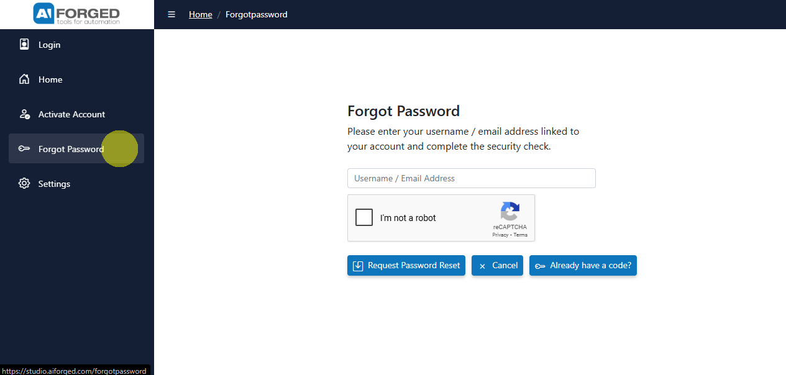
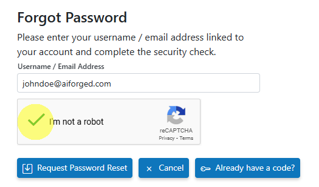

# ❓ Forgot Password

## Overview

If you can’t sign in to your AIForged account, you can request a password reset link and then set a new password using the reset token sent to your email.

- Request reset link: https://studio.aiforged.com/forgotpassword
- Change password with token: https://studio.aiforged.com/changepassword

!!! tip
    You can quickly switch between these pages:
    - On Forgot Password, click “Already have a code?” to go to Change Password.
    - On Change Password, click “Don’t have a code?” to return to Forgot Password.

---

## Option A — Request a password reset link

1. Open the Forgot Password page
    - Go to https://studio.aiforged.com/forgotpassword

    

2. Enter your details
    - Provide your Username or Email Address linked to your account.

3. Complete the security check
    - Solve the CAPTCHA to verify you’re not a robot.

    

4. Submit the request
    - Click Request Password Reset.

5. Check your email
    - Look for the reset password email and follow the instructions.
    - The email includes a reset token and/or a link to the Change Password page.

!!! info
    Didn’t get the email? Wait a few minutes, then check your spam/junk folder. If it still hasn’t arrived, confirm the email/username you entered is correct or try again.

---

## Option B — Change your password (you already have a code)

1. Open the Change Password page
    - Go to https://studio.aiforged.com/changepassword
    - Or from Forgot Password, click “Already have a code?”

2. Enter your account identifier
    - Provide your Username or Email Address.

3. Enter the reset token
    - Paste the Reset Token from the email you received.

4. Set your new password
    - Enter a New Password and Confirm Password.

5. Apply the change
    - Click Change Password. You’ll see a confirmation if successful.

    

!!! tip
    If your token has expired or is invalid, go back to the Forgot Password page (“Don’t have a code?”) and request a fresh reset email.

---

## Troubleshooting

- No reset email received
    - Wait up to 10 minutes and check spam/junk.
    - Confirm you entered the correct Username/Email.
    - Request another reset if needed.

- Invalid or expired code
    - Use the most recent reset email you received.
    - Request a new reset link from the Forgot Password page.

- Enterprise network issues
    - Ensure your network allows outbound access to https://studio.aiforged.com.
    - If you use an on‑prem or private deployment, use your internal Studio URL.

- CAPTCHA not loading
    - Disable conflicting extensions or try a different browser.
    - Check that your network allows the CAPTCHA provider resources.

- Still unable to reset
    - Contact your AIForged administrator or consultant for assistance.

---

## Related links

- How to access AIForged: [Click Here](how-to-install-aiforged.md)
- Login: [Click Here](login.md)
- Activate My Account: [Click Here](activate-my-account.md)
- Multi‑Factor Authentication: [Click Here](multi-factor-authentication.md)
- Register (how new users get accounts): [Click Here](register.md)