# 🚀 Getting Started

This guide walks you through the fastest path to value with AIForged—from automated document intake to extraction, verification, and publishing. You’ll set up the Email Scraper, classify documents, extract data with Document Intelligence and the LLM Extractor, and understand where Human‑in‑the‑Loop (HITL) fits.

!!! tip
    New to document types? Start with [Documents → Document Types](documents/document-types.md) to decide which extraction approach (template, prebuilt, or LLM) fits your inputs.

---

## Before you begin: access your AIForged account

Follow these steps to get into AIForged quickly and securely. If you’re new, start with registration and activation; if you already have an account, jump to Login and MFA.

1) Access AIForged Studio

- Read: [How to access AIForged](how-to-access-aiforged.md)
- Choose your preferred access method and confirm you can reach the sign-in screen.

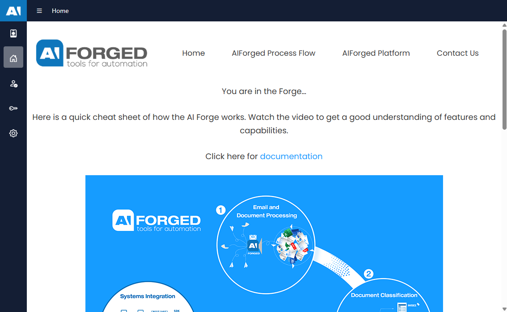

2) New users: register and activate

- Register: [Sign up](register.md)
- Activate: Complete email verification and first-time setup in [Activate my account](activate-my-account.md)

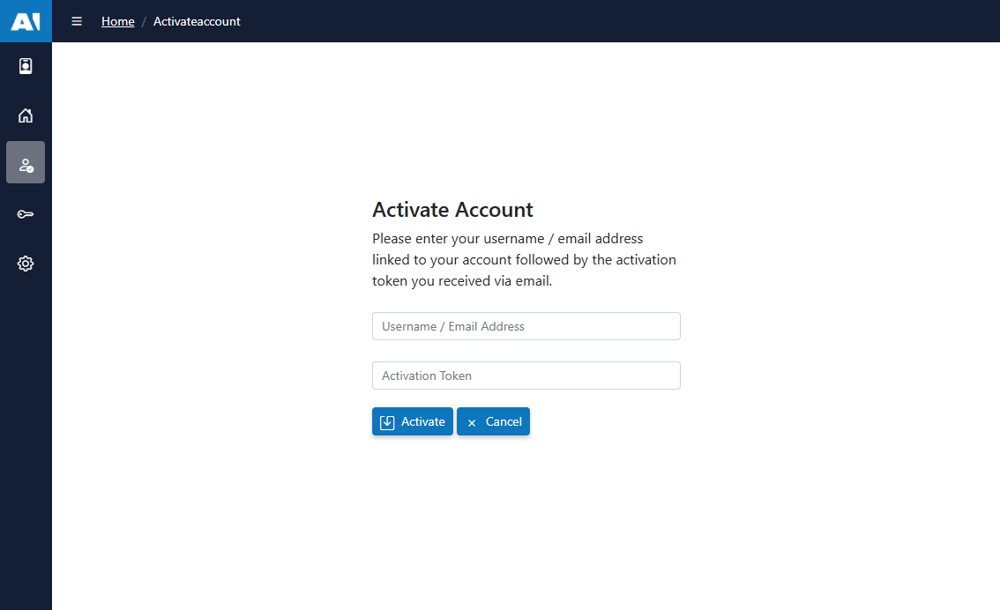

3) Existing users: sign in

- Login: [Sign in to AIForged](login.md)
- Set up Multi‑Factor Authentication (recommended): [MFA guide](multi-factor-authentication.md)

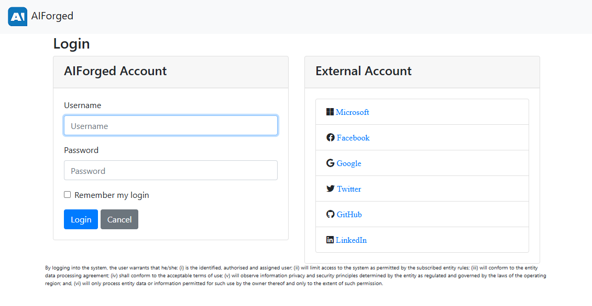

4) Can’t sign in?

- Reset your password: [Forgot Password](forgot-password.md)

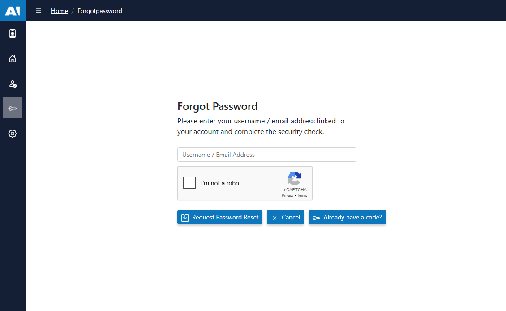

5) Complete your profile

- Update your name, avatar, locale, and notification preferences: [User Profile](user-profile.md)

!!! tip
    Before configuring anything after logging in, make sure you’re in the correct Tenant. Use the Tenant selector in the top‑right of AIForged Studio to switch to your company’s Tenant. Roles (Owner, Administrator, Developer) are assigned per Tenant and control whether you can create agents, services, and flows. If options appear disabled or you can’t see team projects, you’re likely in your personal Tenant—switch to the company Tenant and try again.

---

## Choose the correct Tenant

AIForged is multi-tenant. Most users belong to:

- A personal Tenant (created with your account), and
- Your company’s Tenant (added by your company admin).

Before creating agents and services, ensure you’re working in the correct Tenant so the right roles (Owner, Administrator, Developer, etc.) apply.

### Switch Tenant in AIForged Studio

1. Open AIForged Studio.
2. In the top‑right corner, click the Tenant selector (shows your current Tenant name).
    
3. Choose your company’s Tenant (or the intended Tenant for this work).
4. Confirm your roles in that Tenant (Owner/Admin/Developer) if you plan to configure services.
5. Proceed with your setup (agents, services, utilities) in the selected Tenant.

!!! warning
    Creating agents or services in the wrong Tenant can lead to missing permissions, visibility issues for your team, and misrouted document flows.

!!! tip
    If you can’t add a service, or menu actions appear disabled, you’re likely in your personal Tenant. Switch to your company’s Tenant and try again.

!!! info
    Only Tenants where you are a member will appear in the selector. If you don’t see your company’s Tenant, ask your company admin to add you.

_[Suggested screenshot: Tenant selector in the top‑right corner of Studio]_

---

## Prerequisites

- Roles & permissions  
  - To add/configure services you need one of: Owner, Administrator, Developer.
- Access to a mailbox (for Email Scraper), or sample PDFs/images to upload
- (Optional) Datasets for lookups/grounding (CSV/XML/JSON, or create Custom Datasets in AIForged)

---

## Two ways to get productive

### Option A — Studio (fastest to value)

1. Create or open an Agent
    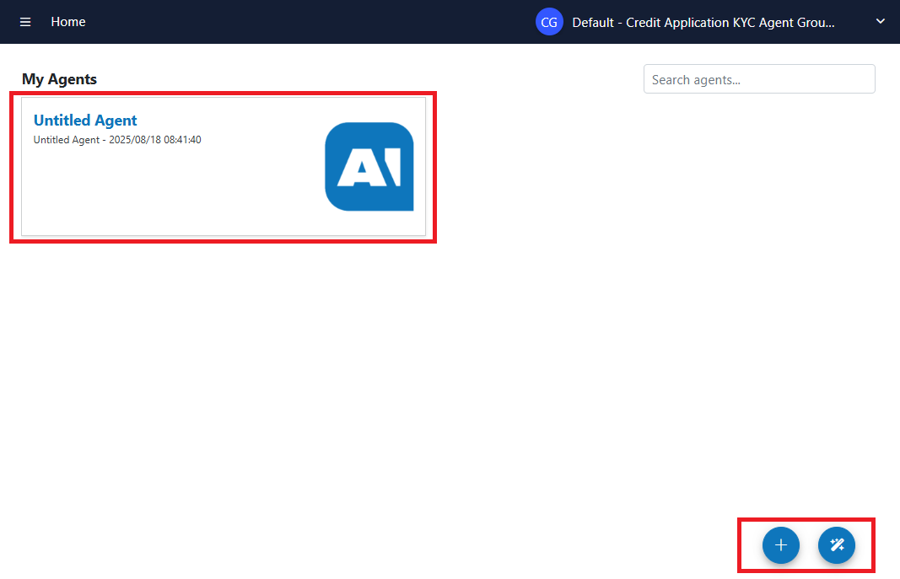
2. Add your first Service (e.g., Email Scraper, LLM Extractor, Document Intelligence, OCR, Vision)
    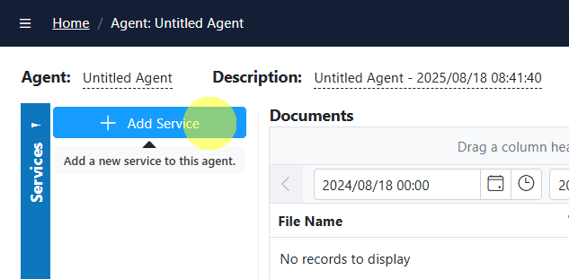
    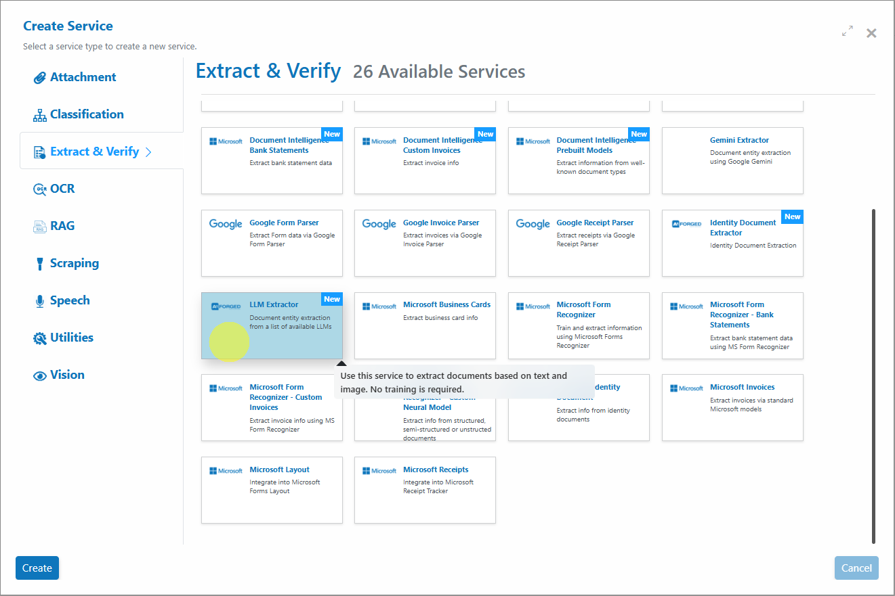
3. Configure the flow (preferred): Open the Service Flow Configurator
    - From the service’s page, click “Open Service Flow Configurator”
        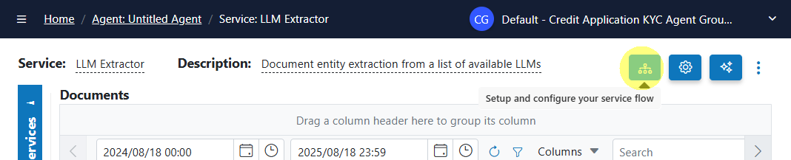
    - Drag additional services from the palette (left) onto the target service’s drop points:
        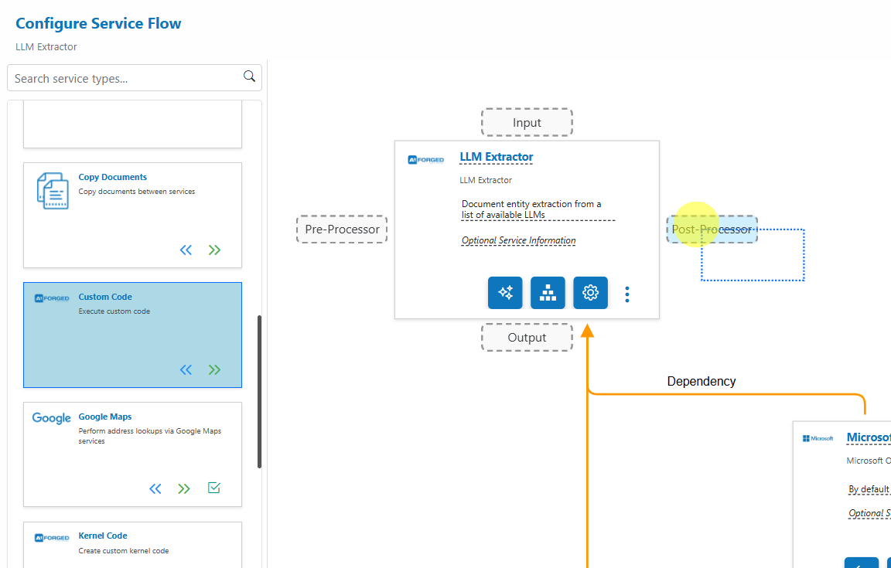
        - Input: New upstream service that feeds into the target
        - Input – Branch: Add parallel inputs without altering existing ones
        - Output: Next step that receives the target’s output
        - Output – Branch: Add parallel outputs without altering existing ones
        - Pre‑Processor: Utilities that run before the target (e.g., Digitizer, PDF Converter)
        - Post‑Processor: Utilities that run after the target (e.g., Copy Documents, Custom Code)
        - Dependency: Required services the target depends on (e.g., OCR)
        - Verification: Enrichment/verification services for Extract & Verify
    - Click Save to apply changes and reveal action buttons (Settings, Parameters, Wizard, Code Editor, More)
        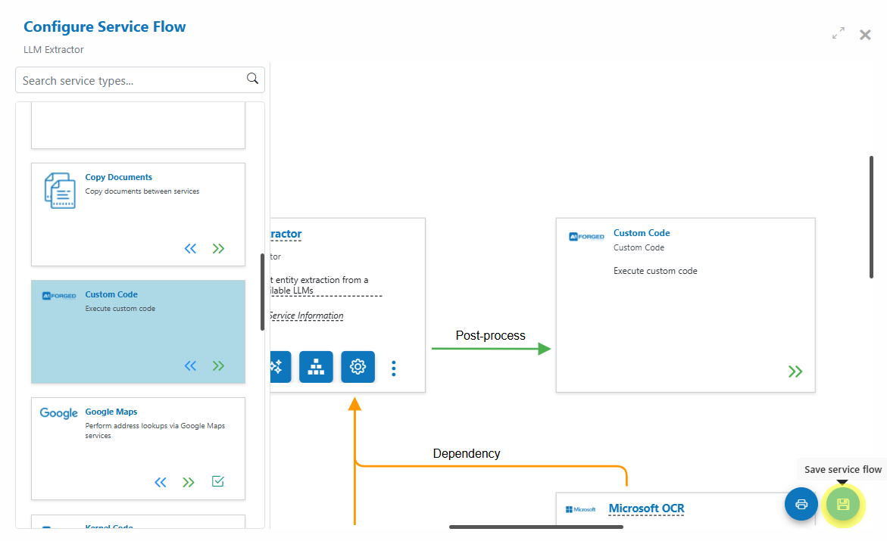
        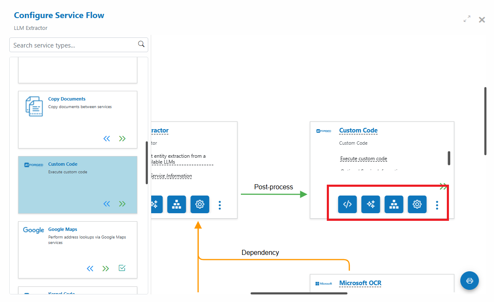

!!! tip
    Utilities are not standalone. Add them as Pre‑ or Post‑Processors from the Service Flow Configurator or the parent service’s Add Service menu. Copy Documents typically acts as the transport between services.

!!! tip
    For unstructured content (contracts, letters), use the LLM Extractor with a typed schema. Ground prompts with datasets for accuracy and enforce output types for reliability.

See also: [Service Flow Configurator](service-flow-configurator.md)

4. Ingest documents
    - Upload directly or configure a Scraper (Email, OneDrive)
5. Process and verify
    - Use HITL work items, assignment methods (Random, HighThroughput, Idle, etc.), and SLAs
6. Publish and integrate
    - Export results, trigger webhooks, or hand off to downstream systems

### Option B — Programmatic (REST, SDKs, and RPA)

!!!tip
    See “Developer tools & integrations” at the end for REST, SDKs (.NET, JS/TS), UiPath activities, and Power Automate connectors.

---

## Configure with the Service Flow Configurator (preferred)

- Launch: Open any service, then click “Open Service Flow Configurator”
    
- Build visually: Drag services from the left palette and drop onto context‑aware drop points (Input, Output, Pre/Post, Dependency, Verification)
    
- Save: Click Save to persist and enable service actions (Settings, Parameters, Wizard, Code Editor, More)
    
- Document: Export your flow to PNG for architecture reviews and runbooks

!!! warning
    Changes are not applied until you click Save.

See the full guide: [Service Flow Configurator](service-flow-configurator.md)

---

## 1) Intake: Email Scraper (recommended foundation)

Use the Email Scraper to automatically ingest attachments from dedicated mailboxes—ideal for invoices, statements, inbound forms, etc.

### Create & configure

1. Add the Email Scraper to your agent  
    - In the agent’s Service view, Add Service → Email Scraper
        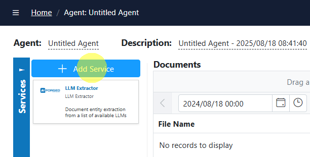
        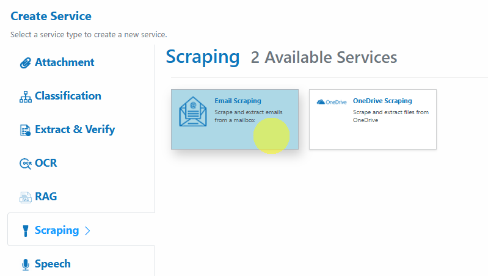
2. Choose your provider and configure the scraper via the Service Configuration Wizard  
        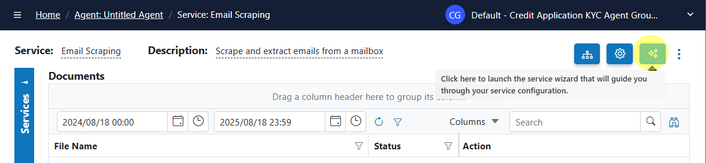
    - Microsoft 365: IMAP, Server: `outlook.office365.com`, Port: `993`  
        - Enable Prompt‑less Device Code Flow (enabled by default)  
        - Set Tenant ID and Client ID (from your Azure app registration)  
            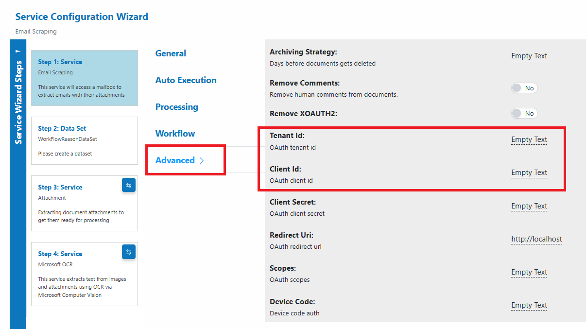
        - No password required with device code flow
    - Gmail: IMAP, Server: `imap.gmail.com`, Port: `993`  
        - Use an app-specific password and set “Remove XOAUTH2: Yes”
            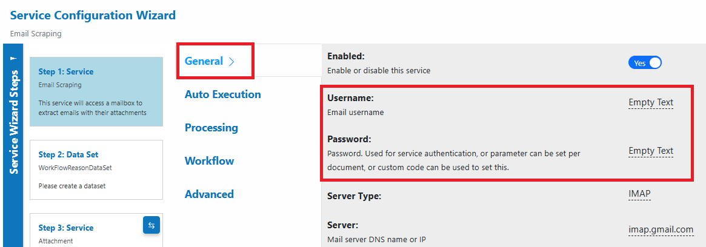
            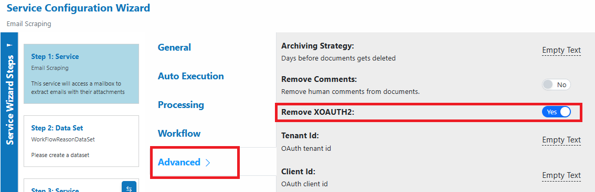
    - Other IMAP: Use provider’s IMAP server; set credentials accordingly
3. Folders  
    - Folder: source folder to monitor (e.g., Inbox)  
        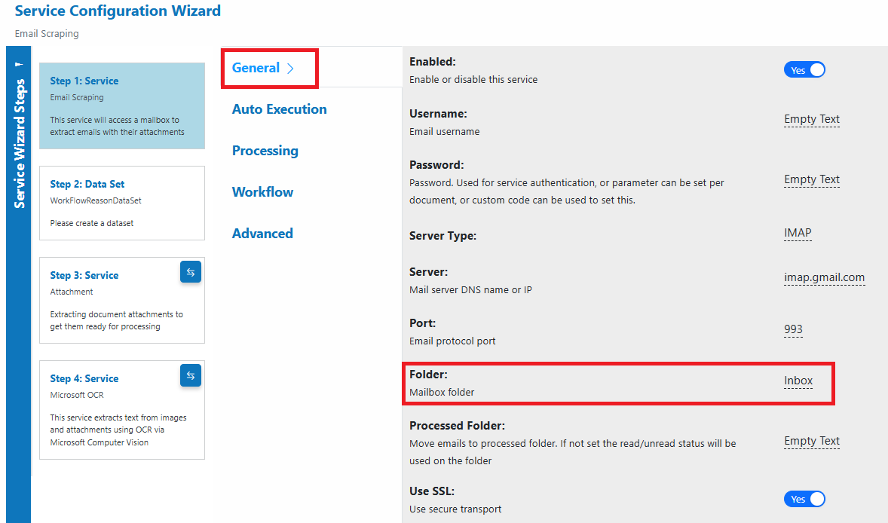
    - Processed Folder: where processed emails will be moved
        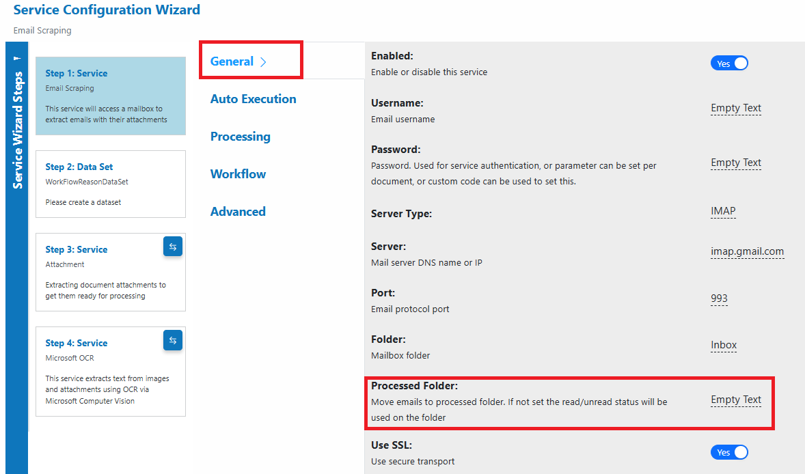
4. Auto Execution  
    - Enable and choose an interval appropriate for your volume
        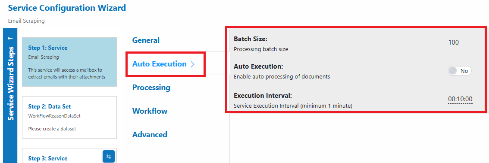

!!! tip
    For Microsoft 365, Prompt‑less Device Code Flow authenticates on the first scheduled run and begins email retrieval on the second. No stored passwords; no prompts.

See: [Services → Scrapers → Email Scraper](services/scrapers/email-scraper.md)

---

## 2) Classification: route pages or documents by type

Classification lets you auto-sort mixed batches (e.g., Credit Application, ID, Payslip, Other), enabling precise downstream pipelines.

!!! tip
    For new classification workflows, start with the [LLM Classifier](services/classification/llm-classifier.md). It is the preferred classifier type in AIForged and is usually faster to tune because category names and descriptions are used directly during classification.

### LLM Classifier (preferred)

1. Add the **LLM Classifier** service.
2. Define your business categories with short, distinct names.
3. Add a clear description to each category explaining what belongs in that class.
4. Process a representative mixed batch and review the results.
5. Refine category wording before scaling up.

Best-practice settings:

- Keep category names distinct and business-friendly
- Use category descriptions to explain category boundaries clearly
- Add an **Other** category where appropriate for unmatched documents
- Review low-confidence results and tune the wording incrementally

See: [Services → Classification → LLM Classifier](services/classification/llm-classifier.md)

### AIForged Classifier (supervised ML alternative)

1. Add the “AIForged Classification” service  
    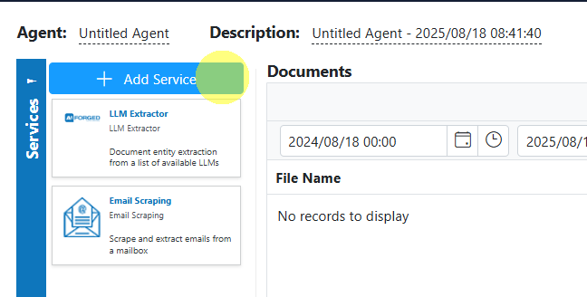
    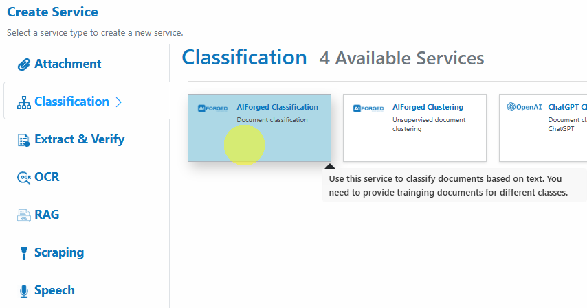
2. Open the Service Configuration Wizard and Define Categories (document classes)
    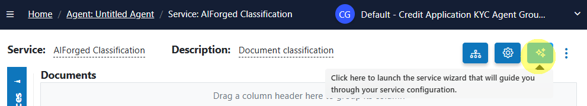
    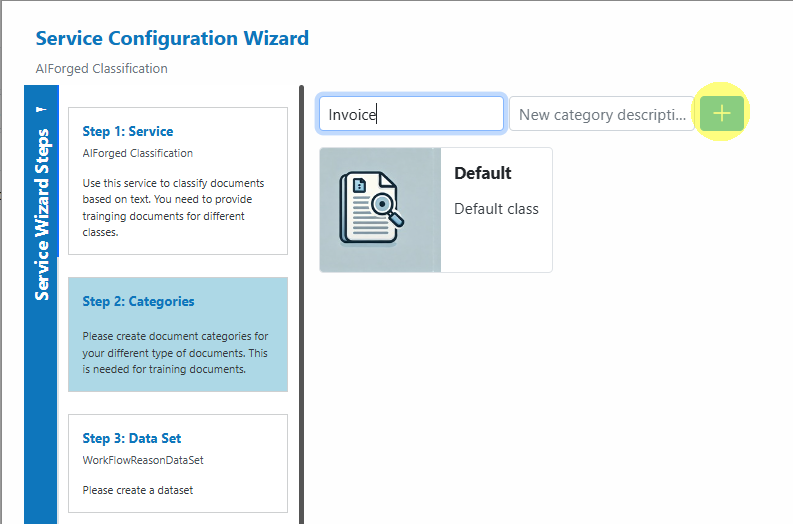
3. Upload training samples  
    - At least 5–10 examples per document category (more is better)  
        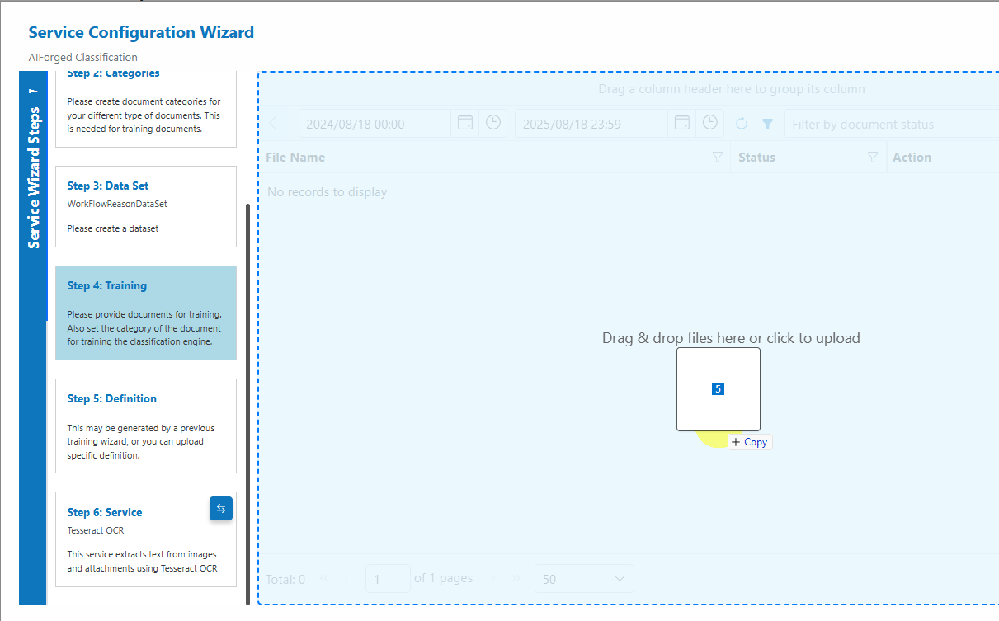
    - Select documents and Train the service
        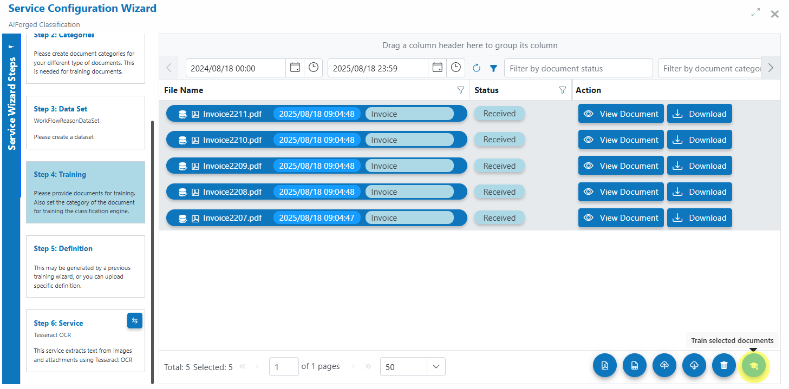
4. Process mixed inputs  
    - The classifier will label them automatically  
    - Use Copy/Move utilities to route by class to specific services (e.g., IDs → Identity extraction)

Best‑practice settings:

- Enable Auto Execution
- Consider “Force PDF Image” for scanned/complex PDFs
- Use “Merge To PDF” if you want grouped outputs per class (optional)

!!! tip
    If classification confidence < 60%, create a HITL work item for a verifier (e.g., assign to Hendri or Sandra).

See: [Services → Classification → AIForged Classification](services/classification/aiforged-classifier.md)

---

## 3) Extract & Verify: two paths

### A) Document Intelligence (template/layout extraction)

Best for structured and semi‑structured documents where field anchors and labels are consistent (forms, bank statements, many invoice formats).

1. Add “Document Intelligence” (Microsoft)  
2. Wizard steps (typical)
    - Service (general settings)
    - Categories (classifier built‑in—define document types)
    - Analysis (upload documents and set correct category)
    - Labelling (label fields across documents; use copy/paste labels)
    - Training (train your extraction model)
    - Definition (review generated definition document)
    - Verification (configure field keys, verification rules)
3. Test with a small batch  
4. Move to production and monitor HITL as needed

Best practices

- Label consistently (same label per field across samples)
- Use high‑quality scans or digitize inputs first  
- Keep model definitions updated when layouts evolve

See: [Services → Extract & Verify → Document Intelligence](services/extract-and-verify/document-intelligence.md)

---

### B) LLM Extractor (Generative AI for unstructured content)

Best for unstructured and highly variable documents (contracts, letters, reports) and when rapid iteration is needed.

1. Add “LLM Extractor”
2. Define your extraction schema (JSON/object mapping)  
   - Example:
     ```json
     {
       "vendor": "string",
       "invoiceNumber": "string",
       "invoiceDate": "date",
       "total": "currency",
       "lineItems": [
         { "description": "string", "qty": "number", "unitPrice": "currency", "amount": "currency" }
       ]
     }
     ```
3. Write a prompt with a few examples (few‑shot)  
    - Specify policy: strict schema, units, currency normalization, date formats
4. (Optional) Grounding  
    - Provide context (linked documents, Custom Dataset lookups, or full text)
5. Validation & guardrails  
    - Enforce types, fail fast on schema mismatch  
    - Add HITL routing for low confidence or policy flags
6. Test & iterate quickly

!!! tip
    LLM Extractor excels at narrative extraction, cross-field reasoning, and normalization. Use datasets to ground and constrain the model for better precision.

See: [Services → Extract & Verify → Document Intelligence](services/extract-and-verify/llm-extractor.md)

---

## 4) Recommended utilities (pre/post)

Attach utilities as pre‑ or post‑processors to strengthen your pipeline.

- Digitizer  
    - Add searchable text layer to scanned PDFs; optional overlays  
    - Consider for all scans before extraction  
    - See: [Services → Utilities → Digitizer](services/utilities/aiforged-digitizer.md)
- PDF Converter  
    - Normalize inputs to PDF; force image‑only for artifact‑heavy PDFs  
    - See: [Services → Utilities → PDF Converter](services/utilities/aiforged-pdf-converter.md)
- Image Splitter  
    - Split multi‑page PDFs/TIFFs into per‑page images for page‑level routing  
    - See: [Services → Utilities → Image Splitter](services/utilities/aiforged-image-splitter.md)
- Copy / Move Documents  
    - Route by class, category, status, or extension to downstream services  
    - See: [Services → Utilities → Copy](services/utilities/copy-documents.md)
    - See: [Services → Utilities → Move](services/utilities/move-documents.md)
- And more
    - See: [Services → Utilities](services/utilities/index.md)

!!! tip
    Utilities are not standalone—attach them to a parent service as pre‑ or post‑processors from the parent’s Service view or Service Flow Configurator.

---

## 5) Human‑in‑the‑Loop (HITL)

Use work items to involve people where it matters.

- Actions: Verify, Investigate, Forensic, Fraudulant, Classify, QA, Reprocess
- Assignment methods: Random, HighThroughput, Idle, ProjectOwner, DocumentOwner, User
- Statuses: Created → Received → Verified → Completed (typical path)
- Escalation: EscalateTx/EscalateRx for handoffs; Transfer for reassignment

!!! tip
    Use data‑driven routing: Idle for fairness, HighThroughput for speed. Always add clear Info/Comment for auditability.

---

## 6) Common enhancements

- Deduplication (Custom Code + Custom Dataset)  
    - Hash (MD5/SHA‑256) incoming bytes; store and check in a dataset  
    - On duplicate → set DocumentStatus=Error, create HITL work item  
    - See full example: “Custom Code Example: Duplicate Document Check”
- Dataset-powered validation/enrichment  
    - Lookup supplier/vendor lists, GL codes, tax rates, etc.  
    - Use `GetDataSetRecord`/`SearchDataSetRecords` to fetch values; add verifications accordingly
- Post‑processing & export  
    - Save JSON/PDF to Result, push via Webhook, or call external APIs

---

## 7) Developer tools & integrations

AIForged is built on REST APIs and offers SDKs and RPA integrations so you can automate everything you can do in AIForged Studio—programmatically.

- REST APIs (foundation)
    - Provision agents/services, ingest documents, orchestrate utilities, drive HITL, and report results
- SDKs
    - .NET (C#), JavaScript / TypeScript for strongly-typed development
- RPA & low-code
    - UiPath activities and Power Automate connector to embed AIForged in existing automations

Typical sequence (high level):
1. Create an agent and add a service (e.g., LLM Extractor or Extract & Verify)
2. Configure parameters, prompts/schemas (LLM), and utilities
3. POST documents for processing
4. Poll or subscribe to results; create/route work items as needed
5. Retrieve structured outputs and metrics for reporting

Example REST pattern (generic):

```http
POST https://{your-aiforged-endpoint}/api/{resource}
Authorization: Bearer {your_token}
Content-Type: application/json

{ ...payload... }
```

!!! tip 
    Prefer SDKs for type safety and faster development; use REST for custom integrations or lightweight automation.

---

## Next steps and references

- Documents
    - Document Types
    - Understanding Document Flows
    - Document Attributes
    - Document Categories

- Services
    - Document Intelligence (Extract & Verify)
    - LLM Extractor (GenAI-powered extraction)
    - Vision, OCR, and other AI services

- Scrapers & Utilities
    - Email Scraper
    - OneDrive Scraper
    - Utilities: Digitizer, PDF Converter, Image Splitter, Copy/Move, Webhooks

- Custom Code & Developer Docs
    - Custom Code
    - BaseModule

- Studio tools
    - [Service Flow Configurator](service-flow-configurator.md)

- REST APIs, SDKs, and RPA integrations
    - REST pattern and authentication
    - SDKs for .NET and JavaScript/TypeScript
    - UiPath and Power Automate integrations

---

## Quick start checklist (at a glance)

- [ ] Set up an Email Scraper with a test mailbox  
- [ ] Choose a classification path (LLM Classifier preferred, or AIForged Classifier for supervised ML)  
- [ ] Configure extraction (Document Intelligence or LLM Extractor)  
- [ ] Add verification/HITL as needed  
- [ ] Validate end-to-end with a small test batch  
- [ ] Document results and iterate on prompts/templates  
- [ ] Consider programmatic paths for automation and integration