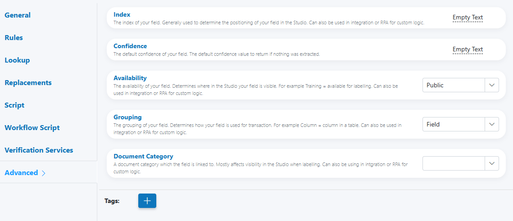

# Advanced

Use the Advanced tab to fine‑tune behavior and metadata for a field (Parameter Definition). These options affect where and how the field appears in Studio, how it’s grouped for transactions, what default confidence is applied when no value is extracted, and how it’s categorized and tagged for integrations and automation.

---

## When to use

- Control the field’s ordering and visibility in Studio and labelling.
- Set a conservative default confidence when no value is extracted.
- Indicate how the field participates in transactions (e.g., as a table column).
- Attach categories and tags to power integrations, filtering, or RPA.

---

## Open Field Configuration

See [Field Rules (Rules Engine)](index.md) for how to open the field configuration:

- From the document overlay (supported services), or
- From the Fields panel on the right sidebar.

---

## Configure Advanced

The Advanced tab includes the following options:

### Index
The positional index for the field. Primarily used for ordering in Studio; may also be referenced in integrations/RPA.

- Lower numbers appear first in lists and panels.
- Use distinct ranges per section (e.g., header: 0–99, body: 100–499, totals: 500+).

!!! tip "Index hygiene"
    Leave gaps (10, 20, 30…) so you can insert new fields later without renumbering everything.

---

### Confidence
The default confidence for the field; returned when nothing is extracted.

- Acts as a fallback signal to downstream steps.
- Does not force a value; only the confidence indicator.

!!! warning "Don’t mask extraction issues"
    Setting a high default confidence can hide systematic extraction gaps. Prefer a conservative default (e.g., 0.00–0.40) and rely on Workflow Script or Verification to route uncertain cases.

---

### Availability
Controls where the field is visible/usable in Studio. Example from the Studio: “Training = available for labelling.”

- Typical values in your build include, for example: Public, Training.
- Choose the option that matches your lifecycle (e.g., expose for labelling vs runtime only).

!!! info "Impact on labelling and UX"
    Availability determines which users and screens see the field. Use Training to expose fields needed for dataset improvement without cluttering runtime views.

---

### Grouping
How the field participates in a transaction or layout. Example from the Studio: “Column = column in a table.”

- Options include, for example: Field, Column.
- Select Column for repeating/table scenarios so downstream logic treats it as a tabular column.

!!! tip "Tables and repeating data"
    Use Grouping = Column for line items and maintain consistent Index values across columns to keep table display aligned.

---

### Document Category
Assign a document category the field is linked to. Affects Studio visibility when labelling and can be used by integrations/RPA.

- Useful for large services where fields apply only to specific document types.
- Helps segment dashboards, queries, and reviewer queues.

!!! tip "Category conventions"
    Adopt a short, stable taxonomy (e.g., “Invoice”, “PO”, “Delivery Note”). Avoid frequent renames that break saved filters.

---

### Tags
Attach one or more tags to the field to support search, automation, and policy grouping.

- Click the “+” button to add tags.
- Use tags to drive Workflow Script routing or to filter fields in Studio/export tools.
- Used by Custom Invoices services to identify columns in extracted tables.

!!! note "Tagging strategy"
    - Keep tags short and consistent (kebab or snake case).
    - Reuse tags across services where policies align (e.g., pii, financial, address).

---

## Interaction with other configurations

- Evaluation order (typical): Replacements → Lookup → Script → Verification Services → Workflow Script → Advanced
- Advanced settings do not transform values; they inform placement, fallback confidence, grouping, and metadata used by scripts/integrations.

!!! info "Downstream usage"
    Index, Availability, Grouping, Category, and Tags are commonly read by Workflow Script and service-level Custom Code to drive routing and automation.

---

## Examples

- Training‑only table column
    - Availability: Training
    - Grouping: Column
    - Index: 210
    - Category: Invoice
    - Tags: line-item, amount

- Hidden runtime helper with low fallback confidence
    - Availability: Public (or your “hidden” equivalent if available)
    - Confidence (default): 0.20
    - Tags: helper, derived

- Categorized header field for integrations
    - Category: PurchaseOrder
    - Tags: header, identifier, pii
    - Index: 20

---

## Testing checklist

- [ ] Field appears in the intended Studio views (Availability).  
- [ ] Ordering is correct relative to neighboring fields (Index).  
- [ ] Table columns align as expected across documents (Grouping = Column).  
- [ ] Fallback confidence behaves as intended when no value is extracted.  
- [ ] Integrations/workflows can filter by Category and Tags.

---

## Troubleshooting

- Field not visible where expected
    - Check Availability and Document Category; confirm permissions for the current role.

- Table columns misaligned
    - Verify Grouping = Column and harmonize Index values across the table’s columns.

- Default confidence not reflected downstream
    - Ensure no later step overrides confidence; confirm your consumer reads the field’s confidence when value is empty.

- Filters don’t return the field
    - Confirm Category/Tags are set exactly (case and spacing); reindex/reload filters if your UI requires it.

---

## UI reference

- Advanced options (Index, Confidence, Availability, Grouping, Document Category, Tags)  
    