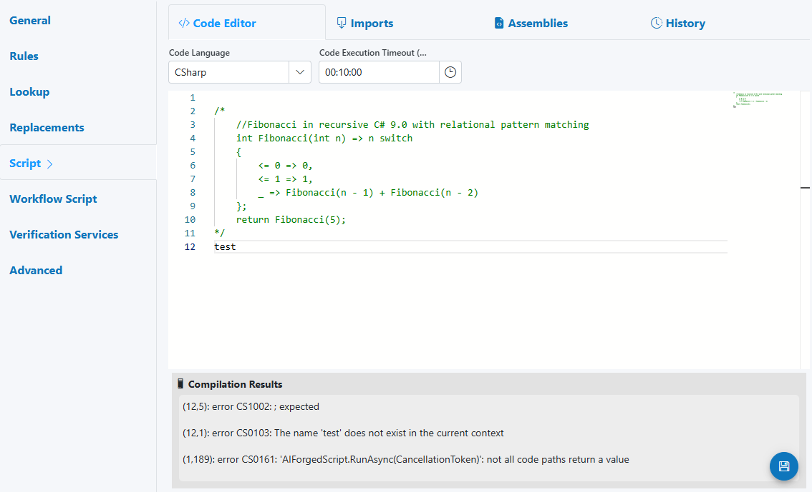
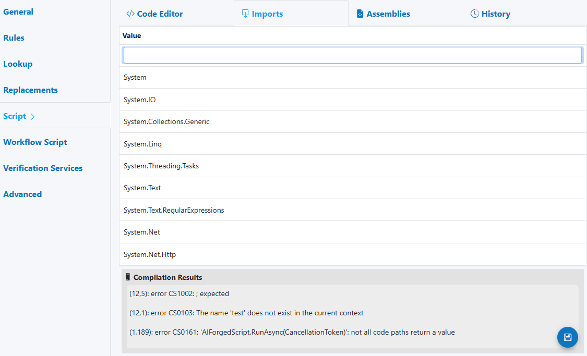
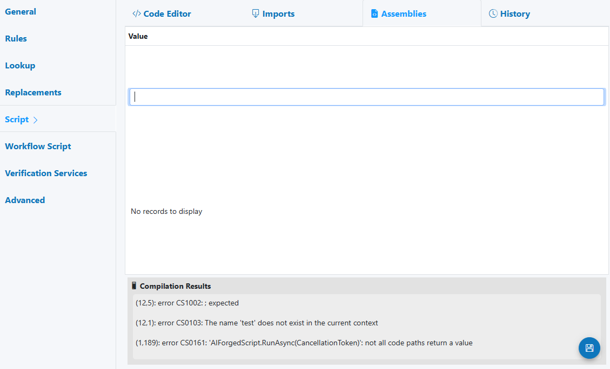
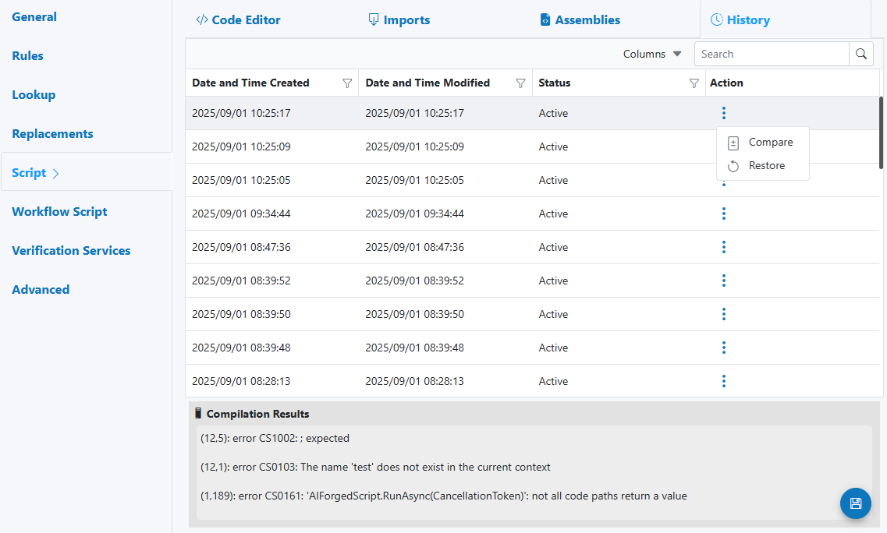

# Script

Use the Script enhancement to run custom logic on a single field’s value after extraction and before downstream steps. It’s ideal for validations, transformations, enrichment, and specialized policies that go beyond built‑in Rule Types. This field-level script uses the same runtime as your Custom Code utilities and exposes the BaseModule and related modules you already know.



---

## When to use

- Apply business rules to a specific field after extraction (normalize, reformat, validate).
- Cross‑check a field against other fields, datasets, or reference services.
- Perform lightweight enrichment (e.g., call an API, compute a checksum).
- Influence HITL by adding verification notes/status or adjusting confidence with policy.

---

## Open Field Configuration

See [Field Rules (Rules Engine)](index.md) for how to open the field configuration:

- From the document overlay (supported services), or
- From the Fields panel on the right sidebar.

---

## Configure the Script enhancement

The Script panel includes four tabs:

- Code Editor
    - Code Language (C#, Visual Basic, F#, IronPython; SemanticKernel if enabled)
    - Code Execution Timeout
    - Editor with compile/run feedback (Compilation Results)

- Imports
    - Add namespaces to simplify references (e.g., System.Text.RegularExpressions)

- Assemblies
    - Reference additional .NET assemblies (e.g., System.Net.Http) required by your script

- History
    - Versioned changes, with Compare and Restore

---

## Execution model and return contract

- Scope: Runs for the specific field (Parameter Definition) it is attached to.
- Order (typical Field Enhancements pipeline): Replacements → Lookup → Script → Verification Services → Workflow Script
- Input: verification (current field value, confidence, and context)
- Output: Return a ProcessResult constructed with the (possibly updated) verification

```csharp
return new AIForged.Services.ProcessResult(verification);
```

---

## Supported languages

- C#
- IronPython
- SemanticKernel (Natural language coding)

!!! tip 
    Prefer C# for best sample coverage and API access. Use IronPython if your team is Python‑centric. SemanticKernel can accelerate natural‑language logic and prototypes.

---

## What’s available in scripts (BaseModule overview)

Your field script has access to the same BaseModule APIs as service‑level Custom Code. See:

- Base module and types: [BaseModule / IBaseModule](../../custom-service-code/basemodule/ibasemodule-interface-data-types.md)
- Full overview: [Custom Code](../../custom-service-code/index.md)

Commonly used modules/capabilities:

- Parameters and Verifications
    - Read/update current field value and confidence
    - Add verification entries, statuses, and reviewer notes
- Documents and Services
    - Access document metadata, pages, other fields (read/update as policy allows)
- Datasets
    - Query your Custom Datasets (allowed lists, product catalogs, policies)
- Work Items (HITL)
    - Signal or add guidance for review routing (often via verification statuses/notes)
- Webhooks and Notifications
    - Trigger downstream hooks when specific conditions are met
- HTTP/Networking
    - Call approved external APIs (respect timeouts/retries)
- Storage/Files
    - Read/write attachments or artifacts (where permitted)
- Utilities
    - JSON serialization, regex helpers, date/number parsing

!!! warning "Security"
    Only use approved endpoints/assemblies; keep secrets in secure configuration, not in code.

---

## Reference: field‑level script context (globals)

These objects are available to your field‑level script at runtime:

- module: TModule (implements IBaseModule; your entry point to AIForged APIs)
- project: IProject (current project context)
- stpd: IParameterDef (the selected Parameter Definition for this field)
- stl: int (selected language ID/index context, if applicable)
- rule: BaseOption (the active rule option object, when relevant)
- logger: ILogger (logging interface)

Current document/field context:

- doc: IDocument (the current document)
- par: IDocumentParameter (the current field’s parameter instance on this document)
- def: IParameterDef (alias of stpd for convenience)
- verification: IVerification (the current field’s verification object)
- step: VerificationStep (current verification step)

IVerificationModule additions available via the field script context:

- Properties:
    - Doc: IDocument
    - Par: IDocumentParameter
    - Def: IParameterDef
    - Verification: IVerification
    - Step: VerificationStep
- Methods:
    - FindParameter(pdId, includeVerification = false, index = null): locate another parameter by definition ID (optionally include verification, or an index for repeating fields)
    - FindParameterByParentIndex(pdId, parentName, includeVerification = false): locate a parameter using a parent index/name
    - CreateParameter<T>(pdId, value): create a new parameter value for the given definition ID

!!! info
    For more, see the [BaseModule](../../../custom-service-code/basemodule/index.md) cover page and linked method references.

---

## Common patterns

- Normalize + validate shape
    - Trim, collapse whitespace
    - Enforce regex pattern(s)
    - Reformat into canonical representation

- Cross‑field checks
    - Compare a numeric total against line‑item sum
    - Ensure Country (Rule Type) and Address country agree

- Dataset validation
    - Enforce “value in allowed list” via Custom Dataset lookup

- External verification (lightweight)
    - Validate a code/ID via an API; add verification note/status on pass/fail
    - Respect Code Execution Timeout; handle timeouts gracefully

- Confidence and reviewer guidance
    - Adjust confidence conservatively
    - Add meaningful verification notes for reviewers (“Expected ABC‑1234 pattern”)

---

## Examples

### Example 1 — Normalize and verify a code with regex

```csharp
// Imports (add in Imports tab): System.Text.RegularExpressions
// Goal: Ensure value is ABC-1234 shape; add verification status and normalize.

if (verification == null || string.IsNullOrWhiteSpace(verification.Value))
{
    // Keep as-is; allow other rules to decide on HITL if required
    return new AIForged.Services.ProcessResult(verification);
}

// Trim + collapse spaces
var raw = Regex.Replace(verification.Value.Trim(), @"\s+", " ");

// Try to coerce "ABC_ 1234" → "ABC-1234"
var m = Regex.Match(raw, @"^([A-Za-z]{3})\s*[-_ ]?\s*(\d{4})$");
if (m.Success)
{
    var canonical = $"{m.Groups[1].Value.ToUpperInvariant()}-{m.Groups[2].Value}";
    verification.Value = canonical;

    // Mark as verified by script
    module.AddVerification(verification, VerificationStatus.Scripted | VerificationStatus.Verified, canonical, "Normalized by Script");
}
else
{
    // Flag as suspicious for HITL routing by downstream workflow
    module.AddVerification(verification, VerificationStatus.Susicious, raw, "Pattern mismatch: expected ABC-1234");
}

return new AIForged.Services.ProcessResult(verification);
```


### Example 2 — Cross-check against a Custom Dataset

```csharp
// Use a dataset to validate that the value is in an allowed list.
// Assumes you know the dataset definition ID and field ID to match against.

const int dataSetDefId = /* your dataset def ID */;
const int allowedFieldId = /* your field ID inside the dataset */;

if (!string.IsNullOrWhiteSpace(verification?.Value))
{
    var ds = module.GetDataSetByDef(stpd, dataSetDefId, false, false, null, null, null, null);
    var field = ds?.FindField(allowedFieldId);

    if (ds != null && field != null)
    {
        var matches = module.GetDataSetRecords(ds, field, verification.Value.Trim(), /*isExactMatch*/ true);
        if (matches == null || !matches.Any())
        {
            module.AddVerification(verification, VerificationStatus.Susicious, verification.Value, "Value not in allowed dataset");
        }
        else
        {
            module.AddVerification(verification, VerificationStatus.Scripted | VerificationStatus.Verified, verification.Value, "Validated against dataset");
        }
    }
}

return new AIForged.Services.ProcessResult(verification);
```

### Example 3 — Call an external API with timeout

```csharp
// Assemblies: System.Net.Http
// Imports: System.Net.Http, System.Text.Json
using var http = new HttpClient { Timeout = TimeSpan.FromSeconds(10) };

if (string.IsNullOrWhiteSpace(verification?.Value))
    return new AIForged.Services.ProcessResult(verification);

var payload = new { value = verification.Value };
var content = new StringContent(System.Text.Json.JsonSerializer.Serialize(payload), System.Text.Encoding.UTF8, "application/json");

try
{
    var resp = await http.PostAsync("https://api.example.com/validate", content);
    if (resp.IsSuccessStatusCode)
    {
        var json = await resp.Content.ReadAsStringAsync();
        // parse response, update value or confidence accordingly
        module.AddVerification(verification, VerificationStatus.Scripted, verification.Value, "Validated via external API");
    }
    else
    {
        module.AddVerification(verification, VerificationStatus.Susicious, verification.Value, $"API error: {resp.StatusCode}");
    }
}
catch (TaskCanceledException)
{
    module.AddVerification(verification, VerificationStatus.Susicious, verification.Value, "API timeout");
}

return new AIForged.Services.ProcessResult(verification);
```

---

## HITL and verification guidance

Escalate to review (via Workflow Script or your routing policy) when:

- Pattern/shape validation fails or is ambiguous
- Dataset/API validations don’t confirm the value
- Confidence drops below your minimum acceptable threshold
- Cross‑field rules conflict (e.g., totals mismatch)

!!! example "Suggested reviewer notes (HITL)"
    - “Check format: expected ABC‑1234; confirm hyphen placement.”
    - “Value not found in Allowed Dataset v2025‑08; pick from list or correct OCR.”
    - “API validation timed out; re‑try or confirm from source document.”

---

## Best practices

- Keep field scripts focused; do heavy orchestration at service-level utilities or Workflow Script.
- Fail safe: when unsure, add a clear verification note and let routing handle HITL.
- Use Imports/Assemblies sparingly; include only what you need.
- Respect timeouts; avoid long-running or synchronous loops.
- Log the why: verification notes should explain the decision in one sentence.
- Version regularly; use History to compare and restore known-good versions.

---

## Testing checklist

- Happy paths: valid inputs normalize and verify as expected
- Negative paths: invalid inputs add Suspicious status and clear reviewer guidance
- Timeouts/API failures: handled safely; do not block pipeline
- Dataset validations: exact vs. fuzzy lookups behave per policy
- Performance: completes within configured timeout
- Return contract: always returns ProcessResult(verification)

---

## Troubleshooting

- Compilation errors
    - Check the Compilation Results pane; add required Imports/Assemblies; correct syntax
- Script made no change
    - Ensure you assign verification.Value and return ProcessResult(verification)
- Verification notes not visible
    - Use module.AddVerification(…) and verify your viewer shows verification history
- “Not all code paths return a value”
    - Ensure every branch ends by returning ProcessResult(verification)
- External calls failing
    - Confirm assembly references, network policies, and timeouts; add exception handling

---

## See also

- Custom Code overview and samples: [Custom Code](../../custom-service-code/README.md)
- Base APIs and data types: [BaseModule / IBaseModule](../../custom-service-code/basemodule/ibasemodule-interface-data-types.md)

---

## UI reference

- Code Editor  
    
- Imports
    
- Assemblies  
    
- History (Compare/Restore)  
    