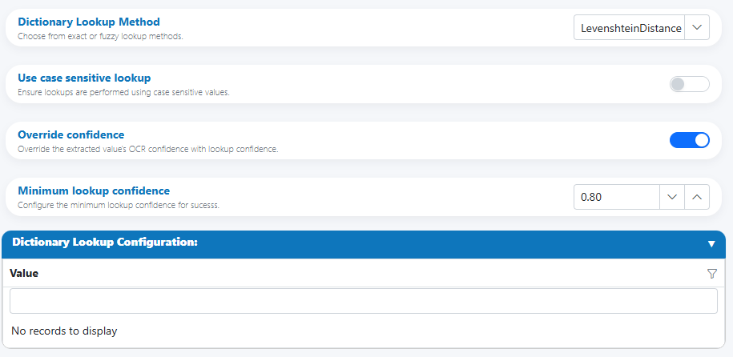
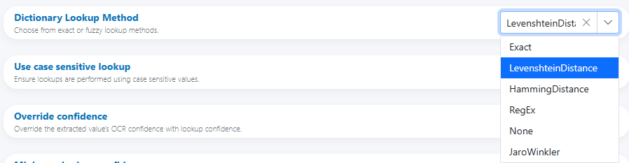

# Lookup

Use the Lookup enhancement to replace noisy or variant text with a canonical value from a curated list. You configure a list of acceptable values and choose a matching method (exact or fuzzy). On a successful match, the field’s value can be normalized and the confidence optionally overridden by the lookup confidence.

---

## When to use

- Normalize variant spellings, abbreviations, or OCR noise to a single canonical value.
- Enforce controlled vocabularies (e.g., US States, departments, product families).
- Map legacy labels to current taxonomy without writing code.

---

## Open Field Configuration

See [Field Rules (Rules Engine)](index.md) for how to open the field configuration:

- From the document overlay (supported services), or
- From the Fields panel on the right sidebar.

---

## Configure the Lookup enhancement

Core controls

- Dictionary Lookup Method  
    Choose the matching strategy (exact or fuzzy) from the dropdown.
- Use case sensitive lookup  
    Enforce case-sensitive comparisons when toggled on.
- Override confidence  
    Replace the field’s OCR confidence with the lookup match confidence (recommended for deterministic vocabularies).
- Minimum lookup confidence  
    The minimum confidence required for a match to be accepted. Values below this threshold are treated as no-match and can trigger HITL.

Dictionary data

- Dictionary Lookup Configuration  
    Provide the allowed values (one per row). This is your canonical set; the selected match will be used to override the field value.

---

## Matching methods

Aligned with DictionaryLookupMethod:

- Exact  
  Input must match a dictionary entry character-for-character (optionally case-sensitive if enabled). Best for already-clean identifiers.

- LevenshteinDistance  
  Fuzzy matching using edit distance (insertions, deletions, substitutions). Works well with OCR or user-entered text that may include typos.  
  Guidance: start Minimum lookup confidence at 0.80–0.90 and tune with samples.

- HammingDistance  
  Fuzzy matching for equal-length strings that differ by substitutions only. Ideal for fixed-length codes after normalization (padding/trim to equal length).

- RegEx  
  Match input against regular-expression patterns. Useful for grouping patterns or enforcing shapes, then mapping to a canonical entry.

- JaroWinkler  
  Fuzzy matching optimized for short strings and transpositions (names, short labels). Often more tolerant of near-miss character swaps than pure edit distance.  
  Guidance: start Minimum lookup confidence ~0.85 and adjust.

- None  
  Disables lookup; useful for A/B comparisons or when lookups are temporarily off.

!!! tip "Choosing a method"
    - IDs/codes: Exact or HammingDistance (equal-length)  
    - Noisy labels/names: JaroWinkler or LevenshteinDistance  
    - Patterned inputs: RegEx (then map to a canonical)

---

## Input preparation and normalization

- Trim whitespace and normalize internal spacing before lookup.
- Unify casing (unless case matters and you’ve enabled case-sensitive lookup).
- Remove known prefixes/suffixes via Replacements (e.g., “Dept: ”) before Lookup.
- For HammingDistance, ensure strings are the same length (pad/trim consistently).

!!! warning "Ambiguity and ties"
    If multiple dictionary entries score equally (within your tolerance), treat as ambiguous. Prefer HITL or add disambiguation rules (e.g., secondary pattern, region filter).

---

## Confidence handling

- Minimum lookup confidence  
    - Below threshold: treat as no-match (do not override value).
    - At/above threshold: accept and override value with the matched dictionary entry.
- Override confidence (toggle)  
    - On: set field confidence to the lookup’s confidence.  
    - Off: retain OCR confidence (and optionally store lookup confidence in metadata).

!!! info "Why override confidence?"
    When a match is deterministic (Exact/Hamming or a high-confidence fuzzy match), using the lookup confidence provides a more meaningful signal to downstream steps than OCR confidence.

---

## Output and formatting

- Field value: replaced with the matched dictionary entry (canonical form).
- Confidence: optionally overridden by the lookup confidence (toggle).
- Metadata: you may store additional details (e.g., chosen method, score) if your workflow benefits from auditability.

---

## HITL triggers and reviewer guidance

Trigger review when:
- No dictionary match meets the Minimum lookup confidence.
- Multiple candidates are within a narrow score band (e.g., ≤0.02 apart).
- Case-sensitive lookup fails but case-insensitive would pass (policy-dependent).
- RegEx matches more than one pattern group or none at all when one is expected.

!!! example "Suggested reviewer note (HITL)"
    “Confirm the intended value from the controlled list. If similar options appear (scores within 0.02), select the correct canonical entry.”

---

## Examples

- US State normalization (typo-tolerant)
    - Method: JaroWinkler
    - Min confidence: 0.88
    - Input: “Calfornia” → Output: “California” (confidence 0.93)

- Fixed-length code (single-character glitch)
    - Method: HammingDistance
    - Inputs are normalized to 8 chars
    - Input: “INV00O12” (O vs 0) → Output: “INV00012”

- Pattern-based mapping
    - Method: RegEx
    - Pattern: `^Invoice(s)?$` → Output: “Invoice”
    - Ambiguous: if both “Invoice” and “Invoices” exist and policy requires singular, keep only “Invoice” in the dictionary.

- Exact, case-sensitive brand
    - Method: Exact; case-sensitive ON
    - Input: “Acme” → matches “Acme” only (not “ACME”)

---

## Best practices

- Keep the dictionary canonical (desired outputs only); do not include variants—let the matcher find the closest canonical.
- Start fuzzy methods at 0.85–0.90 and tune with a validation set.
- Combine with Replacements for predictable cleanup before lookup.
- For international datasets, segment dictionaries by locale to avoid cross-language collisions.
- Log match scores and misses to refine thresholds and expand the dictionary responsibly.

---

## Testing checklist

- [ ] Positive matches across typical typos (insertions, deletions, swaps).  
- [ ] Negative tests (nearby but disallowed terms) to ensure threshold prevents false positives.  
- [ ] Case-sensitive vs case-insensitive behavior (toggle).  
- [ ] Equal-length behavior for HammingDistance (pad/trim first).  
- [ ] RegEx patterns anchored and non-overlapping.  
- [ ] Ambiguous/tie scenarios route to HITL as intended.  
- [ ] Override confidence behaves as expected.

---

## Troubleshooting

- Too many false positives (wrong matches)  
  Raise Minimum lookup confidence; switch from Levenshtein to JaroWinkler for short strings; add disambiguation rules.

- Legitimate values fail to match  
  Lower threshold slightly (e.g., 0.90 → 0.85); add missing canonical entry; add pre-cleanup via Replacements.

- HammingDistance not working  
  Ensure equal-length normalization; otherwise choose Levenshtein or JaroWinkler.

- RegEx matches unpredictably  
  Anchor patterns (`^…$`), avoid overly broad groups, and document precedence if multiple patterns exist.

- Confidence not updating  
  Enable Override confidence; confirm the match meets the Minimum lookup confidence.

---

## UI reference

- Dictionary Lookup Method (with methods: Exact, LevenshteinDistance, HammingDistance, RegEx, None, JaroWinkler)  
    

- Options: Case sensitive, Override confidence, Minimum lookup confidence, and Dictionary Lookup Configuration table  
    .png)