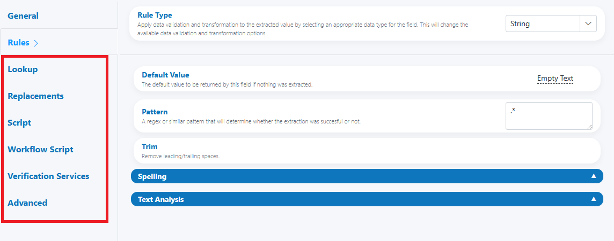

# Field Enhancements

Use Field Enhancements to enrich, transform, validate, or route any field’s value—independent of its Rule Type. These options apply to every Parameter Definition and can be combined to create powerful, policy-aligned outcomes across your workflow.

---

## When to use

- You need business lookups, value mappings, or scripted logic on a field—regardless of its data type.
- You want to apply consistent replacements, normalize variants, or enforce custom policies.
- You need to run external or specialized verifications beyond the built-in Rule Types.
- You want to orchestrate downstream workflow decisions based on field values.

---

## Open Field Configuration

See [Field Rules (Rules Engine)](index.md) for how to open the field configuration:

- From the document overlay (supported services), or
- From the Fields panel on the right sidebar.

---

## What’s included

The Field Enhancements tabs (names aligned with your latest UI) are:

- Lookup
- Replacements
- Script
- Workflow Script
- Verification Services
- Advanced

Each tab can be used standalone or together—order and precedence are explained below.

---

## Lookup

Map raw values to a canonical value using a reference list (key → value), optionally with fuzzy or case-insensitive matching.

Typical use cases:

- Normalize country, region, or department names (e.g., “U.S.” → “United States”).
- Convert internal codes to friendly labels (or vice versa).
- Collapse common OCR variants to a single, clean value.

Key options you’re likely to see:

- Matching mode: exact, case-insensitive, or “contains/starts with” (where available).
- Fallback behavior: keep original, set default, or escalate to review.
- Source/target columns: choose which column is used as the lookup key vs. output.

Best practices:

- Keep lookup tables small and targeted; prefer one clear, authoritative source.
- Version your datasets; review hit/miss ratios periodically.

---

## Replacements

Apply straightforward text replacements (search → replace) to clean or standardize values before (or after) validation.

Typical use cases:

- Remove templated prefixes/suffixes (e.g., “Invoice No: ”).
- Standardize punctuation or spacing (e.g., replace multiple spaces with one).
- Correct recurring OCR quirks (e.g., “lNVOICE” → “INVOICE”).

Key options:

- Ordered rules list (top-to-bottom evaluation).
- Whole-word vs substring matches (where available).
- Regex support (if enabled in your build).

Best practices:

- Keep rules minimal and deterministic.
- Avoid over-aggressive replacements that could alter valid data; test on samples.

---

## Script

Execute custom logic on the field value using the custom script module. Ideal for transformations and validations not covered by built-in rules.

Typical use cases:

- Complex format checks and conditional normalization.
- Lightweight external lookups (via approved APIs) and enrichment.
- Field derivations (combine values from other fields).

Key options:

- Access to the current document, field, and service context.
- Logging for auditability and debugging.
- Return contract: must provide a final value (and optionally confidence/notes).

Best practices:

- Keep scripts short and readable; centralize shared logic.
- Validate all external responses and handle timeouts safely.

---

## Workflow Script

Drive workflow outcomes—assignments, escalations, routing—based on evaluated field values using the custom script module.

Typical use cases:

- Auto-route to HITL when a value falls outside policy.
- Assign to specific teams based on region or product line.
- Add reviewer hints dynamically (e.g., “Compare to PO total”).

Key options:

- Access to work item creation, reviewer guidance, and priority flags.
- Conditional logic on confidence, deltas, or policy thresholds.

Best practices:

- Keep routing logic declarative where possible; document decision trees.
- Avoid mixing heavy transformations here—perform those in Script or Replacements first.

---

## Verification Services

Invoke external or specialized verification providers for the field (e.g., address, identity, compliance checks) beyond the built-in Rule Types.

Typical use cases:

- Vendor-specific validations (e.g., bank account verification).
- Compliance checks requiring third-party APIs.
- Redundant/verifiable checks for high-stakes fields.

Key options:

- Provider configuration and credentials (managed as secure settings).
- Timeout, retry, and failover behaviors.
- Confidence and pass/fail mapping back to the field.

Best practices:

- Use for high-value validations; be mindful of cost and latency.
- Store provider responses (or hashes) for audit trails.

---

## Advanced

Fine-tune behavior and edge-case handling that applies to the field holistically.

Typical options you might see:

- Default Value (returned when nothing is extracted).
- Confidence handling (override or minimums).
- Visibility/security flags (e.g., mask in UI or exports).
- Evaluation order toggles (where supported).

Best practices:

- Prefer conservative defaults that won’t mask systemic extraction issues.
- Use masking for PII/credentials; restrict access where appropriate.

---

## Order of evaluation

1) Replacements  
2) Lookup  
3) Script  
4) Verification Services  
5) Workflow Script  

---

## Examples

- Normalize then verify
    - Replacements: remove “Attn:” prefix.
    - Lookup: map “U.S.A.” → “United States of America”.
    - Verification Services: validate against a country provider.
    - Workflow Script: escalate if no match or region mismatch.

- Code cleanup and mapping
    - Replacements: strip “INV-” prefix.
    - Script: zero-pad to length 8.
    - Lookup: map legacy code to new SKU.
    - Advanced: mask in UI if sensitive.

- Risk gate via external check
    - Script: basic policy validation.
    - Verification Services: third-party compliance API call.
    - Workflow Script: if high-risk → auto-assign to Compliance queue with reviewer note.

---

## Best practices

- Keep transformations simple and layered—Replacements → Lookup → Script.
- Externalize reference data (Lookup) and review it periodically.
- Log and audit: capture what changed, why, and by which rule.
- Fail safe: apply defaults thoughtfully and escalate when policy is unclear.
- Test with a representative sample before enabling broadly.

---

## Testing checklist

- [ ] Replacements apply in the intended order and don’t overreach.  
- [ ] Lookup hits expected keys; misses have a defined fallback.  
- [ ] Script handles nulls, unexpected formats, and timeouts gracefully.  
- [ ] Verification Services return within expected SLAs; pass/fail mapped correctly.  
- [ ] Workflow Script routes edge cases to the correct queue with clear guidance.  
- [ ] Advanced defaults and masking behave correctly across UI and exports.

---

## Troubleshooting

- Value not changing as expected  
    Check evaluation order and whether a later step overrides earlier changes.

- Lookup misses legitimate variants  
    Add synonyms or enable case-insensitive keys; verify leading/trailing spaces.

- Script errors/timeouts  
    Add defensive checks and timeouts; log structured errors with context.

- Verification costs rising  
    Cache results where possible; trigger providers only when necessary (e.g., on minimum confidence).

- Confusing reviewer experience  
    Add concise, field-specific reviewer notes in Workflow Script.

---

## UI reference

- Parameter Configuration with Field Enhancements tabs  
    
