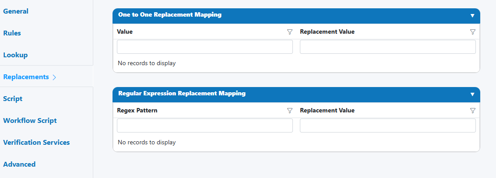

# Replacements

Use Replacements to clean and standardize any field’s value by substituting specific text or matching patterns with a desired output. It’s ideal for fixing recurring OCR quirks, removing boilerplate prefixes/suffixes, and normalizing punctuation/spacing—before any lookups or scripts run.

---

## When to use

- Correct predictable OCR substitutions (e.g., “O” → “0”, “S” → “5”).
- Remove boilerplate labels from extracted values (e.g., “Invoice No: ”).
- Normalize spacing, punctuation, or casing via regex patterns.
- Prepare values for downstream steps (Lookup, Script) by standardizing them first.

---

## Open Field Configuration

See [Field Rules (Rules Engine)](index.md) for how to open the field configuration:

- From the document overlay (supported services), or
- From the Fields panel on the right sidebar.

---

## Configure Replacements

Replacements provides two complementary mapping tables:

1) One-to-One Replacement Mapping

- Value: the exact text to find.
- Replacement Value: the text to substitute.
- Behavior: exact substring match; applied in order (top to bottom).

2) Regular Expression (Regex) Replacement Mapping

- Regex Pattern: a regular expression to match text or shapes.
- Replacement Value: the text to substitute (supports capture groups like $1, $2).
- Behavior: powerful pattern-based substitutions; applied after One-to-One mappings.

Execution order (within this enhancement)

- First: One-to-One Replacement Mapping (top → bottom)
- Then: Regex Replacement Mapping (top → bottom)

Execution order (across Field Enhancements)

- Replacements → Lookup → Script → Verification Services → Workflow Script → Advanced  
  See the Field Enhancements overview for details.

!!! tip "Keep it deterministic"
    Order matters. Place broad, general replacements near the bottom and narrow, specific ones at the top to prevent unexpected over-matches.

---

## Input preparation and options

- Trimming/case: If you also enable trimming/case-normalization in the Rule Type or elsewhere, apply those consistently before Replacements for predictable results.
- Special characters: One-to-One matches literal text; if you need to match metacharacters, prefer the Regex table with proper escaping.

!!! warning "Infinite loops and cascading changes"
    Replacements execute once in the listed order. Avoid creating rules where an early replacement creates a new string that is later replaced back to the original unintentionally (A→B and B→A). When in doubt, consolidate into a single regex.

---

## Examples

One-to-One Replacement Mapping

- Remove label prefix
    - Value: `Invoice No:` → Replacement: `(empty string)`
    - Input: `Invoice No: 12345` → Output: `12345`

- Fix OCR confusions
    - Value: `l` (lowercase L) → `1`
    - Value: `O` (capital O) → `0`
    - Input: `lNVOlCE O0123` → Output: `1NVO1CE 00123`

- Normalize punctuation/spacing
    - Value: `  ` (double space) → ` ` (single space)
    - Value: `, ,` → `,`

Regex Replacement Mapping

- Strip anything before a colon
    - Pattern: `^.*?:\s*` → Replacement: `(empty string)` 
    - `Reference: ABC-001` → `ABC-001`

- Collapse multiple whitespace characters
    - Pattern: `\s+` → Replacement: ` `

- Keep digits only (for IDs/phones, if policy allows)
    - Pattern: `\D+` → Replacement: `(empty string)`

- Normalize hyphen styles to ASCII hyphen-minus
    - Pattern: `[–—]` → Replacement: `-`

- Capture groups to reformat a code
    - Pattern: `^([A-Z]{3})\s*[-_]?\s*(\d{4})$` → Replacement: `$1-$2`  
    - `ABC_ 1234` → `ABC-1234`

!!! tip "Anchors and boundaries"
    Use `^` and `$` to anchor start/end of the string, and `\b` for word boundaries to avoid partial matches. Example: `^\+27` will only match a ZA country code prefix at the start.

---

## HITL triggers and reviewer guidance

Consider escalating to review when:

- The field changes substantially due to replacements (e.g., more than 50% of characters altered).
- A regex rule would remove all content (resulting in an empty value).
- You detect a pattern that could be either a legitimate value or noise (e.g., removing “PO” vs “PO Box”).

!!! example "Suggested reviewer note (HITL)"
    “Confirm that automated replacements produced the intended value. If critical context was removed (labels, prefixes), restore only what’s needed for the field’s policy.”

---

## Best practices

- Start minimal; add rules only for recurring, well-understood issues.
- Prefer One-to-One for simple, unambiguous fixes; use Regex for shapes/patterns.
- Test rules with realistic samples (including edge cases and different locales).
- Document why each rule exists (e.g., “OCR model vX often reads O→0 for this template”).
- Revisit periodically—remove rules that are no longer needed after model or template changes.

---

## Testing checklist

- [ ] Validate order: specific before general; One-to-One before Regex.  
- [ ] Include positive/negative examples for each regex rule (anchors, boundaries).  
- [ ] Confirm no rule empties the field unexpectedly.  
- [ ] Verify downstream steps (Lookup/Script) see the intended cleaned value.  
- [ ] Measure impact: percent of fields altered, common patterns hit.

---

## Troubleshooting

- A replacement didn’t apply
    - Check for casing/spacing differences; One-to-One is literal. Use Regex or add variants.

- Unintended matches
    - Add anchors/boundaries in regex; narrow the pattern or move it lower in order.

- Double replacements
    - Review rule order; consolidate overlapping rules or use a single regex.

- Performance concerns
    - Keep regex patterns simple and anchored when possible; avoid catastrophic backtracking with overly greedy constructs.

---

## UI reference

- One-to-One Replacement Mapping and Regex Replacement Mapping tables  
    