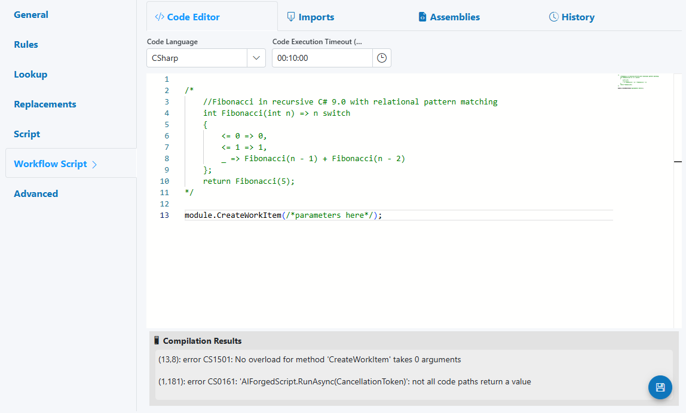
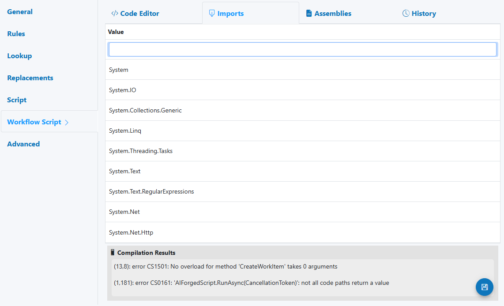
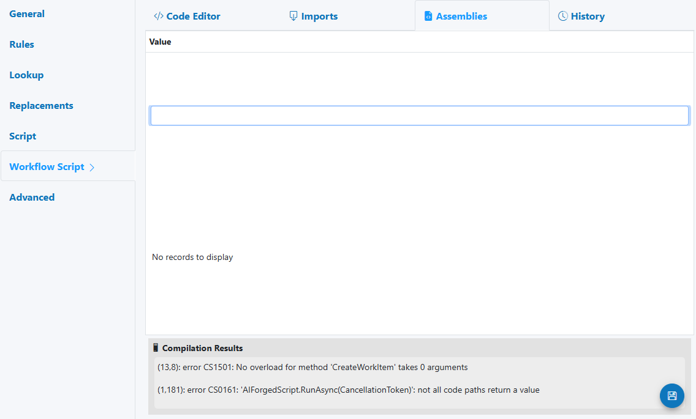
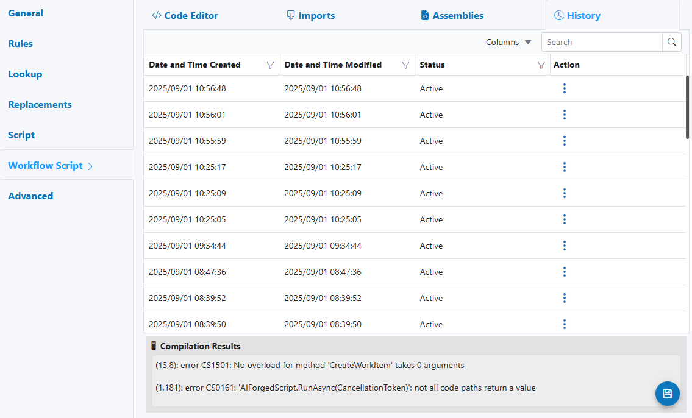

# Workflow Script (Field Enhancement)

Use the Workflow Script enhancement to drive routing, HITL (Human‑in‑the‑Loop) assignments, escalations, and cross‑service orchestration based on a field’s value and context. It complements Script by focusing on workflow actions: creating work items, copying/moving documents, setting statuses, and enforcing verification policies.



---

## When to use

- Create or assign Work Items for manual review when values are out of policy.
- Escalate to admin/supervisors under specific conditions (e.g., low confidence, overdue).
- Copy or move documents to other services based on business rules.
- Set verification statuses/flags and provide reviewer guidance automatically.

---

## Open Field Configuration

See [Field Rules (Rules Engine)](index.md) for how to open the field configuration:

- From the document overlay (supported services), or
- From the Fields panel on the right sidebar.

---

## Configure the Workflow Script enhancement

The Workflow Script panel mirrors the Script UI with four tabs:

- Code Editor
    - Code Language (C#, IronPython; SemanticKernel if enabled)
    - Code Execution Timeout
    - Compilation Results pane (errors, warnings)

- Imports
    - Add namespaces (e.g., System.Text.RegularExpressions, System.Net.Http)

- Assemblies
    - Reference .NET assemblies your script requires

- History
    - Versioned changes with Compare and Restore

---

## Execution model and return contract

- Scope: Runs for the specific field (Parameter Definition) it is attached to.
- Order (typical Field Enhancements pipeline): Replacements → Lookup → Script → Verification Services → Workflow Script → Advanced
- Input: verification (current field value and context), plus document/project context via module
- Output: Return a ProcessResult using the current verification

Example return (do not code fence this in your editor):
return verification;

!!! info "Workflow focus"
    Use Script for value transformations and validation. Use Workflow Script for actions—creating work items, moving/copying documents, and orchestrating verification flow.

---

## Supported languages

- C#
- IronPython
- SemanticKernel (Natural language coding, if enabled)

!!! tip
    Prefer C# for the richest API and samples; IronPython suits Python‑centric teams. SemanticKernel can speed up “policy-in-plain‑English” logic and prototypes.

---

## What’s available (BaseModule overview for workflow)

All BaseModule APIs are available (same as Script), with emphasis on HITL and orchestration:

- Work Items (HITL)
    - Create, assign, prioritize, and escalate work items.
    - KPI‑informed assignment helpers (e.g., pick random, idle, or high‑throughput users).
- Documents and Services
    - Copy/Move documents to other services; update status and comments.
- Parameters and Verifications
    - Read/modify verification state; add reviewer guidance; set flags for routing.
- Datasets, Webhooks, Notifications
    - Lookup or persist context; call webhooks for external systems.

See:
- Base module and types: [BaseModule / IBaseModule](../../custom-service-code/basemodule/ibasemodule-interface-data-types.md)
- Custom Code reference: [Custom Code](../../custom-service-code/index.md)

!!! warning "Security"
    Only use approved endpoints/assemblies; keep secrets in secure configuration, not in code.

---

## Reference: field‑level context (globals)

Available objects in field‑level Workflow Script:

- module: TModule (IBaseModule) — your entry point to AIForged APIs
- project: IProject — current project
- stpd / def: IParameterDef — current field definition
- stl: int — language context/index (if applicable)
- rule: BaseOption — active rule option (if relevant)
- logger: ILogger — write audit/debug logs

Current document/field:

- doc: IDocument — current document
- par: IDocumentParameter — current parameter instance
- verification: IVerification — current field verification
- step: VerificationStep — verification step

IVerificationModule adds convenient helpers:

- FindParameter(pdId, includeVerification = false, index = null)
- FindParameterByParentIndex(pdId, parentName, includeVerification = false)
- CreateParameter<T>(pdId, value)

!!! info
    For more, see [BaseModule](../../../custom-service-code/basemodule/index.md).

---

## Common workflow patterns

- Create a Work Item for HITL when a field fails validation.
- Assign tasks based on availability or KPIs (random, idle, high‑throughput).
- Escalate to Admin if SLAs are breached or confidence drops below threshold.
- Copy/Move document to a specialized service for follow‑up processing.
- Set DocumentStatus and add comments for audit and downstream automation.
- Add verification entries with reviewer guidance to speed decisions.

---

## Examples

### Example 1 — Create a Work Item for verification

```csharp
// If confidence is low or a policy fails, create a HITL task
if (verification == null || verification.Confidence < 0.75)
{
    // pick a verifier (implement your own selection or use helpers)
    var users = module.GetUsers(project.Id, null, null, null); // filter as needed
    var chosen = module.PickRandom(users?.Select(u => u.user).Distinct().ToList(), null);

    if (chosen != null)
    {
        module.AddVerification(verification, VerificationStatus.Required, verification?.Value, "Routed to HITL");
        module.CreateWorkItem(
            chosen.UserId,
            WorkItemType.Document,
            WorkItemStatus.Created,
            WorkItemAction.Verify,
            WorkItemMethod.Random,
            TimeSpan.FromHours(24),
            stpd.Id,            // serviceId or parent service id if needed
            doc.Id,
            null, null, null, null, null,
            "Verify field value; low confidence",
            $"Field {stpd.Name} needs review: {verification?.Value}"
        );
        module.SaveChanges();
    }
}

return verification;
```

### Example 2 — Escalate overdue items to Admin

```csharp
// If previous verification indicates overdue or repeated failure, escalate
bool overdue = /* your SLA logic here */;
if (overdue)
{
    var admins = module.GetUsers(stpd.Id, null, [GroupRoleType.Administrator], null);
    var admin = admins?.Select(x => x.user).FirstOrDefault();

    if (admin != null)
    {
        module.AddVerification(verification, VerificationStatus.Susicious, verification?.Value, "Escalated due to SLA breach");
        module.CreateWorkItem(
            admin.UserId,
            WorkItemType.Document,
            WorkItemStatus.Escalated,
            WorkItemAction.Review,
            WorkItemMethod.Manual,
            TimeSpan.FromHours(12),
            stpd.Id,
            doc.Id,
            null, null, null, null, null,
            "Escalation: SLA breached",
            $"Field {stpd.Name} requires supervisor attention"
        );
        module.SaveChanges();
    }
}

return verification;
```

### Example 3 — Copy or Move the document to another service

```csharp
// Route document to a follow-up service after policy check
bool needsFollowUp = /* your policy */;
if (needsFollowUp)
{
    int targetServiceDefId = /* destination service def id */;
    module.CopyDocument(doc, targetServiceDefId, DocumentStatus.Queued, UsageType.Inbox, null, null);
    module.SetDocumentStatus(doc, DocumentStatus.InterimProcessed, "Routed to follow-up service", "Copied for further processing", true, true, true);
    module.SaveChanges();
}

return verification;
```

### Example 4 — Assign using idle-user fallback

```csharp
// Try KPI-based chooser; if none, fallback to idle user
string userId = module.GetHighThroughputUserId(DateTime.Now.AddDays(-7), DateTime.Now, null, WorkItemType.Document, WorkItemAction.Verify, WorkItemStatus.Created);
if (string.IsNullOrEmpty(userId))
{
    userId = module.GetIdleUserId(WorkItemType.Document, WorkItemAction.Verify, DateTime.Now.AddDays(-30), DateTime.Now, null);
}

// Create work item for selected user
if (!string.IsNullOrEmpty(userId))
{
    module.CreateWorkItem(userId, WorkItemType.Document, WorkItemStatus.Created, WorkItemAction.Verify, WorkItemMethod.Manual, TimeSpan.FromHours(24), stpd.Id, doc.Id, null, null, null, null, null, "Verify via idle/high-throughput selection", null);
    module.SaveChanges();
}

return verification;
```

---

## HITL triggers and reviewer guidance

Trigger Work Items or escalate when:

- Field confidence is below your threshold, or rules/lookup validation fails.
- Ambiguous values or cross‑field inconsistencies occur (totals, dates, IDs).
- SLA or age conditions require re‑assignment or supervisor review.

!!! example "Suggested reviewer notes (HITL)"
    - “Confirm format and value; see policy note in the comment.”
    - “Cross‑field mismatch detected; verify total vs line‑item sum.”
    - “Escalation due to overdue verification; prioritize completion.”

---

## Best practices

- Keep Workflow Script action‑oriented: create/assign/escalate; avoid heavy transformations here.
- Commit often: call SaveChanges() after creating work items or status changes.
- Use structured, concise messages for work items and verification notes.
- Centralize user selection logic (KPI, idle, random) to keep behavior consistent.
- Log decisions (who, why, when) to streamline audits and tuning.

!!! tip "Deterministic routing"
    Combine KPI selection with a stable fallback (idle → random) to avoid unassigned tasks when data is sparse.

---

## Testing checklist

- Happy paths: create a Work Item on intended conditions.
- Negative paths: no work item when conditions are not met.
- KPI/idle/random selection: verify correct user resolution and fallbacks.
- Copy/Move routing: confirm documents arrive at the target service with correct status.
- Performance: scripts complete within the configured timeout.
- Return contract: always returns ProcessResult(verification).

---

## Troubleshooting

- Compilation errors (e.g., CS1501: wrong overload)
    - Check method signatures; required parameters must be provided.
    - Review the Compilation Results pane for precise line/column errors.

- “Not all code paths return a value”
    - Ensure every branch ends with return verification;

- Work Items not appearing
    - Confirm user selection returns a valid user ID.
    - Call SaveChanges() after CreateWorkItem.

- Routing didn’t occur
    - Verify target service definition IDs and document statuses.
    - Check logs for conditional logic skipping execution.

!!! warning "Security"
    Do not hard‑code secrets or PII in scripts. Use secure settings and approved endpoints only.

---

## See also

- Base APIs and data types: [BaseModule / IBaseModule](../../custom-service-code/basemodule/ibasemodule-interface-data-types.md)
- Custom Code utility (service‑level orchestration): [Custom Code](../../custom-service-code/index.md)
- Work Items and HITL concepts: see your team’s internal SOPs and queues setup

---

## UI reference

- Code Editor  
    
- Imports  
    
- Assemblies  
    
- History (Compare/Restore)  
    