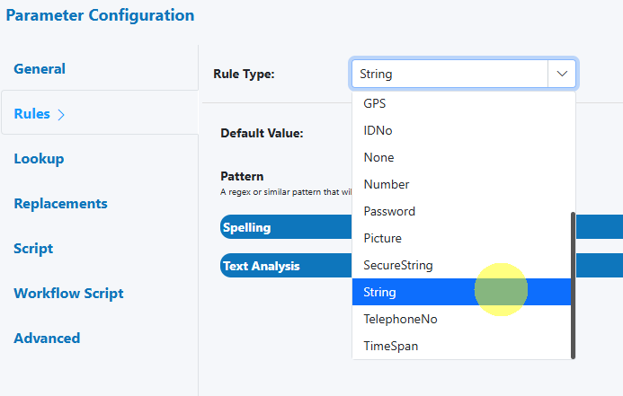
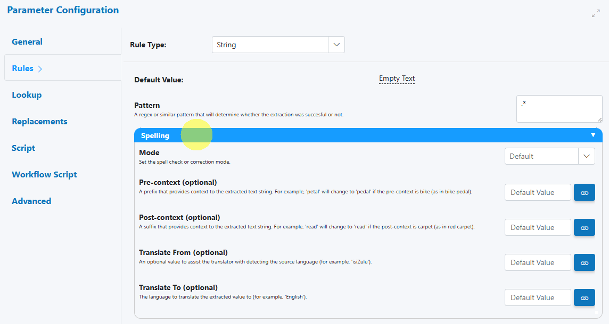
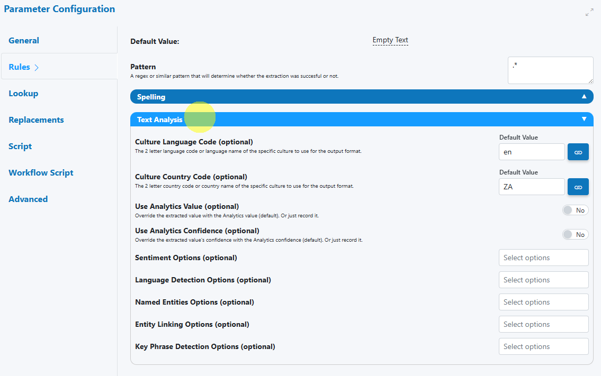

# String

Use the String Rule Type when a field is expected to contain general text (free-form or lightly structured). The Rules Engine validates and optionally normalizes the extracted text, and can route to Human‑in‑the‑Loop (HITL) review when conditions aren’t met.

---

## When to use

- Free-text fields: comments, descriptions, notes.
- Lightly structured identifiers that aren’t covered by a dedicated rule type.
- Any text where you want spelling checks and basic text quality analysis.

---

## Open the field configuration

See [Field Rules (Rules Engine)](index.md) for how to open the field configuration:

- From the document overlay (supported services), or
- From the Fields panel on the right sidebar.

---

## Configure the String rule

The configuration panel allows you to tailor validation, normalization, and escalation for String values.

### Core validation

- Required  
  Mark the field as required or optional.

- Length limits  
  Set minimum and/or maximum character length to prevent very short or excessively long values.

- Allowed patterns (regex)  
  Provide a regular expression to constrain the format where needed (e.g., specific prefixes, allowed character sets).

- Allowed characters (basic)  
  Use simple patterns to restrict to letters, digits, spaces, or common punctuation where applicable.

!!! tip "Pattern quick-start"
    Start with simple patterns and iterate. For example, to allow letters, digits, spaces, dashes and underscores:
    
        ^[A-Za-z0-9 _-]+$

!!! warning "Overly strict patterns"
    If the regex is too restrictive (e.g., excludes accented characters or punctuation found in real data), you’ll see unnecessary validation failures. Expand the character classes or use Unicode-aware ranges when needed.

### Normalization (optional)

- Trim whitespace  
  Remove leading/trailing spaces.

- Collapse internal whitespace  
  Convert multiple spaces/tabs to a single space for consistent text.

- Case normalization  
  Standardize to upper, lower, or leave as-is (helpful when case isn’t meaningful).

!!! tip "Protect meaningful case"
    If the field holds codes that rely on casing (e.g., “AbC-123”), avoid case normalization. Prefer trimming and whitespace cleanup only.

---

## Output and formatting

- The String rule outputs the (optionally) normalized text value.
- Consider whether downstream systems require specific casing (upper/lower) or trimmed content, and configure normalization accordingly.

---

## HITL behavior and reviewer guidance

- Trigger criteria  
  Send to review when validation fails (length/pattern), spelling issues exceed threshold, or text analysis flags issues.

- Reviewer message  
  Provide a short hint to speed up resolution (e.g., “Check language and correct obvious typos. Expected only letters, numbers, spaces, and dashes.”).

!!! tip "Faster reviews with clear instructions"
    Include a 1–2 sentence guideline and an example of a valid entry. Reviewers resolve issues faster and more consistently.

---

## Examples

- Free-text description with length and cleanup  
    - Min length: 10, Max length: 500  
    - Trim and collapse whitespace  
    - Spelling: On (moderate sensitivity), domain terms added to ignore list

- Lightly structured label with a simple pattern  
    - Pattern: `^[A-Za-z0-9 _-]{3,50}$`  
    - Case normalization: Off  
    - Spelling: Off (to avoid flagging product names)

- General notes with language check  
    - Text Analysis: Language must be English  
    - Spelling: On (low sensitivity)  
    - HITL: Escalate if non-English is detected or more than 3 potential spelling issues

!!! tip "Regex snippets you can adapt"
    - Letters, digits, spaces, dash, underscore (3–50 chars):  
      `^[A-Za-z0-9 _-]{3,50}$`
    - Letters (incl. basic punctuation) and spaces (1–100 chars):  
      `^[A-Za-z .'’,-]{1,100}$`
    - Any non-empty, trimmed string (no leading/trailing whitespace):  
      `^(?!\s)(?:.*\S)?$`

---

## Best practices

- Match validation strictness to business intent: tight for identifiers, relaxed for notes.
- Keep regex patterns Unicode‑aware when working with diacritics/accents.
- Use Spelling and Text Analysis for natural‑language fields; disable them for codes/IDs.
- Provide concise reviewer guidance to speed up HITL decisions.
- Start conservative; tune thresholds and patterns with real sample documents.

---

## Testing checklist

- [ ] Include samples that should pass and fail (min/max length, allowed characters).
- [ ] Test accented characters and punctuation if applicable.
- [ ] Verify spelling ignore list behavior with domain terms/brands.
- [ ] Confirm Text Analysis escalates only in intended scenarios.
- [ ] Re‑run across multiple documents/templates to ensure stability.

---

## Troubleshooting

- Accented characters are rejected  
  Expand regex character classes or avoid ASCII‑only patterns.

- Product names are flagged as misspellings  
  Add them to the spelling ignore list or disable spelling for that field.

- Too many escalations for free‑text fields  
  Lower spelling sensitivity, relax the regex, or refine Text Analysis criteria.

- Case changes broke identifiers  
  Disable case normalization; rely on trimming/whitespace cleanup only.

---

## UI reference

- String rule selection  
  

- Spelling section  
  

- Text Analysis section  
  