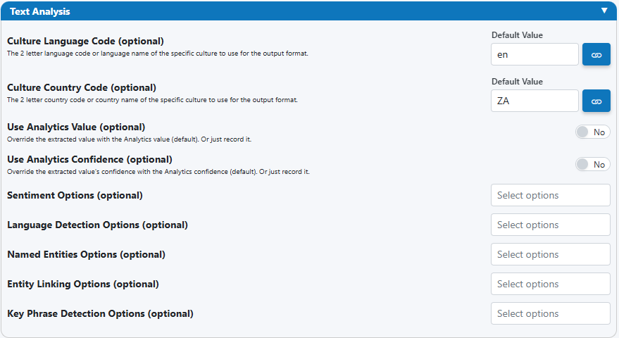
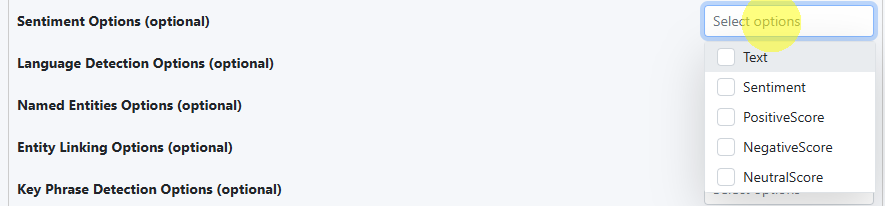
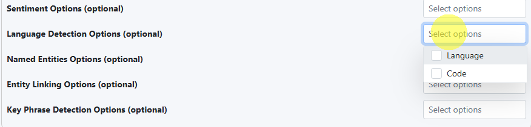
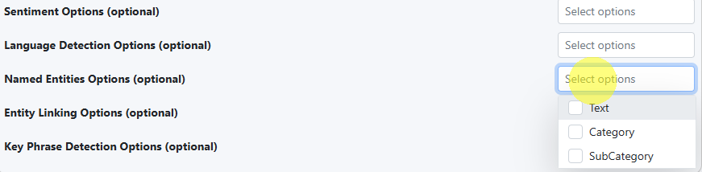
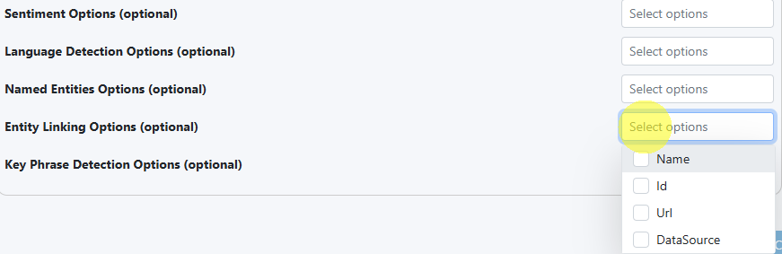
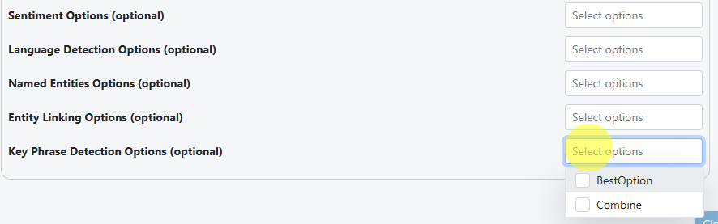

# Text Analysis (String Rule Type)

Text Analysis enriches String fields with insights such as sentiment, language, entities, entity links, and key phrases. You can store these insights as metadata, or optionally use them to override the field’s value and/or confidence.

---

## Where to configure

Open the field, select the String rule, then expand the Text Analysis section.

!!! tip "Pair with String validation"
    Combine Text Analysis with String validations (length, regex, normalization) to catch both structural issues and content quality issues.

---

## Culture and overrides

Use these controls to improve accuracy and decide whether analytics should replace the original value.

- Culture Language Code (optional): e.g., `en`, `fr`, `Spanish`
- Culture Country Code (optional): e.g., `US`, `ZA`, `Germany`
- Use Analytics Value (optional): override the extracted value with the analytics value
- Use Analytics Confidence (optional): override the extracted confidence with the analytics confidence

!!! info "When to override"
    - Keep original text (disable overrides) for free‑form notes.  
    - Override (enable) when the analytics produce a clear, structured value you want to store directly (e.g., a sentiment label or top key phrase).

---

## Analysis types and options

Each analysis type includes a “Select options” picker so you can choose which attributes to store. Select only what you need.

### 1) Sentiment Analysis

Options available:

- Text
- Sentiment
- PositiveScore
- NegativeScore
- NeutralScore

Typical usage:

- Store Sentiment and one or more scores for auditing.
- Optionally enable “Use Analytics Value” to set the field’s value to the Sentiment label.

Example output (stored as metadata):

- Sentiment: Negative
- PositiveScore: 0.04
- NeutralScore: 0.21
- NegativeScore: 0.75

!!! warning "Thresholds and HITL"
    Define clear thresholds for review. Example: escalate when NegativeScore ≥ 0.6 or when the difference between top scores is < 0.15 (uncertain sentiment).

---

### 2) Language Detection

Options available:

- Language
- Code

Typical usage:

- Validate that text matches the expected language; use Code for consistent downstream logic.

Example (HITL trigger):

- Expected language code: `en`; Detected code: `es` → send to review with message “Non‑English text detected.”

---

### 3) Named Entities

Extract entities like people, organizations, locations, dates, and amounts.

Options available (per entity):

- Text
- Category
- SubCategory

Example output (stored as metadata):

- Entity 1
    - Text: AIForged
    - Category: Organization
- Entity 2
    - Text: Cerritos
    - Category: Location

!!! tip "Use cases"
    - Flag PII (e.g., Person) for special handling.  
    - Validate presence of required entities (e.g., an Organization in a supplier note).

---

### 4) Entity Linking

Link entities to canonical entries in a knowledge base (public or internal).

Options available (per link):

- Name
- Id
- Url
- DataSource

Example output (stored as metadata):

- Link 1
    - Name: South Africa
    - Id: Q258
    - Url: https://www.wikidata.org/wiki/Q258
    - DataSource: Wikidata

!!! info "Why linking matters"
    Linking turns ambiguous strings into stable identifiers, improving deduplication and reporting.

---

### 5) Key Phrase Detection

Identify the most important phrase(s) in the text.

Options available:

- BestOption
- Combine

Common patterns:

- Use BestOption and enable “Use Analytics Value” to set the field to the top phrase when you want a concise label.
- Use Combine to store multiple phrases; keep original text as the field value and phrases as metadata.

Example output (stored as metadata):

- BestOption: invoice overdue
- Combine:
    - invoice overdue
    - payment terms

!!! tip "Keep payloads small"
    If you only need the top phrase for routing or tagging, prefer BestOption.

---

## Filtering which results are saved

Use the “Select options” pickers within each analysis type to choose exactly which attributes are written back. This reduces payload size and keeps your data model clean.

!!! tip "Start minimal"
    Begin with just the attributes you’ll use immediately (e.g., Sentiment + NegativeScore). Add more later as reporting needs grow.

---

## Examples: escalation logic

- Sentiment-driven review
    - If Sentiment = Negative and NegativeScore ≥ 0.6 → send to HITL.
- Language mismatch
    - Expected: `en`; Detected Code ≠ `en` → send to HITL with message “Non‑English text detected.”
- Missing required entity
    - If no Organization entity found → escalate.
- No meaningful key phrase
    - If BestOption is empty and Combine < 2 phrases → escalate for manual summary.

---

## Performance and privacy

!!! info "Performance"
    Enabling many analysis types at once increases processing time. Start with the one or two insights that deliver the most value.

!!! warning "Privacy"
    Named Entities and Entity Linking can reveal PII or connect to external sources. Ensure your data handling policy allows this—especially in production.

---

## Troubleshooting

- Results look inconsistent across documents  
  Set Culture Language/Country to guide disambiguation and formatting.

- Confidence overrides not reflected  
  Ensure “Use Analytics Confidence” is enabled and that the provider returns a confidence for the selected analysis.

- Too many false positives in entities  
  Limit stored attributes to Category only, or post-filter by the categories relevant to your process.

---

## UI reference

The pickers below show the attributes available per analysis type.

---

## Quick checklist

- [ ] Set Culture Language/Country when you know the locale.  
- [ ] Select only the attributes you need in each “Select options” dropdown.  
- [ ] Decide whether to override Value/Confidence or store analytics as metadata only.  
- [ ] Define clear HITL thresholds (e.g., negative sentiment, language mismatch).  
- [ ] Test with a small, varied sample and review both pass/fail paths.