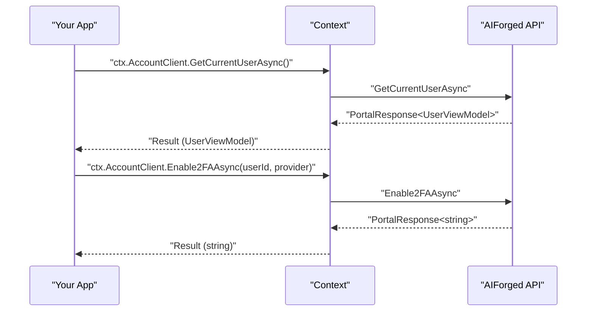

# .NET SDK — Client Reference: AccountClient

Overview

This page documents the thin-wrapper methods exposed via `Context.AccountClient` and the user-related models used in responses.

- Methods:
    - Current user: `GetCurrentUserAsync`, `LogoutAsync`
    - Tokens and keys: `CreateTokenAsync`, `GetApiKeyAsync`
    - User lookup: `GetByIdAsync`, `GetByUserNameAsync`, `FindAsync`, `GetUserCountAsync`, `GetAllAsync`, `GetPagedAsync`
    - User lifecycle: `CreateAsync`, `UpdateAsync`, `DeleteAsync`, `ActivateUserAsync`, `ActivateAccountAsync`, `RegisterAsync`
    - Group user create: `GroupCreateAsync`
    - Account state: `UnblockUserAsync`, `BlockUserAsync`
    - Password reset: `PasswordResetRequestAsync`, `PasswordResetAsync`
    - Phone verification: `VerifyPhoneNoAsync`
    - Two-factor authentication (2FA): `Get2FAProvidersAsync`, `Verify2FATokenAsync`, `Enable2FAAsync`, `Disable2FAAsync`, `GetAuthenticatorUrlAsync`, `GenerateAuthenticatorKeyAsync`
    - Login providers: `GetUserLoginProvidersAsync`, `DeleteUserLoginProviderAsync`
- Models:
    - `UserViewModel` (shape of user records)
    - Related types referenced in signatures (e.g., `UserEditViewModel`, `UserActivateViewModel`, `UserPasswordResetViewModel`, `UserLoginInfo`, `GroupRoleUserViewModel`)

!!! note "Access pattern and response wrapper"
    - Access clients from the Context: for example `ctx.AccountClient`.
    - All client methods return a response object with the payload in the `Result` property, unless otherwise stated. For example: `PortalResponse<UserViewModel>` or `PortalResponse<ObservableCollection<UserViewModel>>`.

!!! info "Date-time is UTC"
    All date-time values in AIForged are stored and returned as UTC. Convert to local time in your application if required (for example, `user.CreatedDate.ToLocalTime()`).

## Prerequisites

1. Install the SDK.

    ```bash
    dotnet add package AIForged.SDK
    ```

1. Initialize the SDK context (API key auth).

    ```csharp
    using AIForged.API;

    var baseUrl = Environment.GetEnvironmentVariable("AIFORGED_BASE_URL") ?? "https://portal.aiforged.com";
    var apiKey  = Environment.GetEnvironmentVariable("AIFORGED_API_KEY")  ?? throw new Exception("AIFORGED_API_KEY not set.");

    var cfg = new Config { BaseUrl = baseUrl, Timeout = TimeSpan.FromMinutes(5) };
    await cfg.Init();
    cfg.HttpClient.DefaultRequestHeaders.Add("X-Api-Key", apiKey);

    var ctx = new Context(cfg);

    // Access the Account client from the context
    var account = ctx.AccountClient;
    ```

!!! tip "Verify connectivity"
    After initialization, call a lightweight endpoint such as `await ctx.GetCurrentUserAsync()` to confirm your API key and base URL are valid before making account calls.

## Methods

### Current user

- `GetCurrentUserAsync()`, `GetCurrentUserAsync(CancellationToken)`

    Returns the current authenticated user’s info.

    ```csharp
    var resp = await ctx.AccountClient.GetCurrentUserAsync();
    var user = resp.Result; // UserViewModel
    Console.WriteLine($"{user.UserName} ({user.Email}) Created(UTC)={user.CreatedDate:u}");
    ```

- `LogoutAsync()`, `LogoutAsync(CancellationToken)`

    Logs out the current user. Returns `PortalResponse<bool>`.

    ```csharp
    var resp = await ctx.AccountClient.LogoutAsync();
    Console.WriteLine($"Logged out: {resp.Result}");
    ```

!!! note "Response wrapper types"
    In narrative text, wrap generic types in backticks to avoid HTML parsing issues, for example: `PortalResponse<UserViewModel>` and `PortalResponse<bool>`.

### Tokens and API keys

- `CreateTokenAsync(string userId, string audience, string issuer)`, `CreateTokenAsync(..., CancellationToken)`

    Creates a special short-lived token. Returns `PortalResponse<string>`.

    ```csharp
    var tokenResp = await ctx.AccountClient.CreateTokenAsync(userId: "user-123", audience: "", issuer: "");
    var jwt = tokenResp.Result;
    ```

- `GetApiKeyAsync(string userId)`, `GetApiKeyAsync(..., CancellationToken)`

    Returns the API key for a user as `PortalResponse<string>`.

    ```csharp
    var keyResp = await ctx.AccountClient.GetApiKeyAsync("user-123");
    var apiKeyForUser = keyResp.Result;
    ```

### User lookup

- `GetByIdAsync(string userid)`, `GetByIdAsync(..., CancellationToken)`

    ```csharp
    var resp = await ctx.AccountClient.GetByIdAsync("user-123");
    var user = resp.Result;
    ```

- `GetByUserNameAsync(string userName)`, `GetByUserNameAsync(..., CancellationToken)`

    ```csharp
    var resp = await ctx.AccountClient.GetByUserNameAsync("alice");
    var user = resp.Result;
    ```

- `FindAsync(string filter, int? groupId)`, `FindAsync(..., CancellationToken)`

    Search users. Returns `PortalResponse<ObservableCollection<UserViewModel>>`.

    ```csharp
    var resp = await ctx.AccountClient.FindAsync(filter: "alice", groupId: null);
    var users = resp.Result; // may be empty
    ```

- `GetUserCountAsync(string filter, int? groupId)`, `GetUserCountAsync(..., CancellationToken)`

    ```csharp
    var countResp = await ctx.AccountClient.GetUserCountAsync(filter: "team:", groupId: 42);
    var count = countResp.Result;
    ```

- `GetAllAsync(int? groupId)`, `GetAllAsync(..., CancellationToken)`

    Returns `PortalResponse<ObservableCollection<UserViewModel>>`.

    ```csharp
    var resp = await ctx.AccountClient.GetAllAsync(groupId: null);
    var allUsers = resp.Result;
    ```

- `GetPagedAsync(string filter, int? page, int? pageSize, int? groupId)`, `GetPagedAsync(..., CancellationToken)`

    ```csharp
    var resp = await ctx.AccountClient.GetPagedAsync(filter: null, page: 1, pageSize: 50, groupId: null);
    var pageUsers = resp.Result;
    ```

!!! tip "Paging strategy"
    Pass explicit values to control result size.

### User lifecycle

- `CreateAsync(UserEditViewModel user)`, `CreateAsync(..., CancellationToken)`

    Creates a new user. Returns `PortalResponse<UserViewModel>`.

    ```csharp
    var newUser = new UserEditViewModel { UserName = "bob", Email = "bob@example.com" };
    var resp = await ctx.AccountClient.CreateAsync(newUser);
    var created = resp.Result;
    ```

- `UpdateAsync(UserEditViewModel user)`, `UpdateAsync(..., CancellationToken)`

    Updates another user. Returns `PortalResponse<bool>`.

    ```csharp
    var edit = new UserEditViewModel { UserName = "bob", Email = "bob@new.example.com" };
    var ok = (await ctx.AccountClient.UpdateAsync(edit)).Result;
    ```

- `DeleteAsync(string userId)`, `DeleteAsync(..., CancellationToken)`

    Deletes a user. Returns `PortalResponse<UserViewModel>`.

    ```csharp
    var resp = await ctx.AccountClient.DeleteAsync("user-123");
    var deletedUser = resp.Result;
    ```

- `RegisterAsync(UserEditViewModel user)`, `RegisterAsync(..., CancellationToken)`

    Registers a new user (self-registration). Returns `PortalResponse<UserViewModel>`.

    ```csharp
    var reg = new UserEditViewModel { UserName = "charlie", Email = "charlie@example.com" };
    var resp = await ctx.AccountClient.RegisterAsync(reg);
    var registered = resp.Result;
    ```

- `ActivateUserAsync(string userId)`, `ActivateUserAsync(..., CancellationToken)`

    Admin activates another user. Returns `PortalResponse<bool>`.

    ```csharp
    var ok = (await ctx.AccountClient.ActivateUserAsync("user-123")).Result;
    ```

- `ActivateAccountAsync(UserActivateViewModel data)`, `ActivateAccountAsync(..., CancellationToken)`

    User activates their own account via token. Returns `PortalResponse<bool>`.

    ```csharp
    var ok = (await ctx.AccountClient.ActivateAccountAsync(new UserActivateViewModel { UserName = "charlie", Token = "..." })).Result;
    ```

!!! warning "Not-found behaviors"
    Returns `404` by the API, handle accordingly.

### Group user create

- `GroupCreateAsync(string userId, int? roleId, bool? grantTenantAdmin, UserEditViewModel user)`, `GroupCreateAsync(..., CancellationToken)`

    Creates a new user in a group with role options. Returns `PortalResponse<GroupRoleUserViewModel>`.

    ```csharp
    var resp = await ctx.AccountClient.GroupCreateAsync(
        userId: "group-owner-id",
        roleId: 10,                
        grantTenantAdmin: false,
        user: new UserEditViewModel { UserName = "newuser", Email = "newuser@example.com" }
    );
    var membership = resp.Result;
    ```

### Account state (block/unblock)

- `UnblockUserAsync(string userId)`, `UnblockUserAsync(..., CancellationToken)`
- `BlockUserAsync(string userId)`, `BlockUserAsync(..., CancellationToken)`

Both return `PortalResponse<bool>`.

```csharp
var unblocked = (await ctx.AccountClient.UnblockUserAsync("user-123")).Result;
var blocked   = (await ctx.AccountClient.BlockUserAsync("user-123")).Result;
```

### Password reset

- `PasswordResetRequestAsync(UserActivateViewModel data)`, `PasswordResetRequestAsync(..., CancellationToken)`

    Initiates a password reset request. Returns `PortalResponse<bool>`.

- `PasswordResetAsync(UserPasswordResetViewModel data)`, `PasswordResetAsync(..., CancellationToken)`

    Completes a password reset (by user). Returns `PortalResponse<bool>`.

```csharp
var requested = (await ctx.AccountClient.PasswordResetRequestAsync(new UserActivateViewModel { UserName = "alice", Token = "[ResetToken]" })).Result;
var resetOk   = (await ctx.AccountClient.PasswordResetAsync(new UserPasswordResetViewModel { UserName = "alice", Token = "...", Password = "********", ConfirmPassword = "********" })).Result;
```

!!! note "Email/token flows"
    Password and account activation tokens are sent via email upon requesting a password reset or creating a new account.

### Phone verification

- `VerifyPhoneNoAsync(string userId, string phoneNo, string token)`, `VerifyPhoneNoAsync(..., CancellationToken)`

    Returns `PortalResponse<string>` (verification result text).

    ```csharp
    var result = (await ctx.AccountClient.VerifyPhoneNoAsync("user-123", "+1234567890", "123456")).Result;
    ```

### Two-factor authentication (2FA)

- `Get2FAProvidersAsync(string userId)`, `Get2FAProvidersAsync(..., CancellationToken)`

    Returns `PortalResponse<ObservableCollection<string>>`.

- `Verify2FATokenAsync(string userId, string provider, string token)`, `Verify2FATokenAsync(..., CancellationToken)`

    Returns `PortalResponse<bool>`.

- `Enable2FAAsync(string userId, string provider)`, `Enable2FAAsync(..., CancellationToken)`

    Returns `PortalResponse<string>` (e.g., status or secret info).

- `Disable2FAAsync(string userId)`, `Disable2FAAsync(..., CancellationToken)`

    Returns `FileResponse`.

- `GetAuthenticatorUrlAsync(string userId)`, `GetAuthenticatorUrlAsync(..., CancellationToken)`

    Returns `PortalResponse<string>` (authenticator URL).

- `GenerateAuthenticatorKeyAsync(string userId)`, `GenerateAuthenticatorKeyAsync(..., CancellationToken)`

    Returns `PortalResponse<string>` (secret/key).

```csharp
var providers = (await ctx.AccountClient.Get2FAProvidersAsync("user-123")).Result;
var enableRes = (await ctx.AccountClient.Enable2FAAsync("user-123", "AuthenticatorApp")).Result;
var urlRes    = (await ctx.AccountClient.GetAuthenticatorUrlAsync("user-123")).Result;
var secretRes = (await ctx.AccountClient.GenerateAuthenticatorKeyAsync("user-123")).Result;
var verified  = (await ctx.AccountClient.Verify2FATokenAsync("user-123", "AuthenticatorApp", "123456")).Result;

// Disable returns FileResponse (not a PortalResponse)
using var file = await ctx.AccountClient.Disable2FAAsync("user-123");
Console.WriteLine($"Disable 2FA status: {file.StatusCode}");
```

### Login providers

- `GetUserLoginProvidersAsync(string userId)`, `GetUserLoginProvidersAsync(..., CancellationToken)`

    Returns `PortalResponse<ObservableCollection<UserLoginInfo>>`.

- `DeleteUserLoginProviderAsync(string userId, UserLoginInfo logininfo)`, `DeleteUserLoginProviderAsync(..., CancellationToken)`

    Returns `PortalResponse<UserLoginInfo>` (the removed provider info).

```csharp
var listResp = await ctx.AccountClient.GetUserLoginProvidersAsync("user-123");
var providers = listResp.Result;

if (providers?.Any() == true)
{
    var removed = (await ctx.AccountClient.DeleteUserLoginProviderAsync("user-123", providers.First())).Result;
}
```



## Model: UserViewModel

Represents a user record. Date-time values are UTC.

| Property | Type | Notes |
|---|---|---|
| `Id` | `string` |  |
| `UserName` | `string` | Required; length 2–200. |
| `FullName` | `string` |  |
| `Email` | `string` | Required (allow empty); max 200. |
| `JobTitle` | `string` |  |
| `PhoneNumber` | `string` |  |
| `Configuration` | `string` |  |
| `IsEnabled` | `bool` |  |
| `IsLockedOut` | `bool` |  |
| `FriendlyName` | `string` |  |
| `CreatedBy` | `string` |  |
| `UpdatedBy` | `string` |  |
| `CreatedDate` | `DateTime` | UTC. |
| `UpdatedDate` | `DateTime` | UTC. |
| `Roles` | `ObservableCollection<string>` |  |
| `ProjectCount` | `int` |  |
| `GroupCount` | `int` |  |
| `LinkedProjectCount` | `int` |  |
| `LinkedGroupCount` | `int` |  |

!!! example "Print basic user info"
    ```csharp
    var me = (await ctx.AccountClient.GetCurrentUserAsync()).Result;
    Console.WriteLine($"{me.UserName} | {me.Email} | Created(UTC): {me.CreatedDate:u}");
    ```

## Error handling

All methods may throw `SwaggerException` for server-side errors. Inspect `StatusCode` and `Response` for diagnostics; apply retries per your policy if appropriate.

```csharp
try
{
    var resp = await ctx.AccountClient.GetByUserNameAsync("alice");
    var user = resp.Result;
}
catch (SwaggerException ex)
{
    Console.Error.WriteLine($"API error {ex.StatusCode}");
    Console.Error.WriteLine(ex.Response);
}
```

!!! tip "Cancellation"
    Prefer overloads that accept `CancellationToken` to bound calls in interactive workflows and services.

## Troubleshooting

- Empty results from search:
    - Check `filter` syntax and `groupId` scope.
- 2FA verification issues:
    - Ensure time synchronization on authenticator devices;
- API key/token concerns:
    - Treat returned values as sensitive and store securely.