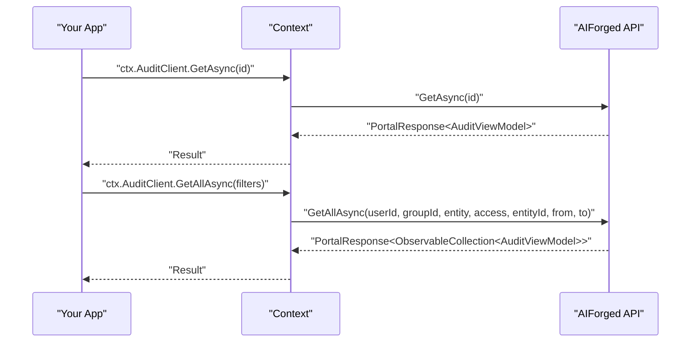

# .NET SDK — Client Reference: AuditClient

Overview

This page documents the thin-wrapper methods exposed via `Context.AuditClient` and the `AuditViewModel` used in responses.

- Methods:
    - `GetAsync`: retrieve a single audit record by Id.
    - `GetAllAsync`: search audit records by criteria.
- Models:
    - `AuditViewModel` (shape of audit records)
    - Enums: `AuditEntity`, `AuditAccessType`

!!! note "Access pattern and response wrapper"
    - Access clients from the context, for example: `ctx.AuditClient`.
    - All client methods return a response object with the payload in the `Result` property, unless otherwise stated.

!!! info "Date-time is UTC"
    All date-time values in AIForged are stored and returned as UTC. Convert to local time in your application if required (for example, `audit.DT.ToLocalTime()`).

## Prerequisites

- .NET 6+ and SDK installed:
    ```bash
    dotnet add package AIForged.SDK
    ```
- Environment variables:
    - `AIFORGED_BASE_URL` = `https://portal.aiforged.com`
    - `AIFORGED_API_KEY` = Not provided

1. Initialize the SDK context (API key auth).

    ```csharp
    using AIForged.API;

    var baseUrl = Environment.GetEnvironmentVariable("AIFORGED_BASE_URL") ?? "https://portal.aiforged.com";
    var apiKey  = Environment.GetEnvironmentVariable("AIFORGED_API_KEY")  ?? throw new Exception("AIFORGED_API_KEY not set.");

    var cfg = new Config { BaseUrl = baseUrl, Timeout = TimeSpan.FromMinutes(5) };
    await cfg.Init();
    cfg.HttpClient.DefaultRequestHeaders.Add("X-Api-Key", apiKey);

    var ctx = new Context(cfg);

    // Access the Audit client from the context
    var auditClient = ctx.AuditClient;
    ```

!!! tip "Verify connectivity"
    After initialization, call a lightweight endpoint (for example, `await ctx.GetCurrentUserAsync()`) to verify the API key and base URL before making audit calls.

## Methods

### GetAsync

Get a single audit record by Id.

- Signatures:
    ```csharp
    System.Threading.Tasks.Task<PortalResponse<AuditViewModel>> GetAsync(int? id);
    System.Threading.Tasks.Task<PortalResponse<AuditViewModel>> GetAsync(int? id, System.Threading.CancellationToken cancellationToken);
    ```
- Parameters:
    - `id`: Log record id (`int?`).
- Returns:
    - `PortalResponse<AuditViewModel>` with the record in `Result`.
- Errors:
    - `SwaggerException` indicates a server-side error.
    - AIForged returns HTTP 404 for not found records.

1. Retrieve an audit record.

    ```csharp
    using AIForged.API;
    using System;
    using System.Threading;
    using System.Threading.Tasks;

    int id = 123;

    try
    {
        var resp = await ctx.AuditClient.GetAsync(id);
        var item = resp.Result; // AuditViewModel

        Console.WriteLine($"Id={item.Id}, Entity={item.Entity}, Access={item.Access}, DT(UTC)={item.DT:u}");
        Console.WriteLine($"Local time: {item.DT.ToLocalTime():u}");
    }
    catch (SwaggerException ex) when (ex.StatusCode == 404)
    {
        Console.WriteLine("Audit record not found.");
    }
    ```

2. With cancellation.

    ```csharp
    using System.Threading;

    using var cts = new CancellationTokenSource(TimeSpan.FromSeconds(30));

    try
    {
        var resp = await ctx.AuditClient.GetAsync(id, cts.Token);
        var item = resp.Result;
        Console.WriteLine($"Id={item.Id}, Entity={item.Entity}, Access={item.Access}");
    }
    catch (SwaggerException ex) when (ex.StatusCode == 404)
    {
        Console.WriteLine("Audit record not found.");
    }
    ```

!!! warning "404 behavior"
    For missing records, the server returns HTTP 404. Handle it explicitly (for example, via an exception filter on `SwaggerException.StatusCode`).

### GetAllAsync

Search audit records by criteria.

- Signatures:
    ```csharp
    System.Threading.Tasks.Task<PortalResponse<System.Collections.ObjectModel.ObservableCollection<AuditViewModel>>> GetAllAsync(
        string userId,
        int? groupId,
        AuditEntity? entity,
        AuditAccessType? access,
        int? entityId,
        System.DateTime? from,
        System.DateTime? to
    );

    System.Threading.Tasks.Task<PortalResponse<System.Collections.ObjectModel.ObservableCollection<AuditViewModel>>> GetAllAsync(
        string userId,
        int? groupId,
        AuditEntity? entity,
        AuditAccessType? access,
        int? entityId,
        System.DateTime? from,
        System.DateTime? to,
        System.Threading.CancellationToken cancellationToken
    );
    ```
- Parameters:
    - `userId`: User id (`string`).
    - `groupId`: Group id (`int?`).
    - `entity`: Entity type (`AuditEntity?`).
    - `access`: Access type (`AuditAccessType?`).
    - `entityId`: Entity id (`int?`).
    - `from`: From date (`DateTime?`, UTC).
    - `to`: To date (`DateTime?`, UTC).
- Returns:
    - `PortalResponse<ObservableCollection<AuditViewModel>>` with records in `Result`.
- Errors:
    - `SwaggerException` for server-side errors.

1. Filter by entity and UTC date range.

    ```csharp
    using AIForged.API;
    using System;
    using System.Linq;

    var fromUtc = new DateTime(2025, 1, 1, 0, 0, 0, DateTimeKind.Utc);
    var toUtc   = new DateTime(2025, 12, 31, 23, 59, 59, DateTimeKind.Utc);

    var resp = await ctx.AuditClient.GetAllAsync(
        userId: null,
        groupId: null,
        entity: AuditEntity.Document,
        access: null,
        entityId: null,
        from: fromUtc,
        to: toUtc
    );

    var audits = resp.Result ?? new System.Collections.ObjectModel.ObservableCollection<AuditViewModel>();
    foreach (var a in audits)
    {
        Console.WriteLine($"{a.DT:u} [{a.Entity}/{a.Access}] KeyId={a.KeyId} Field={a.Field} Value={a.Value}");
    }
    ```

2. Filter by user and access type (with cancellation).

    ```csharp
    using System;
    using System.Threading;

    using var cts = new CancellationTokenSource(TimeSpan.FromSeconds(30));

    var resp = await ctx.AuditClient.GetAllAsync(
        userId: "user-123",
        groupId: null,
        entity: null,
        access: AuditAccessType.Update,
        entityId: null,
        from: null,
        to: null,
        cancellationToken: cts.Token
    );

    var audits = resp.Result;
    Console.WriteLine($"Found {audits?.Count ?? 0} update records for user-123.");
    ```

!!! note "Date filters are UTC"
    Pass `DateTime` values with `DateTimeKind.Utc` (for example, `DateTime.UtcNow`) to match server-side UTC storage and comparisons. Convert to local time only for presentation.

## Examples

### Retrieve and inspect related context

```csharp
var resp = await ctx.AuditClient.GetAsync(555);
var a = resp.Result;

Console.WriteLine($"{a.DT:u} {a.UserName} {a.Entity}/{a.Access} key={a.KeyId}");
if (a.Document != null)
    Console.WriteLine($"Doc #{a.Document.Id} -> {a.Document.Filename}");
if (a.Verification != null)
    Console.WriteLine($"Verification #{a.Verification.Id} value={a.Verification.Value}");
```

### Search audits for document activity in the past 7 days (UTC)

```csharp
var toUtc = DateTime.UtcNow;
var fromUtc = toUtc.AddDays(-7);

var resp = await ctx.AuditClient.GetAllAsync(
    userId: null,
    groupId: null,
    entity: AuditEntity.Document,
    access: null,
    entityId: null,
    from: fromUtc,
    to: toUtc
);

var items = resp.Result ?? new System.Collections.ObjectModel.ObservableCollection<AuditViewModel>();
Console.WriteLine($"Found {items.Count} audit records in last 7 days (UTC window).");
```



!!! tip "Inline type references"
    In prose, always format generic type names with backticks, for example: `ObservableCollection<AuditViewModel>`, `PortalResponse<AuditViewModel>`.

## Model: AuditViewModel

Represents an audit record.

| Property | Type | Notes |
|---|---|---|
| `Id` | `int` |  |
| `UserId` | `string` |  |
| `Entity` | `AuditEntity` |  |
| `Access` | `AuditAccessType` |  |
| `KeyId` | `int` |  |
| `KeyValue` | `string` | `[StringLength(256)]` |
| `DT` | `DateTime` | UTC |
| `FromStatus` | `int?` |  |
| `ToStatus` | `int?` |  |
| `Field` | `string` | `[StringLength(256)]` |
| `Value` | `string` | `[StringLength(256)]` |
| `Address` | `string` | `[StringLength(256)]` |
| `Data` | `string` | `[StringLength(450)]` |
| `Comment` | `string` | `[StringLength(450)]` |
| `Project` | `ProjectViewModel` |  |
| `Service` | `ParameterDefViewModel` |  |
| `Document` | `DocumentViewModel` |  |
| `Def` | `ParameterDefViewModel` |  |
| `Parameter` | `DocumentParameterViewModel` |  |
| `Verification` | `VerificationViewModel` |  |
| `WorkItem` | `WorkItemViewModel` |  |
| `Transaction` | `TransactionsAuditViewModel` |  |
| `Event` | `ServiceEventViewModel` |  |
| `Group` | `GroupViewModel` |  |
| `UserName` | `string` |  |
| `UserFullName` | `string` |  |

!!! example "Display local time"
    Convert UTC to local time for UI display:
    ```csharp
    Console.WriteLine($"Local: {audit.DT.ToLocalTime():u}");
    ```

## Enums

### AuditEntity

- `Project` = 0
- `Service` = 1
- `Document` = 2
- `Work` = 3
- `Contact` = 4
- `Notification` = 5
- `Payment` = 6
- `Verification` = 7
- `DataSet` = 8
- `Reports` = 9
- `Group` = 10
- `ParamDef` = 11
- `Parameter` = 12
- `Audit` = 13
- `Account` = 14
- `Role` = 15
- `Bundle` = 16
- `Classes` = 17
- `UserSettings` = 18
- `Credit` = 19
- `ProjectUser` = 20
- `GroupRole` = 21
- `GroupRoleUser` = 22

### AuditAccessType

- `Create` = 0
- `Read` = 1
- `Update` = 2
- `Delete` = 3
- `Move` = 4
- `Copy` = 5
- `Clone` = 6
- `Elevate` = 7
- `Work` = 8
- `Init` = 9
- `Train` = 10
- `Process` = 11
- `UnDelete` = 12
- `Define` = 13
- `Verify` = 14
- `Link` = 15
- `Expire` = 16
- `Compile` = 17
- `Approve` = 18
- `Archive` = 19

## Error handling

- All methods may throw `SwaggerException`. Inspect `StatusCode` and `Response` for diagnostics; apply retries per your policy if appropriate.

```csharp
try
{
    var resp = await ctx.AuditClient.GetAllAsync(
        userId: null,
        groupId: null,
        entity: AuditEntity.Document,
        access: null,
        entityId: null,
        from: DateTime.UtcNow.AddDays(-7),
        to: DateTime.UtcNow
    );
    var items = resp.Result;
}
catch (SwaggerException ex)
{
    if (ex.StatusCode == 404)
    {
        Console.Error.WriteLine("No audit records found for the given criteria.");
    }
    else
    {
        Console.Error.WriteLine($"API error {ex.StatusCode}");
        Console.Error.WriteLine(ex.Response);
    }
}
```

!!! tip "Cancellation"
    Prefer overloads that accept `CancellationToken` to bound calls in interactive workflows and services.

## Troubleshooting

- No results:
    - Verify filter parameters (`userId`, `entity`, `access`, `entityId`).
    - Ensure `from`/`to` are UTC and the time window is correct.
- 404 on `GetAsync`:
    - The audit record does not exist; confirm the Id and scope.
- Server errors (4xx/5xx):
    - Log `StatusCode` and `Response`; retry on transient statuses per your policy.