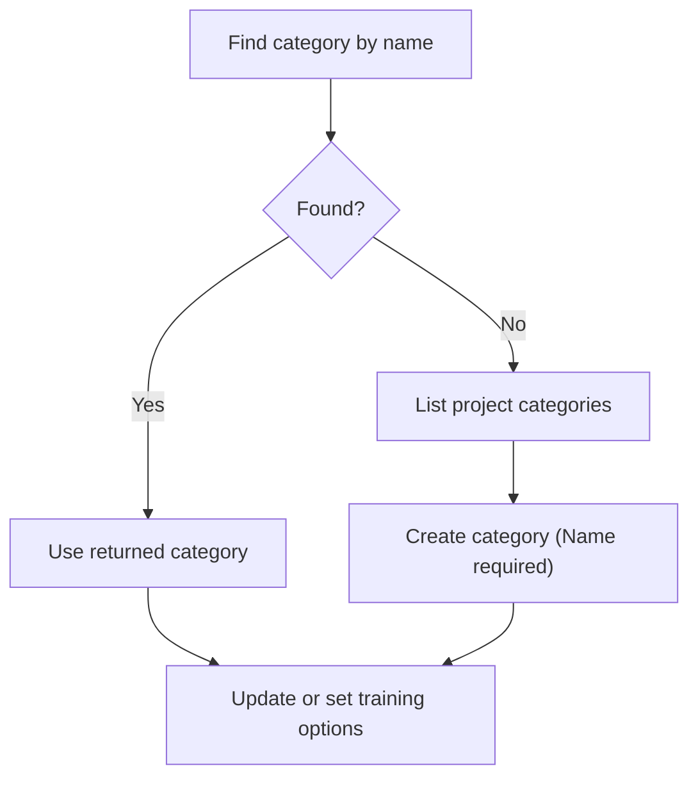

# .NET SDK — Client Reference: ClassesClient

Overview

Use `Context.ClassesClient` to manage and query Document Categories (Classes). This page details available methods, models, and enums, along with validated usage patterns and constraints.

- Read a category by ID.
- List categories by project or by user.
- Find categories by name with configurable lookup methods and confidence.
- Create, update, and delete categories.
- Manage category training options.

!!! note "Access pattern and response wrapper"
    - Access all clients via the context, for example: `ctx.ClassesClient`.
    - All client methods return a response wrapper; access the payload via `.Result`.
    - In narrative text, always wrap generic types in backticks to avoid HTML parsing, for example: `PortalResponse<ClassesViewModel>` and `PortalResponse<ObservableCollection<ClassesViewModel>>`.

!!! info "Operational guarantees"
    - Not found is returned as HTTP 404 via `SwaggerException`.
    - All failures are `SwaggerException`; the response body contains the reason (`ex.Response`).
    - Idempotency is standard: repeating a deletion returns 404 after the first success.
    - All date-time values are UTC. Convert to local time for display if needed (for example, `model.DTC.ToLocalTime()`).

## Prerequisites

1. Install the SDK.

    ```bash
    dotnet add package AIForged.SDK
    ```

1. Initialize the context and access the client.

    ```csharp
    using AIForged.API;

    var baseUrl = Environment.GetEnvironmentVariable("AIFORGED_BASE_URL") ?? "https://portal.aiforged.com";
    var apiKey  = Environment.GetEnvironmentVariable("AIFORGED_API_KEY")  ?? throw new Exception("AIFORGED_API_KEY not set.");

    var cfg = new Config { BaseUrl = baseUrl, Timeout = TimeSpan.FromMinutes(5) };
    await cfg.Init();
    cfg.HttpClient.DefaultRequestHeaders.Add("X-Api-Key", apiKey);

    var ctx = new Context(cfg);

    // Use the Classes client
    var classesClient = ctx.ClassesClient;
    ```

!!! tip "Quick verification"
    After initialization, you can call `await ctx.GetCurrentUserAsync()` to verify connectivity and credentials before invoking ClassesClient methods.

## Methods

### GetAsync

Retrieve a category by ID.

```csharp
System.Threading.Tasks.Task<PortalResponse<ClassesViewModel>> GetAsync(int? id);
System.Threading.Tasks.Task<PortalResponse<ClassesViewModel>> GetAsync(int? id, System.Threading.CancellationToken cancellationToken);
```

- Parameters:
    - id: category ID (int?).
- Returns:
    - `PortalResponse<ClassesViewModel>` in `.Result`.
- Errors:
    - 404 when the category does not exist (via `SwaggerException`).

```csharp
try
{
    var resp = await ctx.ClassesClient.GetAsync(101);
    var cls  = resp.Result;

    Console.WriteLine($"{cls.Name} (ID={cls.Id}) Created(UTC)={cls.DTC:u}");
}
catch (SwaggerException ex) when (ex.StatusCode == 404)
{
    Console.WriteLine("Category not found.");
}
```

### GetByProjectAsync

List all categories for a project.

```csharp
System.Threading.Tasks.Task<PortalResponse<System.Collections.ObjectModel.ObservableCollection<ClassesViewModel>>> GetByProjectAsync(int? projectId);
System.Threading.Tasks.Task<PortalResponse<System.Collections.ObjectModel.ObservableCollection<ClassesViewModel>>> GetByProjectAsync(int? projectId, System.Threading.CancellationToken cancellationToken);
```

- Parameters:
    - projectId: project ID (int?).
- Returns:
    - `PortalResponse<ObservableCollection<ClassesViewModel>>` in `.Result`.

```csharp
var resp = await ctx.ClassesClient.GetByProjectAsync(2001);
var categories = resp.Result ?? new System.Collections.ObjectModel.ObservableCollection<ClassesViewModel>();

foreach (var c in categories)
{
    Console.WriteLine($"[{c.Id}] {c.Name} Status={c.Status} DTM(UTC)={c.DTM:u}");
}
```

!!! note "Empty results"
    An empty `.Result` collection is a valid outcome when no categories exist in the specified project.

### FindByNameAsync

Search for a category by name within a project.

```csharp
System.Threading.Tasks.Task<PortalResponse<ClassesViewModel>> FindByNameAsync(int? projectId, string name, DictionaryLookupMethod? lookupMethod, float? minConfidence);
System.Threading.Tasks.Task<PortalResponse<ClassesViewModel>> FindByNameAsync(int? projectId, string name, DictionaryLookupMethod? lookupMethod, float? minConfidence, System.Threading.CancellationToken cancellationToken);
```

- Parameters:
    - projectId: project ID (int?).
    - name: category name (string).
    - lookupMethod: optional lookup method (`DictionaryLookupMethod?`).
    - minConfidence: optional threshold (float?); default is 0.8 if omitted.
- Returns:
    - `PortalResponse<ClassesViewModel>` in `.Result`.
- Errors:
    - 404 when no match is found.

```csharp
try
{
    var resp = await ctx.ClassesClient.FindByNameAsync(
        projectId: 2001,
        name: "Invoice",
        lookupMethod: DictionaryLookupMethod.JaroWinkler,
        minConfidence: 0.85f
    );
    var found = resp.Result;
    Console.WriteLine(found != null ? $"Found [{found.Id}] {found.Name}" : "No match.");
}
catch (SwaggerException ex) when (ex.StatusCode == 404)
{
    Console.WriteLine("No category matched the criteria (404).");
}
```

!!! tip "Lookup tuning"
    Use `DictionaryLookupMethod.Exact` for strict matches; use distance-based methods (for example, `LevenshteinDistance`, `JaroWinkler`) with `minConfidence` to allow near matches.

### GetByUserAsync

List categories for a specific user within a project.

```csharp
System.Threading.Tasks.Task<PortalResponse<System.Collections.ObjectModel.ObservableCollection<ClassesViewModel>>> GetByUserAsync(string userId, int? projectId);
System.Threading.Tasks.Task<PortalResponse<System.Collections.ObjectModel.ObservableCollection<ClassesViewModel>>> GetByUserAsync(string userId, int? projectId, System.Threading.CancellationToken cancellationToken);
```

- Parameters:
    - userId: user ID (string).
    - projectId: project ID (int?).
- Returns:
    - `PortalResponse<ObservableCollection<ClassesViewModel>>` in `.Result`.

```csharp
var resp = await ctx.ClassesClient.GetByUserAsync("user-123", 2001);
var classes = resp.Result ?? new System.Collections.ObjectModel.ObservableCollection<ClassesViewModel>();

Console.WriteLine($"User has {classes.Count} categories in project 2001.");
```

### CreateAsync

Create a new category.

```csharp
System.Threading.Tasks.Task<PortalResponse<ClassesViewModel>> CreateAsync(ClassesViewModel newclass);
System.Threading.Tasks.Task<PortalResponse<ClassesViewModel>> CreateAsync(ClassesViewModel newclass, System.Threading.CancellationToken cancellationToken);
```

- Validation:
    - Name must be non-empty.
    - Duplicate names are allowed.
- Returns:
    - `PortalResponse<ClassesViewModel>` in `.Result`.

```csharp
var newClass = new ClassesViewModel
{
    ProjectId = 2001,
    Name = "Statement",
    Description = "Bank statement documents",
    Status = CategoryStatus.Enabled
};

var resp = await ctx.ClassesClient.CreateAsync(newClass);
Console.WriteLine($"Created class #{resp.Result.Id} '{resp.Result.Name}'");
```

!!! success "Minimal validation"
    Classes require a non-empty `Name`. Duplicate names are allowed.

### UpdateAsync

Update an existing category.

```csharp
System.Threading.Tasks.Task<PortalResponse<ClassesViewModel>> UpdateAsync(ClassesViewModel docclass);
System.Threading.Tasks.Task<PortalResponse<ClassesViewModel>> UpdateAsync(ClassesViewModel docclass, System.Threading.CancellationToken cancellationToken);
```

- Validation:
    - Name must be non-empty.
    - Duplicate names are allowed.
- Returns:
    - `PortalResponse<ClassesViewModel>` in `.Result`.
- Errors:
    - 404 when the category does not exist.

```csharp
try
{
    var current = (await ctx.ClassesClient.GetAsync(101)).Result;
    current.Description = "Updated description";

    var resp = await ctx.ClassesClient.UpdateAsync(current);
    Console.WriteLine($"Updated class #{resp.Result.Id}: {resp.Result.Description}");
}
catch (SwaggerException ex) when (ex.StatusCode == 404)
{
    Console.WriteLine("Category not found for update.");
}
```

### DeleteAsync

Delete a category.

```csharp
System.Threading.Tasks.Task<PortalResponse<bool>> DeleteAsync(string userId, int? projectId, int? classId);
System.Threading.Tasks.Task<PortalResponse<bool>> DeleteAsync(string userId, int? projectId, int? classId, System.Threading.CancellationToken cancellationToken);
```

- Returns:
    - `PortalResponse<bool>` in `.Result`.
- Errors:
    - 404 for non-existent categories (including repeated deletions due to idempotency).

```csharp
try
{
    var resp = await ctx.ClassesClient.DeleteAsync(userId: "admin-user", projectId: 2001, classId: 101);
    Console.WriteLine($"Deleted: {resp.Result}");
}
catch (SwaggerException ex) when (ex.StatusCode == 404)
{
    Console.WriteLine("Category not found (already deleted or invalid ID).");
}
```

!!! info "Idempotent delete"
    If you delete the same category again, you will receive 404 via `SwaggerException`. Treat as a no-op.

### Training Options
The following endpoints manage training options for a category.

!!! warning "Service-type constraint" 
    Training options are only valid for projects that contain at least one service of type “Microsoft Document Intelligence” or “Microsoft Document Intelligence - Custom Invoices”. If the project does not include one of these service types any provided CategoryTrainingOptions will not be utilised.

### GetTrainingOptionAsync

Get training options for a category.

```csharp
System.Threading.Tasks.Task<PortalResponse<CategoryTrainingOptions>> GetTrainingOptionAsync(int? id);
System.Threading.Tasks.Task<PortalResponse<CategoryTrainingOptions>> GetTrainingOptionAsync(int? id, System.Threading.CancellationToken cancellationToken);
```

- Returns:
    - `PortalResponse<CategoryTrainingOptions>` in `.Result`.
- Errors:
    - 404 when the category or options do not exist.

```csharp
try
{
    var resp = await ctx.ClassesClient.GetTrainingOptionAsync(101);
    var options = resp.Result;

    Console.WriteLine(options != null ? "Training options retrieved." : "No training options configured.");
}
catch (SwaggerException ex) when (ex.StatusCode == 404)
{
    Console.WriteLine("Category or training options not found.");
}
```

### SetTrainingOptionAsync

Set training options for a category.

```csharp
System.Threading.Tasks.Task<PortalResponse<ClassesViewModel>> SetTrainingOptionAsync(int? id, CategoryTrainingOptions options);
System.Threading.Tasks.Task<PortalResponse<ClassesViewModel>> SetTrainingOptionAsync(int? id, CategoryTrainingOptions options, System.Threading.CancellationToken cancellationToken);
```

- Returns:
    - `PortalResponse<ClassesViewModel>` in `.Result`.

```csharp
var options = new CategoryTrainingOptions
{
    TrainingCustomTableNames = new System.Collections.ObjectModel.ObservableCollection<string> { "LineItems" },
    ProcessTableNames = new System.Collections.ObjectModel.ObservableCollection<string> { "LineItems" },
    UseInComposedModel = true,
    ForceToPDF = false,
    TrainingType = CategoryTrainingType.Layout,
    ModelVersion = "v1",
    TableColumnRegexMap = new System.Collections.Generic.Dictionary<string, System.Collections.Generic.Dictionary<string, string>>()
};

var resp = await ctx.ClassesClient.SetTrainingOptionAsync(101, options);
Console.WriteLine($"Updated training options for class #{resp.Result.Id}");
```

### DeleteTrainingOptionAsync

Remove training options from a category.

```csharp
System.Threading.Tasks.Task<PortalResponse<ClassesViewModel>> DeleteTrainingOptionAsync(int? id);
System.Threading.Tasks.Task<PortalResponse<ClassesViewModel>> DeleteTrainingOptionAsync(int? id, System.Threading.CancellationToken cancellationToken);
```

- Returns:
    - `PortalResponse<ClassesViewModel>` in `.Result`.
- Errors:
    - 404 when the category or options are not found (including repeated deletions).

```csharp
try
{
    var resp = await ctx.ClassesClient.DeleteTrainingOptionAsync(101);
    Console.WriteLine($"Training options deleted for class #{resp.Result?.Id}");
}
catch (SwaggerException ex) when (ex.StatusCode == 404)
{
    Console.WriteLine("Category or training options not found.");
}
```

## Model: ClassesViewModel

Represents a document category (class). Date-times are UTC.

| Property | Type | Notes |
| --- | --- | --- |
| Id | int |  |
| UserId | string |  |
| ProjectId | int |  |
| Name | string | [StringLength(256)]; required; must be non-empty. |
| Description | string | [StringLength(450)] |
| Comment | string | [StringLength(450)] |
| DTC | DateTime | UTC |
| DTM | DateTime | UTC |
| Type | ClassType? |  |
| Status | CategoryStatus? |  |
| Related | int? |  |
| Reference | string | [StringLength(450)] |
| Training | string | [StringLength(450)] |

```csharp
var resp = await ctx.ClassesClient.GetAsync(101);
var model = resp.Result;
Console.WriteLine($"{model.Name} [{model.Status}] Created(UTC)={model.DTC:u}");
```

## Enums

### DictionaryLookupMethod

```csharp
public enum DictionaryLookupMethod
{
    Exact = 0,
    LevenshteinDistance = 1,
    HammingDistance = 2,
    RegEx = 3,
    None = 4,
    JaroWinkler = 5
}
```

### ClassType

```csharp
public enum ClassType
{
    System = 0,
    Definition = 1,
    Other = 2
}
```

### CategoryStatus

```csharp
public enum CategoryStatus
{
    Enabled = 0,
    Disabled = 1,
    Deleted = 99
}
```

### CategoryTrainingType

```csharp
public enum CategoryTrainingType
{
    Layout = 1,
    Neural = 2
}
```

## Model: CategoryTrainingOptions

```csharp
public partial class CategoryTrainingOptions : AIForged.API.BindableBase
{
    public System.Collections.ObjectModel.ObservableCollection<string> TrainingCustomTableNames { get; set; }
    public System.Collections.ObjectModel.ObservableCollection<string> ProcessTableNames { get; set; }
    public bool UseInComposedModel { get; set; }
    public bool ForceToPDF { get; set; }
    public CategoryTrainingType? TrainingType { get; set; }
    public string ModelVersion { get; set; }
    public System.Collections.Generic.Dictionary<string, System.Collections.Generic.Dictionary<string, string>> TableColumnRegexMap { get; set; }
}
```

- TrainingCustomTableNames: `ObservableCollection<string>`
- ProcessTableNames: `ObservableCollection<string>`
- UseInComposedModel: `bool`
- ForceToPDF: `bool`
- TrainingType: `CategoryTrainingType?`
- ModelVersion: `string`
- TableColumnRegexMap: `Dictionary<string, Dictionary<string, string>>`

!!! example "Minimal training options"
    ```csharp
    var options = new CategoryTrainingOptions
    {
        TrainingCustomTableNames = new System.Collections.ObjectModel.ObservableCollection<string> { "LineItems" },
        ProcessTableNames = new System.Collections.ObjectModel.ObservableCollection<string> { "LineItems" },
        UseInComposedModel = true
    };
    ```

## Reference flow



## Error handling and diagnostics

- Handle errors via `try/catch` on `SwaggerException`.
- Use `ex.StatusCode` to branch for 404, 4xx, or 5xx.
- Inspect `ex.Response` for a failure reason.

```csharp
try
{
    var resp = await ctx.ClassesClient.DeleteAsync("user", 2001, 101);
    Console.WriteLine($"Deleted: {resp.Result}");
}
catch (SwaggerException ex)
{
    Console.Error.WriteLine($"HTTP {(int)ex.StatusCode}");
    Console.Error.WriteLine(ex.Response);

    if (ex.StatusCode == 404)
    {
        Console.Error.WriteLine("Category not found or already deleted.");
    }
}
```

!!! tip "Logging"
    Log status codes and responses for debugging while avoiding sensitive data. Consider adding retry logic only where appropriate.

## Troubleshooting

- Not found on read/update/delete:
    - Expected in absence of the resource or after a prior successful delete (idempotency). Handle 404 explicitly.
- Empty results:
    - `GetByProjectAsync` and `GetByUserAsync` may return empty collections; treat as valid.
- Create/update validation failures:
    - Ensure `Name` is non-empty. Duplicate names are allowed.