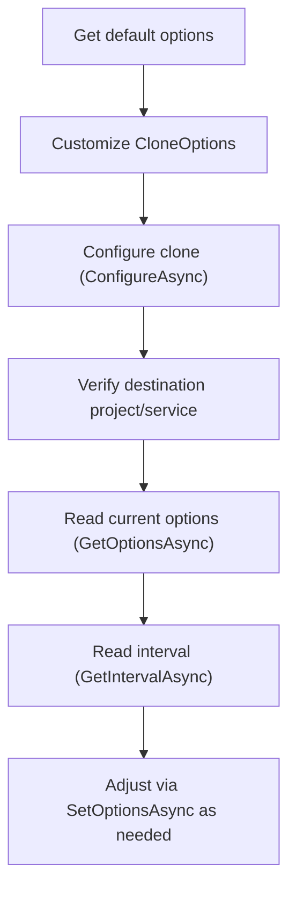

# .NET SDK — Client Reference: CloningClient

Overview

Use Context.CloningClient to configure and manage cloning of services, data, and related artifacts between projects. This page documents available methods, request/response shapes, and the CloneOptions and CloneChecks models.

- Retrieve default, dataset, and training-oriented clone options.
- Configure cloning from a source service to a destination project/service.
- Read and set current cloning options and intervals.
- Resolve destination project/service for an existing cloning configuration.

!!! note "Response wrapper and generic type notation"
    - All client methods return a response wrapper; access payloads via the `.Result` property, for example: `PortalResponse<CloneOptions>`, `PortalResponse<ProjectViewModel>`.
    - When referencing generic types in this documentation, type names are formatted inline with backticks to avoid HTML parsing issues, for example: `PortalResponse<ObservableCollection<string>>`.

!!! info "Error semantics and idempotency"
    - Not found is always returned as HTTP 404 via `SwaggerException`. Handle it explicitly by checking `ex.StatusCode == 404`.
    - All failures surface as `SwaggerException`; the server reason is in `ex.Response`.
    - Idempotency is standard across the API. For destructive operations (for example, delete on applicable endpoints), repeating the same call returns 404 after the item is removed.

## Prerequisites

1. Install the SDK.

    ```bash
    dotnet add package AIForged.SDK
    ```

1. Initialize the SDK context and obtain the client.

    ```csharp
    using AIForged.API;

    var baseUrl = Environment.GetEnvironmentVariable("AIFORGED_BASE_URL") ?? "https://portal.aiforged.com";
    var apiKey  = Environment.GetEnvironmentVariable("AIFORGED_API_KEY")  ?? throw new Exception("AIFORGED_API_KEY not set.");

    var cfg = new Config { BaseUrl = baseUrl, Timeout = TimeSpan.FromMinutes(5) };
    await cfg.Init();
    cfg.HttpClient.DefaultRequestHeaders.Add("X-Api-Key", apiKey);

    var ctx = new Context(cfg);

    // Access the Cloning client
    var cloning = ctx.CloningClient;
    ```

!!! tip "Connectivity check"
    After initialization, call a lightweight endpoint (for example, `await ctx.GetCurrentUserAsync()`) to validate credentials before using CloningClient.

## Methods

### GetDefaultOptionsAsync

Get the default clone options.

```csharp
System.Threading.Tasks.Task<PortalResponse<CloneOptions>> GetDefaultOptionsAsync();
System.Threading.Tasks.Task<PortalResponse<CloneOptions>> GetDefaultOptionsAsync(System.Threading.CancellationToken cancellationToken);
```

- Returns:
    - `PortalResponse<CloneOptions>` in `.Result`.

```csharp
var resp = await ctx.CloningClient.GetDefaultOptionsAsync();
var options = resp.Result;
```

!!! example "Start from defaults and customize"
    Retrieve defaults, then toggle flags (for example, enable Service and Documents) before configuring a clone.

### GetDataSetOptionsAsync

Get the default clone options focused on datasets.

```csharp
System.Threading.Tasks.Task<PortalResponse<CloneOptions>> GetDataSetOptionsAsync();
System.Threading.Tasks.Task<PortalResponse<CloneOptions>> GetDataSetOptionsAsync(System.Threading.CancellationToken cancellationToken);
```

- Returns:
    - `PortalResponse<CloneOptions>` in `.Result`.

```csharp
var resp = await ctx.CloningClient.GetDataSetOptionsAsync();
var datasetOptions = resp.Result;
```

### GetTrainingOptionsAsync

Get clone options tailored by a document range and category mappings.

```csharp
System.Threading.Tasks.Task<PortalResponse<CloneOptions>> GetTrainingOptionsAsync(
    int? docIdFrom,
    int? docIdTo,
    System.Collections.Generic.List<int?> srcCategories,
    System.Collections.Generic.List<int?> dstCategories
);
System.Threading.Tasks.Task<PortalResponse<CloneOptions>> GetTrainingOptionsAsync(
    int? docIdFrom,
    int? docIdTo,
    System.Collections.Generic.List<int?> srcCategories,
    System.Collections.Generic.List<int?> dstCategories,
    System.Threading.CancellationToken cancellationToken
);
```

- Parameters:
    - docIdFrom: start document Id (int?).
    - docIdTo: end document Id (int?).
    - srcCategories: source category Ids (List<int?>).
    - dstCategories: destination category Ids (List<int?>).
- Returns:
    - `PortalResponse<CloneOptions>` in `.Result`.

```csharp
var srcCats = new List<int?> { 10, 11 };
var dstCats = new List<int?> { 110, 111 };

var resp = await ctx.CloningClient.GetTrainingOptionsAsync(
    docIdFrom: 1000,
    docIdTo: 2000,
    srcCategories: srcCats,
    dstCategories: dstCats
);
var trainingOptions = resp.Result;
```

### ConfigureAsync

Clone a service to a new (or existing) destination project/service.

```csharp
System.Threading.Tasks.Task<PortalResponse<ParameterDefViewModel>> ConfigureAsync(
    string userId,
    int? srcProjectId,
    int? srcServiceId,
    int? dstProjectId,
    int? dstServiceId,
    System.TimeSpan? cloneInterval,
    CloneOptions options
);
System.Threading.Tasks.Task<PortalResponse<ParameterDefViewModel>> ConfigureAsync(
    string userId,
    int? srcProjectId,
    int? srcServiceId,
    int? dstProjectId,
    int? dstServiceId,
    System.TimeSpan? cloneInterval,
    CloneOptions options,
    System.Threading.CancellationToken cancellationToken
);
```

- Parameters:
    - userId: user identifier (string).
    - srcProjectId: source project Id (int?).
    - srcServiceId: source service Id (int?).
    - dstProjectId: destination project Id (int?).
    - dstServiceId: destination service Id (int?).
    - cloneInterval: cloning interval (TimeSpan?).
    - options: `CloneOptions`.
- Returns:
    - `PortalResponse<ParameterDefViewModel>` in `.Result`.

```csharp
var options = (await ctx.CloningClient.GetDefaultOptionsAsync()).Result;
options.Service = true;
options.ServiceRecursive = true;
options.ServiceDefSettings = true;
options.Documents = true;
options.DocumentData = true;

try
{
    var configured = await ctx.CloningClient.ConfigureAsync(
        userId: "user-123",
        srcProjectId: 101,
        srcServiceId: 501,
        dstProjectId: 202,
        dstServiceId: null,
        cloneInterval: TimeSpan.FromHours(6),
        options: options
    );

    var dstService = configured.Result; // ParameterDefViewModel
    Console.WriteLine($"Configured destination service Id: {dstService.Id}");
}
catch (SwaggerException ex) when (ex.StatusCode == 404)
{
    Console.Error.WriteLine("Source or destination not found (404).");
}
```

### GetOptionsAsync

Get current cloning options for a project/service.

```csharp
System.Threading.Tasks.Task<PortalResponse<CloneOptions>> GetOptionsAsync(string userId, int? projectId, int? serviceId);
System.Threading.Tasks.Task<PortalResponse<CloneOptions>> GetOptionsAsync(string userId, int? projectId, int? serviceId, System.Threading.CancellationToken cancellationToken);
```

- Returns:
    - `PortalResponse<CloneOptions>` in `.Result`.

```csharp
var resp = await ctx.CloningClient.GetOptionsAsync("user-123", 202, 602);
var currentOptions = resp.Result;
```

### GetIntervalAsync

Get the current cloning interval for a project/service.

```csharp
System.Threading.Tasks.Task<PortalResponse<System.TimeSpan>> GetIntervalAsync(string userId, int? projectId, int? serviceId);
System.Threading.Tasks.Task<PortalResponse<System.TimeSpan>> GetIntervalAsync(string userId, int? projectId, int? serviceId, System.Threading.CancellationToken cancellationToken);
```

- Returns:
    - `PortalResponse<TimeSpan>` in `.Result`.

```csharp
var resp = await ctx.CloningClient.GetIntervalAsync("user-123", 202, 602);
var interval = resp.Result;
Console.WriteLine($"Clone interval: {interval}");
```

### GetDestinationProjectAsync

Resolve the destination project for an existing cloning configuration.

```csharp
System.Threading.Tasks.Task<PortalResponse<ProjectViewModel>> GetDestinationProjectAsync(string userId, int? projectId, int? serviceId);
System.Threading.Tasks.Task<PortalResponse<ProjectViewModel>> GetDestinationProjectAsync(string userId, int? projectId, int? serviceId, System.Threading.CancellationToken cancellationToken);
```

- Returns:
    - `PortalResponse<ProjectViewModel>` in `.Result`.

```csharp
try
{
    var resp = await ctx.CloningClient.GetDestinationProjectAsync("user-123", 101, 501);
    var dstProject = resp.Result;
    Console.WriteLine($"Destination Project Id: {dstProject.Id}");
}
catch (SwaggerException ex) when (ex.StatusCode == 404)
{
    Console.Error.WriteLine("Destination project not found (404).");
}
```

### GetDestinationServiceAsync

Resolve the destination service for an existing cloning configuration.

```csharp
System.Threading.Tasks.Task<PortalResponse<ParameterDefViewModel>> GetDestinationServiceAsync(string userId, int? projectId, int? serviceId);
System.Threading.Tasks.Task<PortalResponse<ParameterDefViewModel>> GetDestinationServiceAsync(string userId, int? projectId, int? serviceId, System.Threading.CancellationToken cancellationToken);
```

- Returns:
    - `PortalResponse<ParameterDefViewModel>` in `.Result`.

```csharp
try
{
    var resp = await ctx.CloningClient.GetDestinationServiceAsync("user-123", 101, 501);
    var dstService = resp.Result;
    Console.WriteLine($"Destination Service Id: {dstService.Id}");
}
catch (SwaggerException ex) when (ex.StatusCode == 404)
{
    Console.Error.WriteLine("Destination service not found (404).");
}
```

### SetOptionsAsync

Set cloning options and optionally adjust interval/destination.

```csharp
System.Threading.Tasks.Task<PortalResponse<ParameterDefViewModel>> SetOptionsAsync(
    string userId,
    int? srcProjectId,
    int? srcServiceId,
    int? dstProjectId,
    int? dstServiceId,
    System.TimeSpan? cloneInterval,
    CloneOptions options
);
System.Threading.Tasks.Task<PortalResponse<ParameterDefViewModel>> SetOptionsAsync(
    string userId,
    int? srcProjectId,
    int? srcServiceId,
    int? dstProjectId,
    int? dstServiceId,
    System.TimeSpan? cloneInterval,
    CloneOptions options,
    System.Threading.CancellationToken cancellationToken
);
```

- Returns:
    - `PortalResponse<ParameterDefViewModel>` in `.Result`.

```csharp
var options = new CloneOptions
{
    Service = true,
    ServiceRecursive = true,
    ServiceDefSettings = true,
    ParamDefSettings = true,
    Parameters = true,
    Verifications = true
};

var updated = await ctx.CloningClient.SetOptionsAsync(
    userId: "user-123",
    srcProjectId: 101,
    srcServiceId: 501,
    dstProjectId: 202,
    dstServiceId: 602,
    cloneInterval: TimeSpan.FromHours(12),
    options: options
);

Console.WriteLine($"Updated destination service Id: {updated.Result.Id}");
```

!!! tip "Iterative configuration"
    Use `GetOptionsAsync` to read current settings, modify only the necessary flags, then submit via `SetOptionsAsync`.

## Models

### CloneOptions

Represents clone configuration flags, ranges, filters, and checks.

| Property | Type | Notes |
|---|---|---|
| Classes | bool |  |
| ProjectUsers | bool |  |
| Service | bool |  |
| ServiceRecursive | bool |  |
| ServiceDefSettings | bool |  |
| ParamDefSettings | bool |  |
| ParamDefCategories | ObservableCollection<ParameterDefinitionCategory?> |  |
| Ratings | bool |  |
| Documents | bool |  |
| DocumentFromId | int? |  |
| DocumentToId | int? |  |
| DocumentDescending | bool? |  |
| DocumentIds | ObservableCollection<int> |  |
| DocumentCategoriesSrc | ObservableCollection<int?> |  |
| DocumentCategoriesDst | ObservableCollection<int?> |  |
| SkipDocs | Dictionary<UsageType, ObservableCollection<string>> |  |
| SkipStatus | Dictionary<DocumentStatus, ObservableCollection<string>> |  |
| DocumentMaxDegreeOfParallelism | int |  |
| DocumentsDeletedState | bool |  |
| DocumentsDataSet | bool |  |
| DocumentsInbox | bool |  |
| DocumentsOutBox | bool |  |
| DocumentsDefinitions | bool |  |
| DocumentsTraining | bool |  |
| DocumentsLabelling | bool |  |
| DocumentData | bool |  |
| Parameters | bool |  |
| Verifications | bool |  |
| RedoVerifications | bool |  |
| Work | bool |  |
| Audit | bool |  |
| Logs | bool |  |
| Transactions | bool |  |
| Payments | bool |  |
| ProviderProjects | bool |  |
| ProviderModels | bool |  |
| Checks | CloneChecks |  |

### CloneChecks

Result of pre/post checks that may influence cloning behavior.

| Property | Type | Notes |
|---|---|---|
| ProjectExist | bool |  |
| DoNotCreatePD | bool |  |
| ReProcessDocumentDataOnly | bool |  |
| ReProcessDataSetDocument | bool |  |
| ReProcessInboxDocument | bool |  |
| ReProcessOutboxDocument | bool |  |
| ReProcessDefinitionDocument | bool |  |
| ReProcessTrainingDocument | bool |  |
| ReProcessLabellingDocument | bool |  |
| ParameterExists | bool |  |
| VerificationExists | bool |  |
| TransactionExists | bool |  |
| AuditExists | bool |  |
| WorkItemsExists | bool |  |
| LogsExists | bool |  |
| PaymentExists | bool |  |

### Related models

- ParameterDefViewModel: Returned by `ConfigureAsync`, `SetOptionsAsync`, and `GetDestinationServiceAsync`. The user-provided shape includes identifiers, service metadata, hierarchical children, settings, and counts.

??? note "ParameterDefViewModel (user-provided source)"
    ```csharp
    public partial class ParameterDefViewModel : AIForged.API.BindableBase
    {
        public int Id { get; set; }
        public int ProjectId { get; set; }
        public int ServiceTypeId { get; set; }
        public int? ServiceId { get; set; }
        public int? ClassId { get; set; }
        public int? ParentId { get; set; }
        public string Name { get; set; }
        public string Label { get; set; }
        public string Tags { get; set; }
        public string Description { get; set; }
        public System.DateTime? DTC { get; set; }
        public System.DateTime? DTM { get; set; }
        public ParameterDefinitionStatus Status { get; set; }
        public ParameterDefinitionCategory? Category { get; set; }
        public GroupingType? Grouping { get; set; }
        public ValueType ValueType { get; set; }
        public string ValueTypeName { get; set; }
        public string DefaultValue { get; set; }
        public RequiredOption Required { get; set; }
        public int? Index { get; set; }
        public string Info { get; set; }
        public string Reference { get; set; }
        public float? Rating { get; set; }
        public Availability? Availability { get; set; }
        public System.Collections.ObjectModel.ObservableCollection<ParameterDefViewModel> Children { get; set; }
        public System.Collections.ObjectModel.ObservableCollection<ParameterDefSettingViewModel> Settings { get; set; }
        public decimal? TotalCharge { get; set; }
        public int UserCount { get; set; }
        public int ParameterCount { get; set; }
        public int DocumentCount { get; set; }
        public string Validation { get; set; }
        public bool IsEnabled { get; set; }
    }
    ```

## Example: Configure a clone workflow

1. Read defaults, tailor flags.
2. Configure the clone.
3. Verify destination project and service.
4. Read back options and interval.

```csharp
// 1) Defaults
var options = (await ctx.CloningClient.GetDefaultOptionsAsync()).Result;
options.Service = true;
options.ServiceRecursive = true;
options.ServiceDefSettings = true;
options.Parameters = true;
options.Documents = true;
options.DocumentData = true;

// 2) Configure
var cfgResp = await ctx.CloningClient.ConfigureAsync(
    userId: "user-123",
    srcProjectId: 101,
    srcServiceId: 501,
    dstProjectId: 202,
    dstServiceId: null,
    cloneInterval: TimeSpan.FromHours(12),
    options: options
);

// 3) Verify destination
var dstProject = (await ctx.CloningClient.GetDestinationProjectAsync("user-123", 101, 501)).Result;
var dstService = (await ctx.CloningClient.GetDestinationServiceAsync("user-123", 101, 501)).Result;

// 4) Read back options and interval
var current = (await ctx.CloningClient.GetOptionsAsync("user-123", 202, dstService.ServiceId)).Result;
var interval = (await ctx.CloningClient.GetIntervalAsync("user-123", 202, dstService.ServiceId)).Result;
```

!!! tip "Troubleshooting during configuration"
    Wrap calls in try/catch for `SwaggerException`. Check `ex.StatusCode` for 404 and read `ex.Response` for details such as missing projects/services or invalid options.

## Error handling

```csharp
try
{
    var resp = await ctx.CloningClient.GetDestinationServiceAsync("user-123", 999, 999);
    var svc = resp.Result;
}
catch (SwaggerException ex)
{
    Console.Error.WriteLine($"HTTP {(int)ex.StatusCode} {ex.StatusCode}");
    Console.Error.WriteLine(ex.Response);

    if (ex.StatusCode == 404)
    {
        Console.Error.WriteLine("Resource not found.");
    }
}
```

## Reference flow



## Troubleshooting

- 404 on lookups:
    - The referenced project or service does not exist in the expected scope.
    - Validate identifiers and user permissions; the server returns details in `ex.Response`.
- Destination unresolved:
    - Use `GetDestinationProjectAsync` and `GetDestinationServiceAsync` after `ConfigureAsync` to confirm mappings.
- Option-related failures:
    - Begin from `GetDefaultOptionsAsync` and change only necessary flags.
    - If using category/document filters (`GetTrainingOptionsAsync`), verify Id ranges and mapping lists.
