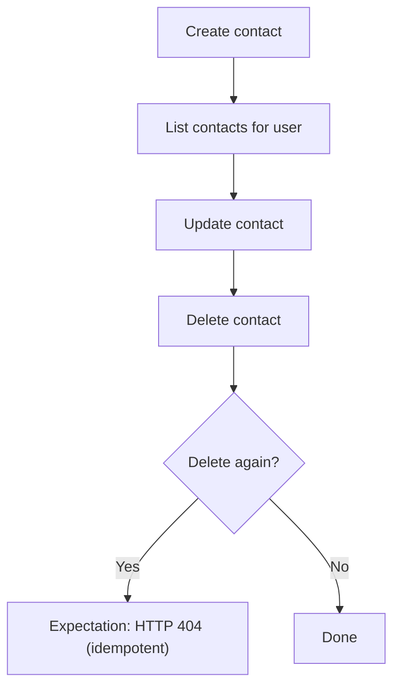

# .NET SDK — Client Reference: ContactClient

Overview

Use Context.ContactClient to manage user contacts for notifications. This page documents available methods, request/response shapes, and the ContactViewModel model with related enums.

- Retrieve contacts for a user.
- Create a contact.
- Update a contact.
- Delete a contact.

!!! info "Error semantics and idempotency"
    - Not found errors are returned as HTTP 404 via `SwaggerException`. Check `ex.StatusCode == 404`.
    - All failures surface as `SwaggerException`; the server’s reason is in `ex.Response`.
    - Idempotency is standard: repeating a deletion returns 404 after the first success.

!!! note "Notification types"
    Only Email notifications are currently available. Other types (SMS, WhatsApp, Bot, Application) are placeholders.

## Prerequisites

1. Install the SDK.

    ```bash
    dotnet add package AIForged.SDK
    ```

1. Initialize the context and access the client.

    ```csharp
    using AIForged.API;

    var baseUrl = Environment.GetEnvironmentVariable("AIFORGED_BASE_URL") ?? "https://portal.aiforged.com";
    var apiKey  = Environment.GetEnvironmentVariable("AIFORGED_API_KEY")  ?? throw new Exception("AIFORGED_API_KEY not set.");

    var cfg = new Config { BaseUrl = baseUrl, Timeout = TimeSpan.FromMinutes(5) };
    await cfg.Init();
    cfg.HttpClient.DefaultRequestHeaders.Add("X-Api-Key", apiKey);

    var ctx = new Context(cfg);

    // Access the Contact client
    var contacts = ctx.ContactClient;
    ```

!!! tip "Verification step"
    After initialization, you can call a lightweight endpoint such as `await ctx.GetCurrentUserAsync()` to verify connectivity and credentials before invoking ContactClient methods.

## Methods

### GetAsync

Get contacts for a user.

```csharp
System.Threading.Tasks.Task<PortalResponse<System.Collections.ObjectModel.ObservableCollection<ContactViewModel>>> GetAsync(string userId);
System.Threading.Tasks.Task<PortalResponse<System.Collections.ObjectModel.ObservableCollection<ContactViewModel>>> GetAsync(string userId, System.Threading.CancellationToken cancellationToken);
```

- Parameters:
    - userId: the user identifier.
- Returns:
    - `PortalResponse<ObservableCollection<ContactViewModel>>` in `.Result`.

```csharp
var resp = await ctx.ContactClient.GetAsync("user-123");
var list = resp.Result ?? new System.Collections.ObjectModel.ObservableCollection<ContactViewModel>();
foreach (var c in list)
{
    Console.WriteLine($"[{c.Id}] {c.Type} {c.Address} ({c.Status})");
}
```

!!! note "Empty results"
    If no contacts exist for the user, the method may return an empty collection.

### CreateAsync

Create a contact.

```csharp
System.Threading.Tasks.Task<PortalResponse<ContactViewModel>> CreateAsync(ContactViewModel contact);
System.Threading.Tasks.Task<PortalResponse<ContactViewModel>> CreateAsync(ContactViewModel contact, System.Threading.CancellationToken cancellationToken);
```

- Parameters:
    - contact: `ContactViewModel` to create.
- Returns:
    - `PortalResponse<ContactViewModel>` in `.Result`.

```csharp
var newContact = new ContactViewModel
{
    UserId  = "user-123",
    Status  = ContactStatus.Active,
    Type    = NotificationType.Email,
    Address = "person@example.com",
    Name    = "Primary Email",
    Comment = "Notifications"
};

var created = await ctx.ContactClient.CreateAsync(newContact);
Console.WriteLine($"Created contact #{created.Result.Id} {created.Result.Address}");
```

!!! warning "Validation"
    Only Email is supported at present. Ensure `Address` and `Name` respect string length limits.

### UpdateAsync

Update an existing contact.

```csharp
System.Threading.Tasks.Task<PortalResponse<ContactViewModel>> UpdateAsync(ContactViewModel contact);
System.Threading.Tasks.Task<PortalResponse<ContactViewModel>> UpdateAsync(ContactViewModel contact, System.Threading.CancellationToken cancellationToken);
```

- Parameters:
    - contact: the full `ContactViewModel` with updated fields.
- Returns:
    - `PortalResponse<ContactViewModel>` in `.Result`.

```csharp
var list = (await ctx.ContactClient.GetAsync("user-123")).Result;
var first = list?[0];
if (first != null)
{
    first.Comment = "Updated comment";
    var updated = await ctx.ContactClient.UpdateAsync(first);
    Console.WriteLine($"Updated contact #{updated.Result.Id}: {updated.Result.Comment}");
}
```

!!! tip "Partial updates"
    The update signature accepts a full `ContactViewModel`.

### DeleteAsync

Delete a contact by Id.

```csharp
System.Threading.Tasks.Task<PortalResponse<ContactViewModel>> DeleteAsync(int? id);
System.Threading.Tasks.Task<PortalResponse<ContactViewModel>> DeleteAsync(int? id, System.Threading.CancellationToken cancellationToken);
```

- Parameters:
    - id: contact identifier.
- Returns:
    - `PortalResponse<ContactViewModel>` in `.Result` (the deleted contact).
- Errors:
    - 404 if the contact does not exist (including repeat deletes due to idempotency).

```csharp
try
{
    var deleted = await ctx.ContactClient.DeleteAsync(42);
    Console.WriteLine($"Deleted contact #{deleted.Result?.Id}");
}
catch (SwaggerException ex) when (ex.StatusCode == 404)
{
    Console.WriteLine("Contact not found or already deleted (404).");
}
```

!!! info "Idempotent delete"
    Repeating a successful deletion for the same contact Id will return HTTP 404 via `SwaggerException`. Treat as a no-op in client logic.

## Model: ContactViewModel

Represents a notification contact. Date-time values are UTC.

| Property | Type | Notes |
| --- | --- | --- |
| Id | int |  |
| UserId | string |  |
| Status | ContactStatus |  |
| Type | NotificationType | Only Email is currently available; others are placeholders. |
| Address | string | [StringLength(256)] |
| Name | string | [StringLength(256)] |
| Comment | string | [StringLength(450)] |
| DTC | DateTime | UTC |
| DTM | DateTime | UTC |

```csharp
var c = new ContactViewModel
{
    UserId = "user-123",
    Status = ContactStatus.Active,
    Type = NotificationType.Email,
    Address = "person@example.com",
    Name = "Ops Team",
    Comment = "Critical alerts"
};
```

!!! note "Date-time fields"
    DTC and DTM are UTC. Convert to local time for display if needed using `.ToLocalTime()`.

## Enums

### ContactStatus

```csharp
public enum ContactStatus
{
    None = 0,
    Active = 1,
    Disabled = 2,
    Deleted = 90
}
```

### NotificationType

```csharp
public enum NotificationType
{
    None = 0,
    Email = 1,
    SMS = 2,
    WhatsApp = 3,
    Bot = 4,
    Application = 5
}
```

!!! info "Supported types"
    Only `NotificationType.Email` is supported. Other values are placeholders.

## Example: Create, list, update, delete

1. Create an Email contact.

    ```csharp
    var created = await ctx.ContactClient.CreateAsync(new ContactViewModel
    {
        UserId = "user-123",
        Status = ContactStatus.Active,
        Type = NotificationType.Email,
        Address = "alerts@example.com",
        Name = "Alerts",
        Comment = "High-priority notifications"
    });
    ```

1. List contacts for the user.

    ```csharp
    var list = (await ctx.ContactClient.GetAsync("user-123")).Result;
    ```

1. Update the contact.

    ```csharp
    var contact = list?[0];
    if (contact != null)
    {
        contact.Status = ContactStatus.Disabled;
        await ctx.ContactClient.UpdateAsync(contact);
    }
    ```

1. Delete the contact (idempotent).

    ```csharp
    try
    {
        await ctx.ContactClient.DeleteAsync(contact?.Id);
    }
    catch (SwaggerException ex) when (ex.StatusCode == 404)
    {
        // Already deleted or not found
    }
    ```

!!! success "Outcome"
    After these steps, the specified contact is created, visible in the list, updated, and then removed. A repeat delete results in a 404.

## Flow



## Error handling

- Wrap calls in `try/catch` for `SwaggerException`.
- Inspect `ex.StatusCode` for HTTP status; use `ex.Response` for server-provided details.
- Treat 404 on delete as an expected idempotency outcome.

```csharp
try
{
    var resp = await ctx.ContactClient.GetAsync("user-123");
    var contacts = resp.Result;
}
catch (SwaggerException ex)
{
    Console.Error.WriteLine($"HTTP {(int)ex.StatusCode}");
    Console.Error.WriteLine(ex.Response);
}
```

!!! tip "Diagnostics"
    Log status codes and response bodies (avoid sensitive data). Add retries only when appropriate; do not retry on 404 for delete operations.

## Troubleshooting

- No contacts returned:
    - Ensure the correct `userId` is used.
    - An empty collection indicates no contacts.
- Create/update fails:
    - Confirm `Type` is `Email`.
    - Check `Address`, `Name`, and `Comment` length limits.
    - Read `ex.Response` for validation details.
- Delete fails with 404:
    - The contact may not exist or was already deleted (idempotent behavior).