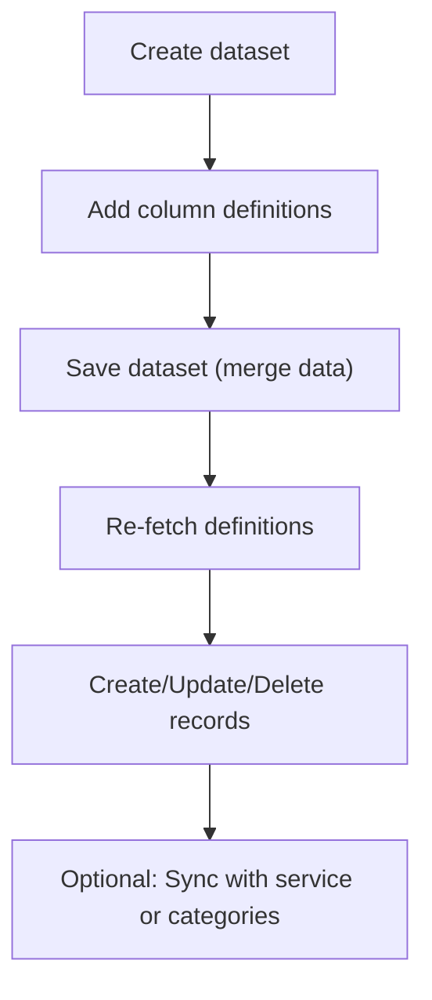

# .NET SDK — Client Reference: DataSetClient

Overview

Use Context.DataSetClient to create, read, update, delete, and synchronize Custom Datasets. This page documents all methods, models, and enums, with usage patterns for paging, sorting, search, and record CRUD.

!!! info "Errors and idempotency"
    - “Not found” is always returned as HTTP 404 via SwaggerException. Handle it explicitly by checking `ex.StatusCode == 404`.
    - All failures are returned as SwaggerException with the reason for failure in `ex.Response`.
    - Idempotency is standard across the API. For destructive operations, repeating the same call returns 404 after the resource is gone.

## Prerequisites

1. SDK installation.

    ```bash
    dotnet add package AIForged.SDK
    ```

1. Context and authentication.

    ```csharp
    using AIForged.API;

    var baseUrl = Environment.GetEnvironmentVariable("AIFORGED_BASE_URL") ?? "https://portal.aiforged.com";
    var apiKey  = Environment.GetEnvironmentVariable("AIFORGED_API_KEY")  ?? throw new Exception("AIFORGED_API_KEY not set.");

    var cfg = new Config { BaseUrl = baseUrl, Timeout = TimeSpan.FromMinutes(5) };
    await cfg.Init();

    // API key authentication
    cfg.HttpClient.DefaultRequestHeaders.Add("X-Api-Key", apiKey);

    var ctx = new Context(cfg);

    // Optional connectivity check
    var me = await ctx.GetCurrentUserAsync();
    ```

!!! note "Environment"
    - Base URL: https://portal.aiforged.com
    - Auth scheme: API key via the `X-Api-Key` header.

## Methods

### GetAsync

Get a custom dataset and optionally its data.

```csharp
Task<PortalResponse<CustomDataSet>> GetAsync(
    int? docId,
    int? defId,
    bool? includeData,
    int? pageNo,
    int? pageSize,
    int? sortFieldDefId,
    SortDirection? sortDirection,
    string searchField,
    string searchFilter
);

Task<PortalResponse<CustomDataSet>> GetAsync(
    int? docId,
    int? defId,
    bool? includeData,
    int? pageNo,
    int? pageSize,
    int? sortFieldDefId,
    SortDirection? sortDirection,
    string searchField,
    string searchFilter,
    CancellationToken cancellationToken
);
```

- Parameters:
    - docId: The document ID.
    - defId: The parameter definition ID of the dataset.
    - includeData: Include dataset records when true.
    - pageNo/pageSize: Optional paging for dataset records.
    - sortFieldDefId/sortDirection: Optional sorting (by field definition ID).
    - searchField/searchFilter: Optional server-side filtering.
- Returns:
    - `PortalResponse<CustomDataSet>` in `.Result`.

```csharp
var resp = await ctx.DataSetClient.GetAsync(
    docId: 123,
    defId: 456,
    includeData: true,
    pageNo: 1,
    pageSize: 100,
    sortFieldDefId: null,
    sortDirection: null,
    searchField: null,
    searchFilter: null
);
var dataSet = resp.Result;
```

!!! tip "Reduce payload"
    Use server-side search and paging (`searchField`, `searchFilter`, `pageNo`, `pageSize`) to minimize response size and speed up queries.

### GetByNameAsync

Get a dataset by name within a project and service.

```csharp
Task<PortalResponse<CustomDataSet>> GetByNameAsync(
    int? projectId,
    int? stpdId,
    string dataSetName,
    bool? includeData,
    int? pageNo,
    int? pageSize,
    int? sortFieldDefId,
    SortDirection? sortDirection,
    string searchField,
    string searchFilter
);

Task<PortalResponse<CustomDataSet>> GetByNameAsync(
    int? projectId,
    int? stpdId,
    string dataSetName,
    bool? includeData,
    int? pageNo,
    int? pageSize,
    int? sortFieldDefId,
    SortDirection? sortDirection,
    string searchField,
    string searchFilter,
    CancellationToken cancellationToken
);
```

- Returns:
    - `PortalResponse<CustomDataSet>` in `.Result`.

### GetByDefAsync

Get a dataset by definition ID (pdId).

```csharp
Task<PortalResponse<CustomDataSet>> GetByDefAsync(
    int? projectId,
    int? stpdId,
    int? pdId,
    bool? includeData,
    int? pageNo,
    int? pageSize,
    int? sortFieldDefId,
    SortDirection? sortDirection,
    string searchField,
    string searchFilter
);

Task<PortalResponse<CustomDataSet>> GetByDefAsync(
    int? projectId,
    int? stpdId,
    int? pdId,
    bool? includeData,
    int? pageNo,
    int? pageSize,
    int? sortFieldDefId,
    SortDirection? sortDirection,
    string searchField,
    string searchFilter,
    CancellationToken cancellationToken
);
```

- Returns:
    - `PortalResponse<CustomDataSet>` in `.Result`.

### GetByIdAsync

Get a dataset by ID.

```csharp
Task<PortalResponse<CustomDataSet>> GetByIdAsync(
    int? dataSetId,
    bool? includeData,
    int? pageNo,
    int? pageSize,
    int? sortFieldDefId,
    SortDirection? sortDirection,
    string searchField,
    string searchFilter
);

Task<PortalResponse<CustomDataSet>> GetByIdAsync(
    int? dataSetId,
    bool? includeData,
    int? pageNo,
    int? pageSize,
    int? sortFieldDefId,
    SortDirection? sortDirection,
    string searchField,
    string searchFilter,
    CancellationToken cancellationToken
);
```

- Returns:
    - `PortalResponse<CustomDataSet>` in `.Result`.

### GetAllAsync

List all datasets for a service.

```csharp
Task<PortalResponse<ObservableCollection<CustomDataSet>>> GetAllAsync(int? projectId, int? stpdId);
Task<PortalResponse<ObservableCollection<CustomDataSet>>> GetAllAsync(int? projectId, int? stpdId, CancellationToken cancellationToken);
```

- Returns:
    - `PortalResponse<ObservableCollection<CustomDataSet>>` in `.Result`.

!!! note "Empty vs. 404"
    An empty collection indicates no datasets for the specified service. Handle other errors via `SwaggerException`.

### CreateAsync

Create a new empty dataset.

```csharp
Task<PortalResponse<CustomDataSet>> CreateAsync(int? projectId, int? stpdId, string dataSetName);
Task<PortalResponse<CustomDataSet>> CreateAsync(int? projectId, int? stpdId, string dataSetName, CancellationToken cancellationToken);
```

- Returns:
    - `PortalResponse<CustomDataSet>` in `.Result`.

```csharp
var created = await ctx.DataSetClient.CreateAsync(projectId: 1001, stpdId: 2001, dataSetName: "Vendors");
var ds = created.Result;
```

!!! note "Service ID naming"
    In the model, `StpdId` is marked Obsolete in favor of `ServiceId`. Method parameters still use `stpdId` for the service ID.

### DeleteAsync

Delete dataset data and optionally its field definitions.

```csharp
Task<PortalResponse<int>> DeleteAsync(int? docid, int? defId, bool? definition);
Task<PortalResponse<int>> DeleteAsync(int? docid, int? defId, bool? definition, CancellationToken cancellationToken);
```

- Parameters:
    - definition: When true, dataset field definitions are also deleted.
- Returns:
    - `PortalResponse<int>` in `.Result`

```csharp
try
{
    var del = await ctx.DataSetClient.DeleteAsync(docid: 123, defId: 456, definition: false);
    Console.WriteLine($"Delete result: {del.Result}");
}
catch (SwaggerException ex) when (ex.StatusCode == 404)
{
    Console.WriteLine("Dataset not found (404).");
}
```

!!! warning "Idempotent delete"
    Repeating the same delete returns 404 after the first successful deletion.

### GetRecordAsync

Get a dataset record by key ID.

```csharp
Task<PortalResponse<CustomDataSetRecord>> GetRecordAsync(int? docId, int? defId, int? keyId, bool? includeVerifications);
Task<PortalResponse<CustomDataSetRecord>> GetRecordAsync(int? docId, int? defId, int? keyId, bool? includeVerifications, CancellationToken cancellationToken);
```

- Returns:
    - `PortalResponse<CustomDataSetRecord>` in `.Result`.

### GetRecordByKeyValueAsync

Find a dataset record by key value.

```csharp
Task<PortalResponse<CustomDataSetRecord>> GetRecordByKeyValueAsync(int? docId, int? defId, string keyValue, bool? includeVerifications);
Task<PortalResponse<CustomDataSetRecord>> GetRecordByKeyValueAsync(int? docId, int? defId, string keyValue, bool? includeVerifications, CancellationToken cancellationToken);
```

- Returns:
    - `PortalResponse<CustomDataSetRecord>` in `.Result`.

```csharp
try
{
    var rec = await ctx.DataSetClient.GetRecordByKeyValueAsync(
        docId: 123,
        defId: 456,
        keyValue: "V-1001",
        includeVerifications: false
    );
    var record = rec.Result;
}
catch (SwaggerException ex) when (ex.StatusCode == 404)
{
    Console.WriteLine("Record not found (404).");
}
```

### CreateRecordAsync

Create a dataset record (row).

```csharp
Task<PortalResponse<CustomDataSetRecord>> CreateRecordAsync(int? docId, int? defId, CustomDataSetRecord record);
Task<PortalResponse<CustomDataSetRecord>> CreateRecordAsync(int? docId, int? defId, CustomDataSetRecord record, CancellationToken cancellationToken);
```

- Returns:
    - `PortalResponse<CustomDataSetRecord>` in `.Result`.

```csharp
var record = new CustomDataSetRecord
{
    KeyDefId = 456,
    KeyValue = "V-1001",
    Values = new System.Collections.ObjectModel.ObservableCollection<CustomDataSetValue>
    {
        new CustomDataSetValue { DefId = 7001, Value = "Acme Ltd" },
        new CustomDataSetValue { DefId = 7002, Value = "V-1001" }
    }
};
var createdRec = await ctx.DataSetClient.CreateRecordAsync(docId: 123, defId: 456, record: record);
```

### UpdateRecordAsync

Update a dataset record.

```csharp
Task<PortalResponse<CustomDataSetRecord>> UpdateRecordAsync(int? docId, int? defId, CustomDataSetRecord record);
Task<PortalResponse<CustomDataSetRecord>> UpdateRecordAsync(int? docId, int? defId, CustomDataSetRecord record, CancellationToken cancellationToken);
```

- Returns:
    - `PortalResponse<CustomDataSetRecord>` in `.Result`.

### DeleteRecordAsync

Delete a dataset record by key ID.

```csharp
Task<PortalResponse<ObservableCollection<CustomDataSetRecord>>> DeleteRecordAsync(int? docId, int? defId, int? keyId);
Task<PortalResponse<ObservableCollection<CustomDataSetRecord>>> DeleteRecordAsync(int? docId, int? defId, int? keyId, CancellationToken cancellationToken);
```

- Returns:
    - `PortalResponse<ObservableCollection<CustomDataSetRecord>>` in `.Result`.

### DeleteRecordsAsync

Delete multiple dataset records by key IDs.

```csharp
Task<PortalResponse<ObservableCollection<CustomDataSetRecord>>> DeleteRecordsAsync(int? docId, int? defId, List<int> keyIds);
Task<PortalResponse<ObservableCollection<CustomDataSetRecord>>> DeleteRecordsAsync(int? docId, int? defId, List<int> keyIds, CancellationToken cancellationToken);
```

- Returns:
    - `PortalResponse<ObservableCollection<CustomDataSetRecord>>` in `.Result`.

### DeleteRecordByKeyValueAsync

Delete a dataset record by key value.

```csharp
Task<PortalResponse<ObservableCollection<CustomDataSetRecord>>> DeleteRecordByKeyValueAsync(int? docId, int? defId, string keyValue);
Task<PortalResponse<ObservableCollection<CustomDataSetRecord>>> DeleteRecordByKeyValueAsync(int? docId, int? defId, string keyValue, CancellationToken cancellationToken);
```

- Returns:
    - `PortalResponse<ObservableCollection<CustomDataSetRecord>>` in `.Result`.

```csharp
try
{
    var deleted = await ctx.DataSetClient.DeleteRecordByKeyValueAsync(docId: 123, defId: 456, keyValue: "V-1001");
    Console.WriteLine($"Deleted count: {deleted.Result?.Count}");
}
catch (SwaggerException ex) when (ex.StatusCode == 404)
{
    Console.WriteLine("Record not found or already deleted (404).");
}
```

### SaveAsync

Save a custom dataset (schema and/or data).

```csharp
Task<PortalResponse<int>> SaveAsync(bool? mergeData, CustomDataSet dataset);
Task<PortalResponse<int>> SaveAsync(bool? mergeData, CustomDataSet dataset, CancellationToken cancellationToken);
```

- Parameters:
    - mergeData: When true, dataset data is merged.
- Returns:
    - `PortalResponse<int>` in `.Result`

### SyncAsync

Sync a dataset with a service or categories.

```csharp
Task<PortalResponse<bool>> SyncAsync(int? projectId, int? stpdId, int? pdId, bool? overrideComment, bool? overrideReference);
Task<PortalResponse<bool>> SyncAsync(int? projectId, int? stpdId, int? pdId, bool? overrideComment, bool? overrideReference, CancellationToken cancellationToken);
```

- Returns:
    - `PortalResponse<bool>` in `.Result`.

```csharp
var sync = await ctx.DataSetClient.SyncAsync(
    projectId: 1001,
    stpdId: 2001,
    pdId: 456,
    overrideComment: null,
    overrideReference: null
);
Console.WriteLine($"Sync result: {sync.Result}");
```

!!! tip "When to sync"
    Run sync after definition changes to align dataset with service or category structures.

## Models

### CustomDataSet

Dataset context (schema and optionally data).

- ProjectId: int
- ServiceId: int
- StpdId: int (Obsolete; use ServiceId)
- DocId: int
- KeyDefId: int
- KeyDef: ParameterDefViewModel
- Document: DocumentViewModel
- Definitions: ObservableCollection<ParameterDefViewModel>
- Data: ObservableCollection<CustomDataSetRecord>
- Status: int
- Info: string
- IncludeData: bool
- PageNo/PageSize: int?
- SortFieldDefId: int?
- SortDirection: SortDirection?
- IncludeVerifications: bool
- SearchField/SearchValue: string

```csharp
var ds = new CustomDataSet
{
    ProjectId = 1001,
    ServiceId = 2001,
    DocId = 123,
    KeyDefId = 456
};
```

### CustomDataSetRecord

- KeyId: int
- KeyDefId: int
- KeyValue: string
- Availability: Availability?
- Values: ObservableCollection<CustomDataSetValue>

### CustomDataSetValue

- DefId: int
- Id: int
- ParentId: int?
- Index: int?
- Value: string
- Availability: Availability?
- VerificationId: int?
- VerValue: string
- DT: DateTime?
- Confidence: float?
- Type: VerificationType?
- Status: VerificationStatus?
- Provider: string
- Result: string

!!! note "Date-times"
    All date-time values are UTC. Convert to local time only for display.

### ParameterDefViewModel

Definition metadata (for dataset columns), including Id, Name, ValueType, Category, Status, Availability, and nested Settings.

!!! tip "Dataset column category"
    For dataset columns, `ParameterDefViewModel.Category` is `ParameterDefinitionCategory.DataSet`.

## Enums

- SortDirection
    - Ascending = 0
    - Descending = 1
- SortField
    - Id = 0
    - Name = 1
    - Description = 2
    - Date = 3
    - Status = 4
    - Category = 5
- ParameterDefinitionStatus
    - Default = 0
    - Deleted = 99
- ParameterDefinitionCategory
    - None = 0
    - Setting = 1
    - Service = 2
    - Statistics = 3
    - Results = 4
    - Dependency = 5
    - Verification = 6
    - DataSet = 7
    - PreProcessor = 20
    - Processor = 21
    - PostProcessor = 22
    - Extraction = 40
- GroupingType
    - None = 0
    - Page = 1
    - Cluster = 2
    - Table = 3
    - Row = 4
    - Column = 5
    - Paragraph = 7
    - Line = 8
    - Word = 9
    - Array = 10
    - Form = 11
    - Field = 12
    - Anchor = 13
    - Unknown = 99
- ValueType
    - None = 0
    - String = 1
    - Number = 2
    - Currency = 3
    - Boolean = 4
    - DateTime = 5
    - TimeSpan = 6
    - Email = 7
    - Enum = 8
    - Picture = 9
    - Password = 10
    - SecureString = 11
    - Address = 12
    - IDNo = 13
    - Country = 14
    - Code = 15
    - TelephoneNo = 17
    - GPS = 18
    - ServiceType = 19
    - Service = 20
    - Project = 21
    - Data = 90
    - DataSet = 91
    - System = 98
    - Unknown = 99
- RequiredOption (Flags)
    - Required = 1
    - Optional = 2
    - UseDefault = 4
    - UseBestFit = 8
    - Hidden = 16
    - Utility = 32
    - VerificationService = 64
    - Trained = 128
    - Conditional = 256
    - DataSet = 512
- Availability
    - None = 0
    - Private = 1
    - Public = 2
    - Marketplace = 3
    - Inherit = 4
    - Internal = 5
    - Training = 6
    - DataSet = 7
    - Hidden = 9
    - Readonly = 10
    - Deleted = 99
- SettingType
    - None = 0
    - Setting = 1
    - Rule = 2
    - Dependency = 3
    - Template = 9
    - Runtime = 10
- SettingStatus
    - Active = 0
    - Disabled = 1
    - Deleted = 99
- Orientation
    - None = 0
    - Horizontal = 1
    - Vertical = 2
    - VerticalReverse = 3
- MarkingType
    - None = 0
    - Simple = 1
    - Undelined = 2
    - SimpleComb = 3
    - TextInFrame = 4
    - CombInFrame = 5
    - PartitionedFrame = 6
    - CharBox = 7
    - GreyBox = 8
- OptionStatusFlags (Flags)
    - Required = 1
    - Suspicious = 2
    - DefaultUsed = 4
    - Verified = 8
    - Bypassed = 16
    - Error = 32
    - Done = 64
    - Success = 128
    - RangeProblem = 256
    - IsValid = 512
    - Warnings = 1024
- DocumentStatus
    - Multiple values including: Received = 3, Processed = 10, Error = 90, Deleted = 99, plus Custom statuses
- UsageType
    - Definition = 0
    - Training = 1
    - Inbox = 2
    - Outbox = 3
    - Label = 4
    - DataSet = 10
    - System = 90
    - Sample = 98
    - Preview = 99

## Examples

### Create a dataset, add columns, save, and add a record

```csharp
using AIForged.API;
using System.Collections.ObjectModel;

// 1) Create an empty dataset
var create = await ctx.DataSetClient.CreateAsync(projectId: 1001, stpdId: 2001, dataSetName: "Vendors");
var ds = create.Result;

// 2) Add column definitions and save with merge
ds.Definitions = new ObservableCollection<ParameterDefViewModel>
{
    new ParameterDefViewModel
    {
        ProjectId = ds.ProjectId,
        ServiceTypeId = ds.KeyDef.ServiceTypeId,
        ParentId = ds.KeyDefId,
        Name = "VendorName",
        Description = "Display name",
        Availability = Availability.Public,
        Category = ParameterDefinitionCategory.DataSet,
        Status = ParameterDefinitionStatus.Default,
        ValueType = ValueType.String,
        DTC = DateTime.UtcNow,
        DTM = DateTime.UtcNow
    },
    new ParameterDefViewModel
    {
        ProjectId = ds.ProjectId,
        ServiceTypeId = ds.KeyDef.ServiceTypeId,
        ParentId = ds.KeyDefId,
        Name = "VendorCode",
        Description = "Unique code",
        Availability = Availability.Public,
        Category = ParameterDefinitionCategory.DataSet,
        Status = ParameterDefinitionStatus.Default,
        ValueType = ValueType.String,
        DTC = DateTime.UtcNow,
        DTM = DateTime.UtcNow
    }
};

var save = await ctx.DataSetClient.SaveAsync(mergeData: true, dataset: ds);

// 3) Re-fetch to get authoritative definition IDs
var refetch = await ctx.DataSetClient.GetAsync(
    docId: ds.DocId,
    defId: ds.KeyDefId,
    includeData: false,
    pageNo: null,
    pageSize: null,
    sortFieldDefId: null,
    sortDirection: null,
    searchField: null,
    searchFilter: null
);
var defs = refetch.Result.Definitions;
int vendorNameId = defs.First(d => d.Name == "VendorName").Id;
int vendorCodeId = defs.First(d => d.Name == "VendorCode").Id;

// 4) Create a record
var rec = new CustomDataSetRecord
{
    KeyDefId = ds.KeyDefId,
    KeyValue = "V-1001",
    Values = new ObservableCollection<CustomDataSetValue>
    {
        new CustomDataSetValue { DefId = vendorNameId, Value = "Acme Ltd" },
        new CustomDataSetValue { DefId = vendorCodeId, Value = "V-1001" }
    }
};

var createdRec = await ctx.DataSetClient.CreateRecordAsync(docId: ds.DocId, defId: ds.KeyDefId, record: rec);
```

!!! tip "DefId correctness"
    Always re-fetch the dataset definitions after changes to ensure you use the correct `DefId` values for record fields.

### Page, sort, and search records

```csharp
var page = await ctx.DataSetClient.GetAsync(
    docId: ds.DocId,
    defId: ds.KeyDefId,
    includeData: true,
    pageNo: 1,
    pageSize: 50,
    sortFieldDefId: vendorNameId,
    sortDirection: SortDirection.Ascending,
    searchField: "VendorName",
    searchFilter: "Acme"
);
var rows = page.Result.Data;
```

### Update and delete a record

```csharp
// Update
var found = await ctx.DataSetClient.GetRecordByKeyValueAsync(
    docId: ds.DocId,
    defId: ds.KeyDefId,
    keyValue: "V-1001",
    includeVerifications: false
);
var row = found.Result;
if (row != null)
{
    var nameCell = row.Values.First(v => v.DefId == vendorNameId);
    nameCell.Value = "Acme Corporation";
    await ctx.DataSetClient.UpdateRecordAsync(ds.DocId, ds.KeyDefId, row);
}

// Delete by key value (idempotent)
try
{
    await ctx.DataSetClient.DeleteRecordByKeyValueAsync(ds.DocId, ds.KeyDefId, "V-1001");
}
catch (SwaggerException ex) when (ex.StatusCode == 404)
{
    // Already deleted or not found
}
```

## Reference flow



## Troubleshooting

- 404 on dataset or record:
    - The resource does not exist or was already deleted (idempotent behavior). Catch `SwaggerException` and check `ex.StatusCode`.
- Sort/search not applied:
    - Ensure `sortFieldDefId` is a valid field definition ID. `searchField` must match a dataset field name.
- Empty lists:
    - `GetAllAsync` may return an empty collection when no datasets exist for a service. Treat as a valid outcome.
