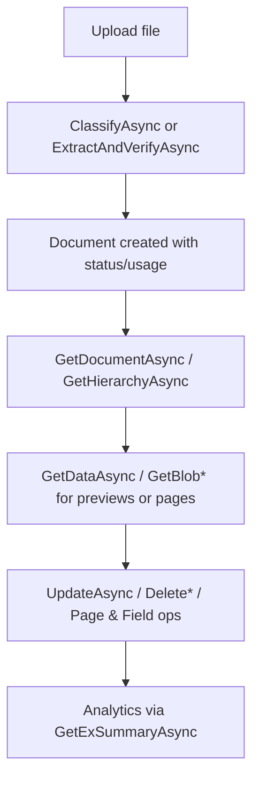

# .NET SDK — Client Reference: DocumentClient

## Overview

Use Context.DocumentClient to manage documents in AIForged: retrieve single documents, navigate hierarchies, perform structured searches, upload and classify or extract, manipulate blobs and pages, clone or bulk move, and generate reports.

- Base URL: https://portal.aiforged.com
- Authentication: Include the HTTP header X-Api-Key with your API key on all requests.

!!! info "Response wrapper"
    All client methods return a response wrapper. Access the payload via the Result property on the returned PortalResponse<T> (or PortalResponse for non-generic responses). Some methods return FileResponse.

## Prerequisites

1. Install the SDK.

    ```bash
    dotnet add package AIForged.SDK
    ```

1. Initialize the SDK context and authenticate.

    ```csharp
    using AIForged.API;

    var baseUrl = Environment.GetEnvironmentVariable("AIFORGED_BASE_URL") ?? "https://portal.aiforged.com";
    var apiKey  = Environment.GetEnvironmentVariable("AIFORGED_API_KEY")  ?? throw new Exception("AIFORGED_API_KEY not set.");

    var cfg = new Config { BaseUrl = baseUrl, Timeout = TimeSpan.FromMinutes(5) };
    await cfg.Init();

    // API key authentication
    cfg.HttpClient.DefaultRequestHeaders.Add("X-Api-Key", apiKey);

    var ctx = new Context(cfg);

    // Optional connectivity check
    var me = await ctx.GetCurrentUserAsync();
    ```

!!! tip "Usage pattern"
    Access the client via the context: var docs = ctx.DocumentClient; Then call the methods documented below.

## Error handling

- Errors surface as SwaggerException.
- Not found is returned as HTTP 404 (inspect ex.StatusCode == 404).

### Read and hierarchy

Get a document by ID

```csharp
// Signature
Task<PortalResponse<DocumentViewModel>> GetDocumentAsync(int? id);
Task<PortalResponse<DocumentViewModel>> GetDocumentAsync(int? id, CancellationToken cancellationToken);

// Example
var resp = await ctx.DocumentClient.GetDocumentAsync(123);
var doc  = resp.Result;
```

Get the topmost root document by ID

```csharp
Task<PortalResponse<DocumentViewModel>> GetRootAsync(int? id);
Task<PortalResponse<DocumentViewModel>> GetRootAsync(int? id, CancellationToken cancellationToken);
```

Get a document and its related documents (hierarchy)

```csharp
Task<PortalResponse<DocumentViewModel>> GetHierarchyAsync(int? id);
Task<PortalResponse<DocumentViewModel>> GetHierarchyAsync(int? id, CancellationToken cancellationToken);
```

Get hierarchies for all documents in a project/service

```csharp
Task<PortalResponse<ObservableCollection<DocumentViewModel>>> GetAllHierarchyAsync(
    int? projectId,
    int? serviceId,
    int? depth,
    UsageType? usage,
    List<DocumentStatus> statuses,
    DateTime? startDate,
    DateTime? endDate,
    int? pageSize,
    int? pageNo
);

Task<PortalResponse<ObservableCollection<DocumentViewModel>>> GetAllHierarchyAsync(
    int? projectId,
    int? serviceId,
    int? depth,
    UsageType? usage,
    List<DocumentStatus> statuses,
    DateTime? startDate,
    DateTime? endDate,
    int? pageSize,
    int? pageNo,
    CancellationToken cancellationToken
);
```

### Update and delete

Update a document

```csharp
Task<PortalResponse<DocumentViewModel>> UpdateAsync(DocumentViewModel document);
Task<PortalResponse<DocumentViewModel>> UpdateAsync(DocumentViewModel document, CancellationToken cancellationToken);

// Example
doc.Comment = "Reviewed";
var updated = await ctx.DocumentClient.UpdateAsync(doc);
```

Delete a document by ID

```csharp
Task<PortalResponse<DocumentViewModel>> DeleteAsync(int? id, bool? recursive, bool? includeTraining, bool? forceHardDelete);
Task<PortalResponse<DocumentViewModel>> DeleteAsync(int? id, bool? recursive, bool? includeTraining, bool? forceHardDelete, CancellationToken cancellationToken);
```

Delete multiple documents

```csharp
Task<PortalResponse<ObservableCollection<DocumentViewModel>>> DeleteMultiAsync(List<int> ids);
Task<PortalResponse<ObservableCollection<DocumentViewModel>>> DeleteMultiAsync(List<int> ids, CancellationToken cancellationToken);
```

Undelete a document by ID

```csharp
Task<PortalResponse<DocumentViewModel>> UnDeleteAsync(int? id, DocumentStatus? newstatus, UsageType? usagefilter, bool? recursive);
Task<PortalResponse<DocumentViewModel>> UnDeleteAsync(int? id, DocumentStatus? newstatus, UsageType? usagefilter, bool? recursive, CancellationToken cancellationToken);
```

### Copy, move, clone, and bulk operations

Copy documents to another project/service and set status/usage

```csharp
Task<PortalResponse<ObservableCollection<DocumentViewModel>>> CopyAsync(
    int? projectId,
    int? stpdId,
    DocumentStatus? status,
    UsageType? usage,
    bool? includeAllData,
    List<int> docIds
);

Task<PortalResponse<ObservableCollection<DocumentViewModel>>> CopyAsync(
    int? projectId,
    int? stpdId,
    DocumentStatus? status,
    UsageType? usage,
    bool? includeAllData,
    List<int> docIds,
    CancellationToken cancellationToken
);
```

Move documents to another project/service

```csharp
Task<PortalResponse<ObservableCollection<DocumentViewModel>>> MoveAsync(
    int? projectId,
    int? toStpdId,
    DocumentStatus? toStatus,
    UsageType? toUsage,
    List<int> docIds
);

Task<PortalResponse<ObservableCollection<DocumentViewModel>>> MoveAsync(
    int? projectId,
    int? toStpdId,
    DocumentStatus? toStatus,
    UsageType? toUsage,
    List<int> docIds,
    CancellationToken cancellationToken
);
```

Bulk copy by status/usage between services

```csharp
Task<PortalResponse<int>> BulkCopyAsync(
    int? projectFromId,
    int? stpdIdFrom,
    DocumentStatus? statusFrom,
    UsageType? usageFrom,
    int? projectToId,
    int? stpdIdTo,
    DocumentStatus? statusTo,
    UsageType? usageTo,
    bool? includeAllData
);

Task<PortalResponse<int>> BulkCopyAsync(..., CancellationToken cancellationToken);
```

Bulk update by status/usage

```csharp
Task<PortalResponse<int>> BulkUpdateAsync(
    int? projectId,
    int? stpdIdFrom,
    DocumentStatus? statusFrom,
    UsageType? usageFrom,
    DocumentStatus? statusTo,
    UsageType? usageTo
);

Task<PortalResponse<int>> BulkUpdateAsync(..., CancellationToken cancellationToken);
```

Bulk move by status/usage between services

```csharp
Task<PortalResponse<int>> BulkMoveAsync(
    int? projectFromId,
    int? stpdIdFrom,
    DocumentStatus? statusFrom,
    UsageType? usageFrom,
    int? projectToId,
    int? stpdIdTo,
    DocumentStatus? statusTo,
    UsageType? usageTo
);

Task<PortalResponse<int>> BulkMoveAsync(..., CancellationToken cancellationToken);
```

Bulk change document classes by status/usage

```csharp
Task<PortalResponse<int>> BulkClassChangeAsync(
    int? projectId,
    int? stpdIdFrom,
    DocumentStatus? statusFrom,
    UsageType? usageFrom,
    int? fromClassId,
    int? toClassId
);

Task<PortalResponse<int>> BulkClassChangeAsync(..., CancellationToken cancellationToken);
```

Clone for training or general clone

```csharp
// Clone a processed document for training
Task<PortalResponse<DocumentViewModel>> CloneForTrainingAsync(int? docId);
Task<PortalResponse<DocumentViewModel>> CloneForTrainingAsync(int? docId, CancellationToken cancellationToken);

// Clone a document (options for destination and recursion)
Task<PortalResponse<ObservableCollection<DocumentViewModel>>> CloneAsync(
    int? docId,
    string filename,
    int? projectId,
    int? serviceId,
    int? classId,
    int? masterId,
    bool? recursive,
    bool? parameters
);
Task<PortalResponse<ObservableCollection<DocumentViewModel>>> CloneAsync(..., CancellationToken cancellationToken);
```

### Classification and extraction uploads

Upload and classify a document

```csharp
Task<PortalResponse<DocumentViewModel>> ClassifyAsync(
    int? stpdId,
    int? projectId,
    int? masterId,
    string comment,
    string externalId,
    string result,
    string resultId,
    int? resultIndex,
    Guid? guid,
    FileParameter file
);

Task<PortalResponse<DocumentViewModel>> ClassifyAsync(..., CancellationToken cancellationToken);
```

Upload and extract information for verification

```csharp
Task<PortalResponse<DocumentViewModel>> ExtractAndVerifyAsync(
    int? stpdId,
    int? projectId,
    int? masterId,
    string comment,
    string externalId,
    string result,
    string resultId,
    int? resultIndex,
    Guid? guid,
    FileParameter file
);

Task<PortalResponse<DocumentViewModel>> ExtractAndVerifyAsync(..., CancellationToken cancellationToken);
```

Get a document classification

```csharp
Task<PortalResponse<ClassesViewModel>> GetClassificationAsync(int? stpdId, int? projectId, int? docId);
Task<PortalResponse<ClassesViewModel>> GetClassificationAsync(int? stpdId, int? projectId, int? docId, CancellationToken cancellationToken);
```

### Search and analytics

Structured search (paged)

```csharp
Task<PortalResponse<ObservableCollection<DocumentViewModel>>> GetExtendedAsync(
    string userId,
    int? projectId,
    int? stpdId,
    UsageType? usage,
    List<DocumentStatus> statuses,
    string classname,
    string filename,
    string filetype,
    DateTime? start,
    DateTime? end,
    int? masterid,
    List<ParameterDefinitionCategory?> includeparamdefcategories,
    int? pageNo,
    int? pageSize,
    SortField? sortField,
    SortDirection? sortDirection,
    string comment,
    string result,
    string resultId,
    int? resultIndex,
    string externalId,
    string docGuid,
    int? classId,
    int? id
);

Task<PortalResponse<ObservableCollection<DocumentViewModel>>> GetExtendedAsync(..., CancellationToken cancellationToken);
```

Structured search count (for paging)

```csharp
Task<PortalResponse<int>> GetExtendedCountAsync(
    string userId,
    int? projectId,
    int? stpdId,
    UsageType? usage,
    List<DocumentStatus> statuses,
    string classname,
    string filename,
    string filetype,
    DateTime? start,
    DateTime? end,
    int? masterid,
    string comment,
    string result,
    string resultId,
    int? resultIndex,
    string externalId,
    string docGuid,
    int? id
);

Task<PortalResponse<int>> GetExtendedCountAsync(..., CancellationToken cancellationToken);
```

Analytics summary

```csharp
Task<PortalResponse<ObservableCollection<DocumentsSummary>>> GetExSummaryAsync(
    string userId,
    int? projectId,
    int? stpdId,
    UsageType? usage,
    List<DocumentStatus> statuses,
    string classname,
    int? masterid,
    TimeSpan? interval,
    bool? getLabelledStats
);

Task<PortalResponse<ObservableCollection<DocumentsSummary>>> GetExSummaryAsync(..., CancellationToken cancellationToken);
```

### Upload and store

Upload multiple documents (multipart form)

```csharp
Task<PortalResponse<ObservableCollection<DocumentViewModel>>> UploadAsync(
    int? stpdId,
    string userId,
    int? projectId,
    int? classId,
    DocumentStatus? status,
    UsageType? usage,
    int? masterid,
    string comment,
    string externalId,
    string result,
    string resultId,
    int? resultIndex,
    Guid? guid,
    List<object> data
);

Task<PortalResponse<ObservableCollection<DocumentViewModel>>> UploadAsync(..., CancellationToken cancellationToken);
```

Upload a single file

```csharp
Task<PortalResponse<ObservableCollection<DocumentViewModel>>> UploadFileAsync(
    int? stpdId,
    string userId,
    int? projectId,
    int? classId,
    DocumentStatus? status,
    UsageType? usage,
    int? masterid,
    string comment,
    string externalId,
    string result,
    string resultId,
    int? resultIndex,
    Guid? guid,
    FileParameter file
);

Task<PortalResponse<ObservableCollection<DocumentViewModel>>> UploadFileAsync(..., CancellationToken cancellationToken);
```

Store structured documents and data blobs

```csharp
Task<PortalResponse<ObservableCollection<DocumentViewModel>>> StoreAsync(
    int? stpdId,
    string userId,
    int? projectId,
    int? masterid,
    List<DocumentViewModel> docs
);

Task<PortalResponse<ObservableCollection<DocumentViewModel>>> StoreAsync(..., CancellationToken cancellationToken);
```

### Blobs, pages, and fields

Get document images/data

```csharp
Task<PortalResponse<ObservableCollection<DocumentDataViewModel>>> GetDataAsync(
    int? id,
    List<DocumentDataType?> types,
    string contentType,
    string text,
    int? blobid,
    int? pageindex,
    int? imagesCount
);

Task<PortalResponse<ObservableCollection<DocumentDataViewModel>>> GetDataAsync(..., CancellationToken cancellationToken);
```

Get system document(s)

```csharp
Task<PortalResponse<DocumentDataViewModel>> GetSystemDocumentAsync(string filename);
Task<PortalResponse<DocumentDataViewModel>> GetSystemDocumentAsync(string filename, CancellationToken cancellationToken);

Task<PortalResponse<ObservableCollection<DocumentDataViewModel>>> GetSystemDocumentsAsync(
    string pattern,
    string filetype,
    string contenttype,
    List<DocumentStatus> statuses,
    int? masterId
);

Task<PortalResponse<ObservableCollection<DocumentDataViewModel>>> GetSystemDocumentsAsync(..., CancellationToken cancellationToken);
```

Download blobs

```csharp
Task<PortalResponse> GetBlobAsync(string userId, int? id, List<DocumentDataType?> types);
Task<PortalResponse> GetBlobAsync(string userId, int? id, List<DocumentDataType?> types, CancellationToken cancellationToken);

Task<PortalResponse> GetBlobByIdAsync(int? id);
Task<PortalResponse> GetBlobByIdAsync(int? id, CancellationToken cancellationToken);
```

Update and delete blobs

```csharp
Task<FileResponse> UpdateBlobAsync(string userId, DocumentDataViewModel data);
Task<FileResponse> UpdateBlobAsync(string userId, DocumentDataViewModel data, CancellationToken cancellationToken);

Task<PortalResponse> DeleteBlobAsync(int? id);
Task<PortalResponse> DeleteBlobAsync(int? id, CancellationToken cancellationToken);
```

Delete pages and fields

```csharp
// Delete specific pages (optionally create/affect child docs)
Task<PortalResponse<DocumentDataViewModel>> DeletePagesAsync(
    int? id,
    UsageType? childUsage,
    DocumentStatus? childStatus,
    OperationOption? childDeleteOptions,
    List<int> pageIndexes
);
Task<PortalResponse<DocumentDataViewModel>> DeletePagesAsync(..., CancellationToken cancellationToken);

// Delete all fields on a page
Task<PortalResponse> DeleteFieldsOnPageAsync(int? id, int? pageIndex);
Task<PortalResponse> DeleteFieldsOnPageAsync(int? id, int? pageIndex, CancellationToken cancellationToken);

// Move fields to another page
Task<PortalResponse> ChangeFieldPageIndexAsync(int? id, int? fromPageIndex, int? toPageIndex);
Task<PortalResponse> ChangeFieldPageIndexAsync(int? id, int? fromPageIndex, int? toPageIndex, CancellationToken cancellationToken);

// Change field verification page index
Task<PortalResponse> SetFieldPageVerificationIndexAsync(int? id, int? fromPageIndex, int? toPageIndex);
Task<PortalResponse> SetFieldPageVerificationIndexAsync(int? id, int? fromPageIndex, int? toPageIndex, CancellationToken cancellationToken);
```

### Training, reports, previews, and fixes

Training report for a document

```csharp
Task<PortalResponse<ObservableCollection<DocumentViewModel>>> GetTrainingReportAsync(int? id);
Task<PortalResponse<ObservableCollection<DocumentViewModel>>> GetTrainingReportAsync(int? id, CancellationToken cancellationToken);
```

Fix page verification indexes

```csharp
Task<PortalResponse<ObservableCollection<DocumentViewModel>>> FixPageVerificationIndexAsync(int? id);
Task<PortalResponse<ObservableCollection<DocumentViewModel>>> FixPageVerificationIndexAsync(int? id, CancellationToken cancellationToken);
```

Find latest child documents to assist verification

```csharp
Task<PortalResponse<ObservableCollection<DocumentViewModel>>> FindLatestChildAsync(
    string userId,
    int? projectId,
    int? stpdId,
    UsageType? usage,
    List<DocumentStatus> statuses,
    string filename,
    string classname,
    int? masterid
);

Task<PortalResponse<ObservableCollection<DocumentViewModel>>> FindLatestChildAsync(..., CancellationToken cancellationToken);
```

Get preview documents/images for a service

```csharp
Task<PortalResponse<ObservableCollection<DocumentViewModel>>> GetPreviewsAsync(string userId, int? projectId, int? stpdId);
Task<PortalResponse<ObservableCollection<DocumentViewModel>>> GetPreviewsAsync(string userId, int? projectId, int? stpdId, CancellationToken cancellationToken);
```

### Merge to PDF by category

Merge multiple image documents into a single PDF for a specified category.

```csharp
Task<PortalResponse<DocumentDataViewModel>> MergeToPdfForCategoryAsync(
    int? projectId,
    int? serviceId,
    int? masterDocId,
    List<int> docsToMergeIds,
    int? classId,
    string mergToPdfPageSplit,
    bool? mergeGroupIntoSingleCategory
);

Task<PortalResponse<DocumentDataViewModel>> MergeToPdfForCategoryAsync(..., CancellationToken cancellationToken);
```

### Examples

Upload and classify a document

```csharp
var response = await ctx.DocumentClient.ClassifyAsync(
    stpdId: 2001,
    projectId: 1001,
    masterId: null,
    comment: "Intake",
    externalId: "EXT-123",
    result: null,
    resultId: null,
    resultIndex: null,
    guid: Guid.NewGuid(),
    file: new FileParameter(stream: File.OpenRead("invoice.pdf"), fileName: "invoice.pdf")
);

var classified = response.Result;
```

Structured search with paging

```csharp
var statuses = new List<DocumentStatus> { DocumentStatus.Processed, DocumentStatus.Verified }; // Example statuses (values must exist in your environment)
var page = await ctx.DocumentClient.GetExtendedAsync(
    userId: "user-123",
    projectId: 1001,
    stpdId: 2001,
    usage: UsageType.Outbox,
    statuses: statuses,
    classname: null,
    filename: null,
    filetype: null,
    start: DateTime.UtcNow.AddDays(-7),
    end: DateTime.UtcNow,
    masterid: null,
    includeparamdefcategories: null,
    pageNo: 1,
    pageSize: 50,
    sortField: SortField.Date,
    sortDirection: SortDirection.Descending,
    comment: null,
    result: null,
    resultId: null,
    resultIndex: null,
    externalId: null,
    docGuid: null,
    classId: null,
    id: null
);

var docs = page.Result;
```

Download a blob by ID

```csharp
var blob = await ctx.DocumentClient.GetBlobByIdAsync(id: 789);
// The actual file retrieval semantics are encapsulated in PortalResponse.
```

!!! tip "Verify inputs"
    When filtering by lists such as statuses or includeparamdefcategories, ensure the enums and values exist in your environment.

### Reference flow



## Models

### DocumentViewModel

```csharp
public partial class DocumentViewModel : AIForged.API.BindableBase
{
    public int Id { get; set; }
    public string UserId { get; set; }
    public int ProjectId { get; set; }
    public int ServiceId { get; set; }
    public DocumentStatus Status { get; set; }
    public UsageType Usage { get; set; }
    public int? ClassId { get; set; }
    public string ContentType { get; set; }
    public string Filename { get; set; }
    public string FileType { get; set; }
    public DateTime DTC { get; set; }
    public DateTime DTM { get; set; }
    public Guid? DocumentId { get; set; }
    public string ExternalId { get; set; }
    public int? MasterId { get; set; }
    public string Result { get; set; }
    public string ResultId { get; set; }
    public int? ResultIndex { get; set; }
    public string Comment { get; set; }
    public Availability? Availability { get; set; }
    public ObservableCollection<DocumentParameterViewModel> ResultParameters { get; set; }
    public ObservableCollection<DocumentDataViewModel> Data { get; set; }
    public ObservableCollection<DocumentViewModel> Documents { get; set; }
    public ObservableCollection<string> Info { get; set; }
    public DocumentStatus? LatestChildStatus { get; set; }
    public int? OriginId { get; set; }
    public bool CanVerify { get; set; }
    public bool CanClassify { get; set; }
    public bool CanTrain { get; set; }
    public bool Trained { get; set; }
    public int? LinkedDocsCount { get; set; }
    public int? TrainingFieldCount { get; set; }
    public int? TrainedParametersCount { get; set; }
}
```

### DocumentParameterViewModel

```csharp
public partial class DocumentParameterViewModel : AIForged.API.BindableBase
{
    public int Id { get; set; }
    public int DocumentId { get; set; }
    public int? ParamDefId { get; set; }
    public int? ParentId { get; set; }
    public int? SourceId { get; set; }
    public string Value { get; set; }
    public byte[] Data { get; set; }
    public int? Index { get; set; }
    public int? ColIndex { get; set; }
    public int? ColSpan { get; set; }
    public int? RowIndex { get; set; }
    public int? RowSpan { get; set; }
    public Availability? Availability { get; set; }
    public ParameterDefViewModel ParamDef { get; set; }
    public ObservableCollection<DocumentParameterViewModel> Children { get; set; }
    public ObservableCollection<VerificationViewModel> Verifications { get; set; }
}
```

### VerificationViewModel

```csharp
public partial class VerificationViewModel : AIForged.API.BindableBase
{
    public int Id { get; set; }
    public int ParameterId { get; set; }
    public string UserId { get; set; }
    public string Value { get; set; }
    public DateTime DT { get; set; }
    public float? Confidence { get; set; }
    public string SymbolsConfidence { get; set; }
    public VerificationType Type { get; set; }
    public VerificationStatus Status { get; set; }
    public string Result { get; set; }
    public string Box { get; set; }
    public string Info { get; set; }
    public byte[] Data { get; set; }
    public string UserName { get; set; }
    public int? ServiceId { get; set; }
    public int? ServiceDocId { get; set; }
    public string Provider { get; set; }
    public int? SettingId { get; set; }
    public int? WorkItem { get; set; }
    public int? TransactionId { get; set; }
    public int? ReferenceDocId { get; set; }
    public int? ReferenceParamId { get; set; }
    public int? ReferenceDefId { get; set; }
    public decimal Charge { get; set; }
}
```

### DocumentDataViewModel

```csharp
public partial class DocumentDataViewModel : AIForged.API.BindableBase
{
    public int Id { get; set; }
    public int DocumentId { get; set; }
    public int? BlobId { get; set; }
    public DocumentDataType? Type { get; set; }
    public byte[] Data { get; set; }
    public byte[] Preview { get; set; }
    public string Text { get; set; }
    public string Info { get; set; }
    public string ContentType { get; set; }
    public string ResultId { get; set; }
    public int? Index { get; set; }
    public double? Width { get; set; }
    public double? Height { get; set; }
    public double? Resolution { get; set; }
    public Availability? Availability { get; set; }
}
```

## Enums

```csharp
public enum DocumentDataType
{
    Image = 0,
    Result = 1,
    Page = 2,
    Backup = 3,
    Definition = 10,
    Training = 11
}

[System.Flags]
public enum VerificationStatus
{
    Required = 1,
    Suspicious = 2,
    DefaultUsed = 4,
    Verified = 8,
    Bypassed = 16,
    Error = 32,
    Done = 64,
    Success = 128,
    RangeProblem = 256,
    IsValid = 512,
    Warnings = 1024,
    Service = 2048,
    Training = 4096,
    Scripted = 8192,
    Deleted = 16384,
    Abort = 32768
}

public enum VerificationType
{
    None = 0,
    Provider = 1,
    System = 2,
    User = 3,
    Service = 4,
    Training = 5,
    RPA = 6,
    API = 7,
    DataSet = 8
}
```

## Troubleshooting

- 404 on read/update/delete:
    - Indicates the resource was not found. Catch SwaggerException and check StatusCode.
- Paged and filtered queries:
    - Ensure date ranges and enums are valid and that pageNo/pageSize are set as intended.
