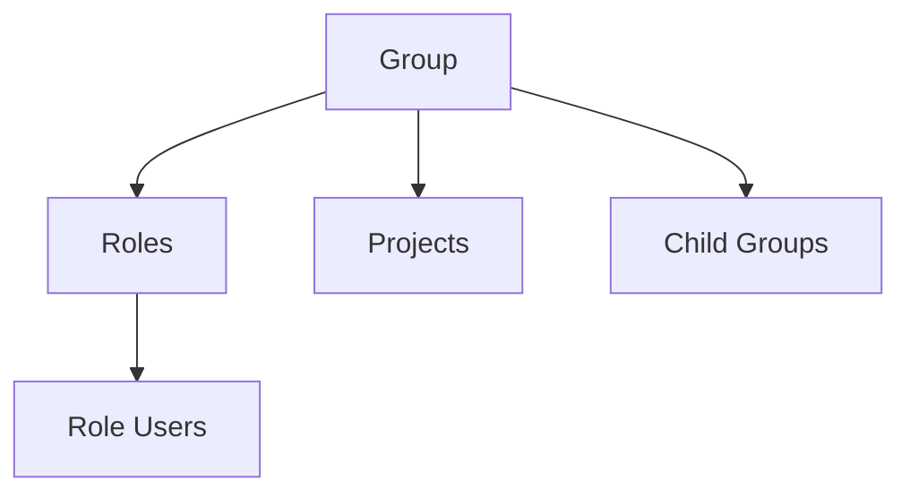

# .NET SDK — Client Reference: GroupClient

Overview

Use Context.GroupClient to manage Organisations, Tenants, Groups, Roles, and Members in AIForged. This reference covers reading groups, creating/updating/deleting groups, and managing roles and role members.

- Get groups by ID, user, tenant, or tenant user.
- Create, update, and delete groups.
- Manage roles (create, copy, consolidate, update, delete) and list users assigned to roles.

!!! info "Authentication and endpoint"
    - Base URL: https://portal.aiforged.com
    - Authentication: include the HTTP header X-Api-Key with your API key on all requests.

## Prerequisites

1. Install the SDK.

    ```bash
    dotnet add package AIForged.SDK
    ```

1. Initialize the context with API key authentication.

    ```csharp
    using AIForged.API;

    var baseUrl = Environment.GetEnvironmentVariable("AIFORGED_BASE_URL") ?? "https://portal.aiforged.com";
    var apiKey  = Environment.GetEnvironmentVariable("AIFORGED_API_KEY")  ?? throw new Exception("AIFORGED_API_KEY not set.");

    var cfg = new Config { BaseUrl = baseUrl, Timeout = TimeSpan.FromMinutes(5) };
    await cfg.Init();
    cfg.HttpClient.DefaultRequestHeaders.Add("X-Api-Key", apiKey);

    var ctx = new Context(cfg);

    // Access the client
    var groups = ctx.GroupClient;
    ```

!!! tip "Connection check"
    After initialization, call a lightweight endpoint such as:
    
    ```csharp
    await ctx.GetCurrentUserAsync();
    ```
    
    to verify connectivity and credentials.

## Methods

### Get group by ID

```csharp
System.Threading.Tasks.Task<PortalResponse<GroupViewModel>> GetAsync(int? id, bool? includeUsers);
System.Threading.Tasks.Task<PortalResponse<GroupViewModel>> GetAsync(int? id, bool? includeUsers, System.Threading.CancellationToken cancellationToken);
```

- Parameters:
    - id: Group identifier.
    - includeUsers: When true, role membership collections are populated (see note below).

```csharp
var resp = await ctx.GroupClient.GetAsync(id: 101, includeUsers: true);
var group = resp.Result;
```

!!! note "includeUsers behavior"
    When includeUsers is true, the Users property on GroupRoleViewModel instances in the returned object graph is populated.

### Get groups by user

```csharp
System.Threading.Tasks.Task<PortalResponse<System.Collections.ObjectModel.ObservableCollection<GroupViewModel>>> GetByUserAsync(string userId, bool? includeUsers);
System.Threading.Tasks.Task<PortalResponse<System.Collections.ObjectModel.ObservableCollection<GroupViewModel>>> GetByUserAsync(string userId, bool? includeUsers, System.Threading.CancellationToken cancellationToken);
```

```csharp
var resp = await ctx.GroupClient.GetByUserAsync(userId: "user-123", includeUsers: false);
var userGroups = resp.Result;
```

### Get groups by tenant

```csharp
System.Threading.Tasks.Task<PortalResponse<System.Collections.ObjectModel.ObservableCollection<GroupViewModel>>> GetByTenantAsync(int? tenantId);
System.Threading.Tasks.Task<PortalResponse<System.Collections.ObjectModel.ObservableCollection<GroupViewModel>>> GetByTenantAsync(int? tenantId, System.Threading.CancellationToken cancellationToken);
```

```csharp
var resp = await ctx.GroupClient.GetByTenantAsync(tenantId: 42);
var tenantGroups = resp.Result;
```

### Get groups by tenant user

```csharp
System.Threading.Tasks.Task<PortalResponse<System.Collections.ObjectModel.ObservableCollection<GroupViewModel>>> GetByTenantUserAsync(string userId);
System.Threading.Tasks.Task<PortalResponse<System.Collections.ObjectModel.ObservableCollection<GroupViewModel>>> GetByTenantUserAsync(string userId, System.Threading.CancellationToken cancellationToken);
```

```csharp
var resp = await ctx.GroupClient.GetByTenantUserAsync(userId: "user-123");
var tenantUserGroups = resp.Result;
```

### Create a group

```csharp
System.Threading.Tasks.Task<PortalResponse<GroupViewModel>> CreateAsync(GroupViewModel group);
System.Threading.Tasks.Task<PortalResponse<GroupViewModel>> CreateAsync(GroupViewModel group, System.Threading.CancellationToken cancellationToken);
```

```csharp
var newGroup = new GroupViewModel
{
    UserId = "owner-user-id",
    Name = "Finance",
    Type = GroupType.Tenant,
    Status = GroupStatus.Active
};

var created = await ctx.GroupClient.CreateAsync(newGroup);
var group = created.Result;
```

### Update a group

```csharp
System.Threading.Tasks.Task<PortalResponse<GroupViewModel>> UpdateAsync(GroupViewModel group);
System.Threading.Tasks.Task<PortalResponse<GroupViewModel>> UpdateAsync(GroupViewModel group, System.Threading.CancellationToken cancellationToken);
```

```csharp
var g = (await ctx.GroupClient.GetAsync(101, includeUsers: false)).Result;
g.Name = "Finance & Operations";
var updated = await ctx.GroupClient.UpdateAsync(g);
```

### Delete a group

```csharp
System.Threading.Tasks.Task<PortalResponse<GroupViewModel>> DeleteAsync(int? id);
System.Threading.Tasks.Task<PortalResponse<GroupViewModel>> DeleteAsync(int? id, System.Threading.CancellationToken cancellationToken);
```

```csharp
var deleted = await ctx.GroupClient.DeleteAsync(101);
```

!!! warning "404 handling"
    If a resource is not found, the server returns HTTP 404 via SwaggerException. Always use try/catch and inspect ex.StatusCode when deleting or reading by ID.

### Get roles in a group

```csharp
System.Threading.Tasks.Task<PortalResponse<System.Collections.ObjectModel.ObservableCollection<GroupRoleViewModel>>> GetRolesAsync(int? groupId, GroupRoleType? type, bool? includeUsers);
System.Threading.Tasks.Task<PortalResponse<System.Collections.ObjectModel.ObservableCollection<GroupRoleViewModel>>> GetRolesAsync(int? groupId, GroupRoleType? type, bool? includeUsers, System.Threading.CancellationToken cancellationToken);
```

```csharp
var roles = (await ctx.GroupClient.GetRolesAsync(groupId: group.Id, type: null, includeUsers: true)).Result;
```

!!! note "includeUsers behavior"
    For GetRolesAsync, includeUsers=true ensures the Users property on each returned GroupRoleViewModel is populated.

### Get users for a role

```csharp
System.Threading.Tasks.Task<PortalResponse<System.Collections.ObjectModel.ObservableCollection<GroupRoleUserViewModel>>> GetUsersByRoleAsync(int? roleId);
System.Threading.Tasks.Task<PortalResponse<System.Collections.ObjectModel.ObservableCollection<GroupRoleUserViewModel>>> GetUsersByRoleAsync(int? roleId, System.Threading.CancellationToken cancellationToken);
```

```csharp
var roleUsers = (await ctx.GroupClient.GetUsersByRoleAsync(roleId: 555)).Result;
```

### Create a role

```csharp
System.Threading.Tasks.Task<PortalResponse<GroupRoleViewModel>> CreateRoleAsync(GroupRoleViewModel grouprole);
System.Threading.Tasks.Task<PortalResponse<GroupRoleViewModel>> CreateRoleAsync(GroupRoleViewModel grouprole, System.Threading.CancellationToken cancellationToken);
```

```csharp
var role = new GroupRoleViewModel
{
    GroupId = group.Id,
    Name = "Project Administrators",
    Type = GroupRoleType.Administrator | GroupRoleType.Projects,
    Status = GroupRoleStatus.Active
};

var createdRole = await ctx.GroupClient.CreateRoleAsync(role);
```

!!! tip "Compose permissions"
    GroupRoleType is a flags enum. Combine permissions with bitwise OR:
    
    ```csharp
    var flags = GroupRoleType.Administrator | GroupRoleType.Projects | GroupRoleType.Download;
    ```

### Copy a role (with users) to another group

```csharp
System.Threading.Tasks.Task<PortalResponse<GroupRoleViewModel>> CopyRoleAsync(int? groupRoleId, int? toGroupId);
System.Threading.Tasks.Task<PortalResponse<GroupRoleViewModel>> CopyRoleAsync(int? groupRoleId, int? toGroupId, System.Threading.CancellationToken cancellationToken);
```

```csharp
var copied = await ctx.GroupClient.CopyRoleAsync(groupRoleId: 777, toGroupId: 202);
```

### Consolidate roles

```csharp
System.Threading.Tasks.Task<PortalResponse<GroupRoleViewModel>> ConsolidateRolesAsync(int? groupId, int? projectId, System.Collections.Generic.List<int> groupRoleIds);
System.Threading.Tasks.Task<PortalResponse<GroupRoleViewModel>> ConsolidateRolesAsync(int? groupId, int? projectId, System.Collections.Generic.List<int> groupRoleIds, System.Threading.CancellationToken cancellationToken);
```

```csharp
var consolidated = await ctx.GroupClient.ConsolidateRolesAsync(
    groupId: group.Id,
    projectId: null,
    groupRoleIds: new List<int> { 101, 102, 103 }
);
```

### Update a role

```csharp
System.Threading.Tasks.Task<PortalResponse<GroupRoleViewModel>> UpdateRoleAsync(GroupRoleViewModel grouprole);
System.Threading.Tasks.Task<PortalResponse<GroupRoleViewModel>> UpdateRoleAsync(GroupRoleViewModel grouprole, System.Threading.CancellationToken cancellationToken);
```

```csharp
var r = createdRole.Result;
r.Name = "Project Admins";
var updatedRole = await ctx.GroupClient.UpdateRoleAsync(r);
```

### Delete a role

```csharp
System.Threading.Tasks.Task<PortalResponse<GroupRoleViewModel>> DeleteRoleAsync(int id);
System.Threading.Tasks.Task<PortalResponse<GroupRoleViewModel>> DeleteRoleAsync(int id, System.Threading.CancellationToken cancellationToken);
```

```csharp
var deletedRole = await ctx.GroupClient.DeleteRoleAsync(id: 555);
```

## Models

### GroupViewModel

Represents a Group (Organisation, Tenant, Users, Billing, Partner).

| Property | Type | Notes |
| --- | --- | --- |
| Id | int |  |
| Type | GroupType |  |
| Status | GroupStatus |  |
| UserId | string | Required; [StringLength(450, MinimumLength = 1)] |
| Name | string | [StringLength(256)] |
| DTC | DateTime | UTC |
| DTM | DateTime | UTC |
| Domain | string | [StringLength(1024)] |
| TenantId | int? |  |
| Info | string |  |
| Address | string |  |
| VATNo | string |  |
| TenantName | string |  |
| UserName | string |  |
| UserFullName | string |  |
| UserDisplayName | string |  |
| IsOwner | bool |  |
| IsAdmin | bool |  |
| IsPartner | bool |  |
| Rights | string |  |
| RoleCount | int |  |
| UserCount | int |  |
| ProjectCount | int |  |
| GroupCount | int |  |
| ConsolidateCount | int |  |
| Children | ObservableCollection<GroupViewModel> |  |
| Projects | ObservableCollection<ProjectViewModel> |  |
| Roles | ObservableCollection<GroupRoleViewModel> |  |

!!! info "Timestamp convention"
    In AIForged, all timestamps are UTC. This applies to DTC and DTM across Group and GroupRole models.

### GroupRoleViewModel

Represents a role within a group, optionally scoped to a project.

| Property | Type | Notes |
| --- | --- | --- |
| Id | int |  |
| GroupId | int |  |
| ProjectId | int? |  |
| Type | GroupRoleType | Flags enum |
| Status | GroupRoleStatus |  |
| Name | string | [StringLength(256)] |
| DTC | DateTime | UTC |
| DTM | DateTime | UTC |
| Start | DateTime? |  |
| End | DateTime? |  |
| Group | GroupViewModel |  |
| Project | ProjectViewModel |  |
| Users | ObservableCollection<GroupRoleUserViewModel> | Populated when includeUsers=true |
| Related | ObservableCollection<GroupRoleViewModel> |  |
| DisplayName | string |  |

## Enums

### GroupType

```csharp
public enum GroupType
{
    Default = 0,
    Partner = 1,
    Tenant = 10,
    Billing = 11,
    Users = 12
}
```

### GroupStatus

```csharp
public enum GroupStatus
{
    Active = 0,
    Deleted = 99
}
```

### GroupRoleType

```csharp
[System.Flags]
public enum GroupRoleType
{
    Owner = 1,
    Administrator = 2,
    Partner = 4,
    User = 8,
    Projects = 32,
    Train = 256,
    Verify = 512,
    Manage = 1024,
    VerifyAdmin = 1536,
    Download = 2048,
    Delete = 4096,
    PromptDesign = 8192,
    ViewOnly = 32768,
    Document = 65536,
    VerifyDoc = 66048,
    DocDownload = 67584,
    Layout = 131072,
    DocLayout = 196608,
    DocLayoutTrain = 196864,
    Shred = 262144,
    VerifyShred = 262656,
    ViewShred = 294912,
    Billing = 524288,
    BillingAdmin = 525312,
    BillingView = 557056,
    Workflow = 1048576,
    WorkManage = 1049600,
    WorkView = 1081344,
    Rule = 2097152,
    RuleManage = 2098176,
    RuleView = 2129920,
    DataSet = 4194304,
    DataSetAdmin = 4195328,
    DataSetView = 4227072,
    Developer = 8326944
}
```

### GroupRoleStatus

```csharp
public enum GroupRoleStatus
{
    Active = 0,
    Deleted = 99
}
```

## Examples

### Create a tenant group and admin role

1. Create the group.

    ```csharp
    var tenant = (await ctx.GroupClient.CreateAsync(new GroupViewModel
    {
        UserId = "owner-user-id",
        Name = "Acme Tenant",
        Type = GroupType.Tenant,
        Status = GroupStatus.Active
    })).Result;
    ```

1. Create a role with combined permissions.

    ```csharp
    var adminRole = (await ctx.GroupClient.CreateRoleAsync(new GroupRoleViewModel
    {
        GroupId = tenant.Id,
        Name = "Tenant Admins",
        Type = GroupRoleType.Owner | GroupRoleType.Administrator | GroupRoleType.Projects,
        Status = GroupRoleStatus.Active
    })).Result;
    ```

!!! tip "Project scoping"
    To scope a role to a specific project, set GroupRoleViewModel.ProjectId before creating the role.

### List groups for a user and include role members

```csharp
var groupsForUser = (await ctx.GroupClient.GetByUserAsync("user-123", includeUsers: true)).Result;
foreach (var g in groupsForUser ?? new System.Collections.ObjectModel.ObservableCollection<GroupViewModel>())
{
    var roles = g.Roles ?? new System.Collections.ObjectModel.ObservableCollection<GroupRoleViewModel>();
    foreach (var role in roles)
    {
        var users = role.Users;
        // users is populated when includeUsers=true
    }
}
```

### Copy a role (with users) to another group

```csharp
var copiedRole = (await ctx.GroupClient.CopyRoleAsync(groupRoleId: 1234, toGroupId: 5678)).Result;
```

### Consolidate multiple roles

```csharp
var result = (await ctx.GroupClient.ConsolidateRolesAsync(
    groupId: 999,
    projectId: null,
    groupRoleIds: new System.Collections.Generic.List<int> { 200, 201, 202 }
)).Result;
```

## Reference



## Troubleshooting

- Retrieve/update/delete failures
    - Wrap calls in try/catch for SwaggerException and inspect ex.StatusCode and ex.Response.
- No users returned for roles
    - Ensure includeUsers=true on GetAsync or GetRolesAsync; otherwise, role Users collections are not populated.
- Timestamps handling
    - DTC and DTM are UTC. Convert to local time for display when needed.