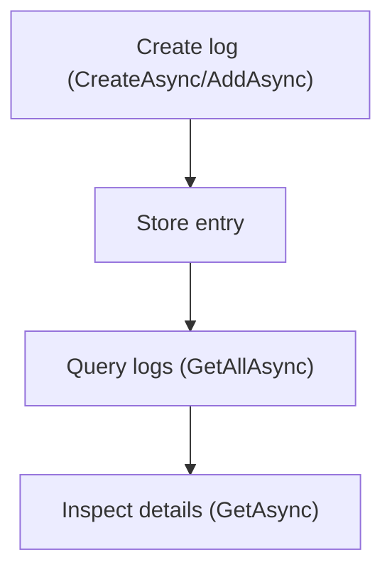

# .NET SDK — Client Reference: LogClient

Overview

Use `Context.LogClient` to record and retrieve operational, diagnostic, and audit log entries within AIForged. The client supports creating logs (by parameters or model) and querying logs by rich criteria such as project, service, document, rule/definition, parameter, verification, work item, user, and date range.

- Base URL: https://portal.aiforged.com
- Authentication: include the HTTP header `X-Api-Key` with your API key on all requests.

!!! info "Timestamps are UTC"
    All timestamp properties (for example, `DTC`) are UTC in AIForged models.

## Prerequisites

1. Install the SDK.

    ```bash
    dotnet add package AIForged.SDK
    ```

1. Initialize the SDK context and authenticate.

    ```csharp
    using AIForged.API;

    var baseUrl = Environment.GetEnvironmentVariable("AIFORGED_BASE_URL") ?? "https://portal.aiforged.com";
    var apiKey  = Environment.GetEnvironmentVariable("AIFORGED_API_KEY")  ?? throw new Exception("AIFORGED_API_KEY not set.");

    var cfg = new Config { BaseUrl = baseUrl, Timeout = TimeSpan.FromMinutes(5) };
    await cfg.Init();

    // API key authentication
    cfg.HttpClient.DefaultRequestHeaders.Add("X-Api-Key", apiKey);

    var ctx = new Context(cfg);

    // Access the client
    var logs = ctx.LogClient;
    ```

!!! tip "Quick connectivity check"
    After initialization, call a lightweight endpoint such as:
    
    ```csharp
    await ctx.GetCurrentUserAsync();
    ```
    
    to verify connectivity and credentials before invoking `LogClient` methods.

## Methods

### GetAsync (by Id)

Retrieve a single log entry by its identifier.

```csharp
System.Threading.Tasks.Task<PortalResponse<LogViewModel>> GetAsync(int? id);
System.Threading.Tasks.Task<PortalResponse<LogViewModel>> GetAsync(int? id, System.Threading.CancellationToken cancellationToken);
```

- Parameters:
    - `id`: Log record id.

```csharp
try
{
    var resp = await ctx.LogClient.GetAsync(12345);
    var log  = resp.Result;
    Console.WriteLine($"{log.DTC:u} [{log.Type}] {log.Comment}");
}
catch (SwaggerException ex)
{
    Console.Error.WriteLine($"Log fetch failed. HTTP {(int)ex.StatusCode}");
    Console.Error.WriteLine(ex.Response);
}
```

!!! note "When to use"
    Use `GetAsync` after you have captured an identifier from a previous query or creation operation and need the full detail for that specific log record.

### GetAllAsync (query logs)

Query logs by multiple optional filters, including date range.

```csharp
System.Threading.Tasks.Task<PortalResponse<System.Collections.ObjectModel.ObservableCollection<LogViewModel>>> GetAllAsync(
    int? projectId,
    int? serviceId,
    int? documentId,
    int? defId,
    int? parameterId,
    int? verId,
    int? workitemId,
    string userId,
    System.DateTime? fromDate,
    System.DateTime? toDate
);

System.Threading.Tasks.Task<PortalResponse<System.Collections.ObjectModel.ObservableCollection<LogViewModel>>> GetAllAsync(
    int? projectId,
    int? serviceId,
    int? documentId,
    int? defId,
    int? parameterId,
    int? verId,
    int? workitemId,
    string userId,
    System.DateTime? fromDate,
    System.DateTime? toDate,
    System.Threading.CancellationToken cancellationToken
);
```

- Common filters:
    - `projectId`, `serviceId`: Scope logs to a project/service.
    - `documentId`: Logs related to a specific document.
    - `defId` (definition/rule), `parameterId`, `verId` (verification), `workitemId`: Narrow to specific entities.
    - `userId`: Filter by user associated with the log.
    - `fromDate`, `toDate`: UTC date-time range.

```csharp
var from = DateTime.UtcNow.AddDays(-7);
var to   = DateTime.UtcNow;

var resp = await ctx.LogClient.GetAllAsync(
    projectId: 1001,
    serviceId: 2001,
    documentId: null,
    defId: null,
    parameterId: null,
    verId: null,
    workitemId: null,
    userId: null,
    fromDate: from,
    toDate: to
);

var items = resp.Result ?? new System.Collections.ObjectModel.ObservableCollection<LogViewModel>();
foreach (var l in items)
{
    Console.WriteLine($"{l.DTC:u} [{l.Type}] {l.Comment}");
}
```

!!! tip "Filter effectively"
    Start with broad filters (for example, project, date range) and add entity-specific filters (`documentId`, `parameterId`, `verId`) to hone in on relevant entries.

### CreateAsync (parameterized)

Create a log entry by specifying individual fields.

```csharp
System.Threading.Tasks.Task<PortalResponse<LogViewModel>> CreateAsync(
    LogType? logtype,
    int? projectId,
    int? serviceId,
    int? documentId,
    string comment,
    string errorMessage,
    string stackTrace,
    int? defId,
    int? parameterId,
    int? verId,
    int? workitemId,
    int? eventId,
    int? txId,
    string page
);

System.Threading.Tasks.Task<PortalResponse<LogViewModel>> CreateAsync(
    LogType? logtype,
    int? projectId,
    int? serviceId,
    int? documentId,
    string comment,
    string errorMessage,
    string stackTrace,
    int? defId,
    int? parameterId,
    int? verId,
    int? workitemId,
    int? eventId,
    int? txId,
    string page,
    System.Threading.CancellationToken cancellationToken
);
```

- Typical usage:
    - Set `logtype` (for example, `LogType.Info`, `LogType.Error`).
    - Provide a `comment`. For error conditions, include `errorMessage` and optional `stackTrace`.
    - Include contextual IDs (project/service/document/def/parameter/verification/workitem/event/transaction) when known.
    - `page`: free-text page/context (max 256 characters).

```csharp
var created = await ctx.LogClient.CreateAsync(
    logtype: LogType.Error,
    projectId: 1001,
    serviceId: 2001,
    documentId: 3001,
    comment: "Extraction failed for document.",
    errorMessage: "NullReferenceException",
    stackTrace: "at Pipeline.StepX()...",
    defId: null,
    parameterId: null,
    verId: null,
    workitemId: null,
    eventId: null,
    txId: null,
    page: "Extraction"
);

Console.WriteLine($"Created log #{created.Result.Id} at {created.Result.DTC:u}");
```

!!! warning "Avoid sensitive data"
    Do not include secrets (API keys, passwords, private keys) in `comment`, `errorMessage`, `stackTrace`, or `page`. Logs can be widely accessible to operators.

### AddAsync (by model)

Create a log entry by posting a `LogViewModel`.

```csharp
System.Threading.Tasks.Task<PortalResponse<LogViewModel>> AddAsync(LogViewModel log);
System.Threading.Tasks.Task<PortalResponse<LogViewModel>> AddAsync(LogViewModel log, System.Threading.CancellationToken cancellationToken);
```

```csharp
var log = new LogViewModel
{
    Type = LogType.Info,
    ProjectId = 1001,
    ServiceId = 2001,
    Comment = "Dataset sync started",
    Page = "Sync"
};

var resp = await ctx.LogClient.AddAsync(log);
Console.WriteLine($"Created log #{resp.Result.Id} [{resp.Result.Type}]");
```

!!! note "Choosing between CreateAsync vs AddAsync"
    - Use `CreateAsync` when you prefer a parameterized call.
    - Use `AddAsync` when you already have a populated `LogViewModel` instance to submit.

## Models

### LogViewModel

Represents a single log entry with optional links to projects, services, documents, rules/definitions, parameters, verifications, work items, transactions, and events.

| Property | Type | Notes |
| --- | --- | --- |
| Id | int |  |
| Type | LogType? |  |
| ProjectId | int? |  |
| ServiceId | int? |  |
| DocumentId | int? |  |
| DefId | int? | Definition/rule id |
| ParameterId | int? |  |
| VerificationId | int? |  |
| WorkItemId | int? |  |
| TransactionId | int? |  |
| EventId | int? |  |
| UserId | string |  |
| DTC | DateTime | UTC |
| Comment | string |  |
| StackTrace | string |  |
| ErrorMessage | string |  |
| Page | string | [StringLength(256)] |
| Project | ProjectViewModel |  |
| Service | ParameterDefViewModel |  |
| Document | DocumentViewModel |  |
| Def | ParameterDefViewModel |  |
| Parameter | DocumentParameterViewModel |  |
| Verification | VerificationViewModel |  |
| WorkItem | WorkItemViewModel |  |
| Transaction | TransactionsAuditViewModel |  |
| Event | ServiceEventViewModel |  |

!!! tip "Correlate with entities"
    Populate the relevant `*Id` fields (for example, `DocumentId`, `ParameterId`, `WorkItemId`) so log queries can accurately correlate entries with operational entities.

### LogType

```csharp
public enum LogType
{
    Info = 0,
    Debug = 1,
    Warning = 2,
    Error = 3,
    Exception = 4,
    Critical = 5
}
```

## Usage patterns

### 1) Capture an exception

```csharp
try
{
    // Code that may throw
}
catch (Exception ex)
{
    await ctx.LogClient.CreateAsync(
        logtype: LogType.Exception,
        projectId: 1001,
        serviceId: 2001,
        documentId: null,
        comment: "Unhandled exception during processing.",
        errorMessage: ex.Message,
        stackTrace: ex.ToString(),
        defId: null,
        parameterId: null,
        verId: null,
        workitemId: null,
        eventId: null,
        txId: null,
        page: "Processing"
    );
}
```

### 2) Record an operational milestone

```csharp
await ctx.LogClient.CreateAsync(
    logtype: LogType.Info,
    projectId: 1001,
    serviceId: 2001,
    documentId: 3001,
    comment: "Verification completed successfully.",
    errorMessage: null,
    stackTrace: null,
    defId: null,
    parameterId: null,
    verId: 4001,
    workitemId: null,
    eventId: null,
    txId: null,
    page: "Verification"
);
```

### 3) Query last week’s warnings and errors for a service

```csharp
var from = DateTime.UtcNow.AddDays(-7);
var to   = DateTime.UtcNow;

var all = await ctx.LogClient.GetAllAsync(
    projectId: 1001,
    serviceId: 2001,
    documentId: null,
    defId: null,
    parameterId: null,
    verId: null,
    workitemId: null,
    userId: null,
    fromDate: from,
    toDate: to
);

var subset = (all.Result ?? new System.Collections.ObjectModel.ObservableCollection<LogViewModel>>())
    .Where(l => l.Type == LogType.Warning || l.Type == LogType.Error || l.Type == LogType.Critical || l.Type == LogType.Exception);

foreach (var l in subset)
{
    Console.WriteLine($"{l.DTC:u} [{l.Type}] {l.Comment}");
}
```

!!! warning "Date ranges are UTC"
    Use UTC when specifying `fromDate` and `toDate` to match server timestamps (`DTC`).

## Reference flow



## Troubleshooting

- Errors during calls
    - Methods raise `SwaggerException` on failure. Wrap calls in `try/catch`, inspect `ex.StatusCode` and `ex.Response` for diagnostic details.
- Empty results from `GetAllAsync`
    - Verify filter scope (project/service/document) and date range. Try removing constraints to broaden the search.
- Large result sets
    - Narrow the date window and add more specific filters (for example, `documentId`, `parameterId`, `workitemId`) to reduce payload.