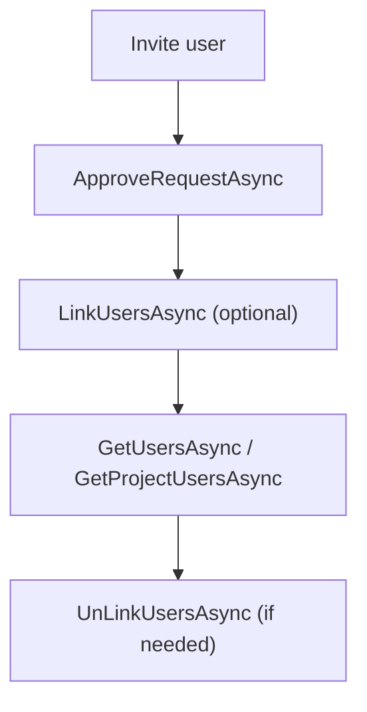

# .NET SDK — Client Reference: MarketPlaceClient

Overview

Manage member links to group roles and query which Projects (Agents) a member (user) can access. Despite its name, MarketPlaceClient handles:

- Linking/unlinking members to roles (project/service sharing).
- Approving membership requests and resending invites.
- Listing roles/users associated with projects and groups.
- Inviting new members to roles.

!!! info "Endpoint and authentication"
    - Base URL: https://portal.aiforged.com
    - Authentication header: X-Api-Key

## Prerequisites

1. Install the SDK.

    ```bash
    dotnet add package AIForged.SDK
    ```

1. Initialize context and authenticate.

    ```csharp
    using AIForged.API;

    var baseUrl = Environment.GetEnvironmentVariable("AIFORGED_BASE_URL") ?? "https://portal.aiforged.com";
    var apiKey  = Environment.GetEnvironmentVariable("AIFORGED_API_KEY")  ?? throw new Exception("AIFORGED_API_KEY not set.");

    var cfg = new Config { BaseUrl = baseUrl, Timeout = TimeSpan.FromMinutes(5) };
    await cfg.Init();
    cfg.HttpClient.DefaultRequestHeaders.Add("X-Api-Key", apiKey);

    var ctx = new Context(cfg);
    var marketplace = ctx.MarketPlaceClient;
    ```

!!! tip "Permissions required"
    You must be a tenant or group admin/owner to invite, approve, link, or unlink members.

## Methods

### ApproveRequestAsync

Approve or update a membership request for a group-role link.

```csharp
System.Threading.Tasks.Task<PortalResponse<GroupRoleViewModel>> ApproveRequestAsync(int? gruId, GroupRoleUserStatus? status);
System.Threading.Tasks.Task<PortalResponse<GroupRoleViewModel>> ApproveRequestAsync(int? gruId, GroupRoleUserStatus? status, System.Threading.CancellationToken cancellationToken);
```

- Parameters:
    - gruId: GroupRoleUserId, the link record ID to a group role.
    - status: New status to apply (see GroupRoleUserStatus).

```csharp
try
{
    var resp = await marketplace.ApproveRequestAsync(gruId: 12345, status: GroupRoleUserStatus.Approved);
    var updatedRole = resp.Result;
    Console.WriteLine($"Approved link; role id: {updatedRole.Id}");
}
catch (SwaggerException ex)
{
    Console.Error.WriteLine($"Approve failed: HTTP {(int)ex.StatusCode}");
    Console.Error.WriteLine(ex.Response);
}
```

!!! note "gruId meaning"
    gruId = GroupRoleUserId. It is the membership link ID to a Group Role.

### LinkUsersAsync

Link (share) users to a project/service group role.

```csharp
System.Threading.Tasks.Task<PortalResponse<System.Collections.ObjectModel.ObservableCollection<GroupRoleViewModel>>> LinkUsersAsync(string userId, int? roleId, System.Collections.Generic.List<string> otherUserIds);
System.Threading.Tasks.Task<PortalResponse<System.Collections.ObjectModel.ObservableCollection<GroupRoleViewModel>>> LinkUsersAsync(string userId, int? roleId, System.Collections.Generic.List<string> otherUserIds, System.Threading.CancellationToken cancellationToken);
```

- Parameters:
    - userId: Acting user’s ID.
    - roleId: Target group role ID to assign.
    - otherUserIds: List of user IDs to link.

```csharp
var linked = await marketplace.LinkUsersAsync(
    userId: "owner-user-id",
    roleId: 9876,
    otherUserIds: new System.Collections.Generic.List<string> { "user-a", "user-b" }
);
Console.WriteLine($"Affected roles: {linked.Result?.Count}");
```

!!! tip "Batch linking"
    Provide multiple user IDs in otherUserIds to link several members to the same role in one call.

### UnLinkUsersAsync

Unlink users from a project/service role.

```csharp
System.Threading.Tasks.Task<PortalResponse<System.Collections.ObjectModel.ObservableCollection<GroupRoleViewModel>>> UnLinkUsersAsync(string userId, int? projectId, System.Collections.Generic.List<int> linkIds);
System.Threading.Tasks.Task<PortalResponse<System.Collections.ObjectModel.ObservableCollection<GroupRoleViewModel>>> UnLinkUsersAsync(string userId, int? projectId, System.Collections.Generic.List<int> linkIds, System.Threading.CancellationToken cancellationToken);
```

- Parameters:
    - userId: Acting user’s ID.
    - projectId: Project (Agent) ID.
    - linkIds: Membership link IDs to remove.

```csharp
var unlinked = await marketplace.UnLinkUsersAsync(
    userId: "owner-user-id",
    projectId: 1001,
    linkIds: new System.Collections.Generic.List<int> { 111, 222 }
);
Console.WriteLine($"Unlinked roles returned: {unlinked.Result?.Count}");
```

!!! warning "Destructive change"
    Unlinking removes access associated with the provided link IDs.

### GetUsersAsync

Get users (via roles) for a project/group context.

```csharp
System.Threading.Tasks.Task<PortalResponse<System.Collections.ObjectModel.ObservableCollection<GroupRoleViewModel>>> GetUsersAsync(string userId, int? projectId, int? groupId);
System.Threading.Tasks.Task<PortalResponse<System.Collections.ObjectModel.ObservableCollection<GroupRoleViewModel>>> GetUsersAsync(string userId, int? projectId, int? groupId, System.Threading.CancellationToken cancellationToken);
```

- Parameters:
    - userId: Acting user’s ID.
    - projectId: Project (Agent) ID.
    - groupId: Group ID.

```csharp
var resp = await marketplace.GetUsersAsync(
    userId: "owner-user-id",
    projectId: 1001,
    groupId: null
);

// Users is populated by default on returned GroupRoleViewModel items.
foreach (var role in resp.Result ?? new System.Collections.ObjectModel.ObservableCollection<GroupRoleViewModel>())
{
    var members = role.Users ?? new System.Collections.ObjectModel.ObservableCollection<GroupRoleUserViewModel>();
    Console.WriteLine($"Role: {role.Name} — Members: {members.Count}");
}
```

!!! info "Users population"
    GetUsersAsync returns GroupRoleViewModel entries with the Users collections populated by default.

### GetProjectUsersAsync

List project users using role filters.

```csharp
System.Threading.Tasks.Task<PortalResponse<System.Collections.ObjectModel.ObservableCollection<GroupRoleViewModel>>> GetProjectUsersAsync(int? projectId, string role, GroupRoleType? type, int? groupId);
System.Threading.Tasks.Task<PortalResponse<System.Collections.ObjectModel.ObservableCollection<GroupRoleViewModel>>> GetProjectUsersAsync(int? projectId, string role, GroupRoleType? type, int? groupId, System.Threading.CancellationToken cancellationToken);
```

- Parameters:
    - projectId: Project (Agent) ID.
    - role: Role name filter.
    - type: Role type flags filter (GroupRoleType).
    - groupId: Group ID scope.

```csharp
var result = await marketplace.GetProjectUsersAsync(
    projectId: 1001,
    role: null,
    type: GroupRoleType.Verify | GroupRoleType.Projects,
    groupId: null
);

foreach (var r in result.Result ?? new System.Collections.ObjectModel.ObservableCollection<GroupRoleViewModel>())
{
    Console.WriteLine($"Role: {r.Name} ({r.Type})");
}
```

!!! tip "Flags filter"
    GroupRoleType is a flags enum; combine values with bitwise OR.

### InviteAsync

Invite a user to a role (project/service).

```csharp
System.Threading.Tasks.Task<PortalResponse<bool>> InviteAsync(UserInviteViewModel invite);
System.Threading.Tasks.Task<PortalResponse<bool>> InviteAsync(UserInviteViewModel invite, System.Threading.CancellationToken cancellationToken);
```

- Model fields:
    - Email (required, 5–256 chars)
    - Message (optional)
    - RoleId

```csharp
var ok = await marketplace.InviteAsync(new UserInviteViewModel
{
    Email = "person@example.com",
    Message = "Please join the project.",
    RoleId = 9876
});

Console.WriteLine($"Invite sent: {ok.Result}");
```

!!! warning "PII in messages"
    Avoid sensitive data in Message.

### ResendInviteAsync

Resend an existing invite.

```csharp
System.Threading.Tasks.Task<PortalResponse<bool>> ResendInviteAsync(int? gruId);
System.Threading.Tasks.Task<PortalResponse<bool>> ResendInviteAsync(int? gruId, System.Threading.CancellationToken cancellationToken);
```

- Parameters:
    - gruId: GroupRoleUserId (membership link ID).

```csharp
var resent = await marketplace.ResendInviteAsync(gruId: 12345);
Console.WriteLine($"Resent: {resent.Result}");
```

!!! note "When to resend"
    Use for pending invitations not yet accepted by the recipient.

## Models

### UserInviteViewModel

| Property | Type | Validation |
| --- | --- | --- |
| Email | string | Required; length 5–256 |
| Message | string | Optional |
| RoleId | int |  |

```csharp
public partial class UserInviteViewModel : AIForged.API.BindableBase
{
    public string Email { get; set; }
    public string Message { get; set; }
    public int RoleId { get; set; }
}
```

### GroupRoleUserStatus

```csharp
public enum GroupRoleUserStatus
{
    None = 0,
    Requested = 1,
    Rejected = 2,
    Approved = 3,
    Deleted = 4,
    Error = 99
}
```

!!! info "Usage in approvals"
    Use GroupRoleUserStatus with ApproveRequestAsync to set the membership link’s state.

### Related models

- GroupRoleViewModel (and GroupRoleUserViewModel) are returned by methods above. See GroupClient reference for the full shape of GroupRoleViewModel.

## Examples

### 1. Invite, approve, and verify membership

1. Invite the user.

    ```csharp
    var inviteOk = await marketplace.InviteAsync(new UserInviteViewModel
    {
        Email = "member@example.com",
        Message = "Join role 9876",
        RoleId = 9876
    });
    ```

1. Approve the request using its gruId (membership link ID).

    ```csharp
    var approved = await marketplace.ApproveRequestAsync(gruId: 12345, status: GroupRoleUserStatus.Approved);
    ```

1. Verify members on the project.

    ```csharp
    var roles = (await marketplace.GetUsersAsync(userId: "owner-user-id", projectId: 1001, groupId: null)).Result;
    foreach (var role in roles ?? new System.Collections.ObjectModel.ObservableCollection<GroupRoleViewModel>())
    {
        Console.WriteLine($"Role {role.Name}: members={role.Users?.Count}");
    }
    ```

!!! success "Outcome"
    The user is invited, the membership link is approved, and Users are visible on the project roles.

### 2. Link and unlink users for a role

1. Link two users.

    ```csharp
    var linkResp = await marketplace.LinkUsersAsync("owner-user-id", 9876, new System.Collections.Generic.List<string> { "user-a", "user-b" });
    ```

1. Unlink by link IDs.

    ```csharp
    var unlinkResp = await marketplace.UnLinkUsersAsync("owner-user-id", 1001, new System.Collections.Generic.List<int> { 111, 222 });
    ```

!!! warning "Verify link IDs"
    Ensure linkIds refer to the intended membership records before unlinking.

## Flow



## Troubleshooting

- Authorization failures
    - Ensure the acting user is a tenant or group admin/owner for invite, approve, link, and unlink operations.
- Empty or unexpected results
    - Double-check scoping parameters (projectId, groupId) and role filters (role, type).
- Invite not received
    - Validate Email and RoleId in UserInviteViewModel. Use ResendInviteAsync with the correct gruId.

!!! tip "Diagnostics"
    Wrap calls in try/catch for SwaggerException and log ex.StatusCode and ex.Response when diagnosing failures.
