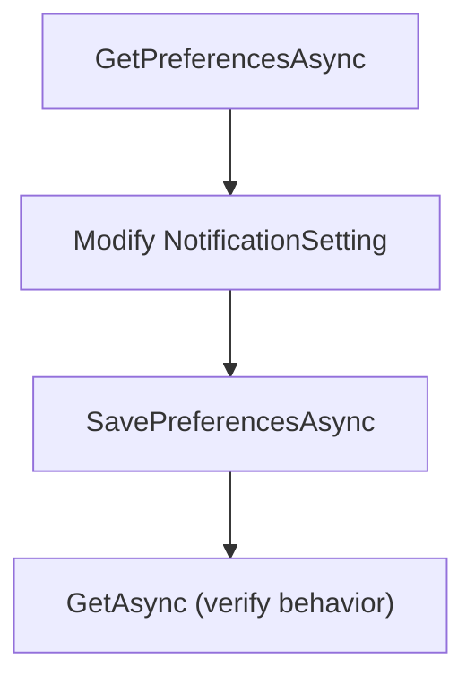
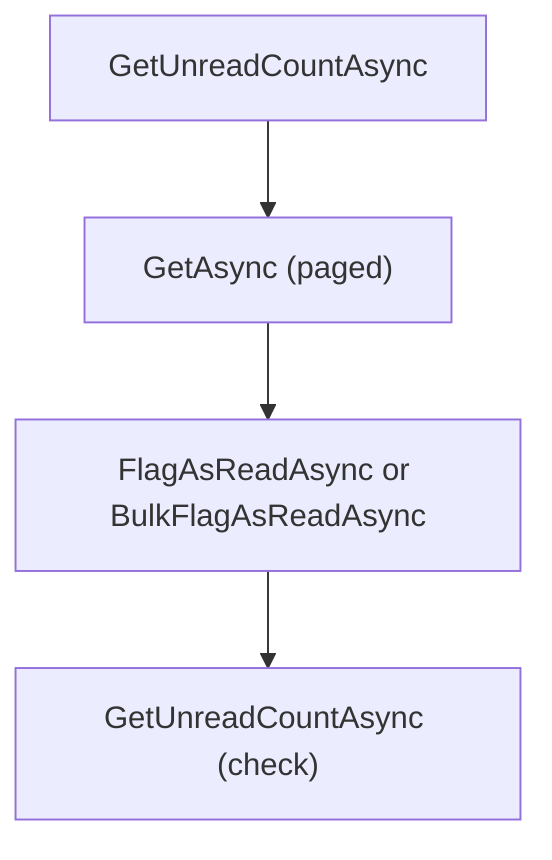

# .NET SDK — Client Reference: NotificationClient

Overview

Use Context.NotificationClient to manage notifications in AIForged. This includes reading and filtering notifications, marking them as read, deleting them, retrieving attachments, sending support messages, and configuring per-user notification preferences and subscriptions.

- Base URL: https://portal.aiforged.com
- Authentication: add the HTTP header X-Api-Key with your API key to all requests.

!!! info "Response wrapper and timestamps"
    - All client methods return a response wrapper; access payloads via the .Result property (for example, PortalResponse<NotificationViewModel>.Result).
    - All timestamps (for example, DTC, DTM, Sent, Delivered, ReadDate) are UTC in AIForged.

!!! note "Notification providers"
    Only Email notifications are currently available. Other NotificationType values are placeholders.

## Prerequisites

1. Install the SDK.

    ```bash
    dotnet add package AIForged.SDK
    ```

1. Initialize context and authenticate.

    ```csharp
    using AIForged.API;

    var baseUrl = Environment.GetEnvironmentVariable("AIFORGED_BASE_URL") ?? "https://portal.aiforged.com";
    var apiKey  = Environment.GetEnvironmentVariable("AIFORGED_API_KEY")  ?? throw new Exception("AIFORGED_API_KEY not set.");

    var cfg = new Config { BaseUrl = baseUrl, Timeout = TimeSpan.FromMinutes(5) };
    await cfg.Init();
    cfg.HttpClient.DefaultRequestHeaders.Add("X-Api-Key", apiKey);

    var ctx = new Context(cfg);
    var notifications = ctx.NotificationClient;
    ```

!!! tip "Connectivity check"
    After initialization, validate credentials with a lightweight call before using NotificationClient:
    
    ```csharp
    var me = await ctx.GetCurrentUserAsync();
    ```

## Methods

### Preferences

Get and save notification preferences for a user.

```csharp
// Get current user notification preferences
Task<PortalResponse<NotificationPreferences>> GetPreferencesAsync(string userId);
Task<PortalResponse<NotificationPreferences>> GetPreferencesAsync(string userId, CancellationToken token);

// Save current user notification preferences
Task<PortalResponse<NotificationPreferences>> SavePreferencesAsync(string userId, NotificationPreferences preferences);
Task<PortalResponse<NotificationPreferences>> SavePreferencesAsync(string userId, NotificationPreferences preferences, CancellationToken token);
```

```csharp
// Read preferences
var prefsResp = await ctx.NotificationClient.GetPreferencesAsync("user-123");
var prefs = prefsResp.Result;

// Example: enable Email notifications for a specific area/event
var area = NotificationArea.Document;
if (!prefs.Preferences.ContainsKey(area))
{
    prefs.Preferences[area] = new NotificationOption
    {
        Name = "Document Events",
        Settings = new System.Collections.ObjectModel.ObservableCollection<NotificationSetting>()
    };
}
var docSettings = prefs.Preferences[area].Settings;
var setting = docSettings.FirstOrDefault(s => s.Event == NotificationEvent.Error && s.Type == NotificationType.Email);
if (setting == null)
{
    setting = new NotificationSetting
    {
        Name = "Document Error (Email)",
        Event = NotificationEvent.Error,
        Type = NotificationType.Email,
        Enabled = true,
        ContactIds = new System.Collections.ObjectModel.ObservableCollection<int>()
    };
    docSettings.Add(setting);
}
else
{
    setting.Enabled = true;
}

// Optionally associate contacts by Id (from ContactClient)
setting.ContactIds.Clear();
setting.ContactIds.Add(101); // example contact Id

// Save preferences
var saveResp = await ctx.NotificationClient.SavePreferencesAsync("user-123", prefs);
var updated = saveResp.Result;
```

!!! tip "Preferences structure"
    Preferences is a dictionary keyed by NotificationArea, each with a NotificationOption containing a collection of NotificationSetting entries. Map lists which events are relevant per area.

### Counts

Get unread count and filtered total count.

```csharp
// Unread notifications count
Task<PortalResponse<int>> GetUnreadCountAsync(string userId);
Task<PortalResponse<int>> GetUnreadCountAsync(string userId, CancellationToken token);

// Filtered notifications count
Task<PortalResponse<int>> GetCountAsync(
    string userId,
    DateTime? fromDate,
    DateTime? toDate,
    bool? includeAlreadyRead,
    string to,
    string subject,
    string body,
    string error,
    NotificationType? type,
    NotificationStatus? status,
    NotificationArea? area,
    NotificationEvent? evnt
);
Task<PortalResponse<int>> GetCountAsync(..., CancellationToken token);
```

```csharp
var unread = (await ctx.NotificationClient.GetUnreadCountAsync("user-123")).Result;

var total = (await ctx.NotificationClient.GetCountAsync(
    userId: "user-123",
    fromDate: DateTime.UtcNow.AddDays(-30),
    toDate: DateTime.UtcNow,
    includeAlreadyRead: false,
    to: null,
    subject: null,
    body: null,
    error: null,
    type: NotificationType.Email,
    status: null,
    area: NotificationArea.Document,
    evnt: NotificationEvent.Error
)).Result;
```

!!! tip "Read vs. total"
    Use GetUnreadCountAsync for quick badges, and GetCountAsync to compute total matching records for paging.

### Query notifications

Get notifications with filters, paging, and sorting.

```csharp
Task<PortalResponse<System.Collections.ObjectModel.ObservableCollection<NotificationViewModel>>> GetAsync(
    string userId,
    DateTime? fromDate,
    DateTime? toDate,
    bool? includeAlreadyRead,
    string to,
    string subject,
    string body,
    string error,
    NotificationType? type,
    NotificationStatus? status,
    NotificationArea? area,
    NotificationEvent? evnt,
    int? pageNo,
    int? pageSize,
    SortField? sortField,
    SortDirection? sortDirection
);
Task<PortalResponse<System.Collections.ObjectModel.ObservableCollection<NotificationViewModel>>> GetAsync(..., CancellationToken token);
```

```csharp
var page = await ctx.NotificationClient.GetAsync(
    userId: "user-123",
    fromDate: DateTime.UtcNow.AddDays(-7),
    toDate: DateTime.UtcNow,
    includeAlreadyRead: false,
    to: null,
    subject: null,
    body: null,
    error: null,
    type: NotificationType.Email,
    status: null,
    area: NotificationArea.Document,
    evnt: null,
    pageNo: 1,
    pageSize: 50,
    sortField: SortField.Date,
    sortDirection: SortDirection.Descending
);
var items = page.Result ?? new System.Collections.ObjectModel.ObservableCollection<NotificationViewModel>();
foreach (var n in items)
{
    Console.WriteLine($"{n.DTC:u} [{n.Level}] {n.Subject}");
}
```

!!! note "Sorting"
    SortField and SortDirection apply to the requested result ordering.

### Attachments

Retrieve an attachment for a notification.

```csharp
Task<PortalResponse<NotificationAttachmentViewModel>> GetAttachmentAsync(int? id);
Task<PortalResponse<NotificationAttachmentViewModel>> GetAttachmentAsync(int? id, CancellationToken token);
```

```csharp
var att = (await ctx.NotificationClient.GetAttachmentAsync(555)).Result;
Console.WriteLine($"Attachment #{att.Id} ({att.ContentType})");
```

!!! tip "Attachment usage"
    Use the returned Data payload to handle the binary content appropriate to the ContentType.

### Create notifications and support messages

Create an email notification (support and other).

```csharp
// Create Email Notifications for Support
Task<PortalResponse<NotificationViewModel>> CreateAsync(NotificationViewModel notification);
Task<PortalResponse<NotificationViewModel>> CreateAsync(NotificationViewModel notification, CancellationToken token);

// Create Email Notification for Support and Other
Task<PortalResponse<NotificationViewModel>> MessageAsync(string type, string name, string email, string subject, string message);
Task<PortalResponse<NotificationViewModel>> MessageAsync(string type, string name, string email, string subject, string message, CancellationToken token);
```

```csharp
// Create a support notification
var created = await ctx.NotificationClient.CreateAsync(new NotificationViewModel
{
    UserId = "user-123",
    Type = NotificationType.Email,
    Area = NotificationArea.Support,
    Event = NotificationEvent.Info,
    Level = NotificationLevel.Info,
    Subject = "Support request",
    Body = "I need assistance with my project."
});
Console.WriteLine($"Created notification #{created.Result.Id}");

// Send a support/other message
var msg = await ctx.NotificationClient.MessageAsync(
    type: "Support",
    name: "John Doe",
    email: "john.doe@example.com",
    subject: "Issue with login",
    message: "I cannot access my account."
);
Console.WriteLine($"Message created notification #{msg.Result.Id}");
```

!!! warning "Content fields"
    Keep Subject and Body concise and non-sensitive. Avoid embedding secrets or personal data unnecessarily.

### Mark as read

Flag notifications as read, single or bulk by filter.

```csharp
// Single
Task<PortalResponse<bool>> FlagAsReadAsync(int? id);
Task<PortalResponse<bool>> FlagAsReadAsync(int? id, CancellationToken token);

// Bulk (by filter)
Task<PortalResponse<int>> BulkFlagAsReadAsync(
    string userId,
    DateTime? fromDate,
    DateTime? toDate,
    bool? includeAlreadyRead,
    string to,
    string subject,
    string body,
    string error,
    NotificationType? type,
    NotificationStatus? status,
    NotificationArea? area,
    NotificationEvent? evnt,
    int? pageNo,
    int? pageSize,
    SortField? sortField,
    SortDirection? sortDirection
);
Task<PortalResponse<int>> BulkFlagAsReadAsync(..., CancellationToken token);
```

```csharp
// Single
var ok = (await ctx.NotificationClient.FlagAsReadAsync(4321)).Result;

// Bulk: mark last 30 days of Email notifications in Document area as read
var count = (await ctx.NotificationClient.BulkFlagAsReadAsync(
    userId: "user-123",
    fromDate: DateTime.UtcNow.AddDays(-30),
    toDate: DateTime.UtcNow,
    includeAlreadyRead: false,
    to: null,
    subject: null,
    body: null,
    error: null,
    type: NotificationType.Email,
    status: null,
    area: NotificationArea.Document,
    evnt: null,
    pageNo: null,
    pageSize: null,
    sortField: null,
    sortDirection: null
)).Result;
Console.WriteLine($"Marked as read: {count}");
```

!!! tip "Verify effect"
    After marking notifications as read, call GetUnreadCountAsync to verify the expected decrease.

### Delete

Delete a notification by Id.

```csharp
Task<PortalResponse<NotificationViewModel>> DeleteAsync(int? id);
Task<PortalResponse<NotificationViewModel>> DeleteAsync(int? id, CancellationToken token);
```

```csharp
try
{
    var deleted = await ctx.NotificationClient.DeleteAsync(4321);
    Console.WriteLine($"Deleted notification #{deleted.Result?.Id}");
}
catch (SwaggerException ex)
{
    Console.Error.WriteLine($"Delete failed: HTTP {(int)ex.StatusCode}");
    Console.Error.WriteLine(ex.Response);
}
```

!!! warning "Irreversible"
    Deletion removes the notification record. Ensure you no longer need the notification or its attachments before deleting.

### Webhooks (WhatsApp)

Webhook endpoints for WhatsApp.

```csharp
Task<PortalResponse<int>> WebHookGETAsync();
Task<PortalResponse<int>> WebHookGETAsync(CancellationToken token);

Task<PortalResponse<int>> WebHookPOSTAsync();
Task<PortalResponse<int>> WebHookPOSTAsync(CancellationToken token);
```

```csharp
// Example invocation (server-side integration typically)
var getRes = (await ctx.NotificationClient.WebHookGETAsync()).Result;
var postRes = (await ctx.NotificationClient.WebHookPOSTAsync()).Result;
```

!!! note "Integration endpoint"
    These endpoints are intended for webhook integrations (for example, WhatsApp). Invocation patterns and authentication for inbound webhooks depend on your deployment.

## Models

### NotificationPreferences

| Property | Type | Validation |
| --- | --- | --- |
| Preferences | Dictionary<NotificationArea, NotificationOption> |  |
| Map | Dictionary<NotificationArea, ObservableCollection<NotificationEvent>> |  |

### NotificationOption

| Property | Type | Validation |
| --- | --- | --- |
| Name | string |  |
| Settings | ObservableCollection<NotificationSetting> |  |

### NotificationSetting

| Property | Type | Validation |
| --- | --- | --- |
| Name | string |  |
| Event | NotificationEvent |  |
| Type | NotificationType |  |
| Enabled | bool |  |
| Contacts | Dictionary<string, string> |  |
| ContactIds | ObservableCollection<int> |  |

### NotificationViewModel

| Property | Type | Validation |
| --- | --- | --- |
| Id | int |  |
| UserId | string | Required |
| ProjectId | int? |  |
| ClassId | int? |  |
| ServiceId | int? |  |
| DocumentId | int? |  |
| WorkItemId | int? |  |
| ShredId | int? |  |
| VerificationId | int? |  |
| ContactId | int? |  |
| Type | NotificationType |  |
| Status | NotificationStatus |  |
| Area | NotificationArea |  |
| Event | NotificationEvent |  |
| Level | NotificationLevel |  |
| To | string | StringLength(450) |
| Address | string | StringLength(450) |
| Subject | string | StringLength(450) |
| ContentType | string | StringLength(256) |
| Body | string |  |
| Error | string | StringLength(2000) |
| DTC | DateTime |  |
| DTM | DateTime |  |
| Sent | DateTime? |  |
| Delivered | DateTime? |  |
| ReadDate | DateTime? |  |
| Contact | ContactViewModel |  |
| Attachments | ObservableCollection<NotificationAttachmentViewModel> |  |

### NotificationAttachmentViewModel

| Property | Type | Validation |
| --- | --- | --- |
| Id | int |  |
| NotificationId | int |  |
| ContentType | string | StringLength(256) |
| ContentId | string | StringLength(450) |
| Data | byte[] |  |

## Enums

### NotificationArea

| Value | Meaning |
|---|---|
| None | 0 |
| Login | 1 |
| Project | 2 |
| Service | 3 |
| Document | 4 |
| Verification | 5 |
| Marketplace | 6 |
| Payment | 7 |
| Preferences | 8 |
| Settings | 9 |
| Support | 10 |
| WorkItem | 11 |
| Billing | 12 |
| System | 13 |
| Sales | 14 |
| Info | 15 |

### NotificationEvent (flags)

Values include Create, Update, Delete, Process, Training, Upload, Request, Invite, Approve, Error, Status, Monitor, Reset, Bug, Info, Progress, Toast, Confirm, Transfer, Escelate, Verify, Linked, Reject, UnDelete, DeviceCode.

### NotificationStatus

Values include None, Created, Sent, Delivered, Display, Ignore, Deleted, Error.

### NotificationLevel (flags)

Values include Error, Exception, Warning, Info, Debug, Trace.

### NotificationType

Values include None, Email, SMS, WhatsApp, Bot, Application.

### Sorting

- SortField: Id, Name, Description, Date, Status, Category.
- SortDirection: Ascending, Descending.

## Examples

### Manage preferences for document errors (Email)

```csharp
var prefs = (await ctx.NotificationClient.GetPreferencesAsync("user-123")).Result;

// Enable Email for Document Error, associate with a contact Id
var area = NotificationArea.Document;
if (!prefs.Preferences.ContainsKey(area))
{
    prefs.Preferences[area] = new NotificationOption
    {
        Name = "Document Events",
        Settings = new System.Collections.ObjectModel.ObservableCollection<NotificationSetting>()
    };
}
var set = prefs.Preferences[area].Settings.FirstOrDefault(s => s.Event == NotificationEvent.Error && s.Type == NotificationType.Email);
if (set == null)
{
    set = new NotificationSetting
    {
        Name = "Doc Error Email",
        Event = NotificationEvent.Error,
        Type = NotificationType.Email,
        Enabled = true,
        ContactIds = new System.Collections.ObjectModel.ObservableCollection<int> { 101 }
    };
    prefs.Preferences[area].Settings.Add(set);
}
else
{
    set.Enabled = true;
    set.ContactIds = new System.Collections.ObjectModel.ObservableCollection<int> { 101 };
}

await ctx.NotificationClient.SavePreferencesAsync("user-123", prefs);
```

!!! tip "Contacts"
    Manage contacts via ContactClient and reference their Ids in NotificationSetting.ContactIds.

### Page notifications and mark as read

```csharp
// Fetch a page of recent notifications
var page = await ctx.NotificationClient.GetAsync(
    userId: "user-123",
    fromDate: DateTime.UtcNow.AddDays(-7),
    toDate: DateTime.UtcNow,
    includeAlreadyRead: false,
    to: null, subject: null, body: null, error: null,
    type: null, status: null, area: null, evnt: null,
    pageNo: 1, pageSize: 25,
    sortField: SortField.Date, sortDirection: SortDirection.Descending
);

var list = page.Result ?? new System.Collections.ObjectModel.ObservableCollection<NotificationViewModel>();
foreach (var n in list) Console.WriteLine($"{n.Id} {n.Subject}");

// Bulk mark visible page (same filter) as read
var marked = (await ctx.NotificationClient.BulkFlagAsReadAsync(
    userId: "user-123",
    fromDate: DateTime.UtcNow.AddDays(-7),
    toDate: DateTime.UtcNow,
    includeAlreadyRead: false,
    to: null, subject: null, body: null, error: null,
    type: null, status: null, area: null, evnt: null,
    pageNo: 1, pageSize: 25, sortField: SortField.Date, sortDirection: SortDirection.Descending
)).Result;
Console.WriteLine($"Marked: {marked}");
```

!!! success "Verification"
    Compare GetUnreadCountAsync before and after BulkFlagAsReadAsync to confirm the change.

## Flows





## Error handling

- Wrap calls in try/catch for SwaggerException.
- Inspect ex.StatusCode and ex.Response for server details.
- Use overloads with CancellationToken when appropriate in interactive or long-running operations.

```csharp
try
{
    var resp = await ctx.NotificationClient.DeleteAsync(4321);
}
catch (SwaggerException ex)
{
    Console.Error.WriteLine($"HTTP {(int)ex.StatusCode}");
    Console.Error.WriteLine(ex.Response);
}
```

!!! warning "Filtering edge cases"
    Ensure your date filters are in UTC and consistent with server-stored timestamps to avoid unexpected results.

## Troubleshooting

- No notifications returned:
    - Broaden your date range or remove filters (type, area, event) and retry.
- Unread count does not decrease:
    - Confirm the read operation used the same filters or specific Ids; re-check GetUnreadCountAsync.
- Attachments missing:
    - Inspect NotificationViewModel.Attachments and use GetAttachmentAsync for specific attachment Ids.
- Preferences not taking effect:
    - Verify setting.Enabled is true and NotificationType is correctly set to Email. Ensure ContactIds refer to valid contacts.

## Open Questions

- Maximum page size and default values for GetAsync and related paging.
- Server-side sort behavior when sortField is omitted or when multiple fields have the same timestamp.
- Size and type limits for NotificationAttachmentViewModel.Data.
- Authentication and verification specifics for WebHookGETAsync and WebHookPOSTAsync.
- Validation rules and required fields for MessageAsync type argument and how it maps to processing.
- Whether GetAsync returns Attachments populated in the list view or requires separate retrieval per attachment.