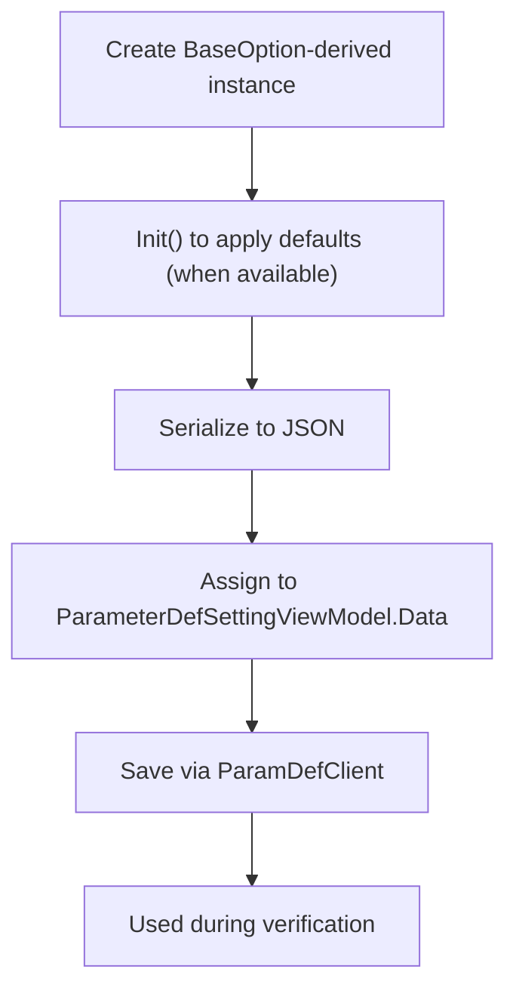

# ParamDefClient — Settings Data (BaseOption and Supporting Types)

## Overview

ParamDefClient settings use a Data field to store serialized rule/validation/transformation configurations that run during verification. Data must contain a JSON-serialized instance of BaseOption or a supported derived type (for example, StringOptions, DateTimeOptions, BooleanOptions). This page documents the structure of BaseOption, its derived options, and all referenced supporting types and enums, and shows how to serialize and persist them via ParamDefClient.

!!! info "What you get"
    - A clear schema reference for BaseOption, its derived options, and supporting types.
    - Copy-pasteable C# snippets for serializing options into ParameterDefSettingViewModel.Data.
    - Troubleshooting guidance and an explicit list of open questions.

## Prerequisites

1. Install and set up the SDK.

    ```bash
    dotnet add package AIForged.SDK
    ```

1. Initialize the context and get ParamDefClient.

    ```csharp
    using AIForged.API;

    var baseUrl = Environment.GetEnvironmentVariable("AIFORGED_BASE_URL") ?? "https://portal.aiforged.com";
    var apiKey  = Environment.GetEnvironmentVariable("AIFORGED_API_KEY")  ?? throw new Exception("AIFORGED_API_KEY not set.");

    var cfg = new Config { BaseUrl = baseUrl, Timeout = TimeSpan.FromMinutes(5) };
    await cfg.Init();
    cfg.HttpClient.DefaultRequestHeaders.Add("X-Api-Key", apiKey);

    var ctx = new Context(cfg);
    var paramDefs = ctx.ParamDefClient;
    ```

!!! note "Timestamps"
    All timestamps in AIForged models (for example, DTC, DTM) are UTC.

## How to use Data with BaseOption

1. Create a BaseOption-derived instance and populate fields.
2. Call Init() on the instance when the type provides defaults (recommended).
3. Serialize the instance to JSON using System.Text.Json.
4. Assign the JSON string to ParameterDefSettingViewModel.Data.
5. Save or create the setting using ParamDefClient.

```csharp
using System.Text.Json;

// 1) Build an options instance
var options = new StringOptions
{
    UseDetectedLanguage = true,
    Spelling = SpellingType.Proof,
    OverrideValue = false,
    OverrideConfidence = false
};

// 2) Initialize defaults where provided
options.Init();

// 3) Serialize to JSON
var json = JsonSerializer.Serialize<BaseOption>(options);

// 4) Build a setting
var setting = new ParameterDefSettingViewModel
{
    ParameterDefId = 1234,
    Type = SettingType.Rule,
    Status = SettingStatus.Active,
    Comment = "String cleanup and proofing",
    Data = json,
    ValidateValuesAfter = true
};

// 5) Save
var saved = (await paramDefs.CreateSettingAsync("user-123", setting)).Result;
```

!!! tip "Deserialization"
    When reading Data, deserialize to the correct derived type that was originally saved. Maintain your own discriminator or context to select the correct target type.

## Reference flow



!!! example "Verify saved settings"
    After saving, fetch the latest setting with GetLastSettingAsync(pdId, type) and deserialize Data into the expected derived type to validate structure and defaults.

## ViewModels and Option Types

### BaseOption

| Property | Type | Validation |
| --- | --- | --- |
| Pattern | string |  |
| Input | ObservableCollection<DepentantValue> |  |
| Services | ObservableCollection<Service> |  |
| Box | List<BlockInfo> |  |
| Substitution | Dictionary<string, string> |  |
| RegexReplacements | Dictionary<string, string> |  |
| Dictionary | DictionarySetting |  |
| WebAPI | WebAPISetting |  |
| Database | DatabaseSetting |  |
| Script | CodeSetting |  |
| WorkFlow | CodeSetting |  |
| Conditions | Conditions |  |

!!! tip "Lifecycle"
    Many options support Init() to set defaults and Cleanup() to normalize data (deduplicate lists, ensure defaults).

### AddressOptions

| Property | Type | Validation |
| --- | --- | --- |
| Engine | MapsEngine |  |
| Field | AddressField |  |
| ExtractField | AddressField |  |
| OverrideValue | bool |  |
| OverrideConfidence | bool |  |
| Country | DepentantValue |  |
| CountryCode | DepentantValue |  |
| CountryCodeISO | DepentantValue |  |
| State | DepentantValue |  |
| Province | DepentantValue |  |
| Municipality | DepentantValue |  |
| Suburb | DepentantValue |  |
| City | DepentantValue |  |
| Street | DepentantValue |  |
| StreetNumber | DepentantValue |  |
| PostalCode | DepentantValue |  |
| Longitude | DepentantValue |  |
| Latitude | DepentantValue |  |
| GeoLocation | DepentantValue |  |
| POI | DepentantValue |  |
| Language | DepentantValue |  |

### BooleanOptions

| Property | Type | Validation |
| --- | --- | --- |
| Options | Dictionary<string, bool?>? |  |

### CountryOptions

| Property | Type | Validation |
| --- | --- | --- |
| Field | CountryField |  |
| ExtractField | CountryField |  |
| OverrideValue | bool |  |
| OverrideConfidence | bool |  |
| Country | DepentantValue |  |
| CountryCode | DepentantValue |  |
| CountryCodeISO | DepentantValue |  |
| CountryCodeAlpha2 | DepentantValue |  |
| CountryCodeAlpha3 | DepentantValue |  |
| Region | DepentantValue |  |
| SubRegion | DepentantValue |  |
| RegionCode | DepentantValue |  |
| SubRegionCode | DepentantValue |  |
| IntermediateRegion | DepentantValue |  |
| IntermediateRegionCode | DepentantValue |  |

### CultureBasedOptions

| Property | Type | Validation |
| --- | --- | --- |
| Language | DepentantValue |  |
| Country | DepentantValue |  |
| Cultures | ObservableCollection<string>? |  |
| RemoveInvalidChars | bool |  |

### BaseNumericOptions

| Property | Type | Validation |
| --- | --- | --- |
| NumberFormats | ObservableCollection<NumberFormatInfo> |  |
| SelectedFormat | NumberFormatInfo? |  |

### DecimalOptions

| Property | Type | Validation |
| --- | --- | --- |
| — | — | Inherits BaseNumericOptions; no additional properties |

### NumericOptions

| Property | Type | Validation |
| --- | --- | --- |
| — | — | Inherits BaseNumericOptions; no additional properties |

### CurrencyOptions

| Property | Type | Validation |
| --- | --- | --- |
| Symbols | Dictionary<string, string> |  |

### DateTimeOptions

| Property | Type | Validation |
| --- | --- | --- |
| DateSeprator | string |  |
| HourSeprator | string |  |
| SelectedDateOption | string? |  |
| SelectedTimeOption | string? |  |
| DateOptions | ObservableCollection<string>? |  |
| TimeOptions | ObservableCollection<string>? |  |
| DatetimeFormats | ObservableCollection<DateTimeFormatInfo> |  |

### EmailOptions

| Property | Type | Validation |
| --- | --- | --- |
| Domain | DepentantValue |  |

### EnumOptions

| Property | Type | Validation |
| --- | --- | --- |
| TypeName | string? |  |
| Options | ObservableCollection<string>? |  |

### GPSOptions

| Property | Type | Validation |
| --- | --- | --- |
| — | — | Inherits CultureBasedOptions; no additional properties |

### IDNoOptions

| Property | Type | Validation |
| --- | --- | --- |
| Digit0 | DepentantValue |  |
| Digit1 | DepentantValue |  |
| Digit2 | DepentantValue |  |
| Digit3 | DepentantValue |  |
| Digit4 | DepentantValue |  |
| Digit5 | DepentantValue |  |
| Digit6 | DepentantValue |  |
| Digit7 | DepentantValue |  |
| Digit8 | DepentantValue |  |
| Digit9 | DepentantValue |  |
| Digit10 | DepentantValue |  |
| Digit11 | DepentantValue |  |
| Digit12 | DepentantValue |  |
| Digit13 | DepentantValue |  |
| Digit14 | DepentantValue |  |
| Digit15 | DepentantValue |  |
| Digit16 | DepentantValue |  |
| Digit17 | DepentantValue |  |
| Digit18 | DepentantValue |  |
| Digit19 | DepentantValue |  |
| Digit20 | DepentantValue |  |

### PasswordOptions

| Property | Type | Validation |
| --- | --- | --- |
| DisplayCharacter | string |  |
| HashAlgorithm | string |  |

### PictureOptions

| Property | Type | Validation |
| --- | --- | --- |
| Classification | PictureClassification |  |
| Other | string? |  |
| Data | string? |  |
| ImageComparisonOptions | ImageComparisonOptions? |  |
| FingerprintOptions | FingerprintOptions? |  |
| SignatureOptions | SignatureOptions? |  |
| ObjectDetectionOptions | ObjectDetectionOptions? |  |

### ServiceOptions

| Property | Type | Validation |
| --- | --- | --- |
| ServiceId | int |  |
| ServiceTypeFilter | string? |  |

### StringOptions

| Property | Type | Validation |
| --- | --- | --- |
| UseDetectedLanguage | bool |  |
| Spelling | SpellingType |  |
| TranslateFrom | DepentantValue |  |
| TranslateTo | DepentantValue |  |
| SpellingPreContext | DepentantValue |  |
| SpellingPostContext | DepentantValue |  |
| OverrideValue | bool |  |
| OverrideConfidence | bool |  |
| SentimentField | SentimentField |  |
| LanguageField | LanguageField |  |
| NamedEntityField | NamedEntityField |  |
| EntityLinkingField | EntityLinkingField |  |
| KeyPhraseField | KeyPhraseField |  |

### TelephoneOptions

| Property | Type | Validation |
| --- | --- | --- |
| CountryCode | string? |  |
| Network | string? |  |

### TimeSpanOptions

| Property | Type | Validation |
| --- | --- | --- |
| HourSeprator | string |  |
| Seprator | string |  |

## Supporting Types

### DepentantValue

| Property | Type | Validation |
| --- | --- | --- |
| Parameter | int? |  |
| Name | string? |  |
| Value | string? |  |
| Info | string? |  |

### Service

| Property | Type | Validation |
| --- | --- | --- |
| Id | int |  |
| Criteria | Criteria |  |
| Confidence | float |  |
| IsFinal | bool |  |
| IsEnabled | bool |  |
| Invert | bool |  |
| Other | string? |  |
| Reference | object? |  |
| MaxRetry | int |  |
| Timeout | TimeSpan |  |

### BlockInfo

| Property | Type | Validation |
| --- | --- | --- |
| Id | string? |  |
| PageIndex | string? |  |
| Rect | Rectangle |  |
| Box | BoundedBox |  |

### DictionarySetting

| Property | Type | Validation |
| --- | --- | --- |
| Method | DictionaryLookupMethod |  |
| Options | ObservableCollection<string>? |  |
| IsCaseSensative | bool |  |
| UseConfidence | bool |  |
| MinAccuracy | float |  |

### WebAPISetting

| Property | Type | Validation |
| --- | --- | --- |
| Method | WebMethod |  |
| Url | string |  |
| Body | string |  |
| ContentType | string |  |
| Credentials | string? |  |
| AuthenticationScheme | string? |  |
| AuthenticationToken | string? |  |
| Headers | Dictionary<string, string> |  |

### DatabaseSetting

| Property | Type | Validation |
| --- | --- | --- |
| Method | SqlMethod |  |
| Provider | string |  |
| Connectionstring | string |  |
| SQL | string |  |

### CodeSetting

| Property | Type | Validation |
| --- | --- | --- |
| Language | CodeLanguage |  |
| Imports | ObservableCollection<string>? |  |
| Assemblies | ObservableCollection<string>? |  |
| Code | string |  |

### RuleFilter

| Property | Type | Validation |
| --- | --- | --- |
| Type | ConditionType |  |
| Operator | ConditionOprator |  |
| Inverter | ConditionInvert |  |
| Filter | ObservableCollection<string>? |  |
| Pattern | ObservableCollection<string>? |  |
| Categories | ObservableCollection<int>? |  |
| Statuses | ObservableCollection<int>? |  |
| Types | ObservableCollection<int>? |  |
| MinCount | int? |  |
| MaxCount | int? |  |
| MinConfidence | int? |  |
| MaxConfidence | int? |  |

### Conditions

| Property | Type | Validation |
| --- | --- | --- |
| Inverter | ConditionInvert |  |
| Filters | ObservableCollection<RuleFilter> |  |

## Enums

!!! tip "Format"
    All enums are shown as Value and Numeric Value.

### Criteria (flags)

| Value | Numeric Value |
| --- | --- |
| Always | 1 |
| Confidence | 2 |
| Verification | 4 |
| Error | 8 |
| Suspicious | 16 |

### DictionaryLookupMethod

| Value | Numeric Value |
| --- | --- |
| Exact | 0 |
| LevenshteinDistance | 1 |
| HammingDistance | 2 |
| RegEx | 3 |
| None | 4 |
| JaroWinkler | 5 |

### CountryField (flags)

| Value | Numeric Value |
| --- | --- |
| None | 1 |
| Name | 2 |
| Alpha2 | 4 |
| Alpha3 | 8 |
| CountryCode | 16 |
| Iso3166_2 | 32 |
| Region | 64 |
| SubRegion | 128 |
| IntermediateRegion | 256 |
| RegionCode | 512 |
| SubRegionCode | 1024 |
| IntermediateRegionCode | 2048 |

### PictureClassification (flags)

| Value | Numeric Value |
| --- | --- |
| Empty | 1 |
| Handwriting | 2 |
| Signature | 4 |
| Photo | 8 |
| Document | 16 |
| Barcode | 32 |
| QRCode | 64 |
| CheckMark | 256 |
| Fingerprint | 512 |
| Other | 1024 |
| Face | 2048 |
| Scene | 4096 |

### PictureThreshold (flags)

| Value | Numeric Value |
| --- | --- |
| None | 1 |
| AdaptiveGausian | 2 |
| AdaptiveMean | 4 |
| Binary | 8 |
| BinaryInvert | 16 |
| Truncate | 32 |
| ToZero | 64 |
| ToZeroInvert | 128 |

### SpellingType

| Value | Numeric Value |
| --- | --- |
| None | 1 |
| Spell | 2 |
| Proof | 4 |

### SentimentField (flags)

| Value | Numeric Value |
| --- | --- |
| Text | 1 |
| Sentiment | 2 |
| PositiveScore | 4 |
| NegativeScore | 8 |
| NeutralScore | 16 |

### LanguageField (flags)

| Value | Numeric Value |
| --- | --- |
| Language | 1 |
| Code | 2 |

### NamedEntityField (flags)

| Value | Numeric Value |
| --- | --- |
| Text | 1 |
| Category | 2 |
| SubCategory | 4 |

### EntityLinkingField (flags)

| Value | Numeric Value |
| --- | --- |
| Name | 1 |
| Id | 2 |
| Url | 3 |
| DataSource | 8 |

### KeyPhraseField (flags)

| Value | Numeric Value |
| --- | --- |
| BestOption | 1 |
| Combine | 2 |

### WebMethod

| Value | Numeric Value |
| --- | --- |
| None | 0 |
| Get | 1 |
| Post | 2 |
| Put | 3 |
| Delete | 4 |

### SqlMethod

| Value | Numeric Value |
| --- | --- |
| None | 0 |
| Query | 1 |
| StoredProc | 2 |
| Command | 3 |

### CodeLanguage

| Value | Numeric Value |
| --- | --- |
| None | 0 |
| CSharp | 1 |
| IronPython | 3 |
| Semantic | 5 |

### ConditionType

| Value | Numeric Value |
| --- | --- |
| Training | 1 |
| Definition | 2 |
| Verifications | 3 |
| WorkItems | 4 |
| ParamDefs | 5 |
| Parameters | 6 |
| Documents | 7 |

### ConditionOprator

| Value | Numeric Value |
| --- | --- |
| And | 1 |
| Or | 2 |
| NOr | 3 |
| NAnd | 4 |

### ConditionInvert

| Value | Numeric Value |
| --- | --- |
| No | 0 |
| Yes | 1 |

## Examples

### String normalization with dictionary lookup

```csharp
using System.Text.Json;

var opts = new StringOptions
{
    UseDetectedLanguage = true,
    Spelling = SpellingType.Spell
};
opts.Init();
opts.Dictionary.Method = DictionaryLookupMethod.LevenshteinDistance;
opts.Dictionary.Options = new System.Collections.ObjectModel.ObservableCollection<string>
{
    "Invoice",
    "Receipt",
    "Statement"
};

var json = JsonSerializer.Serialize<BaseOption>(opts);

var setting = new ParameterDefSettingViewModel
{
    ParameterDefId = 3456,
    Type = SettingType.Rule,
    Status = SettingStatus.Active,
    Comment = "String normalization and dictionary matching",
    Data = json,
    CleanupValuesBefore = true,
    ValidateValuesAfter = true
};

var saved = (await paramDefs.SaveSettingAsync("user-123", setting)).Result;
```

!!! tip "Cleanup and validation"
    Set CleanupValuesBefore and ValidateValuesAfter on the setting to control pre/post processing around your rule execution.

### Date/time parsing with custom formats

```csharp
var opts = new DateTimeOptions
{
    DateSeprator = "/",
    HourSeprator = ":",
    SelectedDateOption = "yyyy/MM/dd",
    SelectedTimeOption = "HH:mm:ss"
};
opts.Init();

var json = System.Text.Json.JsonSerializer.Serialize<BaseOption>(opts);

var setting = new ParameterDefSettingViewModel
{
    ParameterDefId = 5678,
    Type = SettingType.Rule,
    Status = SettingStatus.Active,
    Comment = "Date/Time parsing formats",
    Data = json
};

await paramDefs.CreateSettingAsync("user-123", setting);
```

### Boolean normalization

```csharp
var opts = new BooleanOptions();
opts.Init();

var json = System.Text.Json.JsonSerializer.Serialize<BaseOption>(opts);

var setting = new ParameterDefSettingViewModel
{
    ParameterDefId = 7890,
    Type = SettingType.Rule,
    Status = SettingStatus.Active,
    Comment = "Boolean normalization",
    Data = json
};

await paramDefs.CreateSettingAsync("user-123", setting);
```

### Conditional execution and Web API validation

```csharp
var filter = new RuleFilter
{
    Type = ConditionType.Verifications,
    Operator = ConditionOprator.And,
    Inverter = ConditionInvert.No,
    MinCount = 1,
    MinConfidence = 80
};

var opts = new StringOptions
{
    UseDetectedLanguage = true,
    Spelling = SpellingType.Proof,
    SentimentField = SentimentField.Text
};
opts.Init();
opts.Conditions = new Conditions
{
    Inverter = ConditionInvert.No,
    Filters = new System.Collections.ObjectModel.ObservableCollection<RuleFilter> { filter }
};

opts.WebAPI = new WebAPISetting
{
    Method = WebMethod.Post,
    Url = "https://example.com/verify",
    ContentType = "application/json",
    Body = "{ \"value\": \"{value}\", \"confidence\": {confidence} }"
};
opts.WebAPI.Init();

var json = System.Text.Json.JsonSerializer.Serialize<BaseOption>(opts);

var setting = new ParameterDefSettingViewModel
{
    ParameterDefId = 4321,
    Type = SettingType.Rule,
    Status = SettingStatus.Active,
    Comment = "Conditional external verification",
    Data = json
};

await paramDefs.SaveSettingAsync("user-123", setting);
```

!!! warning "Runtime assumptions"
    The runtime must know which derived type was serialized into Data to deserialize correctly.

## Troubleshooting

- Settings appear to do nothing
    - Verify that Data contains the expected serialized derived type and that your runtime deserializes to the correct type.
    - Ensure setting flags like CleanupValuesBefore and ValidateValuesAfter are set as intended.
- Dictionaries not applied
    - Confirm Dictionary.Options is initialized (call Init()) and contains the expected values. Check Method selection for distance/regex/exact matching.
- External validation failures
    - Review WebAPISetting.Method, Url, ContentType, Headers, and authentication fields. Confirm the request body template matches your service.

!!! success "Verification step"
    After saving, read the latest with GetLastSettingAsync and inspect the Data payload to confirm the expected structure and values.