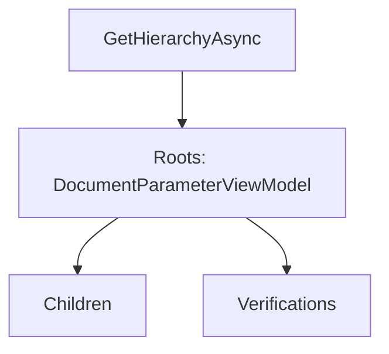
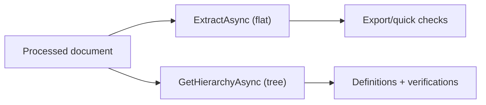

# .NET SDK — Client Reference: ParametersClient

## Overview

Use ParametersClient to retrieve and manage document parameters (extracted fields). You can:

- Read parameter values by ID or by document filters.
- Fetch full parameter hierarchies with optional verifications.
- Extract flat results for one or many documents.
- Search across documents for values.
- Create, update, delete single or multiple parameters.
- Bulk change parameter definitions.
- Export results to Excel.

!!! tip "Result shapes"
    - GetHierarchyAsync returns a hierarchy of DocumentParameterViewModel (rich context with definitions and verifications).
    - ExtractAsync and MultiExtractAsync return a flat list of DocumentExtraction (optimized for simple processing and exports).

## Prerequisites

1. Install and initialize the SDK.

    ```csharp
    using AIForged.API;

    var baseUrl = Environment.GetEnvironmentVariable("AIFORGED_BASE_URL") ?? "https://portal.aiforged.com";
    var apiKey  = Environment.GetEnvironmentVariable("AIFORGED_API_KEY")  ?? throw new Exception("AIFORGED_API_KEY not set.");

    var cfg = new Config { BaseUrl = baseUrl, Timeout = TimeSpan.FromMinutes(5) };
    await cfg.Init();
    cfg.HttpClient.DefaultRequestHeaders.Add("X-Api-Key", apiKey);

    var ctx = new Context(cfg);
    var parameters = ctx.ParametersClient;
    ```

!!! note "Response wrapper"
    Methods return PortalResponse<T>. Access payloads via .Result.

## Methods

### Get parameter value by ID

Signatures
```csharp
Task<PortalResponse<ObservableCollection<DocumentParameterViewModel>>> GetByIdAsync(int? id, int? docId, int? serviceId, bool? includeverification);
Task<PortalResponse<ObservableCollection<DocumentParameterViewModel>>> GetByIdAsync(int? id, int? docId, int? serviceId, bool? includeverification, CancellationToken cancellationToken);
```

Example
```csharp
var resp = await parameters.GetByIdAsync(
    id: 123,
    docId: 456,
    serviceId: 789,
    includeverification: true
);
var list = resp.Result; // ObservableCollection<DocumentParameterViewModel>
```

!!! tip "Multiple matches"
    The API returns a list. Apply your own selection if multiple items are returned.

---

### Get parameters for a document (filters)

Signatures
```csharp
Task<PortalResponse<ObservableCollection<DocumentParameterViewModel>>> GetAsync(int? docId, int? stpdId, ParameterDefinitionCategory? category, GroupingType? grouping, bool? includeverification);
Task<PortalResponse<ObservableCollection<DocumentParameterViewModel>>> GetAsync(int? docId, int? stpdId, ParameterDefinitionCategory? category, GroupingType? grouping, bool? includeverification, CancellationToken cancellationToken);
```

Example
```csharp
var resp = await parameters.GetAsync(
    docId: 456,
    stpdId: 789,
    category: null,
    grouping: null,
    includeverification: true
);
var items = resp.Result;
```

---

### Get usage of a parameter definition across documents

Signatures
```csharp
Task<PortalResponse<ObservableCollection<DocumentParameterViewModel>>> GetUsageAsync(int? pdId, List<int> docIds);
Task<PortalResponse<ObservableCollection<DocumentParameterViewModel>>> GetUsageAsync(int? pdId, List<int> docIds, CancellationToken cancellationToken);
```

Example
```csharp
var resp = await parameters.GetUsageAsync(
    pdId: 321,
    docIds: new List<int> { 456, 457, 458 }
);
var usedParams = resp.Result;
```

---

### Deep search for parameter values

Signatures
```csharp
Task<PortalResponse<ObservableCollection<DocumentParameterViewModel>>> DeepSearchAsync(string userId, int? projectId, int? stpdId, string value, int? pdId, int? docId, UsageType? docUsage, DocumentStatus? docStatus, DateTime? docFrom, DateTime? docTo, int? classId);
Task<PortalResponse<ObservableCollection<DocumentParameterViewModel>>> DeepSearchAsync(string userId, int? projectId, int? stpdId, string value, int? pdId, int? docId, UsageType? docUsage, DocumentStatus? docStatus, DateTime? docFrom, DateTime? docTo, int? classId, CancellationToken cancellationToken);
```

Example
```csharp
var resp = await parameters.DeepSearchAsync(
    userId: "user-123",
    projectId: 1001,
    stpdId: 2001,
    value: "INV-2025-0001",
    pdId: null,
    docId: null,
    docUsage: null,
    docStatus: null,
    docFrom: null,
    docTo: null,
    classId: null
);
var matches = resp.Result;
```

!!! warning "Search scope"
    Provide as many filters as possible (project, service, value) to constrain result volumes.

---

### Get document parameter hierarchy

Signatures
```csharp
Task<PortalResponse<ObservableCollection<DocumentParameterViewModel>>> GetHierarchyAsync(int? docId, int? stpdId, bool? includeverification, int? pageIndex);
Task<PortalResponse<ObservableCollection<DocumentParameterViewModel>>> GetHierarchyAsync(int? docId, int? stpdId, bool? includeverification, int? pageIndex, CancellationToken cancellationToken);
```

Example
```csharp
var resp = await parameters.GetHierarchyAsync(
    docId: 456,
    stpdId: 789,
    includeverification: true,
    pageIndex: null
);
var roots = resp.Result; // ObservableCollection<DocumentParameterViewModel>
```



!!! tip "Paging"
    Use pageIndex to target parameters per page when applicable.

---

### Create a parameter on a document

Signatures
```csharp
Task<PortalResponse<DocumentParameterViewModel>> CreateAsync(DocumentParameterViewModel param);
Task<PortalResponse<DocumentParameterViewModel>> CreateAsync(DocumentParameterViewModel param, CancellationToken cancellationToken);
```

Example
```csharp
var created = await parameters.CreateAsync(new DocumentParameterViewModel
{
    DocumentId = 456,
    ParamDefId = 321,
    Value = "12345"
});
var newParam = created.Result;
```

---

### Update a parameter

Signatures
```csharp
Task<PortalResponse<DocumentParameterViewModel>> UpdateAsync(DocumentParameterViewModel param);
Task<PortalResponse<DocumentParameterViewModel>> UpdateAsync(DocumentParameterViewModel param, CancellationToken cancellationToken);

Task<PortalResponse<ObservableCollection<DocumentParameterViewModel>>> UpdateMultiAsync(List<DocumentParameterViewModel> parameters);
Task<PortalResponse<ObservableCollection<DocumentParameterViewModel>>> UpdateMultiAsync(List<DocumentParameterViewModel> parameters, CancellationToken cancellationToken);
```

Example
```csharp
// Single
param.Value = "67890";
var updated = await parameters.UpdateAsync(param);
var up = updated.Result;

// Multiple
var list = new List<DocumentParameterViewModel>
{
    new DocumentParameterViewModel { Id = 1, DocumentId = 456, Value = "A" },
    new DocumentParameterViewModel { Id = 2, DocumentId = 456, Value = "B" }
};
var many = await parameters.UpdateMultiAsync(list);
var updatedList = many.Result;
```

---

### Delete a parameter

Signatures
```csharp
Task<PortalResponse<DocumentParameterViewModel>> DeleteAsync(int? paramid);
Task<PortalResponse<DocumentParameterViewModel>> DeleteAsync(int? paramid, CancellationToken cancellationToken);
```

Example
```csharp
var deleted = await parameters.DeleteAsync(paramid: 1);
var result = deleted.Result;
```

---

### Bulk change parameter definitions

Signatures
```csharp
Task<PortalResponse<int>> BulkChangeParamDefAsync(int? projectId, int? pdIdFrom, int? pdIdTo);
Task<PortalResponse<int>> BulkChangeParamDefAsync(int? projectId, int? pdIdFrom, int? pdIdTo, CancellationToken cancellationToken);
```

Example
```csharp
var countResp = await parameters.BulkChangeParamDefAsync(
    projectId: 1001,
    pdIdFrom: 321,
    pdIdTo: 654
);
var changedCount = countResp.Result;
```

!!! warning "Project-wide impact"
    This operation affects many parameters across documents. Validate filters and test first.

---

### Delete parameters by definition

Signatures
```csharp
Task<PortalResponse<int>> DeleteByParamDefAsync(int? docId, int? pdId);
Task<PortalResponse<int>> DeleteByParamDefAsync(int? docId, int? pdId, CancellationToken cancellationToken);

Task<PortalResponse<int>> DeleteByProjectServiceParamDefAsync(int? projectId, int? serviceId, int? categoryId, UsageType? usage, List<DocumentStatus> statuses, int? pdId);
Task<PortalResponse<int>> DeleteByProjectServiceParamDefAsync(int? projectId, int? serviceId, int? categoryId, UsageType? usage, List<DocumentStatus> statuses, int? pdId, CancellationToken cancellationToken);
```

Example
```csharp
// Single document
var del1 = await parameters.DeleteByParamDefAsync(docId: 456, pdId: 321);
var removedCount1 = del1.Result;

// Project/service scope
var del2 = await parameters.DeleteByProjectServiceParamDefAsync(
    projectId: 1001,
    serviceId: 2001,
    categoryId: null,
    usage: null,
    statuses: new List<DocumentStatus>(),
    pdId: 321
);
var removedCount2 = del2.Result;
```

---

### Get parameter by verification ID

Signatures
```csharp
Task<PortalResponse<DocumentParameterViewModel>> GetByVerificationAsync(int? verificationId);
Task<PortalResponse<DocumentParameterViewModel>> GetByVerificationAsync(int? verificationId, CancellationToken cancellationToken);
```

Example
```csharp
var resp = await parameters.GetByVerificationAsync(verificationId: 9999);
var parameter = resp.Result;
```

---

### Get project verification summary

Signatures
```csharp
Task<PortalResponse<ObservableCollection<DocParamSummary>>> GetSummaryAsync(int? projectId);
Task<PortalResponse<ObservableCollection<DocParamSummary>>> GetSummaryAsync(int? projectId, CancellationToken cancellationToken);
```

Example
```csharp
var summary = await parameters.GetSummaryAsync(projectId: 1001);
var docs = summary.Result; // ObservableCollection<DocParamSummary>
```

---

### Extract flat results

Signatures
```csharp
Task<PortalResponse<ObservableCollection<DocumentExtraction>>> ExtractAsync(int? docid);
Task<PortalResponse<ObservableCollection<DocumentExtraction>>> ExtractAsync(int? docid, CancellationToken cancellationToken);

Task<PortalResponse<ObservableCollection<DocumentExtraction>>> MultiExtractAsync(List<int> docids);
Task<PortalResponse<ObservableCollection<DocumentExtraction>>> MultiExtractAsync(List<int> docids, CancellationToken cancellationToken);
```

Example
```csharp
// Single document
var ext = await parameters.ExtractAsync(docid: 456);
var flat = ext.Result; // ObservableCollection<DocumentExtraction>

// Multiple documents
var multi = await parameters.MultiExtractAsync(new List<int> { 456, 457 });
var flatBatch = multi.Result; // ObservableCollection<DocumentExtraction>
```

!!! tip "Flat vs. hierarchy"
    Flat extraction is ideal for exports and quick checks. Use GetHierarchyAsync when you need definitions and verification trails per field.

---

### Export results to Excel

Signatures
```csharp
Task<FileResponse> ExportToExcelAsync(int? projectId, int? serviceId, DateTime? fromDate, DateTime? toDate, bool? useModifiedDateForDateRange, int? pageNo, int? pageSize, UsageType? usage, List<DocumentStatus> statuses);
Task<FileResponse> ExportToExcelAsync(int? projectId, int? serviceId, DateTime? fromDate, DateTime? toDate, bool? useModifiedDateForDateRange, int? pageNo, int? pageSize, UsageType? usage, List<DocumentStatus> statuses, CancellationToken cancellationToken);
```

Example
```csharp
var fileResp = await parameters.ExportToExcelAsync(
    projectId: 1001,
    serviceId: 2001,
    fromDate: DateTime.UtcNow.AddDays(-7),
    toDate: DateTime.UtcNow,
    useModifiedDateForDateRange: false,
    pageNo: 1,
    pageSize: 500,
    usage: null,
    statuses: new List<DocumentStatus>()
);

// Save stream
var outPath = Path.Combine(Path.GetTempPath(), "export.xlsx");
using (fileResp)
using (var fs = File.Create(outPath))
{
    await fileResp.Stream.CopyToAsync(fs);
}
```

!!! warning "FileResponse disposal"
    Always dispose FileResponse to close the underlying stream and HTTP resources.

## Models

### DocumentParameterViewModel

| Property | Type | Validation |
| --- | --- | --- |
| Id | int |  |
| DocumentId | int |  |
| ParamDefId | int? |  |
| ParentId | int? |  |
| SourceId | int? |  |
| Value | string |  |
| Data | byte[] |  |
| Index | int? |  |
| ColIndex | int? |  |
| ColSpan | int? |  |
| RowIndex | int? |  |
| RowSpan | int? |  |
| Availability | Availability? |  |
| ParamDef | ParameterDefViewModel |  |
| Children | ObservableCollection<DocumentParameterViewModel> |  |
| Verifications | ObservableCollection<VerificationViewModel> |  |

!!! tip "Layout hints"
    Use ColIndex, RowIndex, ColSpan, RowSpan for grid/table layout reconstruction.

---

### VerificationViewModel

| Property | Type | Validation |
| --- | --- | --- |
| Id | int |  |
| ParameterId | int |  |
| UserId | string |  |
| Value | string |  |
| DT | DateTime |  |
| Confidence | float? |  |
| SymbolsConfidence | string |  |
| Type | VerificationType |  |
| Status | VerificationStatus |  |
| Result | string |  |
| Box | string |  |
| Info | string |  |
| Data | byte[] |  |
| UserName | string |  |
| ServiceId | int? |  |
| ServiceDocId | int? |  |
| Provider | string |  |
| SettingId | int? |  |
| WorkItem | int? |  |
| TransactionId | int? |  |
| ReferenceDocId | int? |  |
| ReferenceParamId | int? |  |
| ReferenceDefId | int? |  |
| Charge | decimal |  |

!!! note "Verification steps"
    Each verification represents a processing step (provider, system, user, service, training, etc.). Inspect Status, Type, Value, Confidence, and DT to understand how a field evolved.

---

### DocumentExtraction

| Property | Type | Validation |
| --- | --- | --- |
| DocumentId | int |  |
| Id | int |  |
| ParentId | int? |  |
| Name | string |  |
| Label | string |  |
| Category | ParameterDefinitionCategory? |  |
| Grouping | GroupingType? |  |
| ValueType | ValueType |  |
| Index | int? |  |
| ParamId | int |  |
| ParentParamId | int? |  |
| ParamIndex | int? |  |
| ParamValue | string |  |
| VerificationId | int? |  |
| UserId | string |  |
| UserName | string |  |
| Value | string |  |
| DT | DateTime? |  |
| Confidence | float? |  |
| Type | VerificationType? |  |
| Status | VerificationStatus? |  |
| Charge | decimal? |  |
| Provider | string |  |
| Result | string |  |

!!! tip "Rebuilding hierarchy"
    Use ParamId and ParentParamId to reconstruct parent-child relationships from flat extractions when needed.

---

### DocParamSummary

| Property | Type | Validation |
| --- | --- | --- |
| ProjectId | int? |  |
| ServiceType | int |  |
| ServiceId | int |  |
| Usage | UsageType |  |
| Status | DocumentStatus |  |
| Name | string |  |
| ClassId | int? |  |
| ClassName | string |  |
| ServiceName | string |  |
| FileType | string |  |
| DT | DateTime? |  |
| Count | int |  |
| LabelledCount | int? |  |
| PDId | int |  |
| ParamDefName | string |  |
| Category | ParameterDefinitionCategory? |  |
| Grouping | GroupingType? |  |
| ValueType | ValueType |  |
| Value | string |  |
| Index | int? |  |

!!! info "Aggregation"
    Summaries help analyze verification volume and labeling over time per service and parameter definition.

---

### FileResponse

| Property | Type | Validation |
| --- | --- | --- |
| StatusCode | int |  |
| Headers | IReadOnlyDictionary<string, IEnumerable<string>> |  |
| Stream | System.IO.Stream |  |
| IsPartial | bool |  |

!!! tip "Partial content"
    IsPartial is true when StatusCode is 206 (partial content).

## Enums

### VerificationType

| Value | Numeric Value |
| --- | --- |
| None | 0 |
| Provider | 1 |
| System | 2 |
| User | 3 |
| Service | 4 |
| Training | 5 |
| RPA | 6 |
| API | 7 |
| DataSet | 8 |

### VerificationStatus (flags)

| Value | Numeric Value |
| --- | --- |
| Required | 1 |
| Suspicious | 2 |
| DefaultUsed | 4 |
| Verified | 8 |
| Bypassed | 16 |
| Error | 32 |
| Done | 64 |
| Success | 128 |
| RangeProblem | 256 |
| IsValid | 512 |
| Warnings | 1024 |
| Service | 2048 |
| Training | 4096 |
| Scripted | 8192 |
| Deleted | 16384 |
| Abort | 32768 |

### ParameterDefinitionCategory

| Value | Numeric Value |
| --- | --- |
| None | 0 |
| Setting | 1 |
| Service | 2 |
| Statistics | 3 |
| Results | 4 |
| Dependency | 5 |
| Verification | 6 |
| DataSet | 7 |
| PreProcessor | 20 |
| Processor | 21 |
| PostProcessor | 22 |
| Extraction | 40 |

### GroupingType

| Value | Numeric Value |
| --- | --- |
| None | 0 |
| Page | 1 |
| Cluster | 2 |
| Table | 3 |
| Row | 4 |
| Column | 5 |
| Paragraph | 7 |
| Line | 8 |
| Word | 9 |
| Array | 10 |
| Form | 11 |
| Field | 12 |
| Anchor | 13 |
| Unknown | 99 |

### ValueType

| Value | Numeric Value |
| --- | --- |
| None | 0 |
| String | 1 |
| Number | 2 |
| Currency | 3 |
| Boolean | 4 |
| DateTime | 5 |
| TimeSpan | 6 |
| Email | 7 |
| Enum | 8 |
| Picture | 9 |
| Password | 10 |
| SecureString | 11 |
| Address | 12 |
| IDNo | 13 |
| Country | 14 |
| Code | 15 |
| TelephoneNo | 17 |
| GPS | 18 |
| ServiceType | 19 |
| Service | 20 |
| Project | 21 |
| Data | 90 |
| DataSet | 91 |
| System | 98 |
| Unknown | 99 |

### Availability

| Value | Numeric Value |
| --- | --- |
| None | 0 |
| Private | 1 |
| Public | 2 |
| Marketplace | 3 |
| Inherit | 4 |
| Internal | 5 |
| Training | 6 |
| DataSet | 7 |
| Hidden | 9 |
| Readonly | 10 |
| Deleted | 99 |

## Examples

### Walk and print a hierarchy with verifications

```csharp
var resp = await parameters.GetHierarchyAsync(
    docId: 456,
    stpdId: 789,
    includeverification: true,
    pageIndex: null
);
var roots = resp.Result;

void Walk(DocumentParameterViewModel node, int depth = 0)
{
    var indent = new string(' ', depth * 2);
    var name = node.ParamDef?.Name ?? $"ParamDefId:{node.ParamDefId}";
    Console.WriteLine($"{indent}{name} = {node.Value}");

    foreach (var v in node.Verifications ?? new System.Collections.ObjectModel.ObservableCollection<VerificationViewModel>())
    {
        Console.WriteLine($"{indent}- [{v.Type}/{v.Status}] value={v.Value} conf={v.Confidence} dt={v.DT}");
    }

    foreach (var child in node.Children ?? new System.Collections.ObjectModel.ObservableCollection<DocumentParameterViewModel>())
    {
        Walk(child, depth + 1);
    }
}

foreach (var root in roots ?? new System.Collections.ObjectModel.ObservableCollection<DocumentParameterViewModel>())
{
    Walk(root);
}
```

### Group flat extractions by document

```csharp
var multi = await parameters.MultiExtractAsync(new List<int> { 456, 457 });
var flatBatch = multi.Result ?? new System.Collections.ObjectModel.ObservableCollection<DocumentExtraction>();

foreach (var g in flatBatch.GroupBy(x => x.DocumentId))
{
    Console.WriteLine($"Document {g.Key}");
    foreach (var x in g)
    {
        Console.WriteLine($"  {x.Name} = {x.Value}");
    }
}
```

!!! example "High-throughput export"
    Use ExportToExcelAsync for bulk exports. Handle the returned FileResponse stream and dispose properly.

## Troubleshooting

- Empty results from ExtractAsync or GetHierarchyAsync
    - The document may not have results yet or your filters are too strict. Relax filters and retry.
- Unexpected duplicates
    - Verify filters (docId, stpdId, includeverification) and perform disambiguation in client code when lists are returned.
- Bulk operations risk
    - For BulkChangeParamDefAsync and DeleteByProjectServiceParamDefAsync, test in a lower environment and audit counts returned.
- File handling
    - Always dispose FileResponse and copy the stream to a file or target stream.

