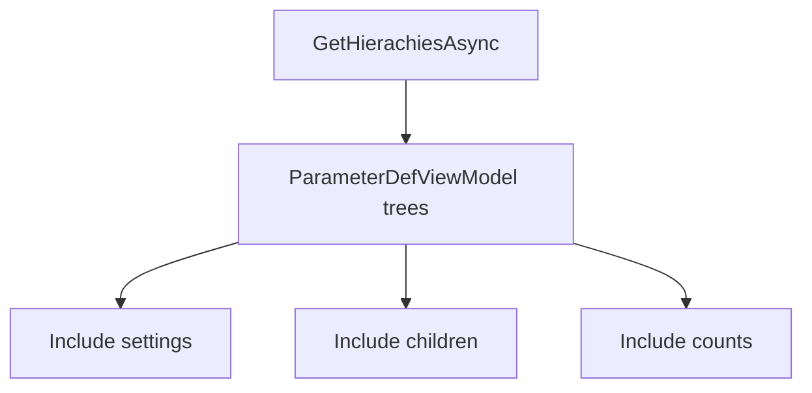

# .NET SDK — Client Reference: ProjectsClient (Projects AKA Agents)

## Overview

ProjectsClient provides methods to retrieve and manage projects (also called agents). You can:

- List a user’s projects and services.
- Retrieve a specific project or find by name.
- Create, update, and delete projects.
- Fetch project service hierarchies and service listings.
- Change project ownership.
- Manage credits (create, transfer, cancel, expire).
- Query balances, statements, and transaction audits.

!!! note "Responses"
    All client methods return PortalResponse<T>. Access the payload via the Result property. Some list-returning methods provide ObservableCollection<T> for easy binding.

## Prerequisites

1. Initialize the SDK and obtain the client.

    ```csharp
    using AIForged.API;

    var baseUrl = Environment.GetEnvironmentVariable("AIFORGED_BASE_URL") ?? "https://portal.aiforged.com";
    var apiKey  = Environment.GetEnvironmentVariable("AIFORGED_API_KEY")  ?? throw new Exception("AIFORGED_API_KEY not set.");

    var cfg = new Config { BaseUrl = baseUrl, Timeout = TimeSpan.FromMinutes(5) };
    await cfg.Init();
    cfg.HttpClient.DefaultRequestHeaders.Add("X-Api-Key", apiKey);

    var ctx = new Context(cfg);
    var projects = ctx.ProjectClient;
    ```

!!! tip "Services within projects"
    ProjectViewModel.Services returns the services for the project as ParameterDefViewModel items. See the ParamDefClient documentation for service model details.

## Methods

### Get projects and services for a user 

Signatures

```csharp
Task<PortalResponse<ObservableCollection<ProjectViewModel>>> GetByUserAsync(string userId, bool? includeBalance);
Task<PortalResponse<ObservableCollection<ProjectViewModel>>> GetByUserAsync(string userId, bool? includeBalance, CancellationToken cancellationToken);
```

Example

```csharp
var resp = await projects.GetByUserAsync(userId: "user-123", includeBalance: true);
var userProjects = resp.Result;
```

---

### Get a specific project for a user

Signatures

```csharp
Task<PortalResponse<ProjectViewModel>> GetUserProjectAsync(string userId, int? projectId);
Task<PortalResponse<ProjectViewModel>> GetUserProjectAsync(string userId, int? projectId, CancellationToken cancellationToken);
```

Example

```csharp
var prj = await projects.GetUserProjectAsync(userId: "user-123", projectId: 1001);
var project = prj.Result;
```

---

### Find a project by name for a user

Signatures

```csharp
Task<PortalResponse<ProjectViewModel>> GetByNameAsync(string userId, string projectName);
Task<PortalResponse<ProjectViewModel>> GetByNameAsync(string userId, string projectName, CancellationToken cancellationToken);
```

Example

```csharp
var prj = await projects.GetByNameAsync(userId: "user-123", projectName: "Acme-Invoices");
var project = prj.Result;
```

---

### Create a new project

Signatures

```csharp
Task<PortalResponse<ProjectViewModel>> CreateAsync(int? groupId, ProjectViewModel project);
Task<PortalResponse<ProjectViewModel>> CreateAsync(int? groupId, ProjectViewModel project, CancellationToken cancellationToken);
```

Example

```csharp
var newProject = new ProjectViewModel
{
    Name = "Acme-Invoices",
    Description = "Invoice processing agent",
    Comment = "Initial setup",
    Status = ProjectStatus.Active
};

var created = await projects.CreateAsync(groupId: null, project: newProject);
var project = created.Result;
```

!!! warning "Validation"
    Name, Description, and Comment have string length attributes in ProjectViewModel. Ensure values comply.

---

### Update a project

Signatures

```csharp
Task<PortalResponse<ProjectViewModel>> UpdateAsync(string userId, ProjectViewModel project);
Task<PortalResponse<ProjectViewModel>> UpdateAsync(string userId, ProjectViewModel project, CancellationToken cancellationToken);
```

Example

```csharp
project.Description = "Updated description";
var updated = await projects.UpdateAsync(userId: "user-123", project: project);
var updatedProject = updated.Result;
```

---

### Delete a project

Signatures

```csharp
Task<PortalResponse<ProjectViewModel>> DeleteAsync(string userId, int? projectId);
Task<PortalResponse<ProjectViewModel>> DeleteAsync(string userId, int? projectId, CancellationToken cancellationToken);
```

Example

```csharp
var deleted = await projects.DeleteAsync(userId: "admin-001", projectId: 1001);
var deletedProject = deleted.Result;
```

---

### Get project service hierarchies

Signatures

```csharp
Task<PortalResponse<ObservableCollection<ParameterDefViewModel>>> GetHierachiesAsync(
    string userId, int? projectId, int? stpdId, int? groupId,
    bool? includeCount, bool? onlyServices, bool? includeSettings, bool? includeChildren
);

Task<PortalResponse<ObservableCollection<ParameterDefViewModel>>> GetHierachiesAsync(
    string userId, int? projectId, int? stpdId, int? groupId,
    bool? includeCount, bool? onlyServices, bool? includeSettings, bool? includeChildren,
    CancellationToken cancellationToken
);
```

Example

```csharp
var hier = await projects.GetHierachiesAsync(
    userId: "user-123",
    projectId: 1001,
    stpdId: null,
    groupId: null,
    includeCount: true,
    onlyServices: false,
    includeSettings: true,
    includeChildren: true
);
var serviceTrees = hier.Result; // ParameterDefViewModel items
```

!!! tip "Scoping"
    Use stpdId to focus on a specific service. Set onlyServices to true to list services without field hierarchies.

---

### List services for a project

Signatures

```csharp
Task<PortalResponse<ObservableCollection<ParameterDefViewModel>>> GetServicesAsync(string userId, int? projectId, int? stlfilter, string enginefilter);
Task<PortalResponse<ObservableCollection<ParameterDefViewModel>>> GetServicesAsync(string userId, int? projectId, int? stlfilter, string enginefilter, CancellationToken cancellationToken);
```

Example

```csharp
var svc = await projects.GetServicesAsync(userId: "user-123", projectId: 1001, stlfilter: null, enginefilter: null);
var services = svc.Result;
```

---

### Change project owner

Signatures

```csharp
Task<PortalResponse<bool>> ChangeOwnerAsync(string userId, int? projectId, string toUserId);
Task<PortalResponse<bool>> ChangeOwnerAsync(string userId, int? projectId, string toUserId, CancellationToken cancellationToken);
```

Example

```csharp
var changed = await projects.ChangeOwnerAsync(userId: "admin-001", projectId: 1001, toUserId: "user-789");
var success = changed.Result;
```

!!! warning "Ownership changes"
    Ownership changes are impactful. Confirm projectId and toUserId before proceeding.

---

### Credits: get available credits

Signatures

```csharp
Task<PortalResponse<ObservableCollection<TransactionsAuditViewModel>>> GetAvailableCreditsAsync(
    string userId, int? projectId, DateTime? fromDate, DateTime? toDate, decimal? amount
);
Task<PortalResponse<ObservableCollection<TransactionsAuditViewModel>>> GetAvailableCreditsAsync(
    string userId, int? projectId, DateTime? fromDate, DateTime? toDate, decimal? amount, CancellationToken cancellationToken
);
```

Example

```csharp
var credits = await projects.GetAvailableCreditsAsync(
    userId: "auditor-1",
    projectId: 1001,
    fromDate: DateTime.UtcNow.AddMonths(-1),
    toDate: DateTime.UtcNow,
    amount: null
);
var available = credits.Result;
```

---

### Credits: create manual credit

Signatures

```csharp
Task<PortalResponse<TransactionsAuditViewModel>> CreateCreditAsync(string userId, int? projectId, int? bundleId, decimal? customAmount, string comment);
Task<PortalResponse<TransactionsAuditViewModel>> CreateCreditAsync(string userId, int? projectId, int? bundleId, decimal? customAmount, string comment, CancellationToken cancellationToken);
```

Example

```csharp
var credit = await projects.CreateCreditAsync(
    userId: "admin-001",
    projectId: 1001,
    bundleId: null,
    customAmount: 100m,
    comment: "Manual credit for pilot"
);
var createdCredit = credit.Result;
```

---

### Credits: transfer credits using an existing transaction

Signatures

```csharp
Task<PortalResponse<TransactionsAuditViewModel>> TransferCreditsAsync(
    string userId, int? transactionId, int? projectId, int? bundleId, decimal? customAmount, string comment
);
Task<PortalResponse<TransactionsAuditViewModel>> TransferCreditsAsync(
    string userId, int? transactionId, int? projectId, int? bundleId, decimal? customAmount, string comment, CancellationToken cancellationToken
);
```

Example

```csharp
var transfer = await projects.TransferCreditsAsync(
    userId: "admin-001",
    transactionId: 555,
    projectId: 2002,
    bundleId: null,
    customAmount: null,
    comment: "Transfer remaining credits"
);
var transferred = transfer.Result;
```

---

### Credits: transfer by amount

Signatures

```csharp
Task<PortalResponse<TransactionsAuditViewModel>> TransferCreditAmountAsync(
    int? fromProjectId, int? debitServiceId, int? toProjectId, decimal? amount, string comment
);
Task<PortalResponse<TransactionsAuditViewModel>> TransferCreditAmountAsync(
    int? fromProjectId, int? debitServiceId, int? toProjectId, decimal? amount, string comment, CancellationToken cancellationToken
);
```

Example

```csharp
var moved = await projects.TransferCreditAmountAsync(
    fromProjectId: 1001,
    debitServiceId: null,
    toProjectId: 2002,
    amount: 250m,
    comment: "Quarterly reallocation"
);
var moveResult = moved.Result;
```

---

### Credits: cancel a credit

Signatures

```csharp
Task<PortalResponse<TransactionsAuditViewModel>> CancelCreditAsync(string userId, int? transactionId, string comment);
Task<PortalResponse<TransactionsAuditViewModel>> CancelCreditAsync(string userId, int? transactionId, string comment, CancellationToken cancellationToken);
```

Example

```csharp
var canceled = await projects.CancelCreditAsync(
    userId: "admin-001",
    transactionId: 777,
    comment: "Duplicate credit reversal"
);
var cancelResult = canceled.Result;
```

---

### Credits: expire credits in a date range

Signatures

```csharp
Task<PortalResponse<TransactionsAuditViewModel>> ExpireCreditsAsync(string userId, int? projectId, DateTime? fromDate, DateTime? toDate, string comment);
Task<PortalResponse<TransactionsAuditViewModel>> ExpireCreditsAsync(string userId, int? projectId, DateTime? fromDate, DateTime? toDate, string comment, CancellationToken cancellationToken);
```

Example

```csharp
var expired = await projects.ExpireCreditsAsync(
    userId: "admin-001",
    projectId: 1001,
    fromDate: DateTime.UtcNow.AddMonths(-6),
    toDate: DateTime.UtcNow,
    comment: "Expire stale credits"
);
var expireResult = expired.Result;
```

---

### Transaction audit (current)

Signatures

```csharp
Task<PortalResponse<ObservableCollection<TransactionsAuditViewModel>>> GetTransactionAuditAsync(
    int? projectId, int? stpdId, DateTime? fromDate, DateTime? toDate, TimeSpan? interval, int? relatedTxId, bool? includeRelated
);
Task<PortalResponse<ObservableCollection<TransactionsAuditViewModel>>> GetTransactionAuditAsync(
    int? projectId, int? stpdId, DateTime? fromDate, DateTime? toDate, TimeSpan? interval, int? relatedTxId, bool? includeRelated, CancellationToken cancellationToken
);
```

Example

```csharp
var audit = await projects.GetTransactionAuditAsync(
    projectId: 1001,
    stpdId: null,
    fromDate: DateTime.UtcNow.AddDays(-30),
    toDate: DateTime.UtcNow,
    interval: TimeSpan.FromDays(1),
    relatedTxId: null,
    includeRelated: true
);
var transactions = audit.Result;
```

!!! tip "Related transactions"
    Use relatedTxId and includeRelated to explore linkages between credits, transfers, and charges.

---

### Transaction audit (obsolete)

Signatures

```csharp
[Obsolete]
Task<PortalResponse<ObservableCollection<TransactionsAuditViewModel>>> GetAuditAsync(
    int? projectId, int? stpdId, DateTime? fromDate, DateTime? toDate, TimeSpan? interval
);

[Obsolete]
Task<PortalResponse<ObservableCollection<TransactionsAuditViewModel>>> GetAuditAsync(
    int? projectId, int? stpdId, DateTime? fromDate, DateTime? toDate, TimeSpan? interval, CancellationToken cancellationToken
);
```

!!! warning "Deprecated"
    Use GetTransactionAuditAsync instead of GetAuditAsync.

---

### Get project balance

Signatures

```csharp
Task<PortalResponse<decimal?>> GetBalanceAsync(string userId, int? projectId, int? stpdId, DateTime? effectiveDate);
Task<PortalResponse<decimal?>> GetBalanceAsync(string userId, int? projectId, int? stpdId, DateTime? effectiveDate, CancellationToken cancellationToken);
```

Example

```csharp
var balanceResp = await projects.GetBalanceAsync(userId: "user-123", projectId: 1001, stpdId: null, effectiveDate: DateTime.UtcNow);
var balance = balanceResp.Result;
```

---

### Get balances for multiple projects

Signatures

```csharp
Task<PortalResponse<ObservableCollection<AccountBalanceItem>>> GetBalancesAsync(
    string userId, int? projectId, int? stpdId, int? groupId, bool? allRelated, DateTime? fromDate, DateTime? toDate
);
Task<PortalResponse<ObservableCollection<AccountBalanceItem>>> GetBalancesAsync(
    string userId, int? projectId, int? stpdId, int? groupId, bool? allRelated, DateTime? fromDate, DateTime? toDate, CancellationToken cancellationToken
);
```

Example

```csharp
var balances = await projects.GetBalancesAsync(
    userId: "user-123",
    projectId: null,
    stpdId: null,
    groupId: null,
    allRelated: true,
    fromDate: DateTime.UtcNow.AddMonths(-3),
    toDate: DateTime.UtcNow
);
var items = balances.Result;
```

---

### Get statement

Signatures

```csharp
Task<PortalResponse<ObservableCollection<AccountBalanceItem>>> GetStatementAsync(
    string userId, int? projectId, int? stpdId, int? groupId, DateTime? fromDate, DateTime? toDate, bool? allRelated, TimeSpan? interval
);
Task<PortalResponse<ObservableCollection<AccountBalanceItem>>> GetStatementAsync(
    string userId, int? projectId, int? stpdId, int? groupId, DateTime? fromDate, DateTime? toDate, bool? allRelated, TimeSpan? interval, CancellationToken cancellationToken
);
```

Example

```csharp
var stmt = await projects.GetStatementAsync(
    userId: "user-123",
    projectId: 1001,
    stpdId: null,
    groupId: null,
    fromDate: DateTime.UtcNow.AddMonths(-1),
    toDate: DateTime.UtcNow,
    allRelated: false,
    interval: TimeSpan.FromDays(1)
);
var statement = stmt.Result;
```

## Models

### ProjectViewModel

| Property | Type | Validation |
| --- | --- | --- |
| Id | int |  |
| UserId | string |  |
| Status | ProjectStatus |  |
| Name | string | StringLength(256) |
| Description | string | StringLength(450) |
| Comment | string | StringLength(450) |
| Dtc | DateTime |  |
| Dtm | DateTime |  |
| Balance | AccountBalanceItem |  |
| TotalDocsCount | int? |  |
| Services | ObservableCollection<ParameterDefViewModel> |  |

!!! info "Timestamps"
    Dtc and Dtm are timestamps for creation and modification respectively.

---

### AccountBalanceItem

| Property | Type | Validation |
| --- | --- | --- |
| Id | Guid |  |
| Seq | int |  |
| ServiceId | int? |  |
| ServiceTypeId | int? |  |
| ProjectId | int? |  |
| GroupId | int? |  |
| BundleId | int? |  |
| IsTransfer | bool? |  |
| UserId | string |  |
| DT | DateTime? |  |
| Info | string |  |
| DRCount | decimal? |  |
| CRCount | decimal? |  |
| DRQty | decimal? |  |
| CRQty | decimal? |  |
| CRQry | decimal? |  |
| DR | decimal? |  |
| CR | decimal? |  |
| Balance | decimal? |  |
| Project | string |  |
| Service | string |  |
| ServiceType | string |  |
| Bundle | string |  |
| Name | string |  |
| UserName | string |  |
| TxIds | ObservableCollection<int> |  |

---

### TransactionsAuditViewModel

| Property | Type | Validation |
| --- | --- | --- |
| Id | int |  |
| ProjectId | int |  |
| ServiceId | int? |  |
| DocumentId | int? |  |
| BundleId | int? |  |
| PaymentId | int? |  |
| ChargeId | int? |  |
| RelatedTxnId | int? |  |
| Status | TransactionStatus |  |
| UserId | string | StringLength(450) |
| RunId | string | StringLength(256) |
| DTC | DateTime |  |
| DTM | DateTime |  |
| Qty | int |  |
| Price | double |  |
| Cost | decimal |  |
| Charge | decimal? |  |
| IsCredit | bool |  |
| CreditBalance | decimal? |  |
| Comment | string | StringLength(128) |
| ExternalId | string | StringLength(64) |
| ProjectName | string |  |
| IsBillingProject | bool |  |
| ServiceName | string |  |
| BundleName | string |  |
| UserName | string |  |
| AuditUserName | string |  |

## Enums

### ProjectStatus

| Value | Numeric Value |
| --- | --- |
| None | 0 |
| Active | 1 |
| Disabled | 2 |
| Billing | 3 |
| Deleted | 90 |
| Error | 99 |

### TransactionStatus

| Value | Numeric Value |
| --- | --- |
| Active | 0 |
| Transfered | 1 |
| Deleted | 99 |

## Examples

### Create, update, and fetch services for a project

```csharp
// Create
var createResp = await projects.CreateAsync(groupId: null, project: new ProjectViewModel
{
    Name = "Acme-Invoices",
    Description = "Invoice processing agent",
    Status = ProjectStatus.Active
});
var project = createResp.Result;

// Update
project.Comment = "Pilot rollout";
var updateResp = await projects.UpdateAsync(userId: "user-123", project: project);
var updated = updateResp.Result;

// List services
var services = (await projects.GetServicesAsync("user-123", updated.Id, stlfilter: null, enginefilter: null)).Result;
```

---

### Credits lifecycle: create, transfer, cancel

```csharp
// Create a manual credit
var createdCredit = (await projects.CreateCreditAsync("admin-001", 1001, bundleId: null, customAmount: 150m, comment: "Kickoff credit")).Result;

// Transfer by amount to another project
var transferred = (await projects.TransferCreditAmountAsync(fromProjectId: 1001, debitServiceId: null, toProjectId: 2002, amount: 50m, comment: "Rebalance")).Result;

// Cancel a credit transaction
var canceled = (await projects.CancelCreditAsync("admin-001", transactionId: createdCredit.Id, comment: "Reversal")).Result;
```

!!! tip "Audit linkage"
    Use GetTransactionAuditAsync with relatedTxId to follow chains of transactions (original credit, transfers, cancellations).

---

### Financial overview: balances and statements

```csharp
// Single project balance
var balance = (await projects.GetBalanceAsync("user-123", projectId: 1001, stpdId: null, effectiveDate: DateTime.UtcNow)).Result;

// Multiple balances (last quarter)
var balances = (await projects.GetBalancesAsync("user-123", projectId: null, stpdId: null, groupId: null, allRelated: true, fromDate: DateTime.UtcNow.AddMonths(-3), toDate: DateTime.UtcNow)).Result;

// Statement aggregated by day
var statement = (await projects.GetStatementAsync("user-123", 1001, stpdId: null, groupId: null, fromDate: DateTime.UtcNow.AddMonths(-1), toDate: DateTime.UtcNow, allRelated: false, interval: TimeSpan.FromDays(1))).Result;
```

---

### Service hierarchy visualization



!!! example "Pull service hierarchies"
    Set includeSettings and includeChildren to true to obtain full service trees for inspection or export.

## Troubleshooting

- Project not found
    - Verify userId and projectId or use GetByNameAsync to lookup by name.
- Ownership change fails
    - Confirm both userId and toUserId exist and have appropriate permissions.
- Credits operations unexpected
    - Check date ranges and amounts; review GetTransactionAuditAsync to verify effective transactions.
- Empty services listing
    - Confirm project is Active and user has access; try GetHierachiesAsync with onlyServices set to true.