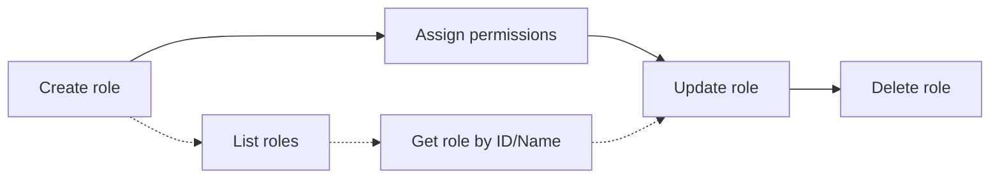

# .NET SDK — Client Reference: RolesClient

## Overview

Use RolesClient to retrieve, create, update, delete, and list system-level roles and permission claims. System-level roles group permissions that can be assigned directly to users for platform-wide capabilities. This is distinct from GroupRoles, which define project (agent) permissions.

!!! note "Availability"
    RolesClient is applicable when AIForged is deployed in your own Azure tenant via the Azure Marketplace.

!!! info "Responses"
    All client methods return PortalResponse<T>. Access the payload via .Result.

## Prerequisites

1. Install and initialize the SDK.

    ```csharp
    using AIForged.API;

    var baseUrl = Environment.GetEnvironmentVariable("AIFORGED_BASE_URL") ?? "https://portal.aiforged.com";
    var apiKey  = Environment.GetEnvironmentVariable("AIFORGED_API_KEY")  ?? throw new Exception("AIFORGED_API_KEY not set.");

    var cfg = new Config { BaseUrl = baseUrl, Timeout = TimeSpan.FromMinutes(5) };
    await cfg.Init();
    cfg.HttpClient.DefaultRequestHeaders.Add("X-Api-Key", apiKey);

    var ctx = new Context(cfg);
    var roles = ctx.RolesClient;
    ```

!!! tip "Role vs. GroupRole"
    - Roles (this client) control system-level permissions.
    - GroupRoles control project (agent) permissions.

## Methods

### Get role by ID

Signatures

```csharp
Task<PortalResponse<RoleViewModel>> GetAsync(string id);
Task<PortalResponse<RoleViewModel>> GetAsync(string id, CancellationToken cancellationToken);
```

Example

```csharp
var resp = await roles.GetAsync("role-id-001");
var role = resp.Result;
```

---

### Get role by name

Signatures

```csharp
Task<PortalResponse<RoleViewModel>> GetByNameAsync(string name);
Task<PortalResponse<RoleViewModel>> GetByNameAsync(string name, CancellationToken cancellationToken);
```

Example

```csharp
var resp = await roles.GetByNameAsync("Tenant Administrator");
var role = resp.Result;
```

---

### List all roles

Signatures

```csharp
Task<PortalResponse<ObservableCollection<RoleViewModel>>> GetAllAsync();
Task<PortalResponse<ObservableCollection<RoleViewModel>>> GetAllAsync(CancellationToken cancellationToken);
```

Example

```csharp
var resp = await roles.GetAllAsync();
var allRoles = resp.Result;
```

---

### List roles (paged)

Signatures

```csharp
Task<PortalResponse<ObservableCollection<RoleViewModel>>> GetPagedAsync(int? page, int? pageSize);
Task<PortalResponse<ObservableCollection<RoleViewModel>>> GetPagedAsync(int? page, int? pageSize, CancellationToken cancellationToken);
```

Example

```csharp
var page = 1;
var pageSize = 50;
var resp = await roles.GetPagedAsync(page, pageSize);
var pagedRoles = resp.Result;
```

!!! note "Paging"
    Page numbering and maximum page size are not documented here. See Open Questions.

---

### Create a role

Signatures

```csharp
Task<PortalResponse<RoleViewModel>> CreateAsync(RoleViewModel role);
Task<PortalResponse<RoleViewModel>> CreateAsync(RoleViewModel role, CancellationToken cancellationToken);
```

Example

```csharp
var roleToCreate = new RoleViewModel
{
    Name = "Ops Auditor",
    Description = "Read-only access to audit and permissions dashboards",
    Permissions = new System.Collections.ObjectModel.ObservableCollection<PermissionViewModel>
    {
        new PermissionViewModel { Name = "Audit.Read", Value = "audit.read", GroupName = "Audit", Description = "View audit logs" },
        new PermissionViewModel { Name = "Roles.Read", Value = "roles.read", GroupName = "Security", Description = "View roles and permissions" },
    }
};

var created = await roles.CreateAsync(roleToCreate);
var newRole = created.Result;
```

!!! warning "Validation"
    RoleViewModel.Name is required and must be 2–200 characters (StringLength(200, MinimumLength = 2)).

---

### Update a role

Signatures

```csharp
Task<PortalResponse<bool>> UpdateAsync(RoleViewModel role);
Task<PortalResponse<bool>> UpdateAsync(RoleViewModel role, CancellationToken cancellationToken);
```

Example

```csharp
// Assume role was previously retrieved
role.Description = "Read-only access to audit data and role views";
role.Permissions.Add(new PermissionViewModel
{
    Name = "Permissions.Read",
    Value = "permissions.read",
    GroupName = "Security",
    Description = "View permission claims"
});

var updated = await roles.UpdateAsync(role);
var success = updated.Result; // bool
```

---

### Delete a role

Signatures

```csharp
Task<PortalResponse<RoleViewModel>> DeleteAsync(string id);
Task<PortalResponse<RoleViewModel>> DeleteAsync(string id, CancellationToken cancellationToken);
```

Example

```csharp
var deleted = await roles.DeleteAsync("role-id-001");
var deletedRole = deleted.Result;
```

!!! warning "Impact"
    Deleting a role may affect users who rely on its permissions. Validate dependencies before deletion.

---

### List all permission claims

Signatures

```csharp
Task<PortalResponse<ObservableCollection<PermissionViewModel>>> GetAllPermissionsAsync();
Task<PortalResponse<ObservableCollection<PermissionViewModel>>> GetAllPermissionsAsync(CancellationToken cancellationToken);
```

Example

```csharp
var claims = await roles.GetAllPermissionsAsync();
var permissions = claims.Result;
```

!!! tip "Use case"
    Fetch all permissions to build a UI for selecting claims when creating or updating roles.

## Models

### RoleViewModel

| Property | Type | Validation |
| --- | --- | --- |
| Id | string |  |
| Name | string | Required; StringLength(200, MinimumLength = 2) |
| Description | string |  |
| UsersCount | int |  |
| Permissions | ObservableCollection<PermissionViewModel> |  |

### PermissionViewModel

| Property | Type | Validation |
| --- | --- | --- |
| Name | string |  |
| Value | string |  |
| GroupName | string |  |
| Description | string |  |

## Examples

### Create, verify, update, and delete a role

```csharp
// 1) Create
var created = await roles.CreateAsync(new RoleViewModel
{
    Name = "Ops Auditor",
    Description = "Read-only audit access",
    Permissions = new System.Collections.ObjectModel.ObservableCollection<PermissionViewModel>
    {
        new PermissionViewModel { Name = "Audit.Read", Value = "audit.read", GroupName = "Audit", Description = "View audit logs" }
    }
});
var role = created.Result;

// 2) Verify by name
var fetched = await roles.GetByNameAsync(role.Name);
var byName = fetched.Result;

// 3) Update (append a permission)
byName.Permissions.Add(new PermissionViewModel
{
    Name = "Roles.Read",
    Value = "roles.read",
    GroupName = "Security",
    Description = "View roles"
});
var updateOk = (await roles.UpdateAsync(byName)).Result;

// 4) Delete
var deleted = await roles.DeleteAsync(byName.Id);
```

### Enumerate permissions and build a selection list

```csharp
var permsResp = await roles.GetAllPermissionsAsync();
var perms = permsResp.Result;

// Build a simple map for UI
var grouped = perms
    .GroupBy(p => p.GroupName)
    .OrderBy(g => g.Key)
    .ToDictionary(
        g => g.Key ?? "(Ungrouped)",
        g => g.OrderBy(p => p.Name).Select(p => $"{p.Name} ({p.Value})").ToList()
    );
```

## Troubleshooting

- Role validation failures
    - Ensure Name is between 2 and 200 characters and not empty.
- Not found (Get/Delete)
    - Verify the role Id or Name is correct and exists.
- Concurrency conflicts on UpdateAsync
    - Re-fetch the latest role state before updating to avoid overwriting changes.
- Empty permissions list
    - Populate Permissions when creating/updating roles, or query GetAllPermissionsAsync to discover available claims.

