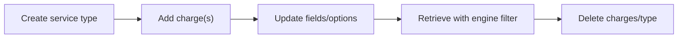
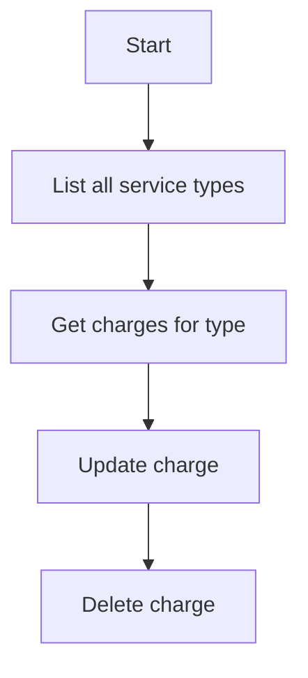

# .NET SDK — Client Reference: ServiceTypesClient

## Overview

ServiceTypesClient retrieves and manages Service Types in AIForged. Service Types represent the various AI and utility services available in the platform.

- Read all service types (with an engine filter).
- Create, update, and delete service types.
- Read and manage service type charges.
- Retrieve all charges across service types.

!!! note "Deployment scope"
    CRUD operations for Service Types are available when AIForged is deployed in your own Azure tenant via the Azure Marketplace.

!!! info "Responses"
    All client methods return PortalResponse<T>. Access the payload via the Result property.

## Prerequisites

1. Initialize the SDK and obtain the client.

    ```csharp
    using AIForged.API;
    using System;
    using System.Collections.ObjectModel;
    using System.Threading;
    using System.Threading.Tasks;

    var baseUrl = Environment.GetEnvironmentVariable("AIFORGED_BASE_URL") ?? "https://portal.aiforged.com";
    var apiKey  = Environment.GetEnvironmentVariable("AIFORGED_API_KEY")  ?? throw new Exception("AIFORGED_API_KEY not set.");

    var cfg = new Config { BaseUrl = baseUrl, Timeout = TimeSpan.FromMinutes(5) };
    await cfg.Init();
    cfg.HttpClient.DefaultRequestHeaders.Add("X-Api-Key", apiKey);

    var ctx = new Context(cfg);
    var serviceTypes = ctx.ServiceTypeClient;
    ```

!!! tip "When to use ServiceTypesClient"
    Use this client to manage the catalog of Service Types (such as enabling training or classification options) and to maintain pricing/charge schedules at the service-type level.

## Methods

### Get all service types (optional engine filter)

Signatures

```csharp
Task<PortalResponse<ObservableCollection<ServiceTypeViewModel>>> GetAllAsync(string enginefilter);
Task<PortalResponse<ObservableCollection<ServiceTypeViewModel>>> GetAllAsync(string enginefilter, CancellationToken cancellationToken);
```

Example

```csharp
var resp = await serviceTypes.GetAllAsync(enginefilter: null);
var allTypes = resp.Result;
```

!!! warning "Filter parameter"
    The accepted values and format for enginefilter are not documented here. Adjust the example to match your environment.

---

### Create a new service type

Signatures

```csharp
Task<PortalResponse<ServiceTypeViewModel>> CreateAsync(ServiceTypeViewModel service);
Task<PortalResponse<ServiceTypeViewModel>> CreateAsync(ServiceTypeViewModel service, CancellationToken cancellationToken);
```

Example

```csharp
var toCreate = new ServiceTypeViewModel
{
    Name = "Custom Extractor",
    Description = "Extraction-capable service type",
    Group = "Extraction",
    Status = ServiceTypeStatus.Enabled,
    Options = ServiceOptions.Training | ServiceOptions.Classification | ServiceOptions.Definition,
    Engine = "custom-engine",
    BillingDimension = "documents",
    BillingQuantityIncluded = 100
};

var created = await serviceTypes.CreateAsync(toCreate);
var createdType = created.Result;
```

!!! tip "Minimal fields"
    Ensure Name and Status align with your governance. Additional fields (Options, Engine, BillingDimension) enable behaviors and billing semantics.

---

### Update a service type

Signatures

```csharp
Task<PortalResponse<ServiceTypeViewModel>> UpdateAsync(ServiceTypeViewModel service);
Task<PortalResponse<ServiceTypeViewModel>> UpdateAsync(ServiceTypeViewModel service, CancellationToken cancellationToken);
```

Example

```csharp
createdType.Description = "Updated: extraction and classification";
createdType.Options |= ServiceOptions.Verification;

var updated = await serviceTypes.UpdateAsync(createdType);
var updatedType = updated.Result;
```

---

### Delete a service type

Signatures

```csharp
Task<PortalResponse<ServiceTypeViewModel>> DeleteAsync(int? id);
Task<PortalResponse<ServiceTypeViewModel>> DeleteAsync(int? id, CancellationToken cancellationToken);
```

Example

```csharp
var deleted = await serviceTypes.DeleteAsync(createdType.Id);
var deletedType = deleted.Result;
```

!!! warning "Downstream impact"
    Deleting a service type that is referenced elsewhere can disrupt dependent services. Review references before deletion.

---

### Get all service types and charges

Signatures

```csharp
Task<PortalResponse<ObservableCollection<ServiceTypeChargeViewModel>>> GetAllChargesAsync();
Task<PortalResponse<ObservableCollection<ServiceTypeChargeViewModel>>> GetAllChargesAsync(CancellationToken cancellationToken);
```

Example

```csharp
var allCharges = await serviceTypes.GetAllChargesAsync();
var chargesList = allCharges.Result;
```

---

### Get charges for a specific service type

Signatures

```csharp
Task<PortalResponse<ObservableCollection<ServiceTypeChargeViewModel>>> GetChargesAsync(int? serviceTypeId);
Task<PortalResponse<ObservableCollection<ServiceTypeChargeViewModel>>> GetChargesAsync(int? serviceTypeId, CancellationToken cancellationToken);
```

Example

```csharp
var charges = await serviceTypes.GetChargesAsync(serviceTypeId: createdType.Id);
var typeCharges = charges.Result;
```

---

### Create a service type charge

Signatures

```csharp
Task<PortalResponse<ServiceTypeChargeViewModel>> CreateChargeAsync(ServiceTypeChargeViewModel charge);
Task<PortalResponse<ServiceTypeChargeViewModel>> CreateChargeAsync(ServiceTypeChargeViewModel charge, CancellationToken cancellationToken);
```

Example

```csharp
var newCharge = new ServiceTypeChargeViewModel
{
    ServiceTypeId = createdType.Id,
    Status = ChargeStatus.Active,
    FromDate = DateTime.UtcNow,
    Cost = 0.02m,
    Charge = 0.05m,
    Comment = "Intro pricing",
    UserId = "billing-admin"
};

var createdCharge = await serviceTypes.CreateChargeAsync(newCharge);
var chargeItem = createdCharge.Result;
```

---

### Update a service type charge

Signatures

```csharp
Task<PortalResponse<ServiceTypeChargeViewModel>> UpdateChargeAsync(ServiceTypeChargeViewModel charge);
Task<PortalResponse<ServiceTypeChargeViewModel>> UpdateChargeAsync(ServiceTypeChargeViewModel charge, CancellationToken cancellationToken);
```

Example

```csharp
chargeItem.Comment = "Intro pricing (rev1)";
var updatedCharge = await serviceTypes.UpdateChargeAsync(chargeItem);
var chargeAfterUpdate = updatedCharge.Result;
```

---

### Delete a service type charge

Signatures

```csharp
Task<PortalResponse<ServiceTypeChargeViewModel>> DeleteChargeAsync(int? id);
Task<PortalResponse<ServiceTypeChargeViewModel>> DeleteChargeAsync(int? id, CancellationToken cancellationToken);
```

Example

```csharp
var chargeDeleted = await serviceTypes.DeleteChargeAsync(chargeAfterUpdate.Id);
var deletedCharge = chargeDeleted.Result;
```

## Models

### ServiceTypeViewModel

| Property | Type | Validation |
| --- | --- | --- |
| Id | int |  |
| Name | string | StringLength(256) |
| Description | string | StringLength(450) |
| Group | string | StringLength(256) |
| DTC | DateTime |  |
| DTM | DateTime |  |
| Status | ServiceTypeStatus |  |
| Options | ServiceOptions | Flags |
| Availability | Availability |  |
| Logo | string | StringLength(256) |
| Icon | string | StringLength(256) |
| Info | string | StringLength(450) |
| Help | string | StringLength(450) |
| Sample | string | StringLength(450) |
| Engine | string | StringLength(450) |
| Cost | decimal? |  |
| Charge | decimal? |  |
| ValueType | ValueType? |  |
| BillingDimension | string |  |
| BillingQuantityIncluded | int? |  |
| Charges | ObservableCollection<ServiceTypeChargeViewModel> |  |

!!! note "Field relationships"
    - Options is a bitwise flags enum (ServiceOptions).
    - Charges provides the list of pricing periods configured for this service type.

---

### ServiceTypeChargeViewModel

| Property | Type | Validation |
| --- | --- | --- |
| Id | int |  |
| ServiceTypeId | int |  |
| Status | ChargeStatus |  |
| FromDate | DateTime |  |
| ToDate | DateTime? |  |
| Cost | decimal? |  |
| Charge | decimal? |  |
| Comment | string |  |
| UserId | string |  |

## Enums

### ServiceTypeStatus

| Value | Numeric Value |
| --- | --- |
| Disabled | 0 |
| Enabled | 1 |

### ServiceOptions (flags)

| Value | Numeric Value |
| --- | --- |
| Billing | 1 |
| Definition | 2 |
| Training | 4 |
| Classification | 8 |
| Code | 16 |
| Verification | 32 |
| Scraping | 64 |
| Attachment | 128 |
| Indexing | 256 |
| Inbox | 512 |
| Outbox | 1024 |
| Processor | 2048 |
| Configure | 4096 |
| Classes | 8192 |
| Keys | 16384 |
| Speech | 32768 |
| Video | 65536 |
| Analysis | 131072 |
| Labelling | 262144 |
| Vendors | 524288 |
| BusinessUnits | 1048576 |
| PurchaseOrders | 2097152 |
| GLCodes | 4194304 |
| HintMatrix | 8388608 |
| QuestionMatrix | 16777216 |
| PromptMatrix | 33554432 |
| WorkFlowReason | 67108864 |

### ChargeStatus

| Value | Numeric Value |
| --- | --- |
| Active | 0 |
| Deleted | 99 |

## Examples

### Typical lifecycle: create, configure charges, update, delete

1. Create the service type.

    ```csharp
    var created = (await serviceTypes.CreateAsync(new ServiceTypeViewModel
    {
        Name = "Acme OCR",
        Description = "OCR service type",
        Group = "OCR",
        Status = ServiceTypeStatus.Enabled,
        Options = ServiceOptions.Training | ServiceOptions.Definition
    })).Result;
    ```

1. Add a charge period.

    ```csharp
    var charge = (await serviceTypes.CreateChargeAsync(new ServiceTypeChargeViewModel
    {
        ServiceTypeId = created.Id,
        Status = ChargeStatus.Active,
        FromDate = DateTime.UtcNow,
        Cost = 0.01m,
        Charge = 0.03m,
        Comment = "Launch pricing",
        UserId = "billing-admin"
    })).Result;
    ```

1. Update properties.

    ```csharp
    created.Info = "Supports scanned PDF inputs";
    created.Options |= ServiceOptions.Verification;
    var updated = (await serviceTypes.UpdateAsync(created)).Result;
    ```

1. Delete a charge and then delete the service type.

    ```csharp
    var deletedCharge = (await serviceTypes.DeleteChargeAsync(charge.Id)).Result;
    var deletedType = (await serviceTypes.DeleteAsync(updated.Id)).Result;
    ```

!!! example "Fetch with engine filter"
    ```csharp
    var openAiTypes = (await serviceTypes.GetAllAsync(enginefilter: "azure-openai")).Result;
    ```

## Workflows





## Troubleshooting

- Creation/update fails for ServiceTypeViewModel
    - Verify required and length-constrained fields (for example, Name up to 256, Description up to 450).
- Charges not appearing
    - Confirm ServiceTypeId is set and FromDate/Status are appropriate; re-query with GetChargesAsync.
- Delete operations fail
    - Ensure the target is not in use and the identifier is correct.