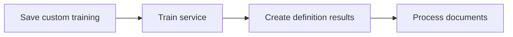
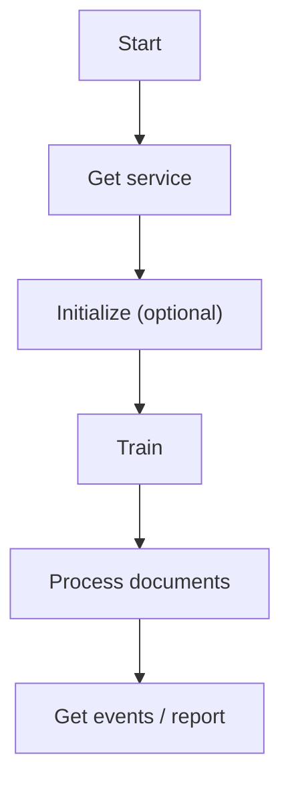

# .NET SDK — Client Reference: ServicesClient

## Overview

ServicesClient lets you retrieve, create, initialize, move, and manage services for a project (agent). It also provides operations to kick off processing, trigger or force retraining, and manage/save custom training parameters (labeling) for documents in services that support training.

- Retrieve and create services.
- Initialize a service (by project/class, when required).
- Change service type or move services across projects.
- Trigger training, build definition results, and process documents.
- Manage custom training (save, read, delete).
- Inspect service events and training reports.
- Manage service charges (create, update, delete, list).
- Inspect references and retrieve code constants.

!!! note "Responses"
    All client methods return PortalResponse<T>. Access returned payloads via the Result property.

## Prerequisites

1. Initialize the SDK context and obtain the client.

    ```csharp
    using AIForged.API;
    using System;
    using System.Collections.Generic;
    using System.Collections.ObjectModel;
    using System.Threading;
    using System.Threading.Tasks;

    // Configure context (ensure environment variables are set)
    var baseUrl = Environment.GetEnvironmentVariable("AIFORGED_BASE_URL") ?? "https://portal.aiforged.com";
    var apiKey  = Environment.GetEnvironmentVariable("AIFORGED_API_KEY")  ?? throw new Exception("AIFORGED_API_KEY not set.");

    var cfg = new Config { BaseUrl = baseUrl, Timeout = TimeSpan.FromMinutes(5) };
    await cfg.Init();
    cfg.HttpClient.DefaultRequestHeaders.Add("X-Api-Key", apiKey);

    var ctx = new Context(cfg);
    var services = ctx.ServicesClient;
    ```

!!! tip "Model cross-references"
    Many methods use shared models such as ParameterDefViewModel, DocumentViewModel, and DocumentParameterViewModel. Refer to their dedicated client pages for full schemas and usage.

## Methods

### Get a service by ID

Signatures

```csharp
Task<PortalResponse<ParameterDefViewModel>> GetAsync(int? stpdId);
Task<PortalResponse<ParameterDefViewModel>> GetAsync(int? stpdId, CancellationToken cancellationToken);
```

Example

```csharp
var resp = await services.GetAsync(stpdId: 2001);
var service = resp.Result;
```

---

### Create a new service

Signatures

```csharp
Task<PortalResponse<ParameterDefViewModel>> CreateAsync(string userId, int? projectId, ParameterDefViewModel service);
Task<PortalResponse<ParameterDefViewModel>> CreateAsync(string userId, int? projectId, ParameterDefViewModel service, CancellationToken cancellationToken);
```

Example

```csharp
var newServiceDef = new ParameterDefViewModel
{
    // Populate fields for the new service definition as required by your scenario
};
var createdResp = await services.CreateAsync(
    userId: "user-123",
    projectId: 1001,
    service: newServiceDef
);
var createdService = createdResp.Result;
```

!!! warning "Validation"
    Ensure the ParameterDefViewModel you submit satisfies your service type’s required fields and constraints.

---

### Initialize a service

Signatures

```csharp
Task<PortalResponse<ParameterDefViewModel>> InitializeAsync(string userId, int? projectId, int? stpdId, int? classId);
Task<PortalResponse<ParameterDefViewModel>> InitializeAsync(string userId, int? projectId, int? stpdId, int? classId, CancellationToken cancellationToken);
```

Example

```csharp
var initResp = await services.InitializeAsync(
    userId: "user-123",
    projectId: 1001,
    stpdId: createdService.Id,
    classId: 3001
);
var initialized = initResp.Result;
```

---

### Change a service type

Signatures

```csharp
Task<PortalResponse<bool>> ChangeServiceTypeAsync(int? stpdId, int? newstId);
Task<PortalResponse<bool>> ChangeServiceTypeAsync(int? stpdId, int? newstId, CancellationToken cancellationToken);
```

Example

```csharp
var ok = await services.ChangeServiceTypeAsync(stpdId: createdService.Id, newstId: 42);
var updated = ok.Result; // bool
```

---

### Move a service to another project

Signatures

```csharp
Task<PortalResponse<bool>> MoveAsync(string userId, int? projectId, int? stpdId, int? toProjectId, bool? moveDocs);
Task<PortalResponse<bool>> MoveAsync(string userId, int? projectId, int? stpdId, int? toProjectId, bool? moveDocs, CancellationToken cancellationToken);
```

Example

```csharp
var moved = await services.MoveAsync(
    userId: "admin-001",
    projectId: 1001,
    stpdId: createdService.Id,
    toProjectId: 2002,
    moveDocs: true
);
var moveOk = moved.Result;
```

!!! warning "Impact"
    Moving a service can affect downstream processes. Verify service dependencies and document locations before moving.

---

### Build definition results after training

Signatures

```csharp
Task<PortalResponse<ObservableCollection<ServiceEventViewModel>>> CreateDefinitionResultsAsync(string userId, int? projectId, int? stpdId);
Task<PortalResponse<ObservableCollection<ServiceEventViewModel>>> CreateDefinitionResultsAsync(string userId, int? projectId, int? stpdId, CancellationToken cancellationToken);
```

Example

```csharp
var defEvents = await services.CreateDefinitionResultsAsync(
    userId: "user-123",
    projectId: 1001,
    stpdId: createdService.Id
);
var eventsAfterDefine = defEvents.Result;
```

---

### Train a service

Signatures

```csharp
Task<PortalResponse<ObservableCollection<ServiceEventViewModel>>> TrainAsync(string userId, int? projectId, int? stpdId, bool? forceRetraining);
Task<PortalResponse<ObservableCollection<ServiceEventViewModel>>> TrainAsync(string userId, int? projectId, int? stpdId, bool? forceRetraining, CancellationToken cancellationToken);
```

Example

```csharp
var trainResp = await services.TrainAsync(
    userId: "user-123",
    projectId: 1001,
    stpdId: createdService.Id,
    forceRetraining: false
);
var trainEvents = trainResp.Result;
```

---

### Save custom training (labeling)

Signatures

```csharp
Task<PortalResponse<ObservableCollection<DocumentParameterViewModel>>> SaveCustomTrainingAsync(
    string userId, int? projectId, int? stpdId, int? docId, List<DocumentParameterViewModel> parameters
);
Task<PortalResponse<ObservableCollection<DocumentParameterViewModel>>> SaveCustomTrainingAsync(
    string userId, int? projectId, int? stpdId, int? docId, List<DocumentParameterViewModel> parameters, CancellationToken cancellationToken
);
```

Example

```csharp
var trainingParams = new List<DocumentParameterViewModel>
{
    new DocumentParameterViewModel { DocumentId = 5555, ParamDefId = 321, Value = "ACME LTD" },
    new DocumentParameterViewModel { DocumentId = 5555, ParamDefId = 322, Value = "2025/01/15" }
};

var saveResp = await services.SaveCustomTrainingAsync(
    userId: "trainer-1",
    projectId: 1001,
    stpdId: createdService.Id,
    docId: 5555,
    parameters: trainingParams
);
var savedParams = saveResp.Result;
```

!!! tip "Iterate"
    After saving training parameters, trigger TrainAsync and, if supported, CreateDefinitionResultsAsync to update definitions.

---

### Get custom training parameters

Signatures

```csharp
Task<PortalResponse<ObservableCollection<DocumentParameterViewModel>>> GetCustomTrainingAsync(string userId, int? projectId, int? stpdId, int? docId);
Task<PortalResponse<ObservableCollection<DocumentParameterViewModel>>> GetCustomTrainingAsync(string userId, int? projectId, int? stpdId, int? docId, CancellationToken cancellationToken);
```

Example

```csharp
var getResp = await services.GetCustomTrainingAsync(
    userId: "trainer-1",
    projectId: 1001,
    stpdId: createdService.Id,
    docId: 5555
);
var currentLabels = getResp.Result;
```

---

### Get custom training fields

Signatures

```csharp
Task<PortalResponse<ObservableCollection<ParameterDefViewModel>>> GetCustomTrainingFieldsAsync(string userId, int? projectId, int? stpdId, int? classId);
Task<PortalResponse<ObservableCollection<ParameterDefViewModel>>> GetCustomTrainingFieldsAsync(string userId, int? projectId, int? stpdId, int? classId, CancellationToken cancellationToken);
```

Example

```csharp
var fieldsResp = await services.GetCustomTrainingFieldsAsync(
    userId: "trainer-1",
    projectId: 1001,
    stpdId: createdService.Id,
    classId: 3001
);
var trainingFields = fieldsResp.Result;
```

---

### Delete custom training parameters

Signatures

```csharp
Task<PortalResponse<ObservableCollection<DocumentParameterViewModel>>> DeleteCustomTrainingAsync(string userId, int? projectId, int? stpdId, int? docId, int? parId);
Task<PortalResponse<ObservableCollection<DocumentParameterViewModel>>> DeleteCustomTrainingAsync(string userId, int? projectId, int? stpdId, int? docId, int? parId, CancellationToken cancellationToken);
```

Example

```csharp
var delResp = await services.DeleteCustomTrainingAsync(
    userId: "trainer-1",
    projectId: 1001,
    stpdId: createdService.Id,
    docId: 5555,
    parId: 321
);
var remaining = delResp.Result;
```

---

### Get training report

Signatures

```csharp
Task<PortalResponse<ObservableCollection<DocumentViewModel>>> GetTrainingReportAsync(int? projectId, int? stpdId, int? classId);
Task<PortalResponse<ObservableCollection<DocumentViewModel>>> GetTrainingReportAsync(int? projectId, int? stpdId, int? classId, CancellationToken cancellationToken);
```

Example

```csharp
var rep = await services.GetTrainingReportAsync(projectId: 1001, stpdId: createdService.Id, classId: null);
var reportDocs = rep.Result;
```

---

### Process documents

Signatures

```csharp
Task<PortalResponse<ObservableCollection<DocumentViewModel>>> ProcessAsync(
    string userId, int? projectId, int? stpdId, List<int> documentIds, bool? force,
    bool? deleteChildDocs, bool? deleteChildDocsRecursive, bool? deletePreviousOutputDocs,
    bool? resetResults, bool? resetComments, string resumeIdentifier, bool? queueProcessing
);
Task<PortalResponse<ObservableCollection<DocumentViewModel>>> ProcessAsync(
    string userId, int? projectId, int? stpdId, List<int> documentIds, bool? force,
    bool? deleteChildDocs, bool? deleteChildDocsRecursive, bool? deletePreviousOutputDocs,
    bool? resetResults, bool? resetComments, string resumeIdentifier, bool? queueProcessing,
    CancellationToken cancellationToken
);
```

Example

```csharp
var processResp = await services.ProcessAsync(
    userId: "ops-001",
    projectId: 1001,
    stpdId: createdService.Id,
    documentIds: new List<int> { 5555, 5556 },
    force: false,
    deleteChildDocs: false,
    deleteChildDocsRecursive: false,
    deletePreviousOutputDocs: false,
    resetResults: false,
    resetComments: false,
    resumeIdentifier: null,
    queueProcessing: true
);
var processedDocs = processResp.Result;
```

!!! warning "Resets and deletes"
    Use delete/reset flags carefully to avoid unintended data loss. Verify behavior in a non-production environment first.

---

### Get related users (service context)

Signatures

```csharp
Task<PortalResponse<ObservableCollection<GroupRoleViewModel>>> GetRelatedUsersAsync(string userId, bool? includeBalances, int? projectId, int? serviceId);
Task<PortalResponse<ObservableCollection<GroupRoleViewModel>>> GetRelatedUsersAsync(string userId, bool? includeBalances, int? projectId, int? serviceId, CancellationToken cancellationToken);
```

Example

```csharp
var rel = await services.GetRelatedUsersAsync(
    userId: "admin-001",
    includeBalances: true,
    projectId: 1001,
    serviceId: createdService.Id
);
var relatedUsers = rel.Result;
```

---

### Get events for a service

Signatures

```csharp
Task<PortalResponse<ObservableCollection<ServiceEventViewModel>>> GetEventsAsync(string userId, int? projectId, int? stpdId, DateTime? fromDate, DateTime? toDate);
Task<PortalResponse<ObservableCollection<ServiceEventViewModel>>> GetEventsAsync(string userId, int? projectId, int? stpdId, DateTime? fromDate, DateTime? toDate, CancellationToken cancellationToken);
```

Example

```csharp
var eventsResp = await services.GetEventsAsync(
    userId: "audit-1",
    projectId: 1001,
    stpdId: createdService.Id,
    fromDate: DateTime.UtcNow.AddDays(-7),
    toDate: DateTime.UtcNow
);
var eventsList = eventsResp.Result;
```

---

### Charges: list, create, update, delete

Signatures

```csharp
Task<PortalResponse<ObservableCollection<ServiceChargeViewModel>>> GetChargesAsync(int? stpdId);
Task<PortalResponse<ObservableCollection<ServiceChargeViewModel>>> GetChargesAsync(int? stpdId, CancellationToken cancellationToken);

Task<PortalResponse<ServiceChargeViewModel>> CreateChargeAsync(ServiceChargeViewModel charge);
Task<PortalResponse<ServiceChargeViewModel>> CreateChargeAsync(ServiceChargeViewModel charge, CancellationToken cancellationToken);

Task<PortalResponse<ServiceChargeViewModel>> UpdateChargeAsync(ServiceChargeViewModel charge);
Task<PortalResponse<ServiceChargeViewModel>> UpdateChargeAsync(ServiceChargeViewModel charge, CancellationToken cancellationToken);

Task<PortalResponse<ServiceChargeViewModel>> DeleteChargeAsync(int? id);
Task<PortalResponse<ServiceChargeViewModel>> DeleteChargeAsync(int? id, CancellationToken cancellationToken);
```

Example

```csharp
// List charges
var listResp = await services.GetChargesAsync(stpdId: createdService.Id);
var charges = listResp.Result;

// Create
var toCreate = new ServiceChargeViewModel
{
    ServiceId = createdService.Id,
    Status = ChargeStatus.Active,
    FromDate = DateTime.UtcNow,
    Cost = 0.05m,
    Charge = 0.10m,
    Comment = "Intro pricing",
    UserId = "billing-1"
};
var createdCharge = (await services.CreateChargeAsync(toCreate)).Result;

// Update
createdCharge.Comment = "Intro pricing (updated)";
var updatedCharge = (await services.UpdateChargeAsync(createdCharge)).Result;

// Delete
var deletedCharge = (await services.DeleteChargeAsync(updatedCharge.Id)).Result;
```

---

### Find service references

Signatures

```csharp
Task<PortalResponse<ObservableCollection<ParameterDefViewModel>>> FindServiceReferencesAsync(int? stpdId, int? id);
Task<PortalResponse<ObservableCollection<ParameterDefViewModel>>> FindServiceReferencesAsync(int? stpdId, int? id, CancellationToken cancellationToken);
```

Example

```csharp
var refsResp = await services.FindServiceReferencesAsync(stpdId: createdService.Id, id: null);
var refs = refsResp.Result;
```

---

### Get code constants for a service

Signatures

```csharp
Task<PortalResponse<Dictionary<string, string>>> GetCodeConstantsAsync(int? serviceId);
Task<PortalResponse<Dictionary<string, string>>> GetCodeConstantsAsync(int? serviceId, CancellationToken cancellationToken);
```

Example

```csharp
var codeResp = await services.GetCodeConstantsAsync(serviceId: createdService.Id);
var constants = codeResp.Result; // Dictionary<string, string>
```

## Models

### ServiceEventViewModel

| Property | Type | Notes |
| --- | --- | --- |
| Id | int |  |
| UserId | string |  |
| ProjectId | int |  |
| ServiceId | int? |  |
| EventType | ServiceEventType |  |
| Status | ServiceEventStatus |  |
| Description | string |  |
| DTC | DateTime |  |
| DTM | DateTime |  |
| Start | DateTime? |  |
| End | DateTime? |  |
| SourceType | ReferenceType? |  |
| SourceId | string |  |
| ResultType | ReferenceType? |  |
| ResultId | string |  |
| ResultBody | string |  |
| ResultCount | int? |  |
| ResultStatusId | int? |  |
| ResultClassId | int? |  |
| MasterId | int? |  |
| Master | ServiceEventViewModel |  |
| Related | ObservableCollection<ServiceEventViewModel> |  |

### ServiceChargeViewModel

| Property | Type | Notes |
| --- | --- | --- |
| Id | int |  |
| ServiceId | int |  |
| Status | ChargeStatus |  |
| DTC | DateTime |  |
| DTM | DateTime |  |
| FromDate | DateTime |  |
| ToDate | DateTime? |  |
| Cost | decimal? |  |
| Charge | decimal? |  |
| Comment | string | StringLength(256) |
| UserId | string |  |

## Enums

### ServiceEventType

| Value | Numeric Value |
| --- | --- |
| None | 0 |
| Classification | 1 |
| Extraction | 2 |
| Verification | 3 |
| Index | 4 |
| Expert | 5 |
| Extractor | 6 |
| Train | 10 |
| Define | 11 |
| Process | 12 |
| Workflow | 13 |
| Rule | 14 |
| Service | 15 |
| Stats | 16 |
| Code | 17 |

### ServiceEventStatus

| Value | Numeric Value |
| --- | --- |
| None | 0 |
| Start | 1 |
| End | 2 |
| Cancelled | 3 |
| Terminated | 4 |
| Error | 5 |
| Stats | 6 |

### ReferenceType

| Value | Numeric Value |
| --- | --- |
| None | 0 |
| Document | 1 |
| Index | 2 |
| Schedule | 3 |
| Expert | 4 |
| Extractor | 5 |
| Definition | 6 |
| Parameter | 7 |
| Verification | 8 |
| Work | 9 |
| Unknown | 99 |

### ChargeStatus

| Value | Numeric Value |
| --- | --- |
| Active | 0 |
| Deleted | 99 |

## Workflows





!!! example "End-to-end training loop"
    1. SaveCustomTrainingAsync for labeled documents.
    1. TrainAsync to retrain the service.
    1. CreateDefinitionResultsAsync to build definition outputs.
    1. ProcessAsync to apply the updated model to documents.
    1. Inspect results with GetTrainingReportAsync and GetEventsAsync.

## Troubleshooting

- No events after training
    - Check TrainAsync returned events and verify date filters in GetEventsAsync.
- Processing returns empty results
    - Confirm documentIds are valid and flags (reset/delete) are set appropriately for your workflow.
- Charges not updating
    - Ensure ServiceChargeViewModel fields (FromDate, Status) are set correctly and verify current charge listing with GetChargesAsync.
- Custom training not applied
    - Verify saved parameters with GetCustomTrainingAsync, retrain with TrainAsync, and rebuild with CreateDefinitionResultsAsync when applicable.