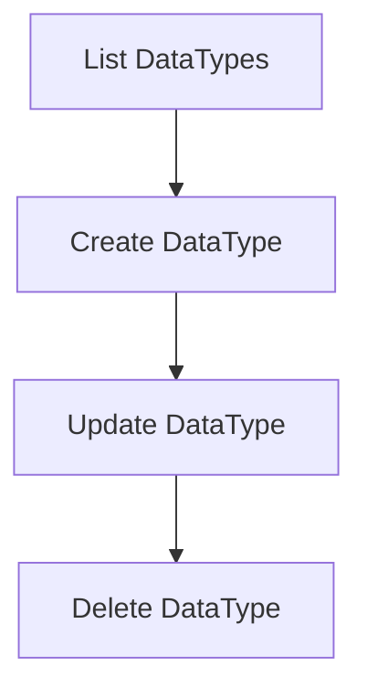
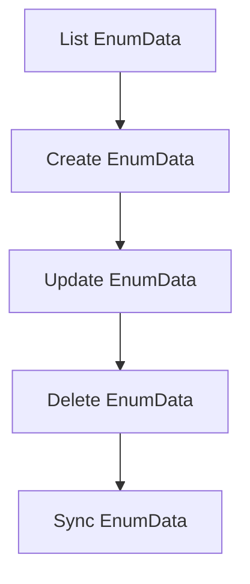

# .NET SDK — Client Reference: SystemClient

## Overview

SystemClient exposes system-level utilities and metadata endpoints for AIForged. You can:

- Retrieve server time, system info, and public IP.
- Inspect data types and value-type metadata.
- Perform DataType CRUD operations.
- Inspect and manage Enum data (list, create, update, delete, sync).
- Get enum options by name.
- Inspect background worker state and fetch system logs.
- Fetch category training options.
- Run diagnostics (service checks, exception test, malware test, dataset test).

!!! note "Deployment scope and permissions"
    CRUD operations (DataTypes, EnumData) are available to System Administrators when AIForged is deployed in your own Azure tenant via the Azure Marketplace.

!!! info "Responses"
    All client methods return PortalResponse<T> (or PortalResponse for some endpoints). Access the payload via the Result property.

## Prerequisites

1. Initialize the SDK and obtain SystemClient.

    ```csharp
    using AIForged.API;
    using System;
    using System.Collections.ObjectModel;
    using System.Threading.Tasks;

    var baseUrl = Environment.GetEnvironmentVariable("AIFORGED_BASE_URL") ?? "https://portal.aiforged.com";
    var apiKey  = Environment.GetEnvironmentVariable("AIFORGED_API_KEY")  ?? throw new Exception("AIFORGED_API_KEY not set.");

    var cfg = new Config { BaseUrl = baseUrl, Timeout = TimeSpan.FromMinutes(5) };
    await cfg.Init();
    cfg.HttpClient.DefaultRequestHeaders.Add("X-Api-Key", apiKey);

    var ctx = new Context(cfg);
    var system = ctx.SystemClient;
    ```

!!! tip "Lightweight connectivity check"
    Use GetSystemDateAsync to validate connectivity and permissions before calling write operations.

## Methods

### System insight

#### GetSystemDateAsync

- Returns the current AIForged server date and time.

Signatures

```csharp
Task<PortalResponse<DateTime>> GetSystemDateAsync();
Task<PortalResponse<DateTime>> GetSystemDateAsync(System.Threading.CancellationToken cancellationToken);
```

Example

```csharp
var resp = await system.GetSystemDateAsync();
Console.WriteLine($"Server time (UTC): {resp.Result:u}");
```

---

#### GetSystemInfoAsync

- Returns system and application information as key-value pairs.

Signatures

```csharp
Task<PortalResponse<System.Collections.Generic.Dictionary<string, string>>> GetSystemInfoAsync();
Task<PortalResponse<System.Collections.Generic.Dictionary<string, string>>> GetSystemInfoAsync(System.Threading.CancellationToken cancellationToken);
```

Example

```csharp
var info = (await system.GetSystemInfoAsync()).Result;
foreach (var kv in info)
{
    Console.WriteLine($"{kv.Key}: {kv.Value}");
}
```

---

#### GetIPAsync

- Returns your public IP from the AIForged server perspective.

Signatures

```csharp
Task<PortalResponse<string>> GetIPAsync();
Task<PortalResponse<string>> GetIPAsync(System.Threading.CancellationToken cancellationToken);
```

Example

```csharp
var ip = (await system.GetIPAsync()).Result;
Console.WriteLine($"Reported IP: {ip}");
```

---

#### CheckServicesAsync

- Returns a string summary of service information and configuration.

Signatures

```csharp
Task<PortalResponse<string>> CheckServicesAsync();
Task<PortalResponse<string>> CheckServicesAsync(System.Threading.CancellationToken cancellationToken);
```

Example

```csharp
var check = (await system.CheckServicesAsync()).Result;
Console.WriteLine(check);
```

!!! note "Diagnostics"
    Use CheckServicesAsync to capture a textual snapshot of service configuration during support investigations.

---

### Data types

#### GetDataTypesAsync

- Lists all data types used by AIForged.

Signatures

```csharp
Task<PortalResponse<ObservableCollection<DataTypeViewModel>>> GetDataTypesAsync();
Task<PortalResponse<ObservableCollection<DataTypeViewModel>>> GetDataTypesAsync(System.Threading.CancellationToken cancellationToken);
```

Example

```csharp
var types = (await system.GetDataTypesAsync()).Result;
foreach (var t in types)
{
    Console.WriteLine($"[{t.Id}] {t.Name} ({t.Category}) - {t.Description}");
}
```

---

#### GetDataTypeInfoAsync

- Returns metadata for a specific value type.

Signatures

```csharp
Task<PortalResponse<DataTypeViewModel>> GetDataTypeInfoAsync(ValueType? vt, string vtname);
Task<PortalResponse<DataTypeViewModel>> GetDataTypeInfoAsync(ValueType? vt, string vtname, System.Threading.CancellationToken cancellationToken);
```

Example

```csharp
var dt = (await system.GetDataTypeInfoAsync(vt: ValueType.String, vtname: "String")).Result;
Console.WriteLine($"{dt.Name}: {dt.Description}");
```

---

#### CreateDataTypeAsync

- Creates a new data type.

Signatures

```csharp
Task<PortalResponse<DataTypeViewModel>> CreateDataTypeAsync(DataTypeViewModel data);
Task<PortalResponse<DataTypeViewModel>> CreateDataTypeAsync(DataTypeViewModel data, System.Threading.CancellationToken cancellationToken);
```

Example

```csharp
var newType = new DataTypeViewModel
{
    Id = ValueType.Code,     // Ensure correct ValueType per governance
    Name = "Code",
    Description = "Custom code payload",
    Category = DataTypeCategory.Processor,
    DefaultValue = "{}",
    Data = "{}"
};

var created = (await system.CreateDataTypeAsync(newType)).Result;
Console.WriteLine($"Created data type: {created.Name} ({created.Id})");
```

!!! warning "Permissions"
    Creating or modifying data types requires System Administrator privileges in self-hosted (Azure Marketplace) deployments.

---

#### UpdateDataTypeAsync

- Updates an existing data type.

Signatures

```csharp
Task<PortalResponse<DataTypeViewModel>> UpdateDataTypeAsync(DataTypeViewModel data);
Task<PortalResponse<DataTypeViewModel>> UpdateDataTypeAsync(DataTypeViewModel data, System.Threading.CancellationToken cancellationToken);
```

Example

```csharp
var dt = (await system.GetDataTypeInfoAsync(ValueType.String, "String")).Result;
dt.Description = "Updated description";
var updated = (await system.UpdateDataTypeAsync(dt)).Result;
Console.WriteLine($"Updated: {updated.Name} - {updated.Description}");
```

---

#### DeleteDataTypeAsync

- Deletes a data type.

Signatures

```csharp
Task<PortalResponse<DataTypeViewModel>> DeleteDataTypeAsync(ValueType? id);
Task<PortalResponse<DataTypeViewModel>> DeleteDataTypeAsync(ValueType? id, System.Threading.CancellationToken cancellationToken);
```

Example

```csharp
var deleted = (await system.DeleteDataTypeAsync(ValueType.Code)).Result;
Console.WriteLine($"Deleted data type: {deleted?.Name}");
```

!!! warning "Impact"
    Deleting data types may affect dependent configurations. Audit usage before removal.

---

### Enum data

#### GetEnumDataAsync

- Lists enum records (types and values) with UI info.

Signatures

```csharp
Task<PortalResponse<ObservableCollection<EnumDataViewModel>>> GetEnumDataAsync();
Task<PortalResponse<ObservableCollection<EnumDataViewModel>>> GetEnumDataAsync(System.Threading.CancellationToken cancellationToken);
```

Example

```csharp
var enums = (await system.GetEnumDataAsync()).Result;
foreach (var e in enums)
{
    Console.WriteLine($"{e.TypeName}.{e.Name} = {e.Value}");
}
```

---

#### CreateEnumDataAsync

- Creates a new enum entry.

Signatures

```csharp
Task<PortalResponse<EnumDataViewModel>> CreateEnumDataAsync(EnumDataViewModel data);
Task<PortalResponse<EnumDataViewModel>> CreateEnumDataAsync(EnumDataViewModel data, System.Threading.CancellationToken cancellationToken);
```

Example

```csharp
var newEnum = new EnumDataViewModel
{
    Type = EnumType.EnumType,   // Example placeholder; set per your needs
    TypeName = "CustomEnum",
    Name = "Sample",
    Value = 1,
    Description = "Sample enum value"
};

var created = (await system.CreateEnumDataAsync(newEnum)).Result;
Console.WriteLine($"Created enum: {created.TypeName}.{created.Name}={created.Value}");
```

---

#### UpdateEnumDataAsync

- Updates an existing enum entry.

Signatures

```csharp
Task<PortalResponse<EnumDataViewModel>> UpdateEnumDataAsync(EnumDataViewModel data);
Task<PortalResponse<EnumDataViewModel>> UpdateEnumDataAsync(EnumDataViewModel data, System.Threading.CancellationToken cancellationToken);
```

Example

```csharp
created.Description = "Updated description";
var updated = (await system.UpdateEnumDataAsync(created)).Result;
Console.WriteLine($"Updated enum: {updated.TypeName}.{updated.Name}");
```

---

#### DeleteEnumDataAsync

- Deletes an enum entry by ID.

Signatures

```csharp
Task<PortalResponse<EnumDataViewModel>> DeleteEnumDataAsync(int? id);
Task<PortalResponse<EnumDataViewModel>> DeleteEnumDataAsync(int? id, System.Threading.CancellationToken cancellationToken);
```

Example

```csharp
var deleted = (await system.DeleteEnumDataAsync(id: created.Id)).Result;
Console.WriteLine($"Deleted enum id: {deleted?.Id}");
```

---

#### SyncEnumDataAsync

- Synchronizes enum data; can automatically remove duplicate or unused entries.

Signatures

```csharp
Task<PortalResponse> SyncEnumDataAsync(bool? autoremove);
Task<PortalResponse> SyncEnumDataAsync(bool? autoremove, System.Threading.CancellationToken cancellationToken);
```

Example

```csharp
await system.SyncEnumDataAsync(autoremove: true);
```

!!! tip "Safe execution"
    Run a read-only audit with GetEnumDataAsync first, then call SyncEnumDataAsync.

---

#### GetEnumOptionsAsync

- Lists the options (string values) for a given enum name.

Signatures

```csharp
Task<PortalResponse<ObservableCollection<string>>> GetEnumOptionsAsync(string name);
Task<PortalResponse<ObservableCollection<string>>> GetEnumOptionsAsync(string name, System.Threading.CancellationToken cancellationToken);
```

Example

```csharp
var opts = (await system.GetEnumOptionsAsync("DocumentStatus")).Result;
foreach (var o in opts) Console.WriteLine(o);
```

---

### Background worker and logs

#### GetBackgroundWorkerItemAsync

- Returns current background worker item.

Signatures

```csharp
Task<PortalResponse<BackgoundWorkItem>> GetBackgroundWorkerItemAsync();
Task<PortalResponse<BackgoundWorkItem>> GetBackgroundWorkerItemAsync(System.Threading.CancellationToken cancellationToken);
```

Example

```csharp
var work = (await system.GetBackgroundWorkerItemAsync()).Result;
Console.WriteLine($"Worker {work.Id} Progress={work.Progress:P0} LastMsg(UTC)={work.LastMsgDT:u}");
```

---

#### GetLogsAsync

- Returns event log entries, optionally filtered by Guid id.

Signatures

```csharp
Task<PortalResponse<ObservableCollection<LogEvent>>> GetLogsAsync(Guid? id);
Task<PortalResponse<ObservableCollection<LogEvent>>> GetLogsAsync(Guid? id, System.Threading.CancellationToken cancellationToken);
```

Example

```csharp
var logs = (await system.GetLogsAsync(id: null)).Result;
foreach (var l in logs)
{
    Console.WriteLine($"[{l.Timestamp:u}] {l.Level}: {l.Message}");
    if (!string.IsNullOrWhiteSpace(l.Exception))
        Console.WriteLine($"Exception: {l.Exception}");
}
```

---

### Training options

#### GetCategoryTrainingAsync

- Returns category training options by Guid id.

Signatures

```csharp
Task<PortalResponse<CategoryTrainingOptions>> GetCategoryTrainingAsync(Guid? id);
Task<PortalResponse<CategoryTrainingOptions>> GetCategoryTrainingAsync(Guid? id, System.Threading.CancellationToken cancellationToken);
```

Example

```csharp
var training = (await system.GetCategoryTrainingAsync(id: Guid.Parse("11111111-1111-1111-1111-111111111111"))).Result;
Console.WriteLine($"UseInComposedModel={training.UseInComposedModel} ForceToPDF={training.ForceToPDF} Type={training.TrainingType}");
```

---

### Diagnostics and tests

#### GetExceptionAsync

- Triggers an exception with a custom message (for testing error handling).

Signatures

```csharp
Task<PortalResponse> GetExceptionAsync(string message);
Task<PortalResponse> GetExceptionAsync(string message, System.Threading.CancellationToken cancellationToken);
```

Example

```csharp
try
{
    await system.GetExceptionAsync("Test exception from client");
}
catch (SwaggerException ex)
{
    Console.WriteLine($"Caught exception (HTTP {(int)ex.StatusCode}): {ex.Response}");
}
```

---

#### TestDataSetAsync

- Dummy endpoint; returns an ObservableCollection<ParameterDefViewModel>.

Signatures

```csharp
Task<PortalResponse<ObservableCollection<ParameterDefViewModel>>> TestDataSetAsync(Guid? id);
Task<PortalResponse<ObservableCollection<ParameterDefViewModel>>> TestDataSetAsync(Guid? id, System.Threading.CancellationToken cancellationToken);
```

Example

```csharp
var ds = (await system.TestDataSetAsync(id: null)).Result;
Console.WriteLine($"Returned items: {ds?.Count ?? 0}");
```

!!! note "Model reference"
    ParameterDefViewModel is documented under ParamDefClient pages.

---

#### TestMalwareAsync

- Test endpoint related to malware failure handling.

Signatures

```csharp
Task<PortalResponse<string>> TestMalwareAsync();
Task<PortalResponse<string>> TestMalwareAsync(System.Threading.CancellationToken cancellationToken);
```

Example

```csharp
var r = await system.TestMalwareAsync();
Console.WriteLine(r.Result);
```

!!! warning "Use in non-production"
    Use TestMalwareAsync only in controlled environments.

## Reference flows





## Models

### DataTypeViewModel

| Property | Type | Validation |
| --- | --- | --- |
| Id | ValueType |  |
| Name | string | Required; StringLength(256, MinimumLength = 1) |
| Description | string | StringLength(256) |
| Category | DataTypeCategory? |  |
| ValueTypeName | string |  |
| DefaultValue | string | StringLength(450) |
| Data | string |  |

---

### EnumDataViewModel

| Property | Type | Validation |
| --- | --- | --- |
| Id | int |  |
| Type | EnumType |  |
| TypeName | string | Required; StringLength(256, MinimumLength = 1) |
| Name | string | Required; StringLength(256, MinimumLength = 1) |
| Value | int |  |
| Description | string | StringLength(450) |
| Info | string | StringLength(450) |
| Icon | string | StringLength(450) |
| Color | string | StringLength(256) |

---

### BackgoundWorkItem

| Property | Type | Notes |
| --- | --- | --- |
| ConnId | string |  |
| UserId | string |  |
| Id | Guid |  |
| Info | string |  |
| Exception | string |  |
| Progress | float | 0–1 progress |
| Start | DateTime? |  |
| End | DateTime? |  |
| LastMsgDT | DateTime |  |

---

### LogEvent

| Property | Type | Notes |
| --- | --- | --- |
| Timestamp | DateTime |  |
| Level | string |  |
| Message | string |  |
| Exception | string |  |
| Context | string |  |

---

### CategoryTrainingOptions

| Property | Type | Notes |
| --- | --- | --- |
| TrainingCustomTableNames | ObservableCollection<string> |  |
| ProcessTableNames | ObservableCollection<string> |  |
| UseInComposedModel | bool |  |
| ForceToPDF | bool |  |
| TrainingType | CategoryTrainingType? |  |
| ModelVersion | string |  |
| TableColumnRegexMap | Dictionary<string, Dictionary<string, string>> |  |

## Enums

### DataTypeCategory (flags)

| Value | Numeric Value |
| --- | --- |
| None | 1 |
| Setting | 2 |
| Service | 4 |
| Statistics | 8 |
| Result | 16 |
| Dependency | 32 |
| Verification | 64 |
| PreProcessor | 128 |
| Processor | 256 |
| PostProcessor | 512 |

### EnumType

| Value | Numeric Value |
| --- | --- |
| EnumType | 0 |
| DataTypeCategory | 1 |
| CategoryStatus | 5 |
| ProjectStatus | 10 |
| ServiceOptions | 13 |
| ServiceStatus | 14 |
| LinkType | 16 |
| ConstraintType | 17 |
| ConstraintStatus | 18 |
| ConstraintIntervalType | 19 |
| DocumentStatus | 21 |
| UsageType | 22 |
| ParameterDefinitionCategory | 24 |
| ParameterDefinitionStatus | 26 |
| DocumentDataType | 27 |
| ChargeStatus | 29 |
| ServiceEventType | 30 |
| ServiceEventStatus | 31 |
| BundleType | 35 |
| PaymentStatus | 41 |
| TransactionStatus | 42 |
| VerificationStatus | 50 |
| FieldRequired | 51 |
| VerificationType | 52 |
| Availability | 55 |
| WorkItemType | 60 |
| WorkItemStatus | 61 |
| WorkItemAction | 62 |
| WorkItemMethod | 63 |
| NotificationType | 70 |
| NotificationStatus | 71 |
| NotificationEvent | 72 |
| SettingType | 80 |
| SettingStatus | 81 |
| MarkingType | 85 |
| Orientation | 86 |
| ReferenceType | 90 |
| ValueType | 91 |
| GroupingType | 92 |
| OptionStatusFlags | 95 |
| RatingType | 96 |
| RatingStatus | 97 |
| GroupType | 100 |
| GroupStatus | 101 |
| GroupRoleType | 102 |
| GroupRoleStatus | 103 |
| GroupRoleUserStatus | 104 |
| LogType | 110 |
| AuditEntity | 200 |
| AuditAccessType | 201 |
| WizardState | 1000 |
| WizardType | 1001 |
| SortField | 2000 |
| SortDirection | 2001 |

## Troubleshooting

- Permissions required
    - DataType and EnumData write operations require System Administrator privileges in self-hosted (Azure Marketplace) deployments.
- Error handling
    - All failures are returned as SwaggerException; inspect ex.StatusCode and ex.Response for details.
- Data dependencies
    - Deleting DataTypes or EnumData may impact dependent configurations. Enumerate usage before deletion.
- Large logs
    - Consider filtering GetLogsAsync by id when available to scope results.