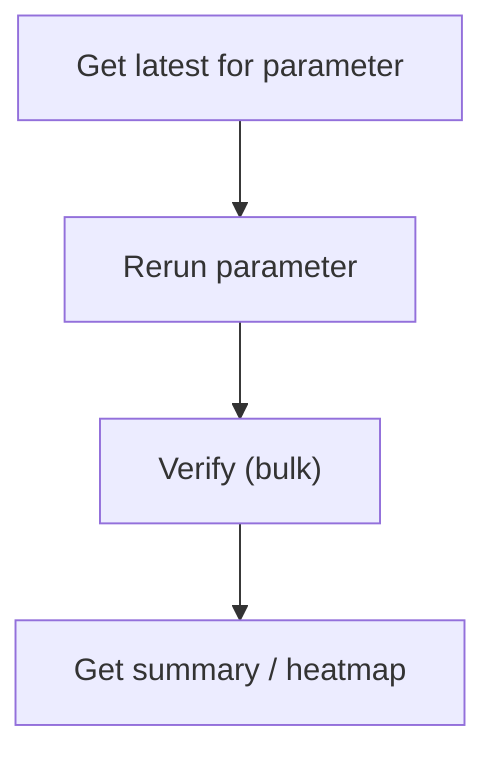
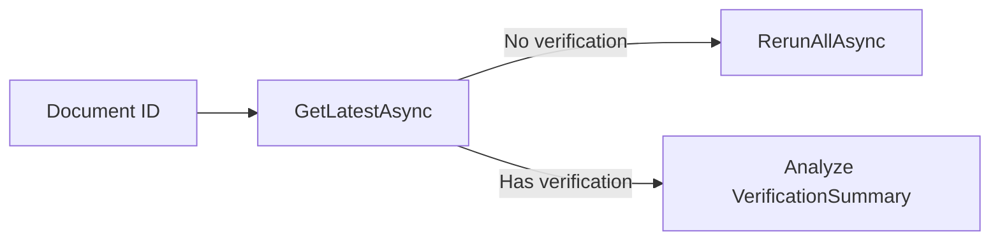

# .NET SDK — Client Reference: VerificationClient

## Overview

VerificationClient retrieves and manages verifications linked to document parameters. Typical tasks include:

- Reading verifications (by ID, by parameter, latest for a field).
- Rerunning verification logic on a parameter or an entire document.
- Creating verification entries in bulk (for a document).
- Fetching verification images (shreds) for UI display.
- Retrieving summaries, heatmaps, and extended analytics.

!!! note "Response wrapper"
    All methods return PortalResponse<T> (or PortalResponse for some endpoints). Access the payload via the Result property.

## Prerequisites

1. Initialize the SDK and create the client.

    ```csharp
    using AIForged.API;
    using System;
    using System.Collections.ObjectModel;
    using System.Threading;
    using System.Threading.Tasks;

    var baseUrl = Environment.GetEnvironmentVariable("AIFORGED_BASE_URL") ?? "https://portal.aiforged.com";
    var apiKey  = Environment.GetEnvironmentVariable("AIFORGED_API_KEY")  ?? throw new Exception("AIFORGED_API_KEY not set.");

    var cfg = new Config { BaseUrl = baseUrl, Timeout = TimeSpan.FromMinutes(5) };
    await cfg.Init();
    cfg.HttpClient.DefaultRequestHeaders.Add("X-Api-Key", apiKey);

    var ctx = new Context(cfg);
    var verifications = ctx.VerificationClient;
    ```

!!! tip "Connectivity check"
    Call a simple read (for example, GetAsync on a known ID) to verify credentials and connectivity before write operations.

## Methods

### Read verifications

#### Get verification by ID

Signatures

```csharp
Task<PortalResponse<VerificationViewModel>> GetAsync(int? verificationId);
Task<PortalResponse<VerificationViewModel>> GetAsync(int? verificationId, CancellationToken cancellationToken);
```

Example

```csharp
var v = (await verifications.GetAsync(verificationId: 12345)).Result;
```

---

#### Get all verifications for a parameter

Signatures

```csharp
Task<PortalResponse<ObservableCollection<VerificationViewModel>>> GetAllAsync(int? docId, int? parameterId);
Task<PortalResponse<ObservableCollection<VerificationViewModel>>> GetAllAsync(int? docId, int? parameterId, CancellationToken cancellationToken);
```

Example

```csharp
var items = (await verifications.GetAllAsync(docId: 456, parameterId: 7890)).Result;
```

---

#### Get latest verification for a parameter

Signatures

```csharp
Task<PortalResponse<VerificationViewModel>> GetLatestAsync(int? docId, int? parameterId, int? pdId);
Task<PortalResponse<VerificationViewModel>> GetLatestAsync(int? docId, int? parameterId, int? pdId, CancellationToken cancellationToken);
```

Example

```csharp
// Using parameterId
var latest = (await verifications.GetLatestAsync(docId: 456, parameterId: 7890, pdId: null)).Result;

// Or using pdId (definition)
var latestByDef = (await verifications.GetLatestAsync(docId: 456, parameterId: null, pdId: 321)).Result;
```

!!! tip "Disambiguation"
    Provide either parameterId or pdId to target a specific field within the document.

---

### Rerun verification

#### Rerun verification on a parameter

Signatures

```csharp
Task<PortalResponse<ObservableCollection<VerificationViewModel>>> RerunAsync(int? docId, int? parameterId, bool? restart, bool? isPublish);
Task<PortalResponse<ObservableCollection<VerificationViewModel>>> RerunAsync(int? docId, int? parameterId, bool? restart, bool? isPublish, CancellationToken cancellationToken);
```

Example

```csharp
var rerun = (await verifications.RerunAsync(
    docId: 456,
    parameterId: 7890,
    restart: false,
    isPublish: false
)).Result;
```

---

#### Rerun verification on a document

Signatures

```csharp
Task<PortalResponse<bool>> RerunAllAsync(int? docId, bool? restart, bool? runCustomCode, bool? runWorkflowClode, bool? runUtilities, bool? runWebHooks, bool? isPublish);
Task<PortalResponse<bool>> RerunAllAsync(int? docId, bool? restart, bool? runCustomCode, bool? runWorkflowClode, bool? runUtilities, bool? runWebHooks, bool? isPublish, CancellationToken cancellationToken);
```

Example

```csharp
var ok = (await verifications.RerunAllAsync(
    docId: 456,
    restart: false,
    runCustomCode: true,
    runWorkflowClode: true,
    runUtilities: true,
    runWebHooks: false,
    isPublish: false
)).Result;
```

!!! warning "Document-wide rerun"
    RerunAllAsync can trigger multiple subsystems (custom code, workflow code, utilities, webhooks). Validate flags in non-production first.

---

### Create verifications

#### Create a list of verifications for a document

Signatures

```csharp
Task<PortalResponse<ObservableCollection<VerificationViewModel>>> VerifyAsync(int? docId, System.Collections.Generic.List<VerificationViewModel> verifications);
Task<PortalResponse<ObservableCollection<VerificationViewModel>>> VerifyAsync(int? docId, System.Collections.Generic.List<VerificationViewModel> verifications, CancellationToken cancellationToken);
```

Example

```csharp
var list = new System.Collections.Generic.List<VerificationViewModel>
{
    new VerificationViewModel
    {
        ParameterId = 7890,
        UserId = "user-123",
        Value = "ACME LTD",
        DT = DateTime.UtcNow,
        Type = VerificationType.User,
        Status = VerificationStatus.Verified,
        Result = "User-confirmed"
    }
};
var created = (await verifications.VerifyAsync(docId: 456, verifications: list)).Result;
```

!!! tip "Batch creation"
    VerifyAsync enables batch creation of multiple verification entries under one document call.

---

### Media

#### Get verification image shred

Signatures

```csharp
Task<FileResponse> GetShredAsync(string userId, int? docId, int? parId, int? verificationId, bool? inline);
Task<FileResponse> GetShredAsync(string userId, int? docId, int? parId, int? verificationId, bool? inline, CancellationToken cancellationToken);
```

Example

```csharp
var fileResp = await verifications.GetShredAsync(
    userId: "user-123",
    docId: 456,
    parId: 7890,
    verificationId: 12345,
    inline: true
);

var path = System.IO.Path.Combine(System.IO.Path.GetTempPath(), "shred.png");
using (fileResp)
using (var fs = System.IO.File.Create(path))
{
    await fileResp.Stream.CopyToAsync(fs);
}
```

!!! note "FileResponse disposal"
    Always dispose FileResponse to close the underlying stream and HTTP resources.

---

### Analytics and summaries

#### Get summary for a service

Signatures

```csharp
Task<PortalResponse<ObservableCollection<VerificationSummary>>> GetSummaryAsync(int? projectId, int? stpdId, int? pdId, bool? latestOnly);
Task<PortalResponse<ObservableCollection<VerificationSummary>>> GetSummaryAsync(int? projectId, int? stpdId, int? pdId, bool? latestOnly, CancellationToken cancellationToken);
```

Example

```csharp
var sum = (await verifications.GetSummaryAsync(
    projectId: 1001,
    stpdId: 2001,
    pdId: 321,
    latestOnly: true
)).Result;
```

---

#### Get verification heatmap

Signatures

```csharp
Task<PortalResponse<ObservableCollection<VerificationSummary>>> GetHeatmapAsync(int? projectId, int? stpdId, bool? latestOnly);
Task<PortalResponse<ObservableCollection<VerificationSummary>>> GetHeatmapAsync(int? projectId, int? stpdId, bool? latestOnly, CancellationToken cancellationToken);
```

Example

```csharp
var heat = (await verifications.GetHeatmapAsync(
    projectId: 1001,
    stpdId: 2001,
    latestOnly: true
)).Result;
```

---

#### Get extended verification info

Signatures

```csharp
Task<PortalResponse<ObservableCollection<VerificationSummary>>> GetExtendedAsync(
    string userId, int? projectId, int? stpdId, UsageType? usage, System.Collections.Generic.List<DocumentStatus> statuses,
    string classname, string filename, string filetype, DateTime? start, DateTime? end, int? masterid,
    int? pageNo, int? pageSize, SortField? sortField, SortDirection? sortDirection,
    string comment, string result, bool? latestResultDoc
);

Task<PortalResponse<ObservableCollection<VerificationSummary>>> GetExtendedAsync(
    string userId, int? projectId, int? stpdId, UsageType? usage, System.Collections.Generic.List<DocumentStatus> statuses,
    string classname, string filename, string filetype, DateTime? start, DateTime? end, int? masterid,
    int? pageNo, int? pageSize, SortField? sortField, SortDirection? sortDirection,
    string comment, string result, bool? latestResultDoc, CancellationToken cancellationToken
);
```

Example

```csharp
var statuses = new System.Collections.Generic.List<DocumentStatus>();
var ext = (await verifications.GetExtendedAsync(
    userId: "user-123",
    projectId: 1001,
    stpdId: 2001,
    usage: null,
    statuses: statuses,
    classname: null,
    filename: null,
    filetype: null,
    start: DateTime.UtcNow.AddDays(-30),
    end: DateTime.UtcNow,
    masterid: null,
    pageNo: 1,
    pageSize: 100,
    sortField: null,
    sortDirection: null,
    comment: null,
    result: null,
    latestResultDoc: null
)).Result;
```

!!! tip "Targeted analytics"
    Combine time range, optional filters, and paging to scope results for dashboards or exports.

## Models

### VerificationViewModel

| Property | Type | Notes |
| --- | --- | --- |
| Id | int |  |
| ParameterId | int |  |
| UserId | string |  |
| Value | string |  |
| DT | DateTime |  |
| Confidence | float? |  |
| SymbolsConfidence | string |  |
| Type | VerificationType |  |
| Status | VerificationStatus | Flags |
| Result | string |  |
| Box | string |  |
| Info | string |  |
| Data | byte[] |  |
| UserName | string |  |
| ServiceId | int? |  |
| ServiceDocId | int? |  |
| Provider | string |  |
| SettingId | int? |  |
| WorkItem | int? |  |
| TransactionId | int? |  |
| ReferenceDocId | int? |  |
| ReferenceParamId | int? |  |
| ReferenceDefId | int? |  |
| Charge | decimal |  |

---

### VerificationSummary

| Property | Type | Notes |
| --- | --- | --- |
| Id | int |  |
| ParameterId | int |  |
| UserId | string |  |
| Value | string |  |
| DT | DateTime |  |
| Confidence | float? |  |
| SymbolsConfidence | string |  |
| Type | VerificationType |  |
| Status | VerificationStatus | Flags |
| Result | string |  |
| Box | string |  |
| Info | string |  |
| Data | byte[] |  |
| UserName | string |  |
| ServiceId | int? |  |
| ServiceDocId | int? |  |
| Provider | string |  |
| SettingId | int? |  |
| WorkItem | int? |  |
| TransactionId | int? |  |
| ReferenceDocId | int? |  |
| ReferenceParamId | int? |  |
| ReferenceDefId | int? |  |
| Charge | decimal |  |
| ParamDefId | int |  |
| ParamDefName | string |  |
| ProjectId | int |  |
| ProjectName | string |  |
| DocId | int |  |
| DocFileName | string |  |
| DocContentType | string |  |
| DocUsage | UsageType? |  |
| DocStatus | DocumentStatus? |  |
| ClassId | int? |  |
| ClassName | string |  |
| Year | int |  |
| Month | int |  |
| Day | int |  |
| DayOfWeek | DayOfWeek |  |
| Count | int |  |
| Average | float? |  |
| Min | float? |  |
| Max | float? |  |
| ParentParameterId | int? |  |

## Enums

### VerificationType

| Value | Numeric Value |
| --- | --- |
| None | 0 |
| Provider | 1 |
| System | 2 |
| User | 3 |
| Service | 4 |
| Training | 5 |
| RPA | 6 |
| API | 7 |
| DataSet | 8 |

### VerificationStatus (flags)

| Value | Numeric Value |
| --- | --- |
| Required | 1 |
| Suspicious | 2 |
| DefaultUsed | 4 |
| Verified | 8 |
| Bypassed | 16 |
| Error | 32 |
| Done | 64 |
| Success | 128 |
| RangeProblem | 256 |
| IsValid | 512 |
| Warnings | 1024 |
| Service | 2048 |
| Training | 4096 |
| Scripted | 8192 |
| Deleted | 16384 |
| Abort | 32768 |

### DayOfWeek

| Value | Numeric Value |
| --- | --- |
| Sunday | 0 |
| Monday | 1 |
| Tuesday | 2 |
| Wednesday | 3 |
| Thursday | 4 |
| Friday | 5 |
| Saturday | 6 |

## Flows





!!! example "End-to-end review"
    1. Use GetLatestAsync to retrieve the current verification state for a target field.
    1. If needed, call RerunAsync (field) or RerunAllAsync (document) to refresh logic.
    1. Add human or automated verification entries with VerifyAsync.
    1. Feed summaries to dashboards with GetSummaryAsync or GetHeatmapAsync.

## Troubleshooting

- No verifications returned
    - Confirm docId and parameterId are correct. For latest by definition, use pdId.
- Rerun does not change outcomes
    - Check flags (restart, runCustomCode, runWorkflowClode, runUtilities, runWebHooks) and verify the service configuration.
- GetShredAsync fails or returns unexpected content
    - Validate docId, parId, and verificationId. Ensure the shred exists for the verification.
- Extended queries return large result sets
    - Use time ranges, paging (pageNo/pageSize), and filters to constrain results.