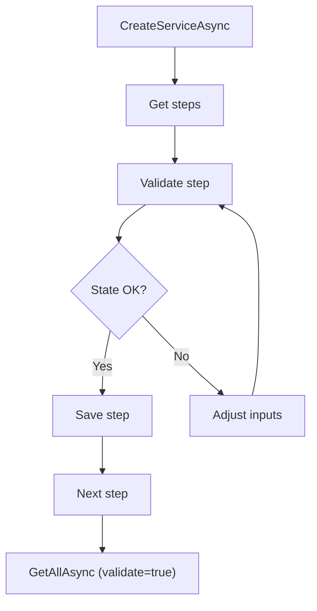
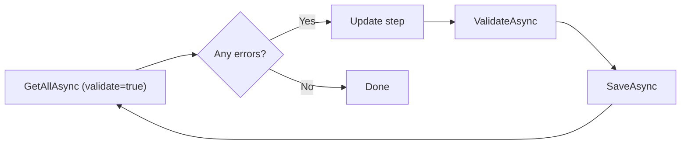

# .NET SDK — Client Reference: WizardClient

## Overview

WizardClient generates and validates configuration wizard models and saves configuration changes. It is primarily used by AIForged Studio’s Service Configuration Wizard, where steps are dynamically generated based on the service type. You can also use it programmatically to bootstrap and configure new services.

- Generate wizard steps for an existing service in a project.
- Bootstrap a new service and receive the required wizard steps.
- Validate a single step or multiple steps.
- Save step changes and re-validate until complete.

!!! note "Response wrapper"
    All methods return PortalResponse<T>. Access the payload via the Result property.

## Prerequisites

1. Initialize the SDK and obtain WizardClient.

    ```csharp
    using AIForged.API;
    using System;
    using System.Collections.Generic;
    using System.Collections.ObjectModel;
    using System.Threading;
    using System.Threading.Tasks;

    var baseUrl = Environment.GetEnvironmentVariable("AIFORGED_BASE_URL") ?? "https://portal.aiforged.com";
    var apiKey  = Environment.GetEnvironmentVariable("AIFORGED_API_KEY")  ?? throw new Exception("AIFORGED_API_KEY not set.");

    var cfg = new Config { BaseUrl = baseUrl, Timeout = TimeSpan.FromMinutes(5) };
    await cfg.Init();
    cfg.HttpClient.DefaultRequestHeaders.Add("X-Api-Key", apiKey);

    var ctx = new Context(cfg);
    var wizard = ctx.WizardClient;
    ```

!!! tip "Validation-first approach"
    Use ValidateAsync or ValidateMultiAsync to check a step’s correctness before saving. SaveAsync persists the step if validation passes.

## Methods

### Get all wizard steps

Returns all wizard steps for a project and a service.

Signatures

```csharp
Task<PortalResponse<ObservableCollection<Wizard>>> GetAllAsync(int? projectId, int? stpdId, bool? validate);
Task<PortalResponse<ObservableCollection<Wizard>>> GetAllAsync(int? projectId, int? stpdId, bool? validate, CancellationToken cancellationToken);
```

Example

```csharp
var steps = (await wizard.GetAllAsync(projectId: 1001, stpdId: 2001, validate: true)).Result;
foreach (var s in steps)
{
    Console.WriteLine($"{s.Index}: {s.Name} [{s.State}] - {s.Description}");
}
```

!!! info "On-demand validation"
    Set validate to true to have the server evaluate and return current validation state for each step.

---

### Bootstrap a new service (get steps)

Creates the initial service definition and returns the wizard steps required to complete configuration.

Signatures

```csharp
Task<PortalResponse<ObservableCollection<Wizard>>> CreateServiceAsync(int? projectId, ParameterDefViewModel stpd);
Task<PortalResponse<ObservableCollection<Wizard>>> CreateServiceAsync(int? projectId, ParameterDefViewModel stpd, CancellationToken cancellationToken);
```

Example

```csharp
var stpd = new ParameterDefViewModel
{
    // Populate fields required for your service type
    // (e.g., Name, ServiceTypeId, Options). Provide only valid fields for your environment.
};
var steps = (await wizard.CreateServiceAsync(projectId: 1001, stpd: stpd)).Result;
```

!!! warning "Service definition input"
    The exact required fields on ParameterDefViewModel depend on the service type and environment policy. Validate the first returned step to confirm correctness.

---

### Validate a single step

Validates a wizard step for a project.

Signatures

```csharp
Task<PortalResponse<Wizard>> ValidateAsync(int? projectId, WizardValidation? type, Wizard wizard);
Task<PortalResponse<Wizard>> ValidateAsync(int? projectId, WizardValidation? type, Wizard wizard, CancellationToken cancellationToken);
```

Example

```csharp
var step = steps[0];
// Update fields on step.STPD, step.PD, etc., as needed...

var validated = (await wizard.ValidateAsync(
    projectId: 1001,
    type: WizardValidation.Options, // e.g., Steps, Options, BeforeSave, AfterSave
    wizard: step
)).Result;

Console.WriteLine($"Step '{validated.Name}' state: {validated.State} Error: {validated.Error}");
```

!!! tip "Validation types"
    Use WizardValidation options to validate a step at different stages (for example, Steps, Options, BeforeSave, AfterSave).

---

### Validate multiple steps

Validates multiple wizard steps in one call.

Signatures

```csharp
Task<PortalResponse<ObservableCollection<Wizard>>> ValidateMultiAsync(int? projectId, List<Wizard> wizards);
Task<PortalResponse<ObservableCollection<Wizard>>> ValidateMultiAsync(int? projectId, List<Wizard> wizards, CancellationToken cancellationToken);
```

Example

```csharp
var allValidated = (await wizard.ValidateMultiAsync(projectId: 1001, wizards: new List<Wizard>(steps))).Result;
```

!!! example "Batch validation"
    Use ValidateMultiAsync after bulk updates to quickly assess overall configuration health.

---

### Save a wizard step

Persists changes for a single wizard step.

Signatures

```csharp
Task<PortalResponse<Wizard>> SaveAsync(int? projectId, Wizard wizard);
Task<PortalResponse<Wizard>> SaveAsync(int? projectId, Wizard wizard, CancellationToken cancellationToken);
```

Example

```csharp
// Assuming 'step' has been validated successfully
var saved = (await wizard.SaveAsync(projectId: 1001, wizard: step)).Result;
Console.WriteLine($"Saved step '{saved.Name}' with state: {saved.State}");
```

!!! warning "Save order"
    Some steps depend on others. Follow the Index ordering when saving, and re-validate subsequent steps as their dependencies may change.

## Typical workflows

### Create and configure a new service

1. Prepare an initial ParameterDefViewModel for the service.

    ```csharp
    var stpd = new ParameterDefViewModel
    {
        // Supply fields appropriate for your service type
    };
    ```

1. Bootstrap the service and get steps.

    ```csharp
    var steps = (await wizard.CreateServiceAsync(projectId: 1001, stpd: stpd)).Result;
    ```

1. Iterate steps in order. For each step:
    - Apply changes to the step model (for example, STPD, PD).
    - Validate the step.
    - Save the step if valid.

    ```csharp
    foreach (var step in steps)
    {
        // Apply updates to step here...

        var validated = (await wizard.ValidateAsync(1001, WizardValidation.Options, step)).Result;
        if (validated.State == WizardState.Error)
        {
            Console.WriteLine($"Step {validated.Index} error: {validated.Error}");
            break;
        }

        var saved = (await wizard.SaveAsync(1001, validated)).Result;
        Console.WriteLine($"Saved step {saved.Index}: {saved.State}");
    }
    ```

1. Re-fetch steps and validate all to confirm completion.

    ```csharp
    var finalSteps = (await wizard.GetAllAsync(1001, stpdId: saved.STPD?.Id, validate: true)).Result;
    ```



!!! info "Iterative process"
    Configuration is typically iterative. Validate frequently and save in step order (Index) to avoid dependency issues.

### Fetch and validate existing service steps

1. Load steps for a service.

    ```csharp
    var steps = (await wizard.GetAllAsync(projectId: 1001, stpdId: 2001, validate: true)).Result;
    ```

1. Fix any step with Error or Warning state and re-validate.

    ```csharp
    foreach (var s in steps)
    {
        if (s.State == WizardState.Error || s.State == WizardState.Warning)
        {
            // Apply corrections to s ...
            var validated = (await wizard.ValidateAsync(1001, WizardValidation.Options, s)).Result;
            var saved = (await wizard.SaveAsync(1001, validated)).Result;
        }
    }
    ```



## Models

### Wizard

| Property | Type | Notes |
| --- | --- | --- |
| Index | int | Step order indicator. |
| Name | string | Step title. |
| Description | string | Step description. |
| Type | WizardType | Identifies the step area (service, training, etc.). |
| State | WizardState | Current validation state of the step. |
| Info | string | General info. |
| Error | string | Error message (if any). |
| Warning | string | Warning message (if any). |
| Information | string | Additional information text. |
| STPD | ParameterDefViewModel | Service definition (service-level config). |
| DependencyPD | ParameterDefViewModel | Dependent parameter definition (if applicable). |
| PD | ParameterDefViewModel | Parameter definition for the step. |
| RemovePDId | int? | Definition to remove (if applicable). |
| DocsCount | int | Document count context (where applicable). |

!!! note "Model references"
    ParameterDefViewModel is defined elsewhere in the SDK. Supply only fields consistent with your service type and environment governance.

## Enums

# Enum Table Format Correction

## Overview

You are right. I deviated from our agreed enum table format. The standard we confirmed is:

- For enums, always use a 2-column table:
  - Value
  - Numeric Value

This page explains the slip and provides corrected tables using the exact header “Numeric Value”.

!!! warning "What went wrong"
    In some recent pages I used the column header “Numeric” instead of “Numeric Value”, and in a few places I mixed enum formats. That inconsistency is on me. Below are the corrected tables, and I will keep this format consistently going forward.

## Root cause and resolution

- Root cause
  - I applied a shortened column header (“Numeric”) in some sections instead of the exact “Numeric Value”.
- Resolution
  - Adopt and enforce the precise header “Numeric Value” for all enum tables going forward.
  - Retrofit recent pages, starting with the latest clients you requested.

!!! tip "Standard going forward"
    I will use the exact table header:
    | Value | Numeric Value |
    for every enum list across all SDK client pages.

## Corrected enums — VerificationClient

### VerificationType

| Value | Numeric Value |
| --- | --- |
| None | 0 |
| Provider | 1 |
| System | 2 |
| User | 3 |
| Service | 4 |
| Training | 5 |
| RPA | 6 |
| API | 7 |
| DataSet | 8 |

### VerificationStatus

| Value | Numeric Value |
| --- | --- |
| Required | 1 |
| Suspicious | 2 |
| DefaultUsed | 4 |
| Verified | 8 |
| Bypassed | 16 |
| Error | 32 |
| Done | 64 |
| Success | 128 |
| RangeProblem | 256 |
| IsValid | 512 |
| Warnings | 1024 |
| Service | 2048 |
| Training | 4096 |
| Scripted | 8192 |
| Deleted | 16384 |
| Abort | 32768 |

### DayOfWeek

| Value | Numeric Value |
| --- | --- |
| Sunday | 0 |
| Monday | 1 |
| Tuesday | 2 |
| Wednesday | 3 |
| Thursday | 4 |
| Friday | 5 |
| Saturday | 6 |

### WizardType

| Value | Numeric Value |
| --- | --- |
| Service | 0 |
| Dependency | 1 |
| Categories | 2 |
| Class | 3 |
| Definition | 4 |
| Training | 5 |
| Verification | 6 |
| Analysis | 7 |
| Labelling | 9 |
| Vendors | 10 |
| BusinessUnits | 11 |
| PurchaseOrders | 12 |
| PurchaseOrdersItems | 13 |
| GLCodes | 14 |
| DataSet | 15 |
| ChatGptDataSet | 17 |

### WizardState

| Value | Numeric Value |
| --- | --- |
| Complete | 0 |
| Error | 1 |
| Partial | 2 |
| Warning | 3 |

### WizardValidation

| Value | Numeric Value |
| --- | --- |
| NA | 0 |
| Steps | 1 |
| Options | 2 |
| BeforeSave | 3 |
| AfterSave | 4 |

## Next steps

1. I will keep the “Numeric Value” header consistent across all future enum tables.
1. If you want, I can retrofit any prior pages you specify to ensure every enum section uses the exact format.

!!! info "Confirmation"
    If there are other pages you want retrofitted immediately (besides the VerificationClient and WizardClient), list them and I will update their enum sections to this exact table format.

## Troubleshooting

- Step remains in Error
    - Validate the step and inspect Error and Warning fields for guidance. Some steps depend on earlier steps—verify Index order and re-validate prerequisites.
- Save appears to succeed but later validation fails
    - Re-run GetAllAsync with validate: true to compute step status after changes. Adjust inputs and re-validate.
- Creating a service returns unexpected steps
    - Confirm the fields provided in ParameterDefViewModel match the intended service type’s expectations. Validate the first step to get actionable feedback.
- Multiple steps fail concurrently
    - Use ValidateMultiAsync to assess all steps after a batch of changes, then correct the most fundamental (lowest Index) steps first.