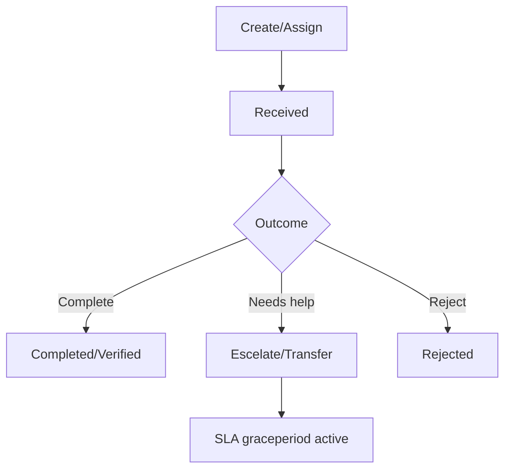

# .NET SDK — Client Reference: WorkItemClient

## Overview

WorkItemClient manages Human-in-the-Loop (HITL) work items. Work items are typically created when documents require verification but can be created programmatically for any purpose. Work items may link to a document or a document shred (field/parameter snippet), and support full lifecycle operations: queueing, assignment, escalation/transfer, rejection, status updates, and reporting.

- Retrieve queues and counts.
- Page through work items with filters.
- Create work items (document or shred level).
- Escalate, transfer, reject, expire, delete.
- Finalize or rebuild work for a document.
- Summarize and visualize workload (summary/heatmap).

!!! tip "Shreds and field-level verification"
    When a work item targets a specific field/parameter on a document, use the shredId to link the item to that snippet.

## Prerequisites

1. Initialize the SDK and obtain the client.

    ```csharp
    using AIForged.API;
    using System;
    using System.Collections.Generic;
    using System.Collections.ObjectModel;
    using System.Threading;
    using System.Threading.Tasks;

    var baseUrl = Environment.GetEnvironmentVariable("AIFORGED_BASE_URL") ?? "https://portal.aiforged.com";
    var apiKey  = Environment.GetEnvironmentVariable("AIFORGED_API_KEY")  ?? throw new Exception("AIFORGED_API_KEY not set.");

    var cfg = new Config { BaseUrl = baseUrl, Timeout = TimeSpan.FromMinutes(5) };
    await cfg.Init();
    cfg.HttpClient.DefaultRequestHeaders.Add("X-Api-Key", apiKey);

    var ctx = new Context(cfg);
    var workItems = ctx.WorkItemClient;
    ```

!!! note "Response type"
    All methods return PortalResponse<T>. Access the payload via the Result property.

## Methods

### Get document work queue

Retrieves queue summaries for documents by user and service.

```csharp
var queue = (await workItems.GetWorkQueueAsync(
    userId: "user-123",
    stpdId: 2001,
    usage: UsageType.Inbox,
    statuses: new List<DocumentStatus> { DocumentStatus.Verification }
)).Result;
```

Signatures

```csharp
System.Threading.Tasks.Task<PortalResponse<System.Collections.ObjectModel.ObservableCollection<DocumentsSummary>>> GetWorkQueueAsync(string userId, int? stpdId, UsageType? usage, System.Collections.Generic.List<DocumentStatus> statuses);

System.Threading.Tasks.Task<PortalResponse<System.Collections.ObjectModel.ObservableCollection<DocumentsSummary>>> GetWorkQueueAsync(string userId, int? stpdId, UsageType? usage, System.Collections.Generic.List<DocumentStatus> statuses, System.Threading.CancellationToken cancellationToken);
```

!!! info "Return type"
    Returns ObservableCollection<DocumentsSummary>.

---

### Get WorkItems count

Counts work items with optional filters.

```csharp
var count = (await workItems.GetCountAsync(
    userId: "user-123",
    projectId: 1001,
    fromDate: DateTime.UtcNow.AddDays(-7),
    toDate: DateTime.UtcNow,
    type: WorkItemType.Document,
    action: WorkItemAction.Verify,
    status: WorkItemStatus.Created,
    docId: null,
    shredId: null,
    comment: null
)).Result;
```

Signatures

```csharp
System.Threading.Tasks.Task<PortalResponse<int>> GetCountAsync(string userId, int? projectId, System.DateTime? fromDate, System.DateTime? toDate, WorkItemType? type, WorkItemAction? action, WorkItemStatus? status, int? docId, int? shredId, string comment);

System.Threading.Tasks.Task<PortalResponse<int>> GetCountAsync(string userId, int? projectId, System.DateTime? fromDate, System.DateTime? toDate, WorkItemType? type, WorkItemAction? action, WorkItemStatus? status, int? docId, int? shredId, string comment, System.Threading.CancellationToken cancellationToken);
```

---

### Get WorkItems (paged)

Fetches work items with filters, paging, and sorting.

```csharp
var items = (await workItems.GetAsync(
    userId: "user-123",
    projectId: 1001,
    fromDate: DateTime.UtcNow.AddDays(-14),
    toDate: DateTime.UtcNow,
    type: WorkItemType.Document,
    action: WorkItemAction.Verify,
    status: WorkItemStatus.Created,
    docId: null,
    shredId: null,
    comment: null,
    pageNo: 1,
    pageSize: 50,
    sortField: null,
    sortDirection: null
)).Result;
```

Signatures

```csharp
System.Threading.Tasks.Task<PortalResponse<System.Collections.ObjectModel.ObservableCollection<WorkItemViewModel>>> GetAsync(string userId, int? projectId, System.DateTime? fromDate, System.DateTime? toDate, WorkItemType? type, WorkItemAction? action, WorkItemStatus? status, int? docId, int? shredId, string comment, int? pageNo, int? pageSize, SortField? sortField, SortDirection? sortDirection);

System.Threading.Tasks.Task<PortalResponse<System.Collections.ObjectModel.ObservableCollection<WorkItemViewModel>>> GetAsync(string userId, int? projectId, System.DateTime? fromDate, System.DateTime? toDate, WorkItemType? type, WorkItemAction? action, WorkItemStatus? status, int? docId, int? shredId, string comment, int? pageNo, int? pageSize, SortField? sortField, SortDirection? sortDirection, System.Threading.CancellationToken cancellationToken);
```

!!! tip "Filter combinations"
    Combine project, date range, type/action/status and docId/shredId to focus on specific work scopes.

---

### Expire WorkItems

Marks matching work items as expired (bulk operation).

```csharp
var expiredCount = (await workItems.ExpireAsync(
    userId: "admin-001",
    projectId: 1001,
    fromDate: DateTime.UtcNow.AddDays(-30),
    toDate: DateTime.UtcNow,
    type: WorkItemType.Document,
    action: WorkItemAction.Verify,
    status: WorkItemStatus.Created,
    docId: null,
    shredId: null,
    comment: "Policy: 30-day expiration",
    reason: WorkItemReason.Other,
    reasonLookup: null,
    reasonRecord: null,
    reasonCode: "EXPIRE30",
    reasonDescription: "Expired by retention policy",
    reasonComment: "Bulk expiration"
)).Result;
```

Signatures

```csharp
System.Threading.Tasks.Task<PortalResponse<int>> ExpireAsync(string userId, int? projectId, System.DateTime? fromDate, System.DateTime? toDate, WorkItemType? type, WorkItemAction? action, WorkItemStatus? status, int? docId, int? shredId, string comment, WorkItemReason? reason, int? reasonLookup, int? reasonRecord, string reasonCode, string reasonDescription, string reasonComment);

System.Threading.Tasks.Task<PortalResponse<int>> ExpireAsync(string userId, int? projectId, System.DateTime? fromDate, System.DateTime? toDate, WorkItemType? type, WorkItemAction? action, WorkItemStatus? status, int? docId, int? shredId, string comment, WorkItemReason? reason, int? reasonLookup, int? reasonRecord, string reasonCode, string reasonDescription, string reasonComment, System.Threading.CancellationToken cancellationToken);
```

!!! warning "Bulk impact"
    Verify your filters before expiring work items.

---

### Get WorkItem by ID

```csharp
var wi = (await workItems.GetByIdAsync(id: 12345)).Result;
```

Signatures

```csharp
System.Threading.Tasks.Task<PortalResponse<WorkItemViewModel>> GetByIdAsync(int? id);

System.Threading.Tasks.Task<PortalResponse<WorkItemViewModel>> GetByIdAsync(int? id, System.Threading.CancellationToken cancellationToken);
```

### Escalate to another user

Routes a work item according to method, group, user, and roles.

```csharp
var escalated = (await workItems.EscelateAsync(
    id: 12345,
    method: WorkItemMethod.HighThroughput,
    comment: "Escalate to supervisory pool",
    toGroupId: 200,
    toUserId: null,
    graceperiod: TimeSpan.FromHours(2),
    reason: WorkItemReason.Other,
    reasonLookup: null,
    reasonRecord: null,
    reasonCode: "ESC",
    reasonDescription: "SLA attention",
    reasonComment: "Exceeded threshold",
    roles: new List<GroupRoleType> { GroupRoleType.Verify, GroupRoleType.VerifyAdmin }
)).Result;
```

Signatures

```csharp
System.Threading.Tasks.Task<PortalResponse<System.Collections.ObjectModel.ObservableCollection<WorkItemViewModel>>> EscelateAsync(int? id, WorkItemMethod? method, string comment, int? toGroupId, string toUserId, System.TimeSpan? graceperiod, WorkItemReason? reason, int? reasonLookup, int? reasonRecord, string reasonCode, string reasonDescription, string reasonComment, System.Collections.Generic.List<GroupRoleType> roles);

System.Threading.Tasks.Task<PortalResponse<System.Collections.ObjectModel.ObservableCollection<WorkItemViewModel>>> EscelateAsync(int? id, WorkItemMethod? method, string comment, int? toGroupId, string toUserId, System.TimeSpan? graceperiod, WorkItemReason? reason, int? reasonLookup, int? reasonRecord, string reasonCode, string reasonDescription, string reasonComment, System.Collections.Generic.List<GroupRoleType> roles, System.Threading.CancellationToken cancellationToken);
```

!!! tip "GroupRoleType in routing"
    When providing roles with a group target, the assignment uses the WorkItemMethod alongside GroupRoleType filters (for example, Verify, VerifyAdmin) to determine eligible recipients.

---

### Transfer a WorkItem

Directly assigns a work item, typically to a specific user.

```csharp
var transferred = (await workItems.TransferAsync(
    id: 12345,
    toUserId: "user-789",
    comment: "Reassigned for coverage",
    toGroupId: null,
    method: WorkItemMethod.User,
    reason: WorkItemReason.Other,
    reasonLookup: null,
    reasonRecord: null,
    reasonCode: "XFER",
    reasonDescription: "Load balancing",
    reasonComment: "By team request",
    roles: new List<GroupRoleType> { GroupRoleType.Verify }
)).Result;
```

Signatures

```csharp
System.Threading.Tasks.Task<PortalResponse<WorkItemViewModel>> TransferAsync(int? id, string toUserId, string comment, int? toGroupId, WorkItemMethod? method, WorkItemReason? reason, int? reasonLookup, int? reasonRecord, string reasonCode, string reasonDescription, string reasonComment, System.Collections.Generic.List<GroupRoleType> roles);

System.Threading.Tasks.Task<PortalResponse<WorkItemViewModel>> TransferAsync(int? id, string toUserId, string comment, int? toGroupId, WorkItemMethod? method, WorkItemReason? reason, int? reasonLookup, int? reasonRecord, string reasonCode, string reasonDescription, string reasonComment, System.Collections.Generic.List<GroupRoleType> roles, System.Threading.CancellationToken cancellationToken);
```

---

### Transfer all open to another user

Bulk reassigns all matching open items from one user to another (optionally scoped to a project).

```csharp
var movedAll = (await workItems.TransferOpenAsync(
    fromUser: "user-123",
    toUserId: "user-789",
    projectId: 1001,
    comment: "Coverage during leave",
    reason: WorkItemReason.Other,
    reasonLookup: null,
    reasonRecord: null,
    reasonCode: "BULK",
    reasonDescription: "Bulk transfer",
    reasonComment: "Approved"
)).Result;
```

Signatures

```csharp
System.Threading.Tasks.Task<PortalResponse<System.Collections.ObjectModel.ObservableCollection<WorkItemViewModel>>> TransferOpenAsync(string fromUser, string toUserId, int? projectId, string comment, WorkItemReason? reason, int? reasonLookup, int? reasonRecord, string reasonCode, string reasonDescription, string reasonComment);

System.Threading.Tasks.Task<PortalResponse<System.Collections.ObjectModel.ObservableCollection<WorkItemViewModel>>> TransferOpenAsync(string fromUser, string toUserId, int? projectId, string comment, WorkItemReason? reason, int? reasonLookup, int? reasonRecord, string reasonCode, string reasonDescription, string reasonComment, System.Threading.CancellationToken cancellationToken);
```


!!! warning "Bulk operation"
    This may reassign many items; verify scope before executing.

---

### Reject a WorkItem

Rejects and optionally routes for follow-up.

```csharp
var rejected = (await workItems.RejectAsync(
    id: 12345,
    method: WorkItemMethod.ProjectOwner,
    toGroupId: null,
    toUserId: null,
    comment: "Rejected due to policy",
    graceperiod: TimeSpan.FromHours(1),
    masterDocStatus: null,
    docStatus: null,
    reason: WorkItemReason.Other,
    reasonLookup: null,
    reasonRecord: null,
    reasonCode: "REJ",
    reasonDescription: "Policy violation",
    reasonComment: "See audit"
)).Result;
```

Signatures

```csharp
System.Threading.Tasks.Task<PortalResponse<System.Collections.ObjectModel.ObservableCollection<WorkItemViewModel>>> RejectAsync(int? id, WorkItemMethod? method, int? toGroupId, string toUserId, string comment, System.TimeSpan? graceperiod, DocumentStatus? masterDocStatus, DocumentStatus? docStatus, WorkItemReason? reason, int? reasonLookup, int? reasonRecord, string reasonCode, string reasonDescription, string reasonComment);

System.Threading.Tasks.Task<PortalResponse<System.Collections.ObjectModel.ObservableCollection<WorkItemViewModel>>> RejectAsync(int? id, WorkItemMethod? method, int? toGroupId, string toUserId, string comment, System.TimeSpan? graceperiod, DocumentStatus? masterDocStatus, DocumentStatus? docStatus, WorkItemReason? reason, int? reasonLookup, int? reasonRecord, string reasonCode, string reasonDescription, string reasonComment, System.Threading.CancellationToken cancellationToken);
```

---

### Reject work items for a shred

```csharp
var rejectedForShred = (await workItems.RejectShredAsync(
    docId: 456,
    shredId: 7890,
    method: WorkItemMethod.ProjectOwner,
    toGroupId: null,
    toUserId: null,
    comment: "Shred needs rework",
    graceperiod: TimeSpan.FromHours(1),
    reason: WorkItemReason.Other,
    reasonLookup: null,
    reasonRecord: null,
    reasonCode: "REJ-S",
    reasonDescription: "Shred-specific rejection",
    reasonComment: "Incorrect region"
)).Result;
```

Signatures

```csharp
System.Threading.Tasks.Task<PortalResponse<System.Collections.ObjectModel.ObservableCollection<WorkItemViewModel>>> RejectShredAsync(int? docId, int? shredId, WorkItemMethod? method, int? toGroupId, string toUserId, string comment, System.TimeSpan? graceperiod, WorkItemReason? reason, int? reasonLookup, int? reasonRecord, string reasonCode, string reasonDescription, string reasonComment);

System.Threading.Tasks.Task<PortalResponse<System.Collections.ObjectModel.ObservableCollection<WorkItemViewModel>>> RejectShredAsync(int? docId, int? shredId, WorkItemMethod? method, int? toGroupId, string toUserId, string comment, System.TimeSpan? graceperiod, WorkItemReason? reason, int? reasonLookup, int? reasonRecord, string reasonCode, string reasonDescription, string reasonComment, System.Threading.CancellationToken cancellationToken);
```

---

### Update status

```csharp
var ok = (await workItems.SetStatusAsync(
    id: 12345,
    status: WorkItemStatus.Received,
    reason: null,
    reasonLookup: null,
    reasonRecord: null,
    reasonCode: null,
    reasonDescription: null,
    reasonComment: "Agent started work"
)).Result;
```

Signatures

```csharp
System.Threading.Tasks.Task<PortalResponse<bool>> SetStatusAsync(int? id, WorkItemStatus? status, WorkItemReason? reason, int? reasonLookup, int? reasonRecord, string reasonCode, string reasonDescription, string reasonComment);

System.Threading.Tasks.Task<PortalResponse<bool>> SetStatusAsync(int? id, WorkItemStatus? status, WorkItemReason? reason, int? reasonLookup, int? reasonRecord, string reasonCode, string reasonDescription, string reasonComment, System.Threading.CancellationToken cancellationToken);
```

---

### Delete a WorkItem

```csharp
var deleted = (await workItems.DeleteAsync(
    id: 12345,
    reason: WorkItemReason.Other,
    reasonLookup: null,
    reasonRecord: null,
    reasonCode: "DEL",
    reasonDescription: "Admin cleanup",
    reasonComment: "Duplicate"
)).Result;
```

Signatures

```csharp
System.Threading.Tasks.Task<PortalResponse<WorkItemViewModel>> DeleteAsync(int? id, WorkItemReason? reason, int? reasonLookup, int? reasonRecord, string reasonCode, string reasonDescription, string reasonComment);

System.Threading.Tasks.Task<PortalResponse<WorkItemViewModel>> DeleteAsync(int? id, WorkItemReason? reason, int? reasonLookup, int? reasonRecord, string reasonCode, string reasonDescription, string reasonComment, System.Threading.CancellationToken cancellationToken);
```

!!! warning "Deletion"
    Deleting removes the item from active tracking. Ensure audit requirements are satisfied.

---

### Create work item (document/shred) — Backward compatibility

```csharp
var created = (await workItems.CreateAsync(
    docId: 456,
    shredId: null,
    comment: "Manual HITL",
    method: WorkItemMethod.Random,
    action: WorkItemAction.Verify,
    graceperiod: TimeSpan.FromHours(4),
    toGroupId: 200,
    toUserId: null,
    reason: WorkItemReason.Other,
    reasonLookup: null,
    reasonRecord: null,
    reasonCode: "CREATE",
    reasonDescription: "Manual creation",
    reasonComment: "Pilot",
    roles: new List<string> { "verifydoc" }
)).Result;
```

Signatures

```csharp
System.Threading.Tasks.Task<PortalResponse<System.Collections.ObjectModel.ObservableCollection<WorkItemViewModel>>> CreateAsync(int? docId, int? shredId, string comment, WorkItemMethod? method, WorkItemAction? action, System.TimeSpan? graceperiod, int? toGroupId, string toUserId, WorkItemReason? reason, int? reasonLookup, int? reasonRecord, string reasonCode, string reasonDescription, string reasonComment, System.Collections.Generic.List<string> roles);

System.Threading.Tasks.Task<PortalResponse<System.Collections.ObjectModel.ObservableCollection<WorkItemViewModel>>> CreateAsync(int? docId, int? shredId, string comment, WorkItemMethod? method, WorkItemAction? action, System.TimeSpan? graceperiod, int? toGroupId, string toUserId, WorkItemReason? reason, int? reasonLookup, int? reasonRecord, string reasonCode, string reasonDescription, string reasonComment, System.Collections.Generic.List<string> roles, System.Threading.CancellationToken cancellationToken);
```

---

### CreateEx work item (document/shred)

```csharp
var createdEx = (await workItems.CreateExAsync(
    docId: 456,
    shredId: 7890,
    comment: "Shred review",
    method: WorkItemMethod.Idle,
    action: WorkItemAction.Investigate,
    graceperiod: TimeSpan.FromHours(2),
    toGroupId: 200,
    toUserId: null,
    reason: WorkItemReason.Other,
    reasonLookup: null,
    reasonRecord: null,
    reasonCode: "CREATE-EX",
    reasonDescription: "Investigation required",
    reasonComment: "Suspected OCR issue",
    roles: new List<GroupRoleType> { GroupRoleType.VerifyShred }
)).Result;
```

Signatures

```csharp
System.Threading.Tasks.Task<PortalResponse<System.Collections.ObjectModel.ObservableCollection<WorkItemViewModel>>> CreateExAsync(int? docId, int? shredId, string comment, WorkItemMethod? method, WorkItemAction? action, System.TimeSpan? graceperiod, int? toGroupId, string toUserId, WorkItemReason? reason, int? reasonLookup, int? reasonRecord, string reasonCode, string reasonDescription, string reasonComment, System.Collections.Generic.List<GroupRoleType> roles);

System.Threading.Tasks.Task<PortalResponse<System.Collections.ObjectModel.ObservableCollection<WorkItemViewModel>>> CreateExAsync(int? docId, int? shredId, string comment, WorkItemMethod? method, WorkItemAction? action, System.TimeSpan? graceperiod, int? toGroupId, string toUserId, WorkItemReason? reason, int? reasonLookup, int? reasonRecord, string reasonCode, string reasonDescription, string reasonComment, System.Collections.Generic.List<GroupRoleType> roles, System.Threading.CancellationToken cancellationToken);
```

!!! note "Roles parameter differences"
    CreateAsync accepts List<string> roles. CreateExAsync accepts List<GroupRoleType> roles.

---

### Finalize workflow for a document

```csharp
var finalized = (await workItems.FinalizeAsync(
    docId: 456,
    docStatus: DocumentStatus.Processed,
    reason: WorkItemReason.Other,
    reasonLookup: null,
    reasonRecord: null,
    reasonCode: "FINAL",
    reasonDescription: "Finalize after QA",
    reasonComment: "All checks passed"
)).Result;
```

Signatures

```csharp
System.Threading.Tasks.Task<PortalResponse<System.Collections.ObjectModel.ObservableCollection<WorkItemViewModel>>> FinalizeAsync(int? docId, DocumentStatus? docStatus, WorkItemReason? reason, int? reasonLookup, int? reasonRecord, string reasonCode, string reasonDescription, string reasonComment);

System.Threading.Tasks.Task<PortalResponse<System.Collections.ObjectModel.ObservableCollection<WorkItemViewModel>>> FinalizeAsync(int? docId, DocumentStatus? docStatus, WorkItemReason? reason, int? reasonLookup, int? reasonRecord, string reasonCode, string reasonDescription, string reasonComment, System.Threading.CancellationToken cancellationToken);
```

---

### Rebuild work items and execute custom code

```csharp
var rebuilt = (await workItems.RebuildAsync(
    docId: 456,
    method: WorkItemMethod.Random,
    graceperiod: TimeSpan.FromHours(1),
    isPublish: false
)).Result;
```

Signatures

```csharp
System.Threading.Tasks.Task<PortalResponse<System.Collections.ObjectModel.ObservableCollection<WorkItemViewModel>>> RebuildAsync(int? docId, WorkItemMethod? method, System.TimeSpan? graceperiod, bool? isPublish);

System.Threading.Tasks.Task<PortalResponse<System.Collections.ObjectModel.ObservableCollection<WorkItemViewModel>>> RebuildAsync(int? docId, WorkItemMethod? method, System.TimeSpan? graceperiod, bool? isPublish, System.Threading.CancellationToken cancellationToken);
```

---

### Work item reporting: Summary and Heatmap

Summary (counts and durations):

```csharp
var summary = (await workItems.GetSummaryAsync(
    userId: "user-123",
    fromDate: DateTime.UtcNow.AddDays(-7),
    toDate: DateTime.UtcNow
)).Result;
```

Signatures

```csharp
System.Threading.Tasks.Task<PortalResponse<System.Collections.ObjectModel.ObservableCollection<WorkFlowSummary>>> GetSummaryAsync(string userId, System.DateTime? fromDate, System.DateTime? toDate);

System.Threading.Tasks.Task<PortalResponse<System.Collections.ObjectModel.ObservableCollection<WorkFlowSummary>>> GetSummaryAsync(string userId, System.DateTime? fromDate, System.DateTime? toDate, System.Threading.CancellationToken cancellationToken);
```

Heatmap (project-scoped analytics):

```csharp
var heatmap = (await workItems.GetHeatmapAsync(
    userId: "user-123",
    projectId: 1001,
    fromDate: DateTime.UtcNow.AddDays(-30),
    toDate: DateTime.UtcNow
)).Result;
```




Signatures

```csharp
System.Threading.Tasks.Task<PortalResponse<System.Collections.ObjectModel.ObservableCollection<WorkFlowSummary>>> GetHeatmapAsync(string userId, int? projectId, System.DateTime? fromDate, System.DateTime? toDate);

System.Threading.Tasks.Task<PortalResponse<System.Collections.ObjectModel.ObservableCollection<WorkFlowSummary>>> GetHeatmapAsync(string userId, int? projectId, System.DateTime? fromDate, System.DateTime? toDate, System.Threading.CancellationToken cancellationToken);
```

## Models

### WorkItemViewModel

| Property | Type |
| --- | --- |
| Id | int |
| ProjectId | int? |
| UserId | string |
| ServiceId | int? |
| DocumentId | int? |
| DefId | int? |
| ShredId | int? |
| VerificationId | int? |
| TransactionId | int? |
| WorkItemId | int? |
| Type | WorkItemType |
| Action | WorkItemAction |
| Status | WorkItemStatus |
| Method | WorkItemMethod? |
| Reason | WorkItemReason |
| ReasonLookup | int? |
| ReasonRecord | int? |
| ReasonCode | string |
| ReasonDescription | string |
| ReasonComment | string |
| Info | string |
| Comment | string |
| GroupId | int? |
| DTC | DateTime |
| DTM | DateTime |
| DueDate | DateTime |
| Open | DateTime? |
| Closed | DateTime? |
| Duration | TimeSpan? |
| Project | ProjectViewModel |
| Service | ParameterDefViewModel |
| Document | DocumentViewModel |
| Shred | DocumentParameterViewModel |
| Def | ParameterDefViewModel |
| Verification | VerificationViewModel |
| Parent | WorkItemViewModel |
| User | UserViewModel |
| DocCategory | string |

---

### DocumentsSummary

| Property | Type |
| --- | --- |
| ProjectId | int? |
| ServiceType | int |
| ServiceId | int |
| Usage | UsageType |
| Status | DocumentStatus |
| Name | string |
| ClassId | int? |
| ClassName | string |
| ServiceName | string |
| FileType | string |
| DT | DateTime? |
| Count | int |
| LabelledCount | int? |

---

### WorkFlowSummary

| Property | Type |
| --- | --- |
| ProjectId | int? |
| UserId | string |
| UserName | string |
| ServiceId | int? |
| DefId | int? |
| DocId | int? |
| Filename | string |
| DocStatus | DocumentStatus? |
| DocUsage | UsageType? |
| DocClassId | int? |
| DocClassName | string |
| Action | WorkItemAction |
| Type | WorkItemType |
| Status | WorkItemStatus |
| Method | WorkItemMethod? |
| DT | DateTime? |
| Duration | TimeSpan? |
| ActiveDuration | TimeSpan? |
| Count | int |

---

### UserViewModel

| Property | Type |
| --- | --- |
| Id | string |
| UserName | string |
| FullName | string |
| Email | string |
| JobTitle | string |
| PhoneNumber | string |
| Configuration | string |
| IsEnabled | bool |
| IsLockedOut | bool |
| FriendlyName | string |
| CreatedBy | string |
| UpdatedBy | string |
| CreatedDate | DateTime |
| UpdatedDate | DateTime |
| Roles | ObservableCollection<string> |
| ProjectCount | int |
| GroupCount | int |
| LinkedProjectCount | int |
| LinkedGroupCount | int |

## Enums

### WorkItemType

| Value | Numeric Value |
| --- | --- |
| None | 0 |
| Document | 1 |
| Shred | 2 |
| DataSet | 3 |
| Support | 4 |
| Error | 99 |

### WorkItemAction

| Value | Numeric Value |
| --- | --- |
| None | 0 |
| Verify | 1 |
| Investigate | 2 |
| Forensic | 3 |
| Fraudulant | 4 |
| Classify | 5 |
| QA | 6 |
| Reprocess | 10 |

### WorkItemStatus

| Value | Numeric Value |
| --- | --- |
| None | 0 |
| Created | 1 |
| Completed | 2 |
| EscalateTx | 3 |
| EscalateRx | 4 |
| Transfer | 5 |
| Received | 6 |
| Verified | 8 |
| RelatedVerified | 9 |
| Rejected | 10 |
| Deleted | 90 |
| DocumentDeleted | 91 |
| Error | 99 |

### WorkItemMethod

| Value | Numeric Value |
| --- | --- |
| Random | 0 |
| HighThroughput | 1 |
| Idle | 2 |
| ProjectOwner | 3 |
| DocumentOwner | 4 |
| User | 5 |

### WorkItemReason

| Value | Numeric Value |
| --- | --- |
| NA | 0 |
| DataSet | 1 |
| Enum | 2 |
| Other | 3 |

### GroupRoleType (flags)

| Value | Numeric Value |
| --- | --- |
| Owner | 1 |
| Administrator | 2 |
| Partner | 4 |
| User | 8 |
| Projects | 32 |
| Train | 256 |
| Verify | 512 |
| Manage | 1024 |
| VerifyAdmin | 1536 |
| Download | 2048 |
| Delete | 4096 |
| PromptDesign | 8192 |
| ViewOnly | 32768 |
| Document | 65536 |
| VerifyDoc | 66048 |
| DocDownload | 67584 |
| Layout | 131072 |
| DocLayout | 196608 |
| DocLayoutTrain | 196864 |
| Shred | 262144 |
| VerifyShred | 262656 |
| ViewShred | 294912 |
| Billing | 524288 |
| BillingAdmin | 525312 |
| BillingView | 557056 |
| Workflow | 1048576 |
| WorkManage | 1049600 |
| WorkView | 1081344 |
| Rule | 2097152 |
| RuleManage | 2098176 |
| RuleView | 2129920 |
| DataSet | 4194304 |
| DataSetAdmin | 4195328 |
| DataSetView | 4227072 |
| Developer | 8326944 |

!!! info "GroupRoleType in Escalate/Transfer/CreateEx"
    These flags scope which users in a target group are eligible during assignment, in conjunction with the selected WorkItemMethod.

### DocumentStatus

| Value | Numeric Value |
| --- | --- |
| None | 0 |
| Received | 3 |
| Analyzed | 4 |
| Trained | 5 |
| Processing | 8 |
| Verification | 9 |
| Processed | 10 |
| Queued | 11 |
| Verifying | 12 |
| InterimProcessed | 13 |
| InsufficientBalance | 81 |
| Error | 90 |
| Archive | 98 |
| Deleted | 99 |
| CustomReceived | 103 |
| CustomBusy | 108 |
| CustomVerification | 109 |
| CustomProcessed | 110 |
| CustomVerified | 120 |
| CustomReleased | 121 |
| CustomExport | 122 |
| CustomError | 190 |

### UsageType

| Value | Numeric Value |
| --- | --- |
| Definition | 0 |
| Training | 1 |
| Inbox | 2 |
| Outbox | 3 |
| Label | 4 |
| DataSet | 10 |
| System | 90 |
| Sample | 98 |
| Preview | 99 |

## Troubleshooting

- Work queue empty unexpectedly
    - Validate userId, stpdId, and document statuses. Try broadening filters (usage/statuses).
- Escalation/transfer didn’t route
    - Confirm WorkItemMethod and any GroupRoleType filters align with available users, and (if set) toUserId is valid.
- Bulk operations affected too many items
    - Re-check filters for ExpireAsync and TransferOpenAsync. Test using a narrow date window or project scope first.
- Status updates not reflected
    - Ensure a valid WorkItemStatus is passed. Re-read the item with GetByIdAsync to confirm.