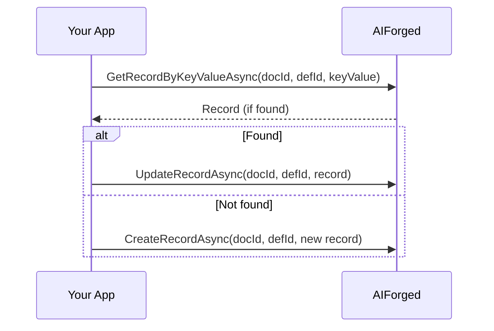

# .NET SDK — How‑to: Custom Datasets

Use Custom Datasets to store, search, and maintain auxiliary data (reference tables, master data, policies) that enrich document processing and validation.

What you’ll learn:

- Discover datasets (by name, definition, or id)
- Read entries with paging, sorting, and search
- Create, update, and delete records (single or bulk)
- Find by key value, and sync with service/categories
- Production tips for scale and reliability

Production API base URL: [https://portal.aiforged.com](https://portal.aiforged.com)  
NuGet: [AIForged.SDK](https://www.nuget.org/packages/AIForged.SDK)

---

## Prerequisites

- .NET 6+ and SDK installed:
  ```bash
  dotnet add package AIForged.SDK
  ```
- Environment variables (recommended):
    - AIFORGED_BASE_URL = https://portal.aiforged.com
    - AIFORGED_API_KEY = •••
    - AIFORGED_PROJECT_ID = (int)
    - AIFORGED_SERVICE_ID = (int)
- Context setup (API key auth):
  ```csharp
  using AIForged.API;

  var baseUrl  = Environment.GetEnvironmentVariable("AIFORGED_BASE_URL") ?? "https://portal.aiforged.com";
  var apiKey   = Environment.GetEnvironmentVariable("AIFORGED_API_KEY")  ?? throw new Exception("AIFORGED_API_KEY not set.");
  int projectId = int.Parse(Environment.GetEnvironmentVariable("AIFORGED_PROJECT_ID"));
  int serviceId = int.Parse(Environment.GetEnvironmentVariable("AIFORGED_SERVICE_ID"));

  var cfg = new Config { BaseUrl = baseUrl, Timeout = TimeSpan.FromMinutes(5) };
  await cfg.Init();
  cfg.HttpClient.DefaultRequestHeaders.Add("X-Api-Key", apiKey);

  var ctx = new Context(cfg);
  var me  = await ctx.GetCurrentUserAsync();
  ```

---

## 1) Discover or create a dataset

Find by name (project + service)
```csharp
var dsByName = await ctx.DataSetClient.GetByNameAsync(
    projectId: projectId,
    stpdId: serviceId,
    dataSetName: "Vendors",
    includeData: false,
    pageNo: 1,
    pageSize: 50,
    sortFieldDefId: null,
    sortDirection: SortDirection.Asc,
    searchField: null,
    searchFilter: null
);
```

Find by definition (pdId)
```csharp
int pdId = /* the dataset definition id */;
var dsByDef = await ctx.DataSetClient.GetByDefAsync(
    projectId: projectId,
    stpdId: serviceId,
    pdId: pdId,
    includeData: true,          // true = return entries
    pageNo: 1,
    pageSize: 100,
    sortFieldDefId: null,       // set to a specific field’s definition id to sort
    sortDirection: SortDirection.Asc,
    searchField: null,
    searchFilter: null
);
```

Find by dataset id
```csharp
int dataSetId = /* dataset id */;
var dsById = await ctx.DataSetClient.GetByIdAsync(
    dataSetId: dataSetId,
    includeData: true,
    pageNo: 1,
    pageSize: 100,
    sortFieldDefId: null,
    sortDirection: SortDirection.Asc,
    searchField: null,
    searchFilter: null
);
```

Create a new empty dataset
```csharp
var created = await ctx.DataSetClient.CreateAsync(
    projectId: projectId,
    stpdId: serviceId,
    dataSetName: "Vendors"
);
// created.Result contains new dataset info (definition will be empty initially)
```

---

## 2) Read entries with paging, sorting, and search

Read via docId + defId (direct)
```csharp
int docId = /* an associated document id, if relevant to your flow */;
int defId = /* dataset definition id (pdId) */;
var ds = await ctx.DataSetClient.GetAsync(
    docId: docId,
    defId: defId,
    includeData: true,
    pageNo: 1,
    pageSize: 100,
    sortFieldDefId: null,        // optional: definition id of the field to sort by
    sortDirection: SortDirection.Asc,
    searchField: null,           // optional: field name to search
    searchFilter: null           // optional: filter text
);
```

!!! note "Notes"
    - includeData: false is faster if you only need headers/metadata.
    - sortFieldDefId: pass a specific field’s definition id to sort by that column.
    - searchField/searchFilter: basic filtering at the API.

---

## Create headers and records (concise guide)

This quick guide shows how to:

- Create a dataset
- Add headers (columns) and persist them
- Re‑fetch header IDs
- Add/update/delete records
- Read with paging/sorting/search

1) Create the dataset
```csharp
// Assumes an authenticated ctx and known projectId/serviceId
var create = await ctx.DataSetClient.CreateAsync(
    projectId: projectId,
    stpdId: serviceId,
    dataSetName: "Vendors"
);

// Server returns dataset context
var created  = create.Result;
int docId    = created.DocId;
int keyDefId = created.KeyDefId;
var keyDef   = created.KeyDef;
```

2) Add headers (columns) and save
```csharp
using System.Collections.ObjectModel;
using AIForged.API;

var dsHeaders = new CustomDataSet
{
    ProjectId = projectId,
    ServiceId = serviceId,
    DocId     = docId,
    KeyDefId  = keyDefId,
    KeyDef    = keyDef,

    // Define columns (headers)
    Definitions = new ObservableCollection<ParameterDefViewModel>
    {
        new ParameterDefViewModel {
            ProjectId = projectId, ServiceTypeId = keyDef.ServiceTypeId, ParentId = keyDefId,
            Name = "VendorName", Description = "Display name",
            Availability = Availability.Public, Category = ParameterDefinitionCategory.DataSet,
            Status = ParameterDefinitionStatus.Default, ValueType = ValueType.String,
            DTC = DateTime.UtcNow, DTM = DateTime.UtcNow
        },
        new ParameterDefViewModel {
            ProjectId = projectId, ServiceTypeId = keyDef.ServiceTypeId, ParentId = keyDefId,
            Name = "VendorCode", Description = "Unique code",
            Availability = Availability.Public, Category = ParameterDefinitionCategory.DataSet,
            Status = ParameterDefinitionStatus.Default, ValueType = ValueType.String,
            DTC = DateTime.UtcNow, DTM = DateTime.UtcNow
        },
        new ParameterDefViewModel {
            ProjectId = projectId, ServiceTypeId = keyDef.ServiceTypeId, ParentId = keyDefId,
            Name = "Status", Description = "Active/Inactive",
            Availability = Availability.Public, Category = ParameterDefinitionCategory.DataSet,
            Status = ParameterDefinitionStatus.Default, ValueType = ValueType.String,
            DTC = DateTime.UtcNow, DTM = DateTime.UtcNow
        }
    },

    IncludeData = false // headers only
};

// Persist columns (merge preserves existing, adds new)
await ctx.DataSetClient.SaveAsync(mergeData: true, dataset: dsHeaders);
```

3) Re‑fetch headers to get field IDs
```csharp
var dsRef = await ctx.DataSetClient.GetByIdAsync(
    dataSetId: keyDefId,  // dataset definition id
    includeData: false,
    pageNo: null, pageSize: null,
    sortFieldDefId: null, sortDirection: null,
    searchField: null, searchFilter: null
);

var defs = dsRef.Result.Definitions;
int vendorNameId = defs.First(d => d.Name == "VendorName").Id;
int vendorCodeId = defs.First(d => d.Name == "VendorCode").Id;
int statusId     = defs.First(d => d.Name == "Status").Id;
```

4) Add a new record
```csharp
var rec = new CustomDataSetRecord
{
    KeyDefId = keyDefId,
    KeyValue = "V-1001", // your unique row key
    Values = new ObservableCollection<CustomDataSetValue>
    {
        new CustomDataSetValue { DefId = vendorNameId, Value = "Acme Ltd" },
        new CustomDataSetValue { DefId = vendorCodeId, Value = "V-1001" },
        new CustomDataSetValue { DefId = statusId,     Value = "Active" }
    }
};

await ctx.DataSetClient.CreateRecordAsync(docId, keyDefId, rec);
```

5) Update an existing record
```csharp
var found = await ctx.DataSetClient.GetRecordByKeyValueAsync(docId, keyDefId, "V-1001", includeVerifications: false);
if (found?.Result is { } upd)
{
    upd.Values.First(v => v.DefId == statusId).Value = "Inactive";
    await ctx.DataSetClient.UpdateRecordAsync(docId, keyDefId, upd);
}
```

6) Delete records
```csharp
await ctx.DataSetClient.DeleteRecordByKeyValueAsync(docId, keyDefId, "V-1001");       // by key value
await ctx.DataSetClient.DeleteRecordAsync(docId, keyDefId, keyId: 123);              // by key id
await ctx.DataSetClient.DeleteRecordsAsync(docId, keyDefId, new List<int>{101,102}); // bulk
```

7) Read with paging/sorting/search
```csharp
var page = await ctx.DataSetClient.GetByIdAsync(
    dataSetId: keyDefId,
    includeData: true,
    pageNo: 1,
    pageSize: 50,
    sortFieldDefId: vendorNameId,
    sortDirection: SortDirection.Asc,
    searchField: "VendorName",
    searchFilter: "Acme"
);

// Rows: page.Result.Data
```

!!! note "Notes"
    - Always re‑fetch Definitions after changing headers to use the correct DefId values.
    - Use a stable KeyValue for idempotent create/retry (check existence with GetRecordByKeyValueAsync).
    - Values are strings — normalize numbers/booleans as needed.

### Alternative: helper methods (CreateNewField and CreateRecord)

The dataset object exposes simple helpers to add columns and pre‑initialize rows.

1) Load the dataset shell (headers only)
```csharp
var dsResp = await ctx.DataSetClient.GetByIdAsync(
    dataSetId: keyDefId,
    includeData: false,
    pageNo: null, pageSize: null,
    sortFieldDefId: null, sortDirection: null,
    searchField: null, searchFilter: null
);
var dataSet = dsResp.Result; // AIForged.API.CustomDataSet
```

2) Add columns with CreateNewField (easiest way to add headers)
```csharp
var colVendorName = dataSet.CreateNewField("VendorName", ValueType.String);
var colVendorCode = dataSet.CreateNewField("VendorCode", ValueType.String);
var colStatus     = dataSet.CreateNewField("Status",     ValueType.String);

// Register headers and save
dataSet.AddField(colVendorName);
dataSet.AddField(colVendorCode);
dataSet.AddField(colStatus);

await ctx.DataSetClient.SaveAsync(mergeData: true, dataset: dataSet);

// Re‑fetch headers for authoritative DefIds
var dsWithIds = await ctx.DataSetClient.GetByIdAsync(dataSet.KeyDefId, includeData: false);
dataSet = dsWithIds.Result;
```

3) Add a record with CreateRecord (pre‑initializes all column values)
```csharp
// Your durable row key
var rec = dataSet.CreateRecord("V-1001");

// Set values by field name (values are strings)
dataSet.SetValue(rec, "VendorName", "Acme Ltd");
dataSet.SetValue(rec, "VendorCode", "V-1001");
dataSet.SetValue(rec, "Status",     "Active");

// Persist the row
await ctx.DataSetClient.CreateRecordAsync(
    docId: dataSet.DocId,
    defId: dataSet.KeyDefId,
    record: rec
);
```

4) Update by key value (simple edit)
```csharp
var found = await ctx.DataSetClient.GetRecordByKeyValueAsync(
    docId: dataSet.DocId,
    defId: dataSet.KeyDefId,
    keyValue: "V-1001",
    includeVerifications: false
);

if (found?.Result is { } upd)
{
    dataSet.SetValue(upd, "Status", "Inactive");
    await ctx.DataSetClient.UpdateRecordAsync(dataSet.DocId, dataSet.KeyDefId, upd);
}
```

5) Delete by key value
```csharp
await ctx.DataSetClient.DeleteRecordByKeyValueAsync(
    docId: dataSet.DocId,
    defId: dataSet.KeyDefId,
    keyValue: "V-1001"
);
```

!!! tip "Tips"
    - CreateNewField ensures the new column is correctly configured; SaveAsync merges changes.
    - CreateRecord initializes a row with values for all current columns.
    - You can set values by field name (as above) or by DefId if you prefer.

---

## 3) Record CRUD (create, update, delete)

Create a record
```csharp
using AIForged.API;

// Your dataset schema drives the record structure.
// Fill the record object as per your dataset field definitions.
var record = new CustomDataSetRecord
{
    // Example (pseudo — replace with your dataset’s fields):
    // KeyId = 0, // usually assigned by server on create
    // Values = new Dictionary<int, string> {
    //     [<FieldDefId_Name>] = "Acme Ltd",
    //     [<FieldDefId_VendorNo>] = "V-1001",
    //     [<FieldDefId_Status>] = "Active"
    // }
};

var createdRec = await ctx.DataSetClient.CreateRecordAsync(
    docId: docId,    // link scope, if your dataset is tied to a document
    defId: defId,    // dataset definition id
    record: record
);
```

Update a record
```csharp
var existing = await ctx.DataSetClient.GetRecordAsync(
    docId: docId,
    defId: defId,
    keyId: /* existing record key id */,
    includeVerifications: false
);

var rec = existing.Result;
// Modify fields as appropriate for your schema.
// e.g., rec.Values[<FieldDefId_Status>] = "Inactive";

var updated = await ctx.DataSetClient.UpdateRecordAsync(
    docId: docId,
    defId: defId,
    record: rec
);
```

Get / delete by key id
```csharp
var one = await ctx.DataSetClient.GetRecordAsync(docId, defId, keyId: 123, includeVerifications: true);

await ctx.DataSetClient.DeleteRecordAsync(
    docId: docId,
    defId: defId,
    keyId: 123
);
```

Find / delete by key value
```csharp
var found = await ctx.DataSetClient.GetRecordByKeyValueAsync(
    docId: docId,
    defId: defId,
    keyValue: "V-1001",
    includeVerifications: false
);

await ctx.DataSetClient.DeleteRecordByKeyValueAsync(
    docId: docId,
    defId: defId,
    keyValue: "V-1001"
);
```

Bulk delete by key ids
```csharp
await ctx.DataSetClient.DeleteRecordsAsync(
    docId: docId,
    defId: defId,
    keyIds: new List<int> { 101, 102, 103 }
);
```

---

## 4) Save and sync

Save (merge vs replace)
```csharp
var dataSet = new CustomDataSet
{
    // Populate dataset metadata and entries according to your schema.
    // This call can merge or replace data depending on 'mergeData' below.
};

var saved = await ctx.DataSetClient.SaveAsync(
    mergeData: true,   // true = merge entries; false = replace
    dataset: dataSet
);
```

Sync dataset with service/categories
```csharp
await ctx.DataSetClient.SyncAsync(
    projectId: projectId,
    stpdId: serviceId,
    pdId: defId,              // dataset definition id
    overrideComment: false,   // keep comments unless true
    overrideReference: false  // keep references unless true
);
```

---

## 5) Dataset search patterns (quick wins)

- Exact match lookups (e.g., “find vendor by code”)
    - Prefer GetRecordByKeyValueAsync to avoid page scans.
- List views with filters
    - Use GetByDefAsync with searchField/searchFilter and paging.
- Sort by specific column
    - Pass sortFieldDefId (the definition id of that field) and sortDirection.

---

## 6) Diagrams (reference)

CRUD workflow


Find-by-key and update


---

## 7) Best practices

- Performance
    - Use includeData=false when you only need headers/metadata.
    - Page results and filter with searchField/searchFilter; sort via sortFieldDefId.
- Idempotency
    - For upserts, prefer “find by key value” then create/update accordingly.
    - For batch changes, SaveAsync with mergeData=true is a safe default.
- Governance
    - Prefer definition‑based access (pdId) for deterministic schemas in CI/CD.
    - Use SyncAsync after definition changes to ensure alignment with services.
- Reliability
    - Wrap calls in your retry policy for transient errors (see Errors & Retries).
    - Increase cfg.Timeout for large saves/reads; avoid unbounded page sizes.

---

## 8) Troubleshooting

- 404 dataset or definition not found
    - Verify dataSetName or pdId; confirm projectId/serviceId.
- Zero results on read
    - Check pageNo/pageSize, searchField/filter, and sortFieldDefId.
- Record create/update fails
    - Ensure your record fields match the dataset’s schema (definition ids / types).
- Bulk delete skipped some keys
    - Confirm the keyIds exist; a partial delete may skip unknown ids.