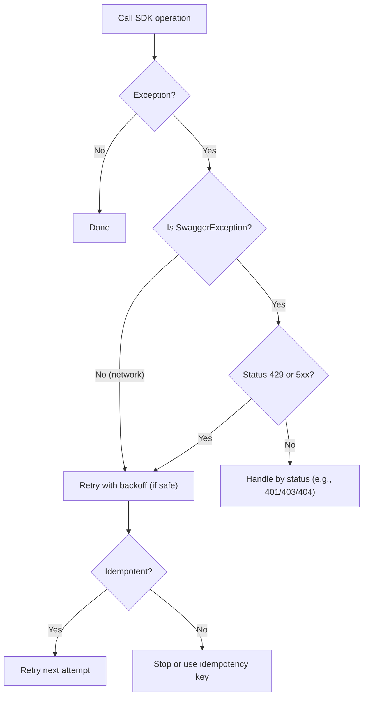

# .NET SDK — How‑to: Errors & Retries

Build resilient integrations with:

- Catching and parsing AIForged.API.SwaggerException
- Backoff strategies for 429/5xx and timeouts
- Idempotency patterns (externalId/guid)
- Logging, correlation, and common failure scenarios

Production API base URL: [https://portal.aiforged.com](https://portal.aiforged.com)  
NuGet: [AIForged.SDK](https://www.nuget.org/packages/AIForged.SDK)

---

## 1) Catch and parse errors (SwaggerException)

All SDK calls can throw AIForged.API.SwaggerException. Inspect:

- StatusCode (HTTP code)
- Response (string body, often JSON with details)
- Message (exception summary)

Basic pattern
```csharp
using AIForged.API;
using System.Net;

try
{
    var me = await ctx.GetCurrentUserAsync();
}
catch (SwaggerException ex)
{
    // Always log status + summary
    Console.Error.WriteLine($"API error {(int)ex.StatusCode} {ex.StatusCode}: {ex.Message}");

    // Optionally parse JSON body for structured details
    var details = TryParseApiError(ex.Response);
    if (details != null)
    {
        Console.Error.WriteLine($"Error code: {details.Code}");
        Console.Error.WriteLine($"Error message: {details.Message}");
        Console.Error.WriteLine($"TraceId: {details.TraceId}");
    }

    // Branch by status for app logic
    if (ex.StatusCode == HttpStatusCode.Unauthorized || ex.StatusCode == HttpStatusCode.Forbidden)
    {
        // rotate key / verify permissions
    }
    else if (ex.StatusCode == (HttpStatusCode)429)
    {
        // apply backoff (see section 2)
    }
    else if ((int)ex.StatusCode >= 500)
    {
        // transient: retry with backoff
    }
}
catch (HttpRequestException ex)
{
    // Network/transport failure (DNS, TCP, TLS)
    Console.Error.WriteLine($"Network error: {ex.Message}");
}
```

Helper: parse JSON error body safely
```csharp
record ApiError(string Code, string Message, string TraceId, string Details);

static ApiError? TryParseApiError(string response)
{
    if (string.IsNullOrWhiteSpace(response)) return null;
    try
    {
        using var doc = System.Text.Json.JsonDocument.Parse(response);
        var root = doc.RootElement;

        string Get(string name)
            => root.TryGetProperty(name, out var p) ? p.GetString() : null;

        return new ApiError(
            Code: Get("code") ?? Get("errorCode") ?? Get("type"),
            Message: Get("message") ?? Get("error") ?? response,
            TraceId: Get("traceId") ?? Get("requestId") ?? Get("correlationId"),
            Details: Get("details")
        );
    }
    catch
    {
        // Not JSON (HTML/plaintext) — fall back to raw text
        return new ApiError(null, response, null, null);
    }
}
```

---

## 2) Backoff strategies (429, 5xx, timeouts)

- 429 Too Many Requests: you are rate‑limited — back off (exponential or jitter).
- 5xx (500/502/503…): transient server/network issue — retry with backoff.
- Timeouts: retry only if the operation is idempotent (see section 3).

Lightweight manual backoff (exponential with jitter)
```csharp
using System.Net;

async Task<T> WithBackoffAsync<T>(Func<Task<T>> action, int maxAttempts = 5)
{
    var rng = new Random();
    var delayMs = 500;

    for (int attempt = 1; attempt <= maxAttempts; attempt++)
    {
        try
        {
            return await action();
        }
        catch (SwaggerException ex) when ((int)ex.StatusCode == 429 || (int)ex.StatusCode >= 500)
        {
            if (attempt == maxAttempts) throw;

            // Optional: look for Retry-After in response headers if available in your environment

            var jitter = rng.Next(0, 250);
            await Task.Delay(delayMs + jitter);
            delayMs = Math.Min(delayMs * 2, 30_000);
        }
        catch (HttpRequestException)  // transient network failure
        {
            if (attempt == maxAttempts) throw;
            var jitter = rng.Next(0, 250);
            await Task.Delay(delayMs + jitter);
            delayMs = Math.Min(delayMs * 2, 30_000);
        }
    }
    throw new Exception("Unreachable");
}
```

Use wrapper for SDK calls
```csharp
var doc = await WithBackoffAsync(async () =>
{
    var resp = await ctx.DocumentClient.GetDocumentAsync(12345);
    return resp.Result;
});
```

Retry decision flow


Timeouts
- Increase Config.Timeout for large uploads/batches:
  ```csharp
  cfg.Timeout = TimeSpan.FromMinutes(5);
  ```
- Pass CancellationToken to SDK methods that support it to cap long calls.

---

## 3) Idempotency patterns

Only retry operations that are idempotent, or make them idempotent with keys. In AIForged:

- Document upload/classify/extract accept both externalId and guid:
  - externalId: your business key to link/avoid duplicates downstream.
  - guid: a unique request identifier to dedupe server‑side request processing.
- GET/READ calls are naturally idempotent.
- Create/update flows (e.g., Work Items) aren’t inherently idempotent — add a guard.

Upload: use externalId + guid
```csharp
var fileParam = new FileParameter(ms, "invoice.pdf", "application/pdf");

var resp = await ctx.DocumentClient.UploadFileAsync(
    stpdId: serviceId,
    userId: ctx.CurrentUser.Id,
    projectId: projectId,
    classId: null,
    status: DocumentStatus.Received,
    usage: UsageType.Inbox,
    masterid: null,
    comment: "SDK upload",
    externalId: "ERP-INV-123456",           // business id
    result: null, resultId: null, resultIndex: null,
    guid: Guid.Parse("c4188b79-7f2c-4c63-8d7d-6c2e8ee9a123"),  // idempotency key
    data: fileParam
);
```

Idempotent retry wrapper for upload
```csharp
var idempotencyGuid = Guid.NewGuid();
await WithBackoffAsync(async () =>
{
    using var ms = new MemoryStream(await File.ReadAllBytesAsync("invoice.pdf"));
    var fp = new FileParameter(ms, "invoice.pdf", "application/pdf");
    var r = await ctx.DocumentClient.UploadFileAsync(
        serviceId, ctx.CurrentUser.Id, projectId, null,
        DocumentStatus.Received, UsageType.Inbox, null,
        "Retry-safe upload", "ERP-INV-123456",
        null, null, null, idempotencyGuid, fp
    );
    return r.Result?.FirstOrDefault();
});
```

Work items: apply “check‑before‑create”

- Before CreateAsync, query for an open/active work item on that doc via GetAsync (filter by document/action/status/time window).
- If found, reuse; else create new.
- This avoids duplicate verification tasks on retries.

```csharp
var existing = await ctx.WorkItemClient.GetAsync(
    userId: ctx.CurrentUser.Id,
    stpdId: serviceId,
    fromDate: DateTime.UtcNow.AddDays(-7),
    toDate: DateTime.UtcNow,
    type: WorkItemType.Document,
    action: WorkItemAction.Verify,
    status: null,           // broaden search to detect open tasks
    pageNo: 1, pageSize: 50,
    filter: $"doc:{doc.Id}", // optional semantic tag you use in comments
    sortField: SortField.DTC,
    sortDirection: SortDirection.Desc
);

var wiId = existing?.Result?.FirstOrDefault()?.Id;
if (wiId == null)
{
    var created = await ctx.WorkItemClient.CreateAsync(
        docId: doc.Id,
        shredId: null,
        comment: $"Verify doc:{doc.Id}",
        method: WorkItemMethod.Random,
        action: WorkItemAction.Verify,
        graceperiod: TimeSpan.FromHours(24),
        toGroupId: groupId,
        toUserId: null
    );
    wiId = created?.Result?.Id;
}
```

---

## 4) Logging, correlation, and observability

Do

- Log: HTTP status, exception type, message, parsed error fields (code/message/traceId).
- Correlate: generate a transaction id (txId = Guid) for each business flow and include it in:
    - your logs
    - AIForged log records via LogClient.CreateAsync (optional, for cross‑system tracing)

Never

- Log API keys or tokens (headers, query strings).

Structured logging example (with txId)
```csharp
var txId = Guid.NewGuid().ToString();

try
{
    var me = await ctx.GetCurrentUserAsync();
}
catch (SwaggerException ex)
{
    var details = TryParseApiError(ex.Response);
    Console.Error.WriteLine($"[{txId}] API {(int)ex.StatusCode} {ex.StatusCode}: {details?.Message ?? ex.Message}");

    // Optional: push to AIForged logs for cross-visibility
    await ctx.LogClient.CreateAsync(
        projectId: projectId,
        serviceId: serviceId,
        documentId: null,
        comment: details?.Message ?? ex.Message,
        errorMessage: ex.Message,
        stackTrace: ex.StackTrace,
        defId: null, parameterId: null, verId: null, workitemId: null,
        eventId: null, txId: txId, page: null
    );
}
```

Set app identity (useful in ops)
```csharp
cfg.AppName = "OrdersService";
cfg.AppVersion = "1.4.2";
cfg.AppComment = "Prod";
```

---

## 5) Common failure scenarios (what to do)

- 401 Unauthorized / 403 Forbidden
    - API key missing/invalid; key lacks project/service access.
    - Fix: rotate API key or adjust access; never log the key.
- 404 Not Found
    - Wrong IDs (project/service/document) or stale reference.
    - Fix: re‑query by externalId or search; verify environment.
- 409 Conflict / duplicates
    - Reused externalId or duplicate command.
    - Fix: apply idempotency (guid) or check-before-create patterns.
- 413 Payload Too Large
    - File exceeds limit.
    - Fix: compress/split documents; batch smaller.
- 415 Unsupported Media Type
    - Wrong content type.
    - Fix: set correct MIME (e.g., application/pdf).
- 429 Too Many Requests
    - Rate limited.
    - Fix: exponential backoff; adjust concurrency; smooth batches.
- 5xx Server Errors
    - Transient/server or network issue.
    - Fix: backoff & retry; add jitter; cap attempts.
- Timeouts
    - Long processing/upload.
    - Fix: increase cfg.Timeout; retry only if idempotent.
- Insufficient balance (document stuck at InsufficientBalance)
    - Account needs funding.
    - Fix: top‑up credits; re‑queue or re‑process afterward.

---

## 6) Production recipe (putting it together)

- Configure client
    - Set cfg.Timeout appropriately for your workload.
    - Wrap SDK calls via WithBackoffAsync for transient faults.
- Make writes idempotent
    - Use externalId and guid on uploads/classify/extract.
    - “Check‑before‑create” for work items and other creates.
- Control concurrency
    - Use 5–10 parallel uploads; back off on 429/5xx; add jitter between batches.
- Log meaningfully
    - Include txId in all logs and optionally in AIForged logs via LogClient.
    - Capture status code, parsed error code/message/traceId — never secrets.

---

## Appendix: Minimal retry helpers

Wrap any SDK call with retry
```csharp
async Task<TResult> ExecWithRetries<TResult>(Func<Task<TResult>> call)
    => await WithBackoffAsync(call);
```

Example: get a page of documents with retry
```csharp
var docs = await ExecWithRetries(async () =>
{
    var resp = await ctx.DocumentClient.GetExtendedAsync(
        userId: ctx.CurrentUser.Id,
        projectId: projectId,
        stpdId: serviceId,
        usage: UsageType.Inbox,
        statuses: new() { DocumentStatus.Received },
        classname: null, filename: null, filetype: null,
        start: DateTime.UtcNow.AddDays(-7), end: DateTime.UtcNow,
        masterid: null, includeparamdefcategories: null,
        pageNo: 1, pageSize: 50,
        sortField: SortField.DTC, sortDirection: SortDirection.Desc,
        comment: null, result: null, resultId: null, resultIndex: null,
        externalId: null, docGuid: null, classId: null, id: null
    );
    return resp.Result?.ToList() ?? new List<DocumentViewModel>();
});
```