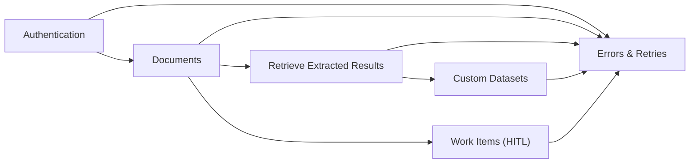

# 🔧 .NET SDK — How‑to Guides

## Overview

These How‑to guides give you a practical path to deliver working outcomes with the AIForged .NET SDK. Start with secure authentication, move through document ingestion and extraction, optionally enrich with custom datasets, add Human‑in‑the‑Loop (HITL) review, and production‑harden with robust error and retry strategies.

!!! info "Scope"
    This landing page orients you to the .NET SDK How‑to guides and how they fit together. Use it to choose the right guide and follow a sensible learning path.

---

## In this section

| Topic | Page |
| --- | --- |
| Authentication | [sdk/dotnet/how-to/authentication](sdk/dotnet/how-to/authentication "mention") |
| Custom Datasets | [sdk/dotnet/how-to/custom-datasets](sdk/dotnet/how-to/custom-datasets "mention") |
| Documents | [sdk/dotnet/how-to/documents](sdk/dotnet/how-to/documents "mention") |
| Errors & Retries | [sdk/dotnet/how-to/errors](sdk/dotnet/how-to/errors "mention") |
| Retrieve Extracted Results | [sdk/dotnet/how-to/retrieve-results](sdk/dotnet/how-to/retrieve-results "mention") |
| Work Items (HITL) | [sdk/dotnet/how-to/workflow](sdk/dotnet/how-to/workflow "mention") |

---

## How these guides fit together

Authenticate once, then move work through your pipeline: upload and process documents, retrieve extracted parameters and verifications, enrich or validate with custom datasets, route exceptions or policy‑sensitive items to HITL, and wrap everything with resilient error and retry handling.



!!! tip "Reading strategy"
    New to the SDK? Start with “Authentication”, then “Documents”, and “Retrieve Extracted Results”. Explore “Custom Datasets” and “Work Items (HITL)” next. Keep “Errors & Retries” handy for production hardening.

---

## Recommended path

1. Authentication
1. Documents
1. Retrieve Extracted Results
1. Custom Datasets
1. Work Items (HITL)
1. Errors & Retries

!!! note "Skip ahead when needed"
    You can jump into any guide directly. The recommended path is optimized for first‑time setup and quick wins.

---

## Quick start

1. Set base URL and API key as environment variables; initialize the SDK config and context.
1. Upload a small test document set and trigger processing.
1. Retrieve extracted results and verify outcomes.
1. (Optional) Create a small custom dataset for enrichment or validation.
1. (Optional) Configure HITL and complete a sample verification.
1. Add basic retries and error logging.

```csharp
// Placeholder: follow each linked How‑to for complete, runnable examples.
```

!!! tip "Keep it fast"
    Use small batches for your first runs, validate outputs quickly, and iterate on configuration before scaling.

---

## Guide previews

### Authentication
- What you’ll learn:
    - Configure base URL and API key, initialize Config/Context, and add the required headers.
    - Validate connectivity and establish a reliable baseline for subsequent calls.
- You’ll use:
    - Environment variables, SDK initialization, and a minimal “smoke test” request.

### Documents
- What you’ll learn:
    - Ingest documents and manage lifecycle from Inbox → Processing → Verification → Outbox.
    - Page, sort, and filter; retrieve blobs (images, results, pages) and metadata.
- You’ll use:
    - Document models (DocumentViewModel, DocumentData), status/usage filters, and result artifacts.

### Retrieve Extracted Results
- What you’ll learn:
    - Access extracted parameters and verification records (flat and hierarchical).
    - Join context (project, service, class) for analytics and downstream export.
- You’ll use:
    - Parameter/verification queries, summaries, and pagination patterns.

### Custom Datasets
- What you’ll learn:
    - Define dataset schemas, add/update rows, and filter/paginate results.
    - Ground extraction and validation against curated reference data.
- You’ll use:
    - Custom dataset models, server‑side filtering, sort direction/fields, and paging.

### Work Items (HITL)
- What you’ll learn:
    - Create/assign items, escalate/transfer, reject, and finalize document workflows.
    - Read summaries/heatmaps and track SLA using timestamps and durations.
- You’ll use:
    - Work item APIs for queues and status transitions, escalation methods, and reporting endpoints.

### Errors & Retries
- What you’ll learn:
    - Interpret exceptions, implement retry/backoff, and set timeouts/cancellations.
    - Log structured error details and avoid unsafe retry scenarios.
- You’ll use:
    - Exception types, cancellation tokens, and a simple resilience policy pattern.

!!! example "Pair the previews with the guides"
    Pick the preview that matches your goal and jump into its How‑to page for step‑by‑step instructions and copy‑paste examples.

---

## Best practices

- Start small, iterate quickly—validate a thin slice end‑to‑end before scaling.
- Prefer server‑side filters and paging to reduce cost and latency.
- Capture external IDs and categories at ingest for clean joins and auditability.
- Define clear HITL criteria (confidence thresholds, sensitive fields, policy triggers).
- Add retries only for transient conditions; handle 4xx responses without retry.

!!! warning "Production readiness"
    Before going live, add structured logging with correlation, sensible timeouts, cancellation support, and limited retry/backoff for transient failures only.

---

## Troubleshooting

- Authentication fails
    - Re‑check base URL, API key, and headers. Test with a minimal read call.
- No results returned
    - Loosen filters, validate IDs, and inspect document statuses/usages.
- HITL not assigning as expected
    - Verify assignment method, target group/user, and role filters.
- Excessive retries or timeouts
    - Differentiate transient vs. permanent errors; tune timeouts and backoff.

!!! info "Deep dives in each guide"
    Each How‑to page contains targeted troubleshooting tips and production checklists specific to that topic.

---

## Outcomes

- A working SDK baseline with authenticated requests.
- Repeatable flows for document processing and results retrieval.
- Optional enrichment via custom datasets aligned to services.
- Operational HITL with clear assignment and SLA tracking.
- Resilient error handling suitable for production.

---

## Related

- [Models & Enums Reference](sdk/dotNET/models-and-enums.md) — schemas and flags used across guides.
- [API Client References](sdk/dotNET/client-reference/index.md) — method signatures, parameters, and response shapes.
- [Agents & Services](agents/index.md) — organize agents, services, and environments.