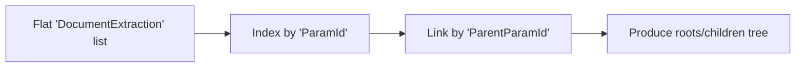
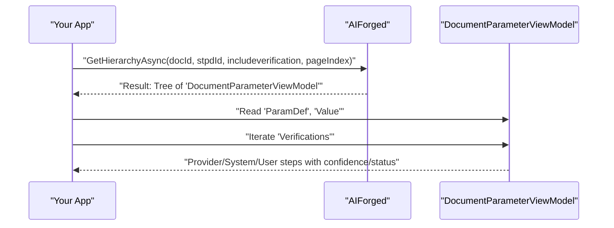
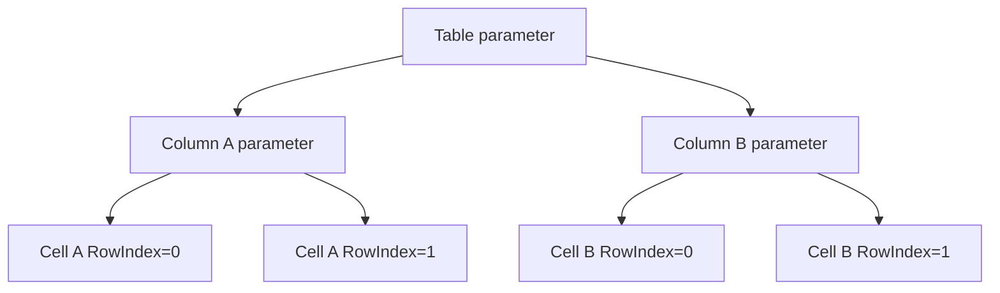

# .NET SDK — How‑to: Retrieve Extracted Results

Overview

After a document has been processed, you can retrieve its extracted data either as a flat list or as a rich hierarchy with definitions and verifications. This page shows how to:

- Call ExtractAsync and MultiExtractAsync to get a flattened list of DocumentExtraction.
- Call GetHierarchyAsync to get a tree of DocumentParameterViewModel with ParamDef (definition) and Verifications.
- Traverse and interpret verifications.
- Build your own domain model, including tables.

!!! tip "Choosing an approach"
    - Use DocumentExtraction (flat) when you need quick “field → value” processing or simple exports.
    - Use DocumentParameterViewModel (hierarchical) when you need context (definitions, rules, transformations, scripts) and the full verification trail.

## Prerequisites

- .NET 6+ and SDK installed:
    ```bash
    dotnet add package AIForged.SDK
    ```
- Environment variables:
    - AIFORGED_BASE_URL = https://portal.aiforged.com
    - AIFORGED_API_KEY = Not provided
    - AIFORGED_PROJECT_ID = Not provided
    - AIFORGED_SERVICE_ID = Not provided
- Context setup (API key auth):
    ```csharp
    using AIForged.API;

    var baseUrl  = Environment.GetEnvironmentVariable("AIFORGED_BASE_URL") ?? "https://portal.aiforged.com";
    var apiKey   = Environment.GetEnvironmentVariable("AIFORGED_API_KEY")  ?? throw new Exception("AIFORGED_API_KEY not set.");
    int projectId = int.Parse(Environment.GetEnvironmentVariable("AIFORGED_PROJECT_ID"));
    int serviceId = int.Parse(Environment.GetEnvironmentVariable("AIFORGED_SERVICE_ID"));

    var cfg = new Config { BaseUrl = baseUrl, Timeout = TimeSpan.FromMinutes(5) };
    await cfg.Init();
    cfg.HttpClient.DefaultRequestHeaders.Add("X-Api-Key", apiKey);

    var ctx = new Context(cfg);
    var me  = await ctx.GetCurrentUserAsync();
    ```

!!! info "Processing status"
    If a document is still processing when you call these APIs, your result list or hierarchy may be empty or incomplete. In production, use a retry policy with backoff.

## Flat results with DocumentExtraction

Use the flat API when you want a quick list of extracted values.

- IParametersClient.ExtractAsync(int? docid)
    - Summary: “Extract document parameters”
    - Returns: “The list of extracted parameters is returned”
- IParametersClient.MultiExtractAsync(List<int> docids)
    - Summary: “Extract multiple document parameters”
    - Returns: “Flat structure of document parameters”

Key properties on DocumentExtraction include:

- Identity/context: DocumentId, Id, ParentId, ParamId, ParentParamId, ParamIndex
- Definition info: Name, Label, Category, Grouping, ValueType, Index
- Value and verification: Value, DT, Confidence, Type, Status, Provider, Result, VerificationId

1. Extract for a single document
    ```csharp
    using AIForged.API;
    using System.Collections.Generic;

    int docId = /* your document id */;

    var resp = await ctx.ParametersClient.ExtractAsync(docId);
    var flat = resp.Result ?? new List<DocumentExtraction>();

    foreach (var x in flat)
    {
        string name = x.Name;
        string label = x.Label;
        string value = x.Value;
        float? confidence = x.Confidence;
        var vType = x.Type;      // VerificationType?
        var vStatus = x.Status;  // VerificationStatus?

        int paramId = x.ParamId;
        int? parentParamId = x.ParentParamId;

        System.Console.WriteLine($"{name} ({label}) = {value} [conf={confidence}]");
    }
    ```

2. Batch extract for multiple documents
    ```csharp
    using AIForged.API;
    using System.Collections.Generic;
    using System.Linq;

    var docIds = new List<int> { 101, 102, 103 };
    var batchResp = await ctx.ParametersClient.MultiExtractAsync(docIds);
    var flatBatch = batchResp.Result ?? new List<DocumentExtraction>();

    foreach (var group in flatBatch.GroupBy(x => x.DocumentId))
    {
        System.Console.WriteLine($"Document {group.Key}");
        foreach (var x in group)
        {
            System.Console.WriteLine($"  {x.Name} = {x.Value}");
        }
    }
    ```

3. Optional: reconstitute a hierarchy from the flat list
    ```csharp
    using AIForged.API;
    using System.Collections.Generic;

    public sealed class ParamNode
    {
        public int ParamId { get; set; }
        public int? ParentParamId { get; set; }
        public string Name { get; set; }
        public string Label { get; set; }
        public string Value { get; set; }
        public List<DocumentExtraction> Items { get; } = new();
        public List<ParamNode> Children { get; } = new();
    }

    public static List<ParamNode> BuildParamTree(IEnumerable<DocumentExtraction> flat)
    {
        var nodes = new Dictionary<int, ParamNode>();

        foreach (var x in flat)
        {
            if (!nodes.TryGetValue(x.ParamId, out var node))
            {
                node = new ParamNode
                {
                    ParamId = x.ParamId,
                    ParentParamId = x.ParentParamId,
                    Name = x.Name,
                    Label = x.Label,
                    Value = x.Value
                };
                nodes[x.ParamId] = node;
            }
            node.Items.Add(x);
        }

        var roots = new List<ParamNode>();
        foreach (var node in nodes.Values)
        {
            if (node.ParentParamId is int parentId && nodes.TryGetValue(parentId, out var parent))
            {
                parent.Children.Add(node);
            }
            else
            {
                roots.Add(node);
            }
        }
        return roots;
    }
    ```



!!! warning "Verification semantics"
    DocumentExtraction includes per-line verification context. If you need the complete verification trail per field (including checks and transformations), prefer the hierarchical API below.

## Hierarchical results with DocumentParameterViewModel

Use GetHierarchyAsync to retrieve a tree with rich context.

- ParametersClient.GetHierarchyAsync(int? docId, int? stpdId, bool? includeverification, int? pageIndex)
    - Summary: “Get document parameter hierarchy”
    - Returns: “The list of parameters is returned”

DocumentParameterViewModel includes:

- Identity/hierarchy: Id, DocumentId, ParamDefId, ParentId, SourceId, Index, ColIndex, RowIndex, ColSpan, RowSpan
- Value/data: Value (string), Data (byte[])
- Definition: ParamDef (ParameterDefViewModel with Name, Label, Category, Grouping, ValueType, etc.)
- Children: ObservableCollection<DocumentParameterViewModel>
- Verifications: ObservableCollection<VerificationViewModel> with Value, Confidence, Type, Status, Provider, DT, etc.

1. Retrieve and traverse the hierarchy
    ```csharp
    using AIForged.API;
    using System;
    using System.Linq;

    int docId = /* your document id */;
    int? stpdId = null;       // optional
    bool? includeVer = true;  // include verification items
    int? pageIndex = null;    // optional

    var resp = await ctx.ParametersClient.GetHierarchyAsync(docId, stpdId, includeVer, pageIndex);
    var roots = resp.Result;  // collection of DocumentParameterViewModel

    void Walk(DocumentParameterViewModel node, int depth = 0)
    {
        string indent = new string(' ', depth * 2);
        string name = node.ParamDef?.Name ?? $"ParamDefId:{node.ParamDefId}";
        string label = node.ParamDef?.Label;
        string value = node.Value;

        Console.WriteLine($"{indent}{name} ({label}) = {value}");

        foreach (var v in node.Verifications ?? new System.Collections.ObjectModel.ObservableCollection<VerificationViewModel>())
        {
            Console.WriteLine($"{indent}  - [{v.Type}/{v.Status}] value={v.Value} conf={v.Confidence} dt={v.DT} provider={v.Provider}");
        }

        foreach (var child in node.Children ?? new System.Collections.ObjectModel.ObservableCollection<DocumentParameterViewModel>())
        {
            Walk(child, depth + 1);
        }
    }

    foreach (var root in roots ?? new System.Collections.ObjectModel.ObservableCollection<DocumentParameterViewModel>())
    {
        Walk(root);
    }
    ```



!!! note "Why verifications matter"
    Verifications represent processing steps: provider output, checks, transformations, and user actions. Use them for transparency, QA thresholds, and audit trails.

## Working with tables (AIForged model)

> “Tables actually work like this: Table Parameter → Column Parameters (Table’s children) → Cell Parameters (Each column’s children. Uses RowIndex to indicate the row the cell belongs to.).”

In AIForged, tables are not modeled with GroupingType.Row as an intermediate node. Instead:

- The table node (ParamDef.Grouping == GroupingType.Table) has children that are the table’s columns.
- Each column node has children that are the cells for that column.
- Each cell indicates which row it belongs to via its RowIndex property.
- You can reconstruct rows by grouping cells from all columns by the same RowIndex.

1. Extract tables from the hierarchy
    ```csharp
    using AIForged.API;
    using System;
    using System.Collections.Generic;
    using System.Linq;

    public sealed class TableItem
    {
        public string Name { get; set; }
        public List<string> Columns { get; } = new();
        public List<Dictionary<string, string>> Rows { get; } = new();
    }

    public static List<TableItem> BuildTablesFromHierarchy(IEnumerable<DocumentParameterViewModel> roots)
    {
        var tables = new List<TableItem>();

        foreach (var table in Traverse(roots).Where(n => n.ParamDef?.Grouping == GroupingType.Table))
        {
            var tableItem = new TableItem
            {
                Name = table.ParamDef?.Name ?? $"ParamDefId:{table.ParamDefId}"
            };

            // Columns are the table's direct children
            var columns = (table.Children ?? new System.Collections.ObjectModel.ObservableCollection<DocumentParameterViewModel>()).ToList();

            // Column names (prefer ParamDef.Name)
            var columnNames = columns
                .Select(c => c.ParamDef?.Name ?? $"ParamDefId:{c.ParamDefId}")
                .ToList();

            tableItem.Columns.AddRange(columnNames);

            // rowIndex -> row dictionary
            var rowsByIndex = new SortedDictionary<int, Dictionary<string, string>>();

            // For each column, enumerate its cells and assign by RowIndex
            foreach (var col in columns)
            {
                string colName = col.ParamDef?.Name ?? $"ParamDefId:{col.ParamDefId}";

                foreach (var cell in col.Children ?? new System.Collections.ObjectModel.ObservableCollection<DocumentParameterViewModel>())
                {
                    // RowIndex identifies which row the cell belongs to
                    int rowIndex = cell.RowIndex ?? 0; // If null, treat as 0 or handle per your policy

                    if (!rowsByIndex.TryGetValue(rowIndex, out var rowDict))
                    {
                        rowDict = new Dictionary<string, string>(StringComparer.OrdinalIgnoreCase);
                        rowsByIndex[rowIndex] = rowDict;
                    }

                    rowDict[colName] = cell.Value;
                }
            }

            // Normalize rows to include all columns (missing cells remain absent or can be set to "")
            foreach (var kvp in rowsByIndex)
            {
                var row = new Dictionary<string, string>(StringComparer.OrdinalIgnoreCase);
                foreach (var colName in columnNames)
                {
                    if (kvp.Value.TryGetValue(colName, out var v))
                        row[colName] = v;
                    else
                        row[colName] = ""; // or leave out if you prefer sparse rows
                }
                tableItem.Rows.Add(row);
            }

            tables.Add(tableItem);
        }

        return tables;
    }

    private static IEnumerable<DocumentParameterViewModel> Traverse(IEnumerable<DocumentParameterViewModel> nodes)
    {
        foreach (var n in nodes ?? Enumerable.Empty<DocumentParameterViewModel>())
        {
            yield return n;
            foreach (var c in Traverse(n.Children))
                yield return c;
        }
    }
    ```



!!! tip "Ordering rows and columns"
    - Rows: sort by RowIndex to preserve input order.
    - Columns: you can use ColIndex on the column nodes to order columns when present; otherwise use the child order.

2. Example: building a combined document model (fields + tables)
    ```csharp
    public sealed class DocModel
    {
        public int DocumentId { get; set; }
        public List<FieldItem> Fields { get; } = new();
        public List<TableItem> Tables { get; } = new();
    }

    public sealed class FieldItem
    {
        public string Path { get; set; }
        public string Name { get; set; }
        public string Label { get; set; }
        public string Value { get; set; }
        public float? Confidence { get; set; }
        public string Provider { get; set; }
        public string Status { get; set; }
    }

    public static DocModel MapHierarchy(IEnumerable<DocumentParameterViewModel> roots, int documentId)
    {
        var model = new DocModel { DocumentId = documentId };

        // Fields: collect leaf nodes (no children)
        foreach (var node in Traverse(roots))
        {
            bool isLeaf = !(node.Children?.Any() ?? false);
            if (isLeaf && node.ParamDef?.Grouping != GroupingType.Table) // exclude table parents
            {
                var lastVer = node.Verifications?.OrderBy(v => v.DT).LastOrDefault();
                string name = node.ParamDef?.Name ?? $"ParamDefId:{node.ParamDefId}";
                string label = node.ParamDef?.Label;

                model.Fields.Add(new FieldItem
                {
                    Path = BuildPath(node),
                    Name = name,
                    Label = label,
                    Value = node.Value,
                    Confidence = lastVer?.Confidence,
                    Provider = lastVer?.Provider,
                    Status = lastVer?.Status?.ToString()
                });
            }
        }

        // Tables
        model.Tables.AddRange(BuildTablesFromHierarchy(roots));

        return model;
    }

    // Helpers (reuse Traverse from previous snippet)
    private static string BuildPath(DocumentParameterViewModel node)
    {
        // Simple name-only path; extend with Index/RowIndex if needed
        var parts = new Stack<string>();
        var cur = node;
        while (cur != null)
        {
            parts.Push(cur.ParamDef?.Name ?? $"ParamDefId:{cur.ParamDefId}");
            // Parent traversal is via ParentId; if you need full parent chain,
            // keep a map of Id->node when building the tree.
            // For this example we only build a local name chain.
            cur = null; // Not provided: direct parent reference
        }
        return string.Join(".", parts);
    }
    ```

    ```mermaid
    flowchart LR
        A["Document 'Processed'"] --> B["ExtractAsync → 'DocumentExtraction' list"]
        A["Document 'Processed'"] --> C["GetHierarchyAsync → 'DocumentParameterViewModel' tree"]
        C --> D["Build tables: group column cells by 'RowIndex'"]
    ```

!!! warning "RowIndex presence"
    RowIndex determines row membership for cells. If RowIndex is null for some cells, decide on a policy (for example, treat as 0 or skip the cell). The example above defaults null to 0.

## Verification and quality checks

1. Ensure results exist
    ```csharp
    var flatResp = await ctx.ParametersClient.ExtractAsync(docId);
    var flat = flatResp.Result;
    if (flat == null || !flat.Any())
    {
        // Document might still be processing; apply retry policy.
    }
    ```

2. Apply confidence thresholds
    ```csharp
    var hResp = await ctx.ParametersClient.GetHierarchyAsync(docId, null, true, null);
    var roots = hResp.Result;

    foreach (var node in roots ?? new System.Collections.ObjectModel.ObservableCollection<DocumentParameterViewModel>())
    {
        foreach (var v in node.Verifications ?? new System.Collections.ObjectModel.ObservableCollection<VerificationViewModel>())
        {
            if (v.Confidence is float conf && conf < 0.7f)
            {
                // Flag for review or route to human-in-the-loop
            }
        }
    }
    ```

3. Handle API errors
    ```csharp
    try
    {
        var resp = await ctx.ParametersClient.ExtractAsync(docId);
        var flat = resp.Result;
        // Use results...
    }
    catch (SwaggerException ex)
    {
        System.Console.Error.WriteLine($"API error {ex.StatusCode}: {ex.Message}");
        System.Console.Error.WriteLine(ex.Response);
        // Retry or remediate per your policy
    }
    ```

!!! example "Combine both approaches"
    A common pattern is to use ExtractAsync for quick checks and totals, and GetHierarchyAsync to build a full object model (definitions + verifications) for downstream logic and audit.

## Troubleshooting

- Empty or partial results
    - The document may still be processing. Retry with backoff.
    - Confirm the document ID is correct and accessible in the current project/service context.
- Missing fields in the tree
    - Rules or transformations may have changed the final values. Inspect the node’s Verifications to see the processing steps.
- Differences between flat and hierarchical values
    - The flat list reflects per-line verification context; the hierarchy presents the final value at each node. Compare with the latest verification (by DT).
- Table reconstruction issues
    - Ensure you build rows by grouping cell nodes by RowIndex across all columns under a single table node.
    - Use ColIndex to order columns when provided; otherwise use child order.

