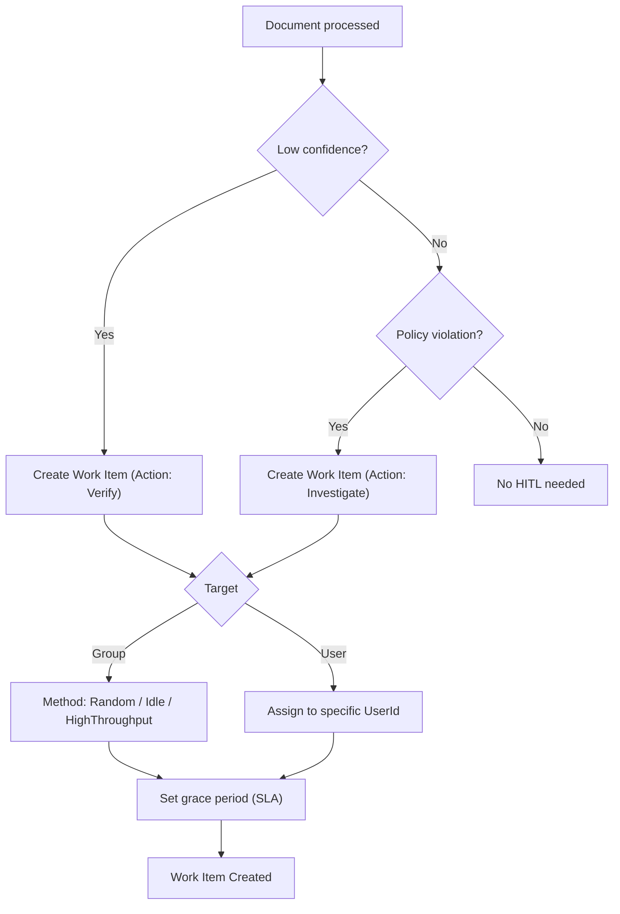
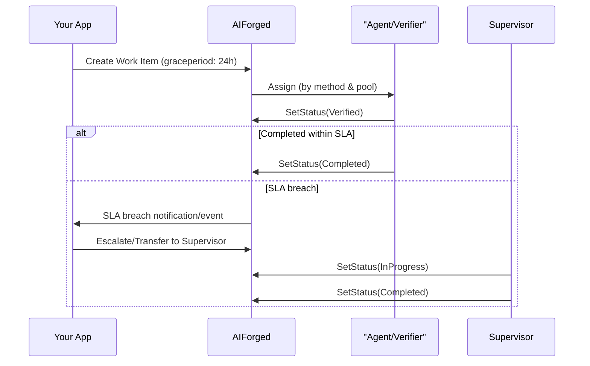

# .NET SDK — How‑to: Work Items (HITL)

This guide helps you create, assign, and escalate Human‑in‑the‑Loop (HITL) work items. You’ll learn when to choose groups vs users, how to route tasks for low confidence and policy violations, how to honor SLAs, and how to read queues and summaries (heatmaps).

Production API base URL: [https://portal.aiforged.com](https://portal.aiforged.com)  
NuGet: [AIForged.SDK](https://www.nuget.org/packages/AIForged.SDK)

---

## Prerequisites

- .NET 6+ and SDK installed:
  ```bash
  dotnet add package AIForged.SDK
  ```
- Environment variables (recommended):
    - AIFORGED_BASE_URL = https://portal.aiforged.com
    - AIFORGED_API_KEY = •••
    - AIFORGED_PROJECT_ID = (int)
    - AIFORGED_SERVICE_ID = (int)
    - AIFORGED_GROUP_ID = (int, optional for group routing)

- Context setup (API key auth):
  ```csharp
  using AIForged.API;

  var baseUrl  = Environment.GetEnvironmentVariable("AIFORGED_BASE_URL") ?? "https://portal.aiforged.com";
  var apiKey   = Environment.GetEnvironmentVariable("AIFORGED_API_KEY")  ?? throw new Exception("AIFORGED_API_KEY not set.");
  int? projectId = int.TryParse(Environment.GetEnvironmentVariable("AIFORGED_PROJECT_ID"), out var p) ? p : null;
  int? serviceId = int.TryParse(Environment.GetEnvironmentVariable("AIFORGED_SERVICE_ID"), out var s) ? s : null;
  int? groupId   = int.TryParse(Environment.GetEnvironmentVariable("AIFORGED_GROUP_ID"), out var g) ? g : null;

  var cfg = new Config { BaseUrl = baseUrl, Timeout = TimeSpan.FromMinutes(5) };
  await cfg.Init();
  cfg.HttpClient.DefaultRequestHeaders.Add("X-Api-Key", apiKey);

  var ctx = new Context(cfg);
  var me  = await ctx.GetCurrentUserAsync();
  ```

---

## 1) Create a work item

Use WorkItemClient.CreateAsync to create a HITL task. You can target:

- a specific user (toUserId), or
- a group (toGroupId) and let the assignment method distribute within that pool.

Basic document‑level verification task (route to a group)
```csharp
var create = await ctx.WorkItemClient.CreateAsync(
    docId: /* required */ 12345,
    shredId: null,                         // optional (field‑level tasks pass a shred/parameter id)
    comment: "Low confidence — please verify",
    method: WorkItemMethod.Random,         // or HighThroughput, Idle, ProjectOwner, DocumentOwner, User
    action: WorkItemAction.Verify,
    graceperiod: TimeSpan.FromHours(24),   // SLA before escalation/transfer
    toGroupId: groupId,                    // route to a group pool
    toUserId: null,                        // or set a specific user id
    reason: null,
    reasonLookup: null,
    reasonRecord: null,
    reasonCode: null,
    reasonDescription: null,
    reasonComment: null,
    roles: new() { "verifydoc" }           // optional role filter depending on your setup
);

var wi = create?.Result;
Console.WriteLine($"Created work item for doc {12345} (id: {wi?.Id}).");
```

Target a specific user
```csharp
var createUser = await ctx.WorkItemClient.CreateAsync(
    docId: 12345,
    shredId: null,
    comment: "Direct hand‑off to specialist",
    method: WorkItemMethod.User,
    action: WorkItemAction.Verify,
    graceperiod: TimeSpan.FromHours(12),
    toGroupId: null,
    toUserId: "user-123"                   // the assignee’s user id
);
```

Field‑level (shred) task
```csharp
var createField = await ctx.WorkItemClient.CreateAsync(
    docId: 12345,
    shredId: 6789,                         // link to a specific parameter/field
    comment: "Please validate invoice number format",
    method: WorkItemMethod.Random,
    action: WorkItemAction.Verify,
    graceperiod: TimeSpan.FromHours(24),
    toGroupId: groupId,
    toUserId: null
);
```

Routing decision flow


!!! tip
    - Prefer group routing for pooled teams; it’s easier to scale and balance.  
    - Use user routing for escalations or named specialists.

---

## 2) Assignment methods: choosing groups vs users

- `WorkItemMethod.Random`: distributes evenly within a group (simple, fair).
- `WorkItemMethod.HighThroughput`: prioritizes users with higher recent throughput (performance‑first).
- `WorkItemMethod.Idle`: prioritizes users with lower recent activity (fairness‑first).
- `WorkItemMethod.ProjectOwner / DocumentOwner`: direct to the owner for triage or accountability.
- `WorkItemMethod.User`: assign to a named user (direct hand‑off).

Patterns:

- `Group + Random`: baseline distribution for verification teams.
- `Group + Idle`: smooth out bottlenecks during peaks.
- `Group + HighThroughput`: speed/volume during SLA crunch windows.
- `User`: urgent escalations or specialist queues.

---

## 3) Patterns: low confidence, policy violations, SLAs

Low confidence verification
```csharp
bool lowConfidence = /* your detection */;
if (lowConfidence)
{
    await ctx.WorkItemClient.CreateAsync(
        docId: doc.Id,
        shredId: null,
        comment: "Low OCR confidence — verify totals",
        method: WorkItemMethod.Random,
        action: WorkItemAction.Verify,
        graceperiod: TimeSpan.FromHours(24),
        toGroupId: groupId,
        toUserId: null
    );
}
```

Policy violation (e.g., sum mismatch, invalid shape)
```csharp
bool policyFail = /* your check */;
if (policyFail)
{
    await ctx.WorkItemClient.CreateAsync(
        docId: doc.Id,
        shredId: null,
        comment: "Policy violation — investigate mismatch",
        method: WorkItemMethod.Idle,
        action: WorkItemAction.Investigate,
        graceperiod: TimeSpan.FromHours(8),
        toGroupId: groupId,
        toUserId: null,
        reasonCode: "SUM_MISMATCH",
        reasonDescription: "Totals do not match line‑item sum"
    );
}
```

SLA and escalation sequence


SLA handling (expire or escalate overdue)
```csharp
// Bulk expire (or mark) work items past due (example filters)
await ctx.WorkItemClient.ExpireAsync(
    userId: ctx.CurrentUser.Id,
    stpdId: serviceId,
    fromDate: DateTime.UtcNow.AddDays(-7),
    toDate: DateTime.UtcNow,
    type: WorkItemType.Document,
    action: WorkItemAction.Verify,
    status: WorkItemStatus.Created,     // e.g., created but not handled
    pageNo: 1,
    pageSize: 500,
    filter: "SLA",                      // optional semantic tag
    reason: WorkItemReason.Timeout,
    reasonLookup: null,
    reasonRecord: null,
    reasonCode: "SLA_BREACH",
    reasonDescription: "Expired by SLA policy",
    reasonComment: "Auto-expired after 24h"
);
```

Escalate a specific work item (reassign)
```csharp
var escalated = await ctx.WorkItemClient.EscelateAsync(
    workItemId: /* wiId */,
    method: WorkItemMethod.ProjectOwner,   // or User/Random/etc.
    toUserId: null,
    toGroupId: groupId,                    // escalate to a supervisory group
    info: "SLA breach — supervisor attention required",
    graceperiod: TimeSpan.FromHours(12),
    reason: WorkItemReason.Timeout,
    reasonLookup: null,
    reasonRecord: null,
    reasonCode: "SLA_BREACH",
    reasonDescription: "Exceeded 24h verification SLA",
    reasonComment: "Auto-escalated by policy",
    roles: new() { GroupRoleType.Administrator } // optional supervisory roles
);
```

Transfer to a named specialist
```csharp
var transfer = await ctx.WorkItemClient.TransferAsync(
    workItemId: /* wiId */,
    fromUserId: null,
    toUserId: "user-specialist-001",
    toGroupId: null,
    method: WorkItemMethod.User,
    reason: WorkItemReason.Escalation,
    reasonLookup: null,
    reasonRecord: null,
    reasonCode: "SPECIALIST",
    reasonDescription: "Specialist hand‑off",
    reasonComment: "Complex case"
);
```

!!! note
    Exact reasons and codes are optional but recommended for auditability and downstream analytics.

---

## 4) Update status during HITL

Use SetStatusAsync to change a work item’s status (e.g., when an agent starts or completes a task).

```csharp
await ctx.WorkItemClient.SetStatusAsync(
    id: /* wiId */,
    status: WorkItemStatus.Verified,
    reason: null,
    reasonLookup: null,
    reasonRecord: null,
    reasonCode: null,
    reasonDescription: null,
    reasonComment: "Agent started work"
);

// Mark completed with a resolved comment
await ctx.WorkItemClient.SetStatusAsync(
    id: /* wiId */,
    status: WorkItemStatus.Completed,
    reason: WorkItemReason.Resolved,
    reasonLookup: null,
    reasonRecord: null,
    reasonCode: "OK",
    reasonDescription: "Verified and corrected",
    reasonComment: "All values validated"
);
```

---

## 5) Reading queues and measuring performance

Work queue (for an agent or a service)
```csharp
var queue = await ctx.WorkItemClient.GetWorkQueueAsync(
    userId: ctx.CurrentUser.Id,          // or a specific agent id
    stpdId: serviceId,
    usage: UsageType.Inbox,
    statuses: new() { DocumentStatus.Verification, DocumentStatus.Received } // docs needing attention
);

foreach (var q in queue ?? new())
    Console.WriteLine($"{q.DocumentId} — {q.ClassName} — {q.Status}");
```

Summary (counts over a time window)
```csharp
var summary = await ctx.WorkItemClient.GetSummaryAsync(
    userId: ctx.CurrentUser.Id,
    fromDate: DateTime.UtcNow.AddDays(-7),
    toDate: DateTime.UtcNow
);

foreach (var s in summary ?? new())
    Console.WriteLine($"{s.Action} — {s.Status} — {s.Count}");
```

Heatmap (work item analytics by project)
```csharp
var heatmap = await ctx.WorkItemClient.GetHeatmapAsync(
    userId: ctx.CurrentUser.Id,
    projectId: projectId ?? 0,
    fromDate: DateTime.UtcNow.AddDays(-30),
    toDate: DateTime.UtcNow
);

foreach (var h in heatmap ?? new())
    Console.WriteLine($"{h.Action} — {h.Status} — {h.Count} (last 30 days)");
```

Paging through work items (advanced)
```csharp
var items = await ctx.WorkItemClient.GetAsync(
    userId: ctx.CurrentUser.Id,
    stpdId: serviceId,
    fromDate: DateTime.UtcNow.AddDays(-14),
    toDate: DateTime.UtcNow,
    type: WorkItemType.Document,
    action: WorkItemAction.Verify,
    status: WorkItemStatus.Created,
    pageNo: 1,
    pageSize: 100,
    filter: null,
    sortField: SortField.DTC,
    sortDirection: SortDirection.Desc
);
```

---

## Best practices

- Groups vs Users:
    - Use groups for pooled routing and scale; use users for escalations and named specialists.
- Methods:
    - Random for baseline fairness; Idle for smoothing load; HighThroughput for SLA crunches.
- SLAs:
    - Always set a grace period. Monitor aging items (ExpireAsync) and auto‑escalate when necessary.
- Metadata:
    - Fill reasonCode/description/comment for audits and analytics; keep comments concise and helpful.
- Observability:
    - Log work item id, document id, project/service ids, action, status transitions (but never log secrets).
- Throughput:
    - Use a safe concurrency level when creating many work items; handle 429/5xx with backoff.

---

## Troubleshooting

- Work item not visible
    - Verify the target group/user exists and is active; confirm your filters (service, dates, statuses).
- Escalation didn’t route as expected
    - Check the method and target parameters; ensure supervisory roles or target users are valid.
- Queue appears empty, but tasks exist
    - Check userId context; some queue queries are scoped to a user vs service. Try broader filters.
- Frequent timeouts or 429s
    - Add retries with exponential backoff; reduce concurrency; consider batching.

---

## Next steps

- Documents (search, upload, status): ../documents/index.md
- Datasets (lookups and curation): ../datasets/index.md
- Errors & Retries (production hygiene): ../errors-retries/index.md