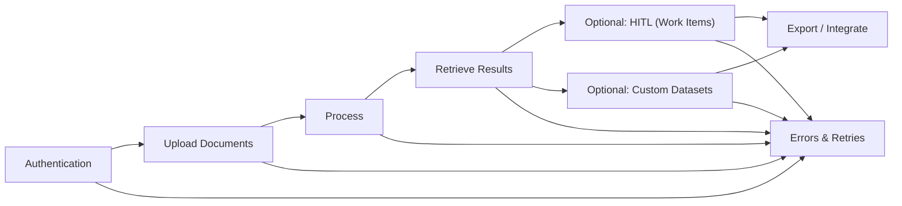

# 🧭 SDKs — Overview

## Overview

AIForged SDKs provide a typed, developer-friendly way to integrate programmatically with the platform. Use the SDK when you want language-native models, resilient client patterns, and discoverable operations. Use the REST API directly when you need polyglot scripting, ultra-light dependencies, or raw HTTP access.

!!! info "What this page helps you do"
    Pick an SDK, understand the typical development flow, and jump into the right quick start or how‑to. Includes placeholders for TypeScript and Python SDKs.

---

## In this section

A quick index of available SDKs and where to find their docs.

| SDK | Status | Docs |
| --- | --- | --- |
| .NET (C#) | Available | [/sdk/dotnet/](sdk/dotnet/) |
| TypeScript | Coming Soon | [/sdk/javascript/](sdk/javascript/) |
| Python | Coming Soon | [/sdk/python/](sdk/python/) |

!!! note "Placeholders"
    TypeScript and Python entries are placeholders for now. We will update links and status as the documentation for those SDKs are published.

---

## Quick start chooser

Pick the SDK that matches your stack. Each quick start gets you from authentication to your first results.

- .NET (C#)
    - Install (replace with the published package name):
        ```bash
        dotnet add package AIForged.SDK
        ```
    - Authenticate, upload a document, trigger processing, retrieve results.
    - Explore how‑to guides for documents, datasets, HITL, and errors/retries.
    - Links:
        - [Overview](/sdk/dotnet)
        - [Quickstart](/sdk/dotnet/quickstart)
        - [How‑to Guides](/sdk/dotnet/how-to)
- TypeScript
    - Install (placeholder; replace with the published package name):
        ```bash
        npm install AIForged.SDK
        ```
    - Placeholder for install, auth, and first document flow.
    - Links:
        - [Overview](/sdk/javascript/)
        - [Quickstart](/sdk/javascript/quickstart)
- Python
    - Install (placeholder; replace with the published package name):
        ```bash
        pip install AIForged.SDK
        ```
    - Placeholder for install, auth, and first document flow.
    - Links:
        - [Overview](/sdk/python/)
        - [Quickstart](/sdk/python/quickstart)

!!! tip "Fast path to success"
    Start with a tiny sample (one or two documents) to validate your flow end‑to‑end. Scale only after you’ve confirmed outputs and any HITL (Human‑in‑the‑Loop) steps.

---

## Typical developer flow

A small visual to orient new developers to the common steps you’ll implement with any SDK.



!!! example "Where to go next"
    - Learn authentication flow: [sdk/dotnet/how-to/authentication](/sdk/dotnet/how-to/authentication)
    - Learn document flows: [sdk/dotnet/how-to/documents](/sdk/dotnet/how-to/documents)
    - Retrieve results: [sdk/dotnet/how-to/retrieve-results](/sdk/dotnet/how-to/retrieve-results)
    - HITL work items: [sdk/dotnet/how-to/workflow](/sdk/dotnet/how-to/workflow)

---

## Integrations and automation

AIForged integrates with RPA and low‑code tools for orchestration at scale.

- UiPath activities: build unattended and attended automations with AIForged steps.
- Power Automate connector: trigger AIForged actions and react to results within flows.
- Webhooks: subscribe your services to document, verification, or workflow events.

!!! info "When to use integrations"
    Use SDKs for application code and deeper control. Use UiPath or Power Automate to compose cross‑system workflows and human approvals without writing much code.

---

## Best practices

- Choose the SDK closest to your runtime and team skills.
- Capture External IDs at ingest for easy reconciliation downstream.
- Prefer server‑side filtering, paging, and sorting for performance and cost.
- Define clear HITL criteria early (confidence thresholds, sensitive fields).
- Implement retries only for transient conditions; avoid retrying on most 4xx responses.

!!! warning "Security essentials"
    Never commit tokens or secrets. Use environment variables or secret managers. Scope tokens minimally and rotate regularly.

---

## Troubleshooting

- Can’t authenticate
    - Verify base URL and token configuration; try a minimal “who‑am‑I” or read call.
- No results after processing
    - Check document status transitions and service configuration; loosen filters.
- Unexpected HITL routing
    - Confirm assignment method, target group/user, and role flags.

!!! note "Deeper help"
    Each SDK section includes targeted troubleshooting for its quick starts and how‑tos.

---

## Related

- How‑to Guides: [sdk/dotnet/how-to/](/sdk/dotnet/how-to/)
- Client References: [sdk/dotnet/client-reference/](/sdk/dotnet/client-reference/)
- Models & Enums Reference (.NET): [sdk/dotnet/models-and-enums](/sdk/dotnet/models-and-enums)