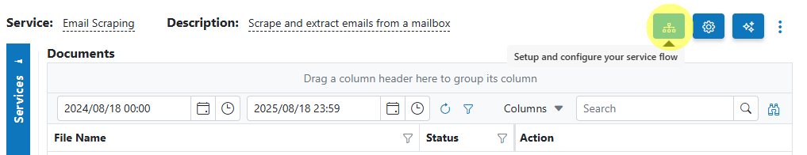
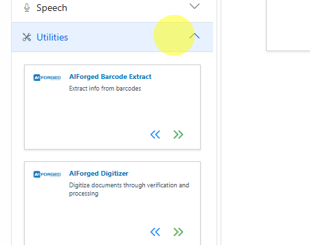
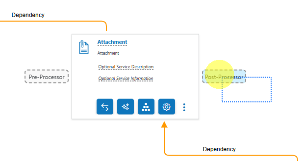
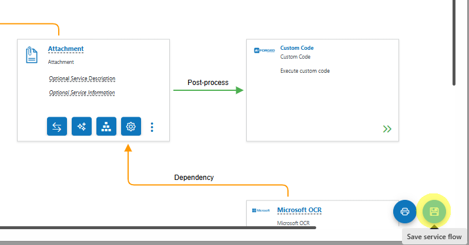
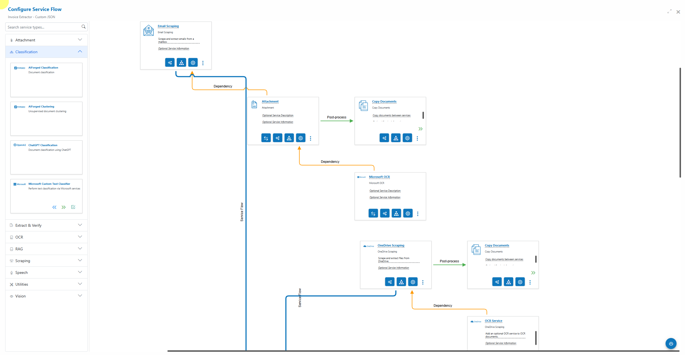
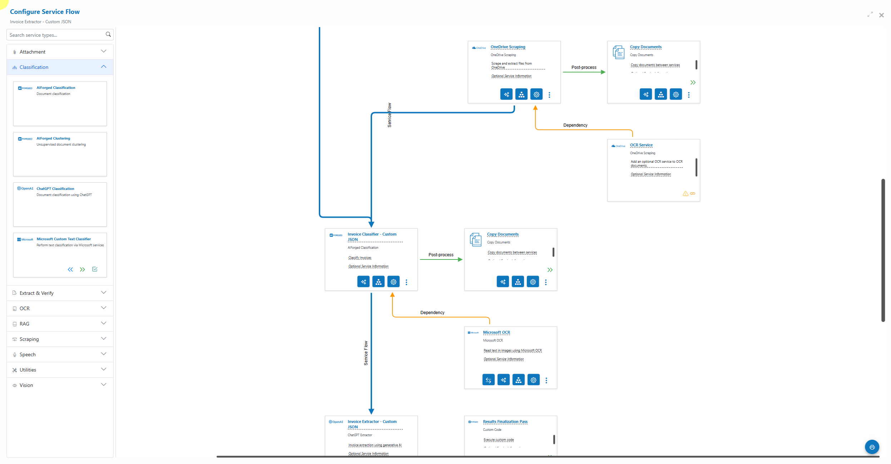
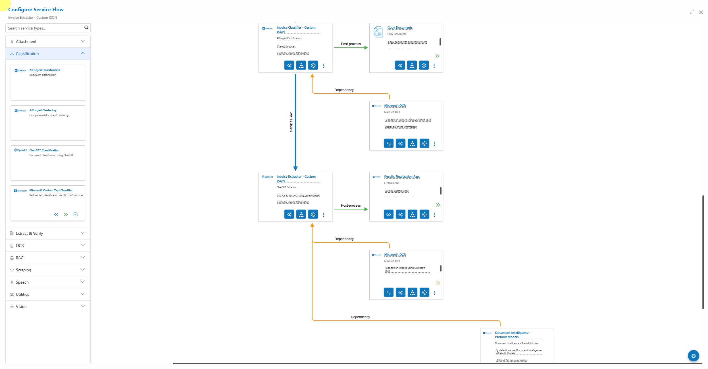
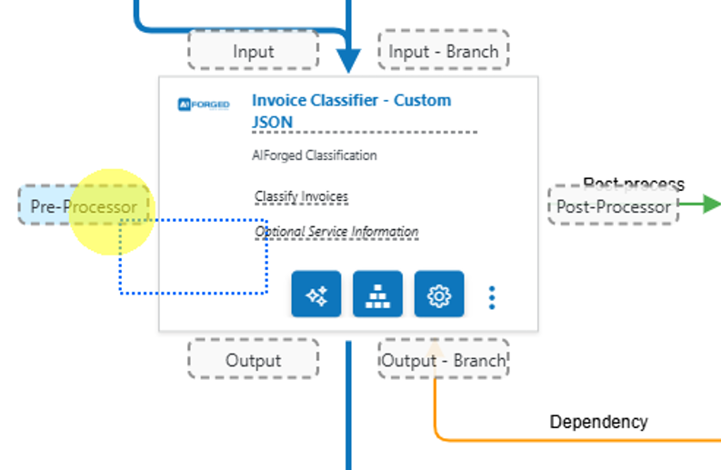
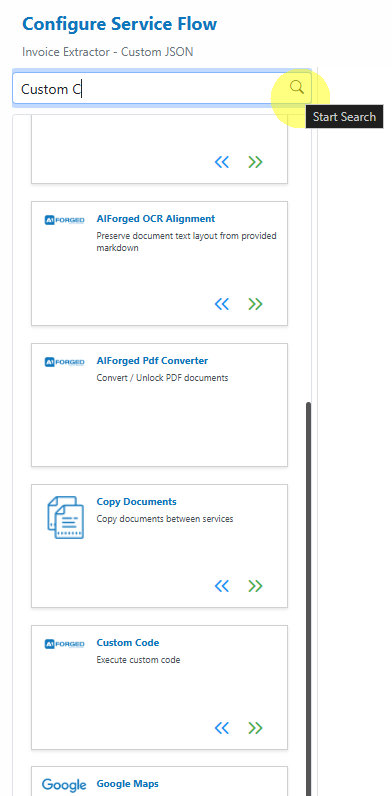
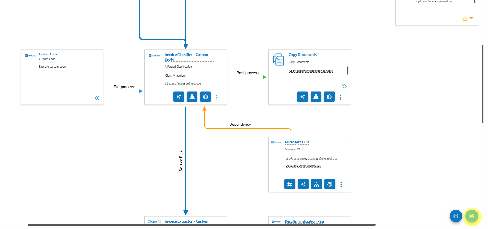

# 🔀 Service Flow Configurator

The Service Flow Configurator is the preferred way to set up, configure, and manage your services in AIForged. It presents your solution as an easy‑to‑read flow diagram and lets you drag services from a palette and drop them onto clearly marked drop points to build end‑to‑end pipelines.

- Visual, trustworthy representation of inputs, outputs, pre/post‑processing, dependencies, and verification
- Fast configuration with drag‑and‑drop and context‑aware drop points
- Clear auditing with save/apply steps and a one‑click export to PNG for documentation

!!! tip
    Keep your flows modular: use dedicated utilities for normalization and transport (Digitizer, PDF Converter, Copy Documents), and keep extraction concerns focused (Document Intelligence or LLM Extractor). This yields higher accuracy and easier maintenance.

---

## Prerequisites

- You have at least one service created in your Agent (starting point for the flow).
- You’re working in the correct Tenant and have the right role:
  - Owner, Administrator, or Developer.
- You can open the target service’s Service View (from which you’ll launch the Configurator).

!!! tip
    If configuration options appear disabled or you can’t see your team’s services, switch to your company Tenant using the Tenant selector in the top‑right of AIForged Studio. Roles are assigned per Tenant.

---

## Open the Service Flow Configurator

You launch the Configurator from any existing service in your Agent:

- Open the service, then click the “Open Service Flow Configurator” button to launch the diagram canvas.

Example steps and visuals (Email Scraping as the starting service):

1. Open the Service Flow Configurator for the Email Scraping service by clicking on the Open Service Flow Configurator  button.  
    
2. Expand the Utilities service group.  
    
3. Drag the Custom Code service type card over the Attachment Service card, then to the Post‑Processor drop point.  
    
4. Click Save (bottom‑right) to apply changes.
    

!!! warning
    Changes are not applied until you click Save. After saving, newly added services will display their action buttons (Settings, Parameters, Wizard, Code Editor, etc.).

---

## The canvas at a glance

- Left panel: Service Palette
  - Collapse/expand categories (e.g., Scraping, Classification, Extract & Verify, OCR, Utilities, Vision)
  - Search to filter available service types
- Middle: Diagram canvas
  - Service cards represent configured services
  - Connectors and labels indicate flow semantics (see legend below)
  - Context‑aware drop points appear on hover while dragging

Color/line legend (as shown in the UI):

- Blue lines: Main service flow (input → target → output)
- Green arrows: Post‑process path (runs after the target service)
- Orange lines: Dependency links (e.g., OCR required by a downstream step)
- Grey dashed boxes: Drop points (appear only when applicable)

---

## Drop points and what they do

The configurator adapts visible drop points based on the service you’re dragging and the target service you’re hovering over.

- Input
    - The dropped service will feed its output into the target service.
    - If an input already exists, your new input becomes the upstream input and the previous input is chained behind it.
- Input – Branch
    - Appears only when the target already has an input.
    - Add a parallel input path without altering existing inputs.
- Output
    - The dropped service will receive the target’s output as its input.
    - If an output already exists, your new output becomes the next step and the previous output is chained behind it.
- Output – Branch
    - Appears only when the target already has an output.
    - Add a parallel output path without altering existing outputs.
- Pre‑Processor
    - Appears for compatible types (typically utilities).
    - Runs before the target service processes documents.
- Post‑Processor
    - Appears for compatible types (typically utilities).
    - Runs after the target service processes documents.
- Dependency
    - Appears on dependency placeholders.
    - Some services need a dependency (e.g., OCR) to function correctly. If not preconfigured, a placeholder invites you to drop a compatible dependency service.
- Verification
    - Appears when dragging services that can enrich or verify data for an Extract & Verify service (e.g., OCR/Vision‑based checks).

!!! note
    Available drop points change dynamically based on the service type being dragged. If you don’t see the expected drop point, confirm the dragged service is compatible with the target position.

---

## Important: Utilities are not standalone

Utility services (e.g., Digitizer, PDF Converter, Image Splitter, Copy Documents, Custom Code, Workflow Code) are attached as Pre‑ or Post‑Processors. They are not meant to be configured as standalone services.

- Parent service’s Service View:
    - Click Add Service → Utility Service to attach as Pre or Post.
- Service Flow Configurator:
    - Expand the Utilities group, drag the utility over the parent, then drop:
        - Left = Pre‑Processor
        - Right = Post‑Processor

!!! tip
    Copy Documents is the default “transport” between services and is automatically added when you connect services from one to the next in the flow configurator.

---

## Service cards: controls and actions

Each configured service appears as a card with the service name, description, and its run type (e.g., Post‑Processor, Dependency). After saving, each card shows these actions:

- Service Settings
- Parameter Definitions
- Service Configuration Wizard
- Switch Dependency (dependency services only, e.g., swap Microsoft OCR ↔ Google OCR)
- Code Editor (for Custom Code and Workflow Code)
- More Actions menu (e.g., Remove Service)

!!! tip
    If you’ve just added a service and can’t see these buttons, click Save to persist and refresh the card actions.

---

## Example flows (visual)

- End‑to‑end with Email and OneDrive Scraping, Attachment extraction, OCR dependencies, and Copy Documents routing:  
    
    
    

- Drop point preview while dragging:  
    

- Palette search example:  
    

- Save your configuration (bottom‑right):  
    

---

## Building common patterns

- Intake to extraction (classic)
    - Scraper (Email/OneDrive) → Attachment (Post‑Processor: Copy Documents) → OCR (Dependency) → Extract & Verify (Document Intelligence) → Post‑Processor (Custom Code for normalization)
- Intake to LLM reasoning (unstructured)
    - Scraper → Digitizer (Pre‑Processor) → LLM Extractor → Post‑Processor (Custom Code for validation, Copy Documents for routing) → Optional Verification
- Classification gate
    - Scraper → Classifier (Output – Branch per class) → Per‑class OCR/Extract pipelines

!!! tip
    For unstructured or highly variable content, use LLM Extractor with a typed schema. Ground prompts with datasets and enforce types. You can still keep OCR as a dependency to ensure text fidelity.

---

## Exporting the flow

- Use the Export to PNG action to capture the flow diagram for solution documentation and design reviews.

---

## Troubleshooting

- I can’t drop a utility where I expect to:
    - Utilities must be Pre‑ or Post‑Processors. Hover over the left or right drop points of a compatible target.
- My new service is missing action buttons:
    - Click Save to apply changes; actions appear after persistence.
- Dependencies keep showing a placeholder:
    - Drop a compatible OCR or required service into the Dependency drop point.
- Options are disabled:
    - Switch to the correct Tenant and ensure your role is Owner, Administrator, or Developer.

---

## Developer and automation options

Beyond Studio, you can create and manage full service flows programmatically:

- REST APIs (foundation)
- SDKs for .NET (C#) and JavaScript/TypeScript
- UiPath activities and Power Automate connectors

Use these to provision agents/services, configure parameters, attach utilities, manage HITL routing, and report on results—everything you can do in Studio, automated.

---

## Quick checklist

- [ ] Open the target service and launch the Service Flow Configurator  
- [ ] Drag required services from the palette and drop onto the correct drop points  
- [ ] Attach utilities as Pre/Post (not standalone)  
- [ ] Add required dependencies (OCR, etc.) where placeholders are shown  
- [ ] Configure verification where needed  
- [ ] Click Save to apply  
- [ ] Export PNG for your documentation (optional)

---