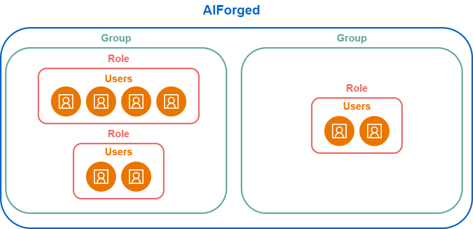

# 👥 Organisations and User Groups

## Organisation and Usergroup Management in AIForged

Managing access to your AI agents and services is essential for maintaining security, compliance, and operational efficiency. AIForged provides a robust framework for organizing users and defining clear access rules through Organisations and Usergroups.

### What Are Organisations and Usergroups?

Organisations in AIForged are the top-level entities that represent your company or business unit within the platform. Usergroups exist within these Organisations and are designed to streamline the management of permissions, roles, and access to AI-powered services.

**Key Benefits:**

* **Granular Access Control:** Assign specific permissions at both the organisation and individual AI agent level.
* **Role-Based Security:** Define roles such as System Administrator, Solution Developer, Document Verifier, and more, ensuring users only access what they need.
* **Efficient Collaboration:** Organise teams and responsibilities, supporting Human-in-the-Loop (HITL) workflows.

### Structure and Hierarchy

At the core of AIForged’s access management is a hierarchical model:

1. **Tenant Groups (Root Level):**
   * Represent the highest authority within an Organisation.
   * Manage all user access and permissions across the Organisation.
2. **Nested Usergroups:**
   * Created within Tenant Groups to reflect specific teams, projects, or AI agents (e.g., Invoice Processing Group).
   * Each group can have tailored roles and permissions based on operational needs.

### Roles and Permissions

Roles are the backbone of the permission system in AIForged. Examples include:

* **Administrator:** Full access to configuration, management, and auditing features.
* **Developer:** Rights to create, modify, and test AI agents and services.
* **User:** Limited access, typically focused on using assigned agents or services.
* **Document Verifier (DocVerify):** Access to review, verify, and validate documents in HITL workflows.

Each user is assigned to one or more Usergroups and inherits permissions based on their role and the group’s configuration. Permissions can be applied:

* **Globally:** Across all AI agents within the Organisation.
* **Specifically:** To selected AI agents or services only.

### Example Scenario

Suppose your Organisation processes invoices and contracts using different AI agents. You can:

* Create a Tenant Group to govern overall access.
* Establish nested Usergroups for "Invoice Processing" and "Contract Review."
* Assign roles so only Document Verifiers can approve processed documents, while Developers can update AI agent logic.

