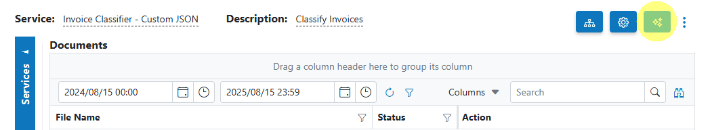

# 🧭 AIForged Classifier

## Overview

The AIForged Classifier is a supervised machine learning service that classifies documents (and pages) into business-ready categories. It is cost‑effective, reliable, and typically requires minimal maintenance over an agent’s lifetime. Use it to route work, branch flows, and organize documents for downstream processing.

!!! info
    Ideal for document triage, inbox routing, automated foldering, and pre‑processing before specialized extraction.

---

## Supported content types

- PDF (single or multi‑page)
- TIFF (single or multi‑page)
- Images: JPEG, PNG

!!! info
    If your inputs are in other formats, normalize with the AIForged PDF Converter first for best results.

---

## Possible use cases

- Auto‑separate invoices, receipts, and statements for downstream extractors.
- Triage HR or onboarding documents (ID, proof‑of‑address, contracts).
- Identify mixed batches and route to the right Service per category.
- Page‑level classification to split/assemble documents before export.

---

## Service setup

Follow these steps to add and configure the AIForged Classifier in your agent:

1. Open the Agent view
    - Navigate to the agent where you want to add the Service.
    - %20(1)%20(1)%20(1).png)

2. Add the Service
    - Click Add Service and select AIForged Classifier.
    - %20(1)%20(1)%20(1).png)

3. Open the Service Wizard
    - 
    - or
    - 
    - Step 1: General
        - Configure settings related to how your classifier processes documents.
        - 
    - Step 2: Categories
        - Add all business categories (classes) you want the classifier to recognize (e.g., Invoice, Receipt, Statement).
        - 
    - Step 3: Training
        - Upload labeled examples per category (see “Training the classifier”).
        - %20(1)%20(1)%20(1).png)

---

## Recommended settings

| Setting            | Description                                                                                   | Recommendation                                                                                         |
|--------------------|-----------------------------------------------------------------------------------------------|--------------------------------------------------------------------------------------------------------|
| Enabled            | Turns the Service on for processing.                                                          | On (when you’re ready to run)                                                                          |
| Auto Execution     | Processes “Received” items on a schedule.                                                     | On for production; Off for manual/QA                                                                   |
| Force PDF Image    | Flattens PDFs to image‑only for consistent vision input.                                      | Off by default; enable only if complex PDF artifacts reduce accuracy                                   |
| Merge To PDF       | Groups classified pages into consolidated PDFs by detected class.                              | On if you need per‑class PDFs; Off if you want to keep pages/documents separate                        |
| Document Status    | Status set after processing.                                                                  | Use “Completed” or your team’s standard                                                                |
| Remove Comments    | Strips human comments prior to classification.                                                | On in regulated environments; optional otherwise                                                        |
| Archiving Strategy | Lifecycle retention (days before automated deletion).                                         | Align to your data retention policy                                                                     |

!!! tip
    If accuracy drops on scanned or layered PDFs, try enabling Force PDF Image. It increases processing time but often improves consistency.

---

## Training the classifier

1. Define classes (Categories)
    - In the Categories step, add each business category you need (e.g., Invoice, Receipt).
    - Aim for clear, distinct definitions to avoid overlap.
    - %20(1)%20(1)%20(1).png)

2. Prepare and upload training data
    - Go to the Training step and upload example documents per class.
    - Provide at least 5–10 representative samples per class to start; more is better.
    - Upload one class at a time to avoid labeling mistakes.
    - %20(1)%20(1)%20(1).png)

3. Train the model
    - Click the Train %20(1)%20(1)%20(1).png) button.
    - %20(1)%20(1)%20(1).png)
    - Keep processing parameters default for the first run.
    - Monitor progress; the dialog will close automatically when finished.

!!! info
    Balanced, diverse samples per class lead to better generalization. Add new examples over time and retrain to improve accuracy.

---

## Add and process documents

1. Open Service
    - In the AIForged Classifier, click Upload or drag‑and‑drop files into the grid.

2. Select Category (optional)
    - For unlabeled production items, leave as “No selection.”
    - For additional training or test labeling, choose the intended Category.

3. Process documents
    - Select items, click Process or Process Checked.
    - For clean re‑runs, consider enabling Reset Previous Results and Delete Output of Previous Processing.

!!! tip
    For new configurations, process a small batch first to validate predictions before you scale up.

---

## View processed documents

- Switch the usage filter to Outbox to view results.
- Open a processed item to see:
    - Predicted category and confidence
    - Page‑level vs document‑level classification outcome
    - Any grouped output (if Merge To PDF is enabled)
- Use filters to review low‑confidence predictions and feed corrections back into training.

---

## Troubleshooting tips

- Classifier not performing well
    - Ensure at least 5–10 varied examples per class; add more for edge cases.
    - Avoid near‑duplicate samples across different classes.
    - Check if classes are too similar; consider merging or adding clearer examples.

- Training fails to start/complete
    - Verify sufficient credits on the agent.
    - Confirm formats are supported (PDF, TIFF, JPEG, PNG).
    - Re‑upload any files that errored during upload.

- Unexpected page/document grouping
    - Review Merge To PDF setting.
    - For page‑level flows, keep Merge To PDF off and manage assembly downstream.

- Many low‑confidence results
    - Add representative samples and retrain.
    - Consider pre‑processing (Digitizer, PDF Converter) to normalize inputs.

- Performance concerns
    - Use Auto Execution with moderate Batch Size (e.g., 10–30) and a sensible interval.
    - Avoid Force PDF Image unless needed; it increases processing time.

---

## Best practices

- Balance your classes
    - Keep similar numbers of samples per class to avoid bias.
- Keep classes distinct
    - Use clear naming and scope; split overly broad classes.
- Iterate regularly
    - Add misclassified samples to training and retrain periodically.
- Normalize early
    - Convert to PDF and standardize scans for consistent results.
- Govern with categories
    - Use Categories for business types; Usage/Status for lifecycle (Inbox, Processing, Verification, Outbox).