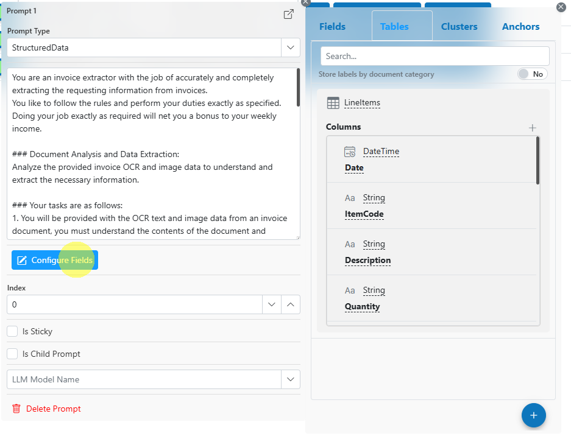
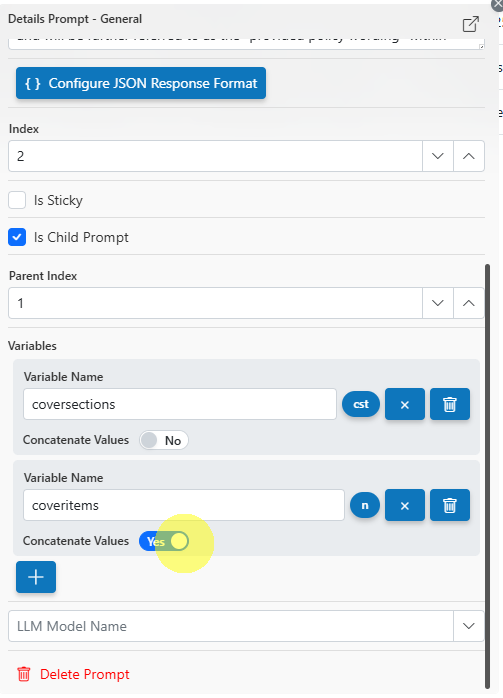
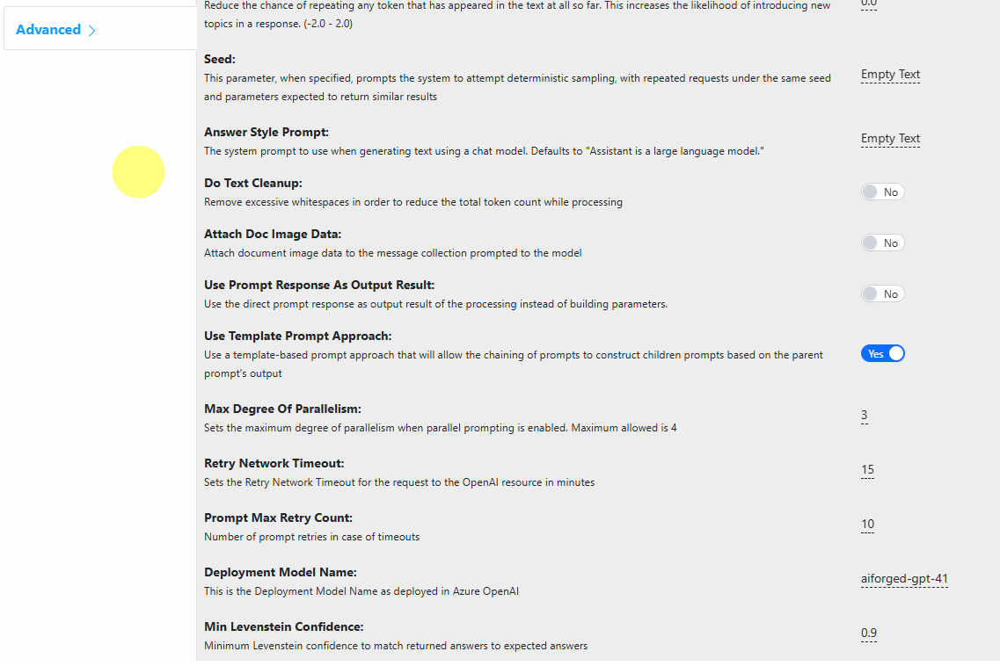

# LLM Extractor

### Overview

The **LLM Extractor** service in AIForged leverages cutting-edge generative AI models (LLMs) to extract structured data from documents using user-defined prompts. With support for multi-prompt workflows, template and child prompting, and full configurability of model parameters, LLM Extractor provides unparalleled flexibility for custom data extraction—without needing to train or label traditional models.


LLM Extractor empowers you to extract exactly the data you want, in your preferred format, by designing prompts and structured response templates tailored to your use case.



Even though other LLM service are still available in AIForged such as ChatGPT Extractor and Claude Extractor, it is recommended to use and / or migrate to the LLM Extractor service as the other services have been deprecated.



**❗ Important:**\
**For all prompt types (Plain Text, JSON, Structured Data), your prompt must always include a clear instruction that the output/result must be in valid JSON format.**\
&#xNAN;_&#x54;his ensures that responses from the AI model are structured and can be reliably parsed for downstream processing._


***

### Supported Content Types

* PDF
* Images (JPEG, PNG, TIFF, etc.)


If your content is in a different format, use the AIForged PDF Converter to generate a compatible file.


***

### Possible Use Cases

* Extracting specific, structured information from invoices, contracts, forms, and custom documents.
* Creating multi-step and hierarchical data extraction workflows using chained or child prompts.
* Rapid prototyping of new data extraction solutions without traditional model training.
* Supporting multi-modal extraction with OCR’d text and document images for LLMs that support images.

***

### Service Setup

Follow these steps to add and configure the **LLM Extractor** service to your agent:

1. **Open the Agent View**\
   Navigate to the agent where you want to add the service.
2. **Add the LLM Extractor Service**\
   Click the **Add Service** .png>) button.
3. **Select Service Type**\
   Choose **LLM Extractor** from the available service types.\
    (1).png>)
4.  **Configure the Service Wizard**\
    Open the Service Configuration Wizard.\
     (1).png>)\
    or

    <figure><figcaption></figcaption></figure>

    * **Step 1: General Settings**\
      Configure core settings such as service enablement, parallel prompt execution, and connection details for your LLM provider (e.g., Azure OpenAI).\
      &#xNAN;_&#x44;efault settings are sufficient for most use cases._\
      .png>)
    *   **Step 2: Prompts**\
        Set up your extraction prompts.\
        **This is done directly from the Service view by clicking on the Prompt Configuration button:**\
        .png>)\
        **Additional prompts can be added by clicking on the** .png>) **button.**\
        .png>)

        For each prompt, you can configure:

        * **Prompt Type:**
          * **Plain Text:** Write a fully custom prompt and configure the JSON response schema.\
            .png>)\
            .png>)
          * **JSON:** Write the prompt as pure JSON (the UI will provide a JSON editor).\
            .png>)
          * **Structured Data:** Use custom prompts, but define the response format using Label Definitions for easy, visual mapping of output fields.\
            \

        * **Response Format:**
          * For Plain Text prompts, click **Configure JSON Response Format** to define the required output structure as a JSON schema.\
            .png>)\
            .png>)
          * For Structured Data prompts, click **Configure Fields** to design your field and table outputs visually.\
            
        * **Model Selection:**
          * Choose which LLM model to use for this prompt (per prompt basis).
        * **Index:**
          * Set the order of execution for prompts (lower index executes first).
        * **Sticky/Child Prompt:**
          * Make a prompt "sticky" (persists context) or configure as a child of another prompt for template/variable-based prompting.
        * **Child Prompt Variables:**
          * When creating child prompts, specify variables to pass extracted data from parent prompts.\
            
          * Choose to execute for each result or concatenate results (e.g., as CSV lines).
    * **Step 3: Advanced Configuration**
      * Configure general, processing, workflow, and advanced settings.
      * All model parameters are fully customizable, including Temperature, TopP, Frequency Penalty, Presence Penalty, Max Tokens, Seed, etc.\
        .png>)\
        
      * Control parallel prompt execution and template prompting approaches.
      * Enable/disable attaching document images or OCR’d text as input to the LLM.

***

### Example Prompt Templates

#### Example 1: Plain Text Prompt (Extract Invoice Header Fields)

```
Extract the following information from the document:
- Invoice Number
- Invoice Date
- Supplier Name
- Total Amount

Return the result as valid JSON in the following format:
{
  "InvoiceNumber": "",
  "InvoiceDate": "",
  "SupplierName": "",
  "TotalAmount": ""
}
```

#### Example 2: JSON Prompt (Structured Extraction)

```json
{
  "prompt": "Extract the customer name, address, and phone number from the document and return as JSON.",
  "response_format": {
    "CustomerName": "",
    "Address": "",
    "PhoneNumber": ""
  }
}
```

#### Example 3: Structured Data Prompt (with Label Definitions)

_Prompt text:_

```
Extract all line items from the invoice and return the result as a JSON array matching the defined table columns.
```

_Response format configured visually using label definitions by clicking on Configure Fields:_

* Description
* Quantity
* UnitPrice
* Total

***

### Example Configuration

Suppose you want to extract both header fields and line items from invoices using two prompts, with line items extracted as a child prompt for each header:

| Index | Prompt Type     | Model      | Description                                | Parent Index | Child Variable | Response Format           |
| ----- | --------------- | ---------- | ------------------------------------------ | ------------ | -------------- | ------------------------- |
| 1     | Plain Text      | GPT-4o     | Extract invoice header fields              | –            | –              | JSON (Invoice fields)     |
| 2     | Structured Data | Gemini-Pro | Extract line item details for this invoice | 1            | InvoiceNumber  | Table (Label Definitions) |

**How it works:**\
Prompt 1 extracts invoice-level fields. Prompt 2, configured as a child, uses the InvoiceNumber from Prompt 1 and processes each line item row accordingly.

***

### Service Configuration Settings

LLM Extractor provides robust configuration to tailor extraction to your needs:

| Setting                      | Description                                                              |
| ---------------------------- | ------------------------------------------------------------------------ |
| Enabled                      | Enable or disable the service.                                           |
| Data Embedding Enabled       | Use embedding for data in prompts, instead of just prompt text.          |
| Parallel Prompt Enabled      | Run multiple prompts or child prompts in parallel for faster processing. |
| Generate Structured Response | Force the LLM to return responses in a structured (JSON) format.         |
| Model Parameters             | Configure Temperature, TopP, Frequency/Penalty, Max Tokens, etc.         |
| Attach Doc Image Data        | Attach document page images for multi-modal LLMs.                        |
| Use Template Prompt Approach | Chain prompts and pass extracted data as variables to child prompts.     |
| Max Degree Of Parallelism    | Set maximum parallel prompt executions (up to 4).                        |
| Access Key / API Version     | Credentials for the LLM/AI provider.                                     |
| Output Content Type          | Specify the output format (e.g., Markdown, JSON, etc.).                  |
| OCR/DI Layout Dependency     | Configure which OCR/DI service is used to extract text from documents.   |


**Tip:** All model parameters and prompt chaining options are fully customizable—experiment to find the best combination for your use case!


***

### Add and Process Documents

To upload and process documents using the **LLM Extractor**:

1. **Open Service**\
   Click the **Upload**  (1).png>) button or drag and drop files over the document grid.\
   .png>)
2. **Process Documents**\
   After uploading, select the documents to process and click **Process Checked**. Prompts will execute in order of their index, using the selected models and response formats.


**Tip:** For new services, process a small batch first to verify extraction results before scaling up.


***

### View Processed Documents

* Select **Outbox** in the usage filter in the **LLM Extractor** service.\
  .png>)
* Open any processed document to view and verify the extracted structured results.

***

### Troubleshooting Tips

* **Prompt Not Extracting Desired Data?**
  * Refine your prompt wording or response format.
  * Use the Structured Data or JSON prompt type for more control.
* **Child Prompts Not Executing as Expected?**
  * Ensure parent and child prompt indexes and variable names are set correctly.
  * Double-check variable mappings and concatenation settings.
* **Performance Issues?**
  * Enable parallel execution for faster processing, or reduce prompt complexity.
* **Model Errors or Timeouts?**
  * Adjust model parameters (e.g., max tokens, temperature) or retry settings.
  * Verify API keys, model deployment names, and connectivity.

***

### Best Practices

* Use clear, explicit prompts and well-defined response schemas for reliable extraction.
* Take advantage of template and child prompting to break complex extractions into manageable steps.
* Experiment with model parameters and prompt chaining to optimize speed and accuracy.
* Regularly review extracted results, updating prompts and response formats as your needs evolve.


