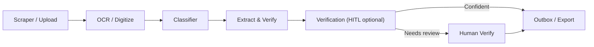
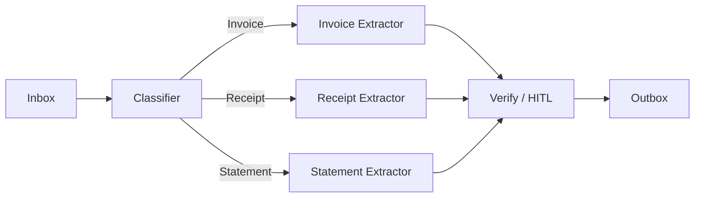
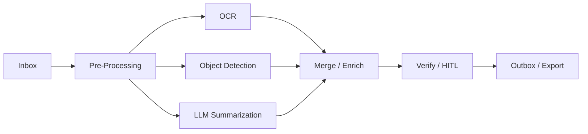

# 🧃 AI Services

## Overview

AI Services in AIForged are specialized processing engines—first‑party or third‑party—that you compose into end‑to‑end workflows. Services can ingest content, classify it, extract data, apply verification rules (including Human‑in‑the‑Loop), and publish results to downstream systems. You connect Services with utilities and verification engines to deliver reliable, scalable document and data automation.

!!! tip
    Start simple. Prove your flow with a small set of documents, then scale and add advanced steps like branching, HITL, and exports.

---

## What you can build with Services

- Document pipelines that classify, extract, and verify content
- Image and object analysis for vision‑based use cases
- OCR and digitization to normalize scanned content
- Email and storage scrapers for continuous ingestion
- Rule‑based and HITL verification for quality and compliance
- Exports and webhooks to keep downstream systems in sync

---

## Types of AI Services

AIForged offers a variety of Services, each tailored for specific tasks:

- Scrapers
    - Pull documents from sources such as mailboxes, folders, or cloud storage.
- Classifiers
    - Identify the type/category of each page or document to route processing.
    - For new classification projects, the **LLM Classifier** is the preferred starting point.
- Extractors and Verifiers
    - Extract structured fields and tables, then validate and standardize results.
- OCR (Optical Character Recognition)
    - Convert scans/images into machine‑readable text to boost downstream accuracy.
- Object Detection
    - Detect and locate visual objects within images or pages.
- Speech Recognition
    - Convert audio to text for further classification, extraction, or search.

!!! info
    You can combine Service types to automate complex, multi‑step processing—for example, Scraper → OCR → Classifier → Extract & Verify → Export.

---

## Service composition patterns

Choose the pattern that fits your workflow and SLAs:

- Sequence
    - Services run one after another in a defined order (straightforward, predictable).
- Independent
    - Services operate on their own; useful for ad‑hoc jobs and experimentation.
- Parallel
    - Multiple Services run simultaneously on the same or split inputs to reduce latency.
- Tandem
    - One Service’s outputs feed directly into another with tight coupling (e.g., OCR → Extract).

!!! tip
    Keep responsibilities focused. Use Utilities such as Digitizer and PDF Converter as pre/post steps to normalize inputs and improve extraction accuracy.

---

## Service operations and orchestration

- Connect in any order
    - Design flows that match your business rules; branch by category or confidence when needed.
- Individual Services
    - Run standalone; ideal for simple or single‑purpose processing.
- Dependent Services
    - Add pre‑processing (before) and post‑processing (after) steps, such as OCR, formatting, or enrichment.
- Verification Services
    - Trigger rule‑based checks and HITL when confidence is low or policy requires review (configured in the Rule Engine).
- Auto Execution
    - Poll and process new “Received” documents on a schedule using batch size and interval settings.
- Processing Parameters
    - Control re‑runs and outputs with options like Force Re‑Processing, Reset Previous Results, and Delete Output of Previous Processing.

---

## Example end‑to‑end flows

### 1) Straight‑through document processing (with optional HITL)

```mermaid
flowchart LR
  A["Scraper / Upload"] --> B["OCR / Digitize"]
  B --> C[Classifier]
  C --> D[Extract & Verify]
  D --> E["Verification (HITL optional)"]
  E -- Confident --> F["Outbox / Export"]
  E -- Needs review --> G[Human Verify]
  G --> F
```

- Use when documents generally follow a known structure, with HITL only for edge cases.
- Improves steadily with training data and tuned verification rules.

### 2) Branch by Category to specialized extractors

```mermaid
flowchart LR
  A[Inbox] --> B[Classifier]
  B -->|Invoice| C[Invoice Extractor]
  B -->|Receipt| D[Receipt Extractor]
  B -->|Statement| E[Statement Extractor]
  C --> F[Verify / HITL] --> G[Outbox]
  D --> F
  E --> F
```

- Route each document type to the best‑fit model.
- Apply different verification policies per branch.

### 3) Parallel enrichment (run multiple Services at once)

```mermaid
flowchart LR
  A[Inbox] --> B[Pre‑Processing]
  B --> C1[OCR]
  B --> C2[Object Detection]
  B --> C3[LLM Summarization]
  C1 --> D[Merge / Enrich]
  C2 --> D
  C3 --> D
  D --> E[Verify / HITL] --> F[Outbox / Export]
```

- Reduce latency by running independent steps simultaneously.
- Merge results before verification/export.

---

## Setup at a glance

1. Open your agent
    - From the agent view, click Add Service to create a new Service.
2. Configure the Service
    - Use the Service Configuration Wizard to set basics (name, description) and any required categories or datasets.
3. Connect steps
    - Add pre/post Utilities, enable Auto Execution if needed, and configure verification rules in the Rule Engine.
4. Test with a small batch
    - Upload to Inbox, run processing, and review outputs in Outbox.
5. Scale and automate
    - Tune Processing Parameters, expand sources (Scrapers), and enable exports/webhooks for downstream systems.

!!! tip
    When comparing configurations, use a clean re‑run: enable Force Re‑Processing, Reset Previous Results, and Delete Output of Previous Processing.

---

## Best practices

- Design for clarity
    - Name Services for their purpose (e.g., “Invoice – Extract & Verify”) and document assumptions.
- Normalize early
    - Convert to PDF and digitize scans before extraction to improve accuracy.
- Separate concerns
    - Keep classification, extraction, and verification steps distinct for easier tuning and troubleshooting.
- Start small, iterate fast
    - Validate on small batches; scale once results are stable.
- Govern with categories
    - Use Categories for business types (Invoice, ID). Use Usage/Status for lifecycle (Inbox, Processing, Verification, Outbox).
- Plan re‑processing
    - Use Processing Parameters to avoid stale outputs and ensure reproducible runs.

---

## Troubleshooting

- Service doesn’t start processing
    - Ensure the Service is enabled and documents are in the Received state; check permissions.
- Auto Execution isn’t picking up items
    - Verify Auto Execution is enabled, Batch Size > 0, and Execution Interval is set; documents must not be older than 7 days.
- Results didn’t change after a re‑run
    - Enable Force Re‑Processing and delete previous outputs to avoid confusion with stale results.
- Too many items in Verification
    - Adjust thresholds or rules in the Rule Engine; provide more/better training data to improve confidence.
- Performance concerns
    - Use Parallel where appropriate, right‑size batch sizes, and remove unnecessary Utilities for test runs.

---

## Related links

- Documents overview: [Click Here](../documents/index.md)
- Processing documents: [Click Here](../documents/processing-documents/index.md)
- Processing Parameters: [Click Here](../documents/processing-documents/index.md)
- Understanding Document Flows: [Click Here](../documents/understanding-document-flows.md)
- Documents in the Service view: [Click Here](../documents/documents-in-service-view.md)
- Rule Engine (Verification): [Click Here](../rules-engine/index.md)